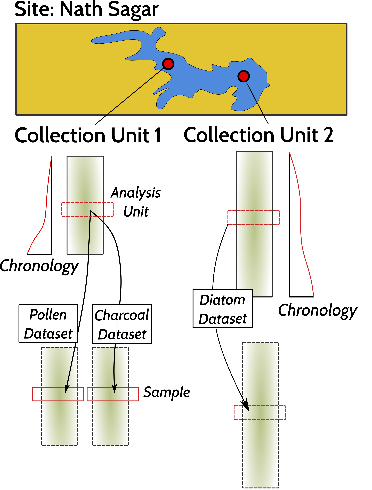

## 1. Introduction

This document is intended to act as a primer for the use of the new Neotoma R package, `neotoma2`.  Some users may be working with this document as part of a workshop for which there is a Binder instance. The Binder instance will run RStudio in your browser, with all the required packages installed.

If you are using this workflow on its own, or want to use the package directly, [the `neotoma2` package](https://github.com/NeotomaDB/neotoma2) is available from GitHub and can be installed in R using the `devtools` package by running:

```r
devtools::install_github('NeotomaDB/neotoma2')
library(neotoma2)
```

This workshop will also require other packages. To maintain the flow of this document we've placed instructions at the end of the document in the section labelled "[Installing packages on your own](#localinstall)".

## 2. Learning Goals

In this tutorial you will learn how to:

* Search for sites using site names and geographic parameters -- [Site Searches](#3-site-searches)
* Filter results using temporal and spatial parameters -- [Filter Results](#33-filter-records-tabset)
* Obtain sample information for the selected datasets -- [Sample Information](#34-pulling-in-sample-data)
* Perform basic analysis including the use of climate data from rasters -- [Basic Analysis](#4-simple-analytics)

### 2.1. Getting Help with Neotoma

If you're planning on working with Neotoma, please join us on [Slack](https://join.slack.com/t/neotomadb/shared_invite/zt-cvsv53ep-wjGeCTkq7IhP6eUNA9NxYQ) where we manage a channel specifically for questions about the R package. You may also wish to join our Google Groups mailing list, please [contact us](mailto:neotoma-contact@googlegroups.com) to be added.

### 2.2 Understanding Data Structures in Neotoma

Data in the Neotoma database itself is structured as a set of linked relationships to express the different elements of paleoecological analysis: space and time, raw data, scientific methods and data models. Because paleoecology is such a broad discipline these relationships can be complex, and as such, the database itself is highly structured. If you want to better understand concepts within the database, you can read the [Neotoma Database Manual](https://open.neotomadb.org/manual), or take a look at [the database schema itself](https://open.neotomadb.org/dbschema).

In this workshop we want to highlight two key structural concepts:
  
  1. The way data is structured conceptually within Neotoma (Sites, Collection Units and Datasets).
  2. The way that this structure is adapted within the `neotoma2` R package.

### 2.2.1 Data Structure in the Neotoma Database

{width=100%}

Data in Neotoma is associated with sites -- specific locations with lat/long coordinates.

Within a **site**, there may be one or more [**collection units**](https://open.neotomadb.org/manual/dataset-collection-related-tables-1.html#CollectionUnits) -- locations at which samples are physically collected within the site. For example, an archaeological **site** may have one or more **collection units**, pits within a broader dig site; a pollen sampling **site** on a lake may have multiple **collection units** -- core sites within the lake basin. Collection units may have higher resolution GPS locations than the site location, but are considered to be part of the broader site.\

Within a **collection unit** data is collected at various [**analysis units**]. Any data sampled within an analysis unit is grouped by data type and aggregated into a sample. The set of samples for a collection unit of a particular data type is then assigned to a dataset.

### 2.2.2 Data Structures in `neotoma2`


If we look at the [UML diagram](https://en.wikipedia.org/wiki/Unified_Modeling_Language) for the objects in the `neotoma2` R package we can see that the data structure generally mimics the structure within the database itself.  As we will see in the [Site Searches section](#3-site-searches), we can search for these objects, and begin to manipulate them (in the [Simple Analysis section](#4-simple-analytics)).

It is important to note: *within the `neotoma2` R package, most objects are `sites` objects, they just contain more or less data*.  There are a set of functions that can operate on `sites`.  As we add to `sites` objects, using `get_datasets()` or `get_downloads()`, we are able to use more of these helper functions.

## 3. Site Searches

### 3.1. `get_sites()`

There are several ways to find sites in `neotoma2`, but we think of `sites` as being spatial objects primarily. They have names, locations, and are found within the context of geopolitical units, but within the API and the package, the site itself does not have associated information about taxa, dataset types or ages.  It is simply the container into which we add that information.  So, when we search for sites we can search by:

| Parameter | Description |
| --------- | ----------- |
| sitename | A valid site name (case insensitive) using `%` as a wildcard. |
| siteid | A unique numeric site id from the Neotoma Database |
| loc | A bounding box vector, geoJSON or WKT string. |
| altmin | Lower altitude bound for sites. |
| altmax | Upper altitude bound for site locations. |
| database | The constituent database from which the records are pulled. |
| datasettype | The kind of dataset (see `get_tables(datasettypes)`) |
| datasetid | Unique numeric dataset identifier in Neotoma |
| doi | A valid dataset DOI in Neotoma |
| gpid | A unique numeric identifier, or text string identifying a geopolitical unit in Neotoma |
| keywords | Unique sample keywords for records in Neotoma. |
| contacts | A name or numeric id for individuals associuated with sites. |
| taxa | Unique numeric identifiers or taxon names associated with sites. |

All sites in Neotoma contain one or more datasets. It's worth noting that the results of these search parameters may be slightly unexpected. For example, searching for sites by sitename, latitude, or altitude will return all of the datasets for the particular site. Searching for terms such as datasettype, datasetid or taxa will return the site, but the only datasets returned will be those matching the dataset-specific search terms. We'll see this later.

#### 3.1.1. Site names: `sitename="%Cheruvu%"` {.tabset}

We may know exactly what site we're looking for ("Lac Mouton"), or have an approximate guess for the site name (for example, we know it's something like "Lait Lake", or "Lac du Lait", but we're not sure how it was entered specifically), or we may want to search all sites that have a specific term, for example, *Cheruvu* is the Telugu term for a lake or pond. If we are looking for lakes in a particular part of India we may want to search using this term.

We use the general format: `get_sites(sitename="XXXXX")` for searching by name.

PostgreSQL (and the API) uses the percent sign as a wildcard.  So `"%Cheruvu%"` would pick up ["Potapuram Cheruvu"](https://data.neotomadb.org/12018) for us (and would pick up "Durgam Cheruvu" and "Pedda Cheruvu" if records for these lakes existed).  Note that the search query is also case insensitive, so you could simply write `"%cheruvu%"`.

##### 3.1.1.1. Code


```r
pop_sites <- neotoma2::get_sites(sitename = "%Cheruvu%")
plotLeaflet(pop_sites)
```

##### 3.1.1.2. Result


```{=html}
<div class="leaflet html-widget html-fill-item-overflow-hidden html-fill-item" id="htmlwidget-f9544f0ba951d7baf482" style="width:672px;height:480px;"></div>
<script type="application/json" data-for="htmlwidget-f9544f0ba951d7baf482">{"x":{"options":{"crs":{"crsClass":"L.CRS.EPSG3857","code":null,"proj4def":null,"projectedBounds":null,"options":{}}},"calls":[{"method":"addProviderTiles","args":["Stamen.TerrainBackground",null,null,{"errorTileUrl":"","noWrap":false,"detectRetina":false}]},{"method":"addTiles","args":["https://{s}.tile.openstreetmap.org/{z}/{x}/{y}.png",null,null,{"minZoom":0,"maxZoom":18,"tileSize":256,"subdomains":"abc","errorTileUrl":"","tms":false,"noWrap":false,"zoomOffset":0,"zoomReverse":false,"opacity":1,"zIndex":1,"detectRetina":false,"attribution":"&copy; <a href=\"https://openstreetmap.org\">OpenStreetMap<\/a> contributors, <a href=\"https://creativecommons.org/licenses/by-sa/2.0/\">CC-BY-SA<\/a>"}]},{"method":"addCircleMarkers","args":[16.21348,78.57092,10,null,null,{"interactive":true,"draggable":false,"keyboard":true,"title":"","alt":"","zIndexOffset":0,"opacity":1,"riseOnHover":true,"riseOffset":250,"stroke":true,"color":"#03F","weight":5,"opacity.1":0.5,"fill":true,"fillColor":"#03F","fillOpacity":0.2},{"showCoverageOnHover":true,"zoomToBoundsOnClick":true,"spiderfyOnMaxZoom":true,"removeOutsideVisibleBounds":true,"spiderLegPolylineOptions":{"weight":1.5,"color":"#222","opacity":0.5},"freezeAtZoom":false},null,"<b>Potapuram Cheruvu<\/b><br><b>Description:<\/b> Potapuram Cheruvu is a non-system tank or rain-fed reservoir not linked to any river.<br><a href=http://apps.neotomadb.org/explorer/?siteids=7544>Explorer Link<\/a>",null,null,{"interactive":false,"permanent":false,"direction":"auto","opacity":1,"offset":[0,0],"textsize":"10px","textOnly":false,"className":"","sticky":true},null]}],"limits":{"lat":[16.21348,16.21348],"lng":[78.57092,78.57092]}},"evals":[],"jsHooks":[]}</script>
```

#### 3.1.2. Location: `loc=c()` {.tabset}

The `neotoma` package used a bounding box for locations, structured as a vector of latitude and longitude values: `c(xmin, ymin, xmax, ymax)`.  The `neotoma2` R package supports both this simple bounding box, but also more complex spatial objects, using the [`sf` package](https://r-spatial.github.io/sf/). Using the `sf` package allows us to more easily work with raster and polygon data in R, and to select sites from more complex spatial objects.  The `loc` parameter works with the simple vector, [WKT](https://arthur-e.github.io/Wicket/sandbox-gmaps3.html), [geoJSON](http://geojson.io/#map=2/20.0/0.0) objects and native `sf` objects in R.

Looking for sites using a location. We're putting a rough representations of a region stretching from East Africa through South Asia.  To work with this spatial object in R we also transformed the `geoJSON` element to an object for the `sf` package.  There are many other tools to work with spatial objects in R. Regardless of how you get the data into R, `neotoma2` works with almost all objects in the `sf` package.


```r
geoJSON <- '{"coordinates": 
  [[
    [20.59, 34.22],
    [16.19, 30.57],
    [17.75, 19.51],
    [43.63, 10.59],
    [85.47, 2.15],
    [107.32, 8.90],
    [107.39, 27.31],
    [67.87, 37.84],
    [20.59, 34.22]
  ]],
  "type": "Polygon"}'

sa_sf <- geojsonsf::geojson_sf(geoJSON)

sa_sites <- neotoma2::get_sites(loc = sa_sf, all_data = TRUE)
```

You can always simply `plot()` the `sites` objects, but you will lose some of the geographic context.  The `plotLeaflet()` function returns a `leaflet()` map, and allows you to further customize it, or add additional spatial data (like our original bounding polygon, `sa_sf`, which works directly with the R `leaflet` package):

##### 3.1.2.1. Code


```r
neotoma2::plotLeaflet(sa_sites) %>% 
  leaflet::addPolygons(map = ., 
                       data = sa_sf, 
                       color = "green")
```

##### 3.1.2.2. Result


```{=html}
<div class="leaflet html-widget html-fill-item-overflow-hidden html-fill-item" id="htmlwidget-aba64af0a79d145c0e5e" style="width:672px;height:480px;"></div>
<script type="application/json" data-for="htmlwidget-aba64af0a79d145c0e5e">{"x":{"options":{"crs":{"crsClass":"L.CRS.EPSG3857","code":null,"proj4def":null,"projectedBounds":null,"options":{}}},"calls":[{"method":"addProviderTiles","args":["Stamen.TerrainBackground",null,null,{"errorTileUrl":"","noWrap":false,"detectRetina":false}]},{"method":"addTiles","args":["https://{s}.tile.openstreetmap.org/{z}/{x}/{y}.png",null,null,{"minZoom":0,"maxZoom":18,"tileSize":256,"subdomains":"abc","errorTileUrl":"","tms":false,"noWrap":false,"zoomOffset":0,"zoomReverse":false,"opacity":1,"zIndex":1,"detectRetina":false,"attribution":"&copy; <a href=\"https://openstreetmap.org\">OpenStreetMap<\/a> contributors, <a href=\"https://creativecommons.org/licenses/by-sa/2.0/\">CC-BY-SA<\/a>"}]},{"method":"addCircleMarkers","args":[[31.3,31.10833,31.125,31.21667,35.23333,33.10556,33.08333,35.53333,16.21348,25.86957,11.179412,33.27806,29.48537,29.47722,31.41889,33.56417,31.49111,33.071444,32.844,32.38104,34.35,33.73222,33.75278,25.53333,25.5,25.50556,10.76,19.26,15.86667,22.08806,32.9,34.88083,32.6175,33.25,35.37083,33.25,32.82028,32.03333,29.47083,29.85278,34.05111,21.37,35.11,18.16667,18.01667,15.784,19.03,20.61,34.887478,17.00914,31.53722,31.53621,31.53607,31.53583,31.53567,31.53548,31.53533,30.32861,31.94972,31.33733],[31.6,31.71667,31.86667,32.03333,41.18333,35.52833,47.71667,46.11667,78.57092,99.277968,41.77536,35.20306,51.809368,52.75972,35.38833,35.36861,35.42972,35.59735,35.282,35.86761,36.2,35.79361,35.94806,51.5,51.41667,51.42222,47.3,26.18,46.88333,59.66694,35.08333,33.61194,34.91639,35.65361,35.93722,35.66667,35.58861,34.28333,30.63722,31.2375,46.645,29.31,33.23,26.65,27.15,49.471,20.31,58.17,32.479546,54.14157,35.5625,35.55769,35.55768,35.5576,35.55762,35.5571,35.5571,35.44194,35.93278,35.98121],10,null,null,{"interactive":true,"draggable":false,"keyboard":true,"title":"","alt":"","zIndexOffset":0,"opacity":1,"riseOnHover":true,"riseOffset":250,"stroke":true,"color":"#03F","weight":5,"opacity.1":0.5,"fill":true,"fillColor":"#03F","fillOpacity":0.2},{"showCoverageOnHover":true,"zoomToBoundsOnClick":true,"spiderfyOnMaxZoom":true,"removeOutsideVisibleBounds":true,"spiderLegPolylineOptions":{"weight":1.5,"color":"#222","opacity":0.5},"freezeAtZoom":false},null,["<b>Nile Delta S2<\/b><br><b>Description:<\/b> Physiography: Nile Delta.<br><a href=http://apps.neotomadb.org/explorer/?siteids=1744>Explorer Link<\/a>","<b>Nile Delta S6<\/b><br><b>Description:<\/b> Physiography: Nile Delta.<br><a href=http://apps.neotomadb.org/explorer/?siteids=1745>Explorer Link<\/a>","<b>Nile Delta S7<\/b><br><b>Description:<\/b> Physiography: Nile Delta.<br><a href=http://apps.neotomadb.org/explorer/?siteids=1746>Explorer Link<\/a>","<b>Nile Delta S8<\/b><br><b>Description:<\/b> Physiography: Nile Delta.<br><a href=http://apps.neotomadb.org/explorer/?siteids=1747>Explorer Link<\/a>","<b>Bouara<\/b><br><b>Description:<\/b> Saline depression. Surrounding vegetation: artemisia herba-alba, chenopodiaceae.<br><a href=http://apps.neotomadb.org/explorer/?siteids=3032>Explorer Link<\/a>","<b>Huleh<\/b><br><b>Description:<\/b> Former lake. Physiography: basin. Surrounding vegetation: marshes and cultivated fields.<br><a href=http://apps.neotomadb.org/explorer/?siteids=3155>Explorer Link<\/a>","<b>Lake Mirabad<\/b><br><b>Description:<\/b> Lake. Physiography: Saidmarreh valley. Surrounding vegetation: grazing.<br><a href=http://apps.neotomadb.org/explorer/?siteids=3286>Explorer Link<\/a>","<b>Lake Zeribar<\/b><br><b>Description:<\/b> Lake. Physiography: valley. Surrounding vegetation: cultivated fields and oak forest.<br><a href=http://apps.neotomadb.org/explorer/?siteids=3521>Explorer Link<\/a>","<b>Potapuram Cheruvu<\/b><br><b>Description:<\/b> Potapuram Cheruvu is a non-system tank or rain-fed reservoir not linked to any river.<br><a href=http://apps.neotomadb.org/explorer/?siteids=7544>Explorer Link<\/a>","<b>Lake Tianchi<\/b><br><b>Description:<\/b> Lake Tianchi is in the subalpine zone of the Hengduan Mountains, formerly dominated by Tsuga dumosa. Vegetation today is dominated by Pinus yunnanensis, accompanied by Castanopsis delavayi, Cyclobalanopsis delavayi, Alnus nepalensis, Celtis tetrandra, Sapindus delavayi, Pistacia chinensis, Quercus variabilis, Gleditsia delavayi and Docynia delavayi. At present, Tsuga dumosa is rare in the area due to human activity. The natural lake is currently submerged under Tianchi Reservoir.<br><a href=http://apps.neotomadb.org/explorer/?siteids=23806>Explorer Link<\/a>","<b>Lake Abhé<\/b><br><b>Description:<\/b> Large hypersaline lake lying on the Ethiopia-Djibouti border. Lake surface area has decreased by two thirds since 1940, forming 11,500 ha of salt flats to the southwest.<br><a href=http://apps.neotomadb.org/explorer/?siteids=23815>Explorer Link<\/a>","<b>Tyre<\/b><br><b>Description:<\/b> NA<br><a href=http://apps.neotomadb.org/explorer/?siteids=23959>Explorer Link<\/a>","<b>Lake Parishan<\/b><br><b>Description:<\/b> Lake. Physiography: Basin. Surrounding vegetation: Pasture and cultivated lands.<br><a href=http://apps.neotomadb.org/explorer/?siteids=24176>Explorer Link<\/a>","<b>Maharlou Lake<\/b><br><b>Description:<\/b> Hypersaline lake. Physiography: Closed basin. Surrounding vegetation: Xeromorphic dwarf-shrub cultivated lands. Vegetation formation: Pistacia-Amygdalus open scrub.<br><a href=http://apps.neotomadb.org/explorer/?siteids=24179>Explorer Link<\/a>","<b>Ein Gedi<\/b><br><b>Description:<\/b> Marine coastal site. Physiography: Dead Sea basin. Surrounding vegetation: Sparse Mediterranean shrubs.<br><a href=http://apps.neotomadb.org/explorer/?siteids=26027>Explorer Link<\/a>","<b>Sidon<\/b><br><b>Description:<\/b> Ancient harbour of Sidon. Physiography: Little rocky cape.<br><a href=http://apps.neotomadb.org/explorer/?siteids=26033>Explorer Link<\/a>","<b>Dead Sea 7<\/b><br><b>Description:<\/b> Off-shore site. Physiography: Tectonic basin. Surrounding vegetation: Cultivated fields,forest, dry vegetation.<br><a href=http://apps.neotomadb.org/explorer/?siteids=26120>Explorer Link<\/a>","<b>Hula<\/b><br><b>Description:<\/b> Mosaic of drained and heavily impacted marshes.<br><a href=http://apps.neotomadb.org/explorer/?siteids=27176>Explorer Link<\/a>","<b>Marj Rabba<\/b><br><b>Description:<\/b> Marj Rabba is one of about three dozen known Chalcolithic sites in the Galilee (Shalem 2008). The areal extent of the sherd scatter (c. 8 ha) and dense palimpsest of stone architecture revealed by ground-penetrating radar (Urban et al. 2014) indicates a sizable village, with four phases radiocarbon dated to 4600–4200 cal.BC. In addition to domestic architecture, the excavators uncovered two seemingly ritual features, i.e., a pit containing the articulated remains of two cattle (Hill et al. 2016) and a uniquely and well-constructed building (building 1) containing the remains of several gazelle feet as well as a human foot (Price et al. 2016). Archaeobotanical and faunal data from Marj Rabba indicate a mixed agricultural economy. Among the plant remains, wheat and barley predominated, followed by lentils, olives, and peas (Graham 2018). The animal remains (Table 1) show a predominance of domestic livestock. Gazelle were also present, although the majority of these remains (N = 256) derive from the previously mentioned building 1 and probably reflect ritual, not quotidian, activities.<br><a href=http://apps.neotomadb.org/explorer/?siteids=27292>Explorer Link<\/a>","<b>Ya'amun<\/b><br><b>Description:<\/b> Ya'amun is located in the northern part of the Western Highlands of Jordan at about eight hundred metres above sea level, 23 km southeast of Irbid. Here, current mean annual precipitation is ~400 mm (Cordova, 2007). However, within few tens of kilometres of Ya'amun the amount of rainfall decreases drastically to less than 200 mm, with the dry Jordan River Valley to the west and the steppe and desert landscapes to the east (Fig. 1b). The region around Ya'amun therefore presents as a mosaic of ecosystems, where oak forests, Mediterranean low vegetation and steppe habitats are in relative close proximity (Al-Eisawi, 1985). Occupation at Ya'amun spanned from the Early Bronze Age,  beginning at c. 3600 cal BCE to the Ayyubid-Mamluk period, thirteenth to sixteenth century CE (dates as in Adams, 2008). Since the first season of excavation, several tombs of variable type, chamber and shaft tombs as well as natural caves used for burial have been identified and excavated (Renfro and Cooper, 2000; Rose, 2002; Rose et al., 2007, 2003).<br><a href=http://apps.neotomadb.org/explorer/?siteids=27296>Explorer Link<\/a>","<b>Al Jourd<\/b><br><b>Description:<\/b> Marsh. Physiography: mountain. Surrounding vegetation: shrubs.<br><a href=http://apps.neotomadb.org/explorer/?siteids=27553>Explorer Link<\/a>","<b>Aammiq<\/b><br><b>Description:<\/b> Marsh in wetland. Physiography: Beqaa valley. Surrounding vegetation: cultivated fields.<br><a href=http://apps.neotomadb.org/explorer/?siteids=27554>Explorer Link<\/a>","<b>Chamsine<\/b><br><b>Description:<\/b> Marsh into wetland. Physiography: Beqaa valley. Surrounding vegetation: cultivated fielads.<br><a href=http://apps.neotomadb.org/explorer/?siteids=27555>Explorer Link<\/a>","<b>Site 36<\/b><br><b>Description:<\/b> Archaeological site.<br><a href=http://apps.neotomadb.org/explorer/?siteids=27677>Explorer Link<\/a>","<b>Khor F.B.<\/b><br><b>Description:<\/b> NA<br><a href=http://apps.neotomadb.org/explorer/?siteids=27682>Explorer Link<\/a>","<b>Khor M<\/b><br><b>Description:<\/b> Archaeological site.<br><a href=http://apps.neotomadb.org/explorer/?siteids=27683>Explorer Link<\/a>","<b>Hayla Cave<\/b><br><b>Description:<\/b> Limestone Cave. Physiography: Karst highlands. Surrounding vegetation: Evergreen scrub.<br><a href=http://apps.neotomadb.org/explorer/?siteids=27841>Explorer Link<\/a>","<b>Oyo<\/b><br><b>Description:<\/b> Deflationary depression. Physiography: Evaporite basin. Surrounding vegetation: absent.<br><a href=http://apps.neotomadb.org/explorer/?siteids=28030>Explorer Link<\/a>","<b>al-Hawa<\/b><br><b>Description:<\/b> Holocene lacustrine sediments in outcrop in interdune depressions. Modern desert vegetation mainly herbaceous taxa (Panicum turgidum, Leptadenia\r\npyrotechnica, Calligonum comosum, Zygophyllum simplex, Aristida plumosa associated with Dipterygium glaucum,\r\nCyperus conglomeratus, Plantago ciliata\r\nAnastatica hierochuntia) and isolated trees (Acacia tortilis, A. oerfota, A. hamulosa associated with Commiphora myrrha and Tamarix nilotica). Vegetation in saline environments mainly Salsola\r\nimbricata and Suaeda aegyptiaca.<br><a href=http://apps.neotomadb.org/explorer/?siteids=28033>Explorer Link<\/a>","<b>Mangrove of Suwayh 1<\/b><br><b>Description:<\/b> Suwayh depression- fossil lagoon section; Modern vegetation in area comprised of semi-desert steppes and Prosopis trees<br><a href=http://apps.neotomadb.org/explorer/?siteids=28035>Explorer Link<\/a>","<b>Akko<\/b><br><b>Description:<\/b> Coastal site. Physiography: Haifa Bay. Surrounding vegetation: shrub-steppe and cultivated fields.<br><a href=http://apps.neotomadb.org/explorer/?siteids=28063>Explorer Link<\/a>","<b>Larnaca Salt Lake<\/b><br><b>Description:<\/b> Salt lake. Physiography: coastal lagoon in wetland. Surrounding vegetation: dry landscape and agriculture.<br><a href=http://apps.neotomadb.org/explorer/?siteids=28064>Explorer Link<\/a>","<b>Dor<\/b><br><b>Description:<\/b> Coastal ridge. Physiography: Carmel coastal plain. Surrounding vegetation: Quercus, Pinus, urban area.<br><a href=http://apps.neotomadb.org/explorer/?siteids=28065>Explorer Link<\/a>","<b>Tel Dan<\/b><br><b>Description:<\/b> Spring in marsh area. Physiography: Dan stream in Hula valley. Surrounding vegetation: agriculture.<br><a href=http://apps.neotomadb.org/explorer/?siteids=28066>Explorer Link<\/a>","<b>Tell Tweini<\/b><br><b>Description:<\/b> Floodplain of a spring-fed valley. Physiography: Basin in valley of River Rumailiah. Surrounding vegetation: agriculture and xeric steppe.<br><a href=http://apps.neotomadb.org/explorer/?siteids=28071>Explorer Link<\/a>","<b>Birkat Ram<\/b><br><b>Description:<\/b> Cratere lake. Physiography: volcanic caldera. Surrounding vegetation: oak woodland, Pistacia and Quercus.<br><a href=http://apps.neotomadb.org/explorer/?siteids=28119>Explorer Link<\/a>","<b>Kinneret<\/b><br><b>Description:<\/b> Lake. Physiography: basin. Surrounding vegetation: macchia and bathas scrub.<br><a href=http://apps.neotomadb.org/explorer/?siteids=28120>Explorer Link<\/a>","<b>Levantine Basin<\/b><br><b>Description:<\/b> Marine site. Physiography: basin. Surrounding vegetation: Quercus, Olea, Pistacia, Pinus.<br><a href=http://apps.neotomadb.org/explorer/?siteids=28155>Explorer Link<\/a>","<b>Lake Qarun<\/b><br><b>Description:<\/b> Saline lake. Physiography: depression. Surrounding vegetation: cultivated fields.<br><a href=http://apps.neotomadb.org/explorer/?siteids=28166>Explorer Link<\/a>","<b>Saqqara<\/b><br><b>Description:<\/b> Floodplain. Physiography: Nile valley. Surrounding vegetation: cultivated fields.<br><a href=http://apps.neotomadb.org/explorer/?siteids=28167>Explorer Link<\/a>","<b>Wezmeh cave<\/b><br><b>Description:<\/b> Cave (0.0045ha). Physiography: valley in footfills of Qazivand Mountain. Surrounding vegetation: dry farming of cereals, shrubs.<br><a href=http://apps.neotomadb.org/explorer/?siteids=28200>Explorer Link<\/a>","<b>Selima<\/b><br><b>Description:<\/b> Desert oasis. Partly vegetated depression extending NW-SE for 7 km along the base of a 90 m high escarpement of Mesozoic sandstone. Two tree species (Hyphaene thebaica and introduced Phoenix dactylifera), one shrub (Tamarix nilotica) and a few grasses and rushes occur in the oasis.<br><a href=http://apps.neotomadb.org/explorer/?siteids=28203>Explorer Link<\/a>","<b>Marki Alonia<\/b><br><b>Description:<\/b> Located in central Cyprus, about 15 km from the modern city of Nicosia (Fig. 1), Marki Alonia is the most extensively excavated Early and Middle Bronze Age settlement in Cyprus. It lies south of the Alykos River (at a mean elevation of 280 m asl), at the interface of the Troodos igneous rocks and the sedimentary\r\nchalks and limestones of the central lowlands, providing access both to the copper sulphide ore deposits of the Troodos Pillow Lavas, and to themore fertile, agricultural soils of the central plain. Climatically, all of\r\nthe region around Marki Alonia is semi-arid and average yearly precipitation in the site area is only 300�400 mm per year (Xenophontos,\r\n1996; Michaelides et al., 2009). On this basis, and considering the small remnants of native vegetation, it has been proposed that the general vegetation of the Marki area during the Early and Middle Bronze Age likely consisted of low maquis on the pillow lavas and maquis and\r\ngarrigue on the chalk cliffs and hills, with riparian scrub growing along the Alykos River (Adams and Simmons, 1996a). From 1990 to 2000, excavations by La Trobe University (Australia) exposed about 2000 m2 of the settlement and demonstrated some 500 years of continuous occupation, from the beginning of the Early Bronze Age (Philia facies) through to Middle Cypriot II (ca. 2400 to 1850 BCE), with nine architectural phases (A�I) evidenced within the stratigraphic sequence (Frankel and Webb, 2006a, 2006b).Zooarchaeological analyses revealed that about half of the animal bones recovered during excavation were from sheep and goats, followed by cattle and fallow deer (Dama mesopotamica). The remainder of the assemblage consists of pigs, equid (most likely donkeys) and carnivores, particularly dogs and foxes.<br><a href=http://apps.neotomadb.org/explorer/?siteids=28207>Explorer Link<\/a>","<b>Bir Atrun<\/b><br><b>Description:<\/b> Lake surrounded by low bedrock hills. Physiography: The surrounging landscape is dune fields. Surrounding vegetation: desert (isolated tree:Acacia or Tamarix).<br><a href=http://apps.neotomadb.org/explorer/?siteids=28238>Explorer Link<\/a>","<b>El Atrun<\/b><br><b>Description:<\/b> Surrounding vegetation: Isolated Capparis, Acacia, Tamarix.<br><a href=http://apps.neotomadb.org/explorer/?siteids=28352>Explorer Link<\/a>","<b>Wadi Sana<\/b><br><b>Description:<\/b> dry river valley with rock shelter on steep canyon walls<br><a href=http://apps.neotomadb.org/explorer/?siteids=28354>Explorer Link<\/a>","<b>Lake Yoa<\/b><br><b>Description:<\/b> between Tibesti and Ennedi massifs, Sahara<br><a href=http://apps.neotomadb.org/explorer/?siteids=28360>Explorer Link<\/a>","<b>Filim<\/b><br><b>Description:<\/b> bay along Indian Ocean coast west of Barr al Hikman, fed by Wadi Andam draining Jebel Akhdar.<br><a href=http://apps.neotomadb.org/explorer/?siteids=28405>Explorer Link<\/a>","<b>Ais Giorkis<\/b><br><b>Description:<\/b> [Ais Gorkis] was chosen because it is uniquely located in the uplands during the Cypro-PPNB (Figure 1.1). It is situated 25 km northeast of Paphos, at approximately 480 meters above sea level (masl) in the foothills of the Troodos Mountains. It overlooks the Ezousas River. Excavations have been completed and a monograph is currently being written about the findings. Approximately 300 sq m have been excavated, producing one of the largest faunal assemblages on the island. The assemblage is comprised of Mesopotamian fallow deer, followed by pig and caprine. There are also small quantities of cattle remains (less than 2%). Dog and cat, presumably domesticated, are also represented in very small numbers. Radiocarbon determinations suggest a site occupation of around 400-500 years (7956-7058 cal BC). Two of the three Near Eastern founder cereal crops are present: einkorn and hulled barley. Pulses and wild taxa, such as pistachio and pea/vetch, were also recovered. Material artifacts recovered include: a large chipped stone assemblage (around 300,000 pieces); numerous ground stone implements; picrolite (local mineral whose color varies from light blue-green to dark olivegreen) ornaments; shell beads; and several circular/oval, cobbled structures, which would have required substantial labor investment in their construction and maintenance. Combined with the faunal and floral assemblage, all of these material artifacts and structures suggest that people were present at the site for at least part of the year (Lucas 2014; Lucas et al. 2012; Simmons 1998a, 1998b, 2009a, 2009b, 2010, 2012; Simmons et al. in press).<br><a href=http://apps.neotomadb.org/explorer/?siteids=28519>Explorer Link<\/a>","<b>Albalid1<\/b><br><b>Description:<\/b> Wetlands along the Arabian sea<br><a href=http://apps.neotomadb.org/explorer/?siteids=28521>Explorer Link<\/a>","<b>Palm Terrace<\/b><br><b>Description:<\/b> Oasis located 700 m east of the Dead Sea shore (northern basin)<br><a href=http://apps.neotomadb.org/explorer/?siteids=28701>Explorer Link<\/a>","<b>Palm Terrace site 1<\/b><br><b>Description:<\/b> Phoenix oasis in desert<br><a href=http://apps.neotomadb.org/explorer/?siteids=28894>Explorer Link<\/a>","<b>Palm Terrace site 2<\/b><br><b>Description:<\/b> Phoenix oasis in desert<br><a href=http://apps.neotomadb.org/explorer/?siteids=28895>Explorer Link<\/a>","<b>Palm Terrace site 3<\/b><br><b>Description:<\/b> Phoenix oasis in desert<br><a href=http://apps.neotomadb.org/explorer/?siteids=28896>Explorer Link<\/a>","<b>Palm Terrace site 4<\/b><br><b>Description:<\/b> Phoenix oasis in desert<br><a href=http://apps.neotomadb.org/explorer/?siteids=28897>Explorer Link<\/a>","<b>Palm Terrace site 5<\/b><br><b>Description:<\/b> Phoenix oasis in desert<br><a href=http://apps.neotomadb.org/explorer/?siteids=28898>Explorer Link<\/a>","<b>Palm Terrace site 6<\/b><br><b>Description:<\/b> Phoenix oasis in desert<br><a href=http://apps.neotomadb.org/explorer/?siteids=28899>Explorer Link<\/a>","<b>Petra<\/b><br><b>Description:<\/b> Petra, originally called Rekem by the Nabataeans (Retso 1999), is located in the eastern highlands of the Jordan Rift Valley (Figure 1). The geographic origin of the Nabataeans and the date that their tribal kingdom was established at Petra remains uncertain. The Greek Historian Diodorus in the 4th century A.D. describes the Nabataeans as nomads, giving the impression that at the time the Nabataeans lacked permanent dwellings (Schmid 2002). Over the following centuries, the Nabataeans gained wealth through trading incense and spices between the Mediterranean and South Arabia and Petra became a major center for trade, collecting taxes from caravans passing through the city (Fiema 2003). The increased interaction with international polities and intensified trade likely stimulated the increased sedentism of Nabataeans (Schmid 2002), who began building permanent structures at Petra in the 3rd to 2nd centuries B.C. (Graf et al. 2005; Graf et al. 2007). The city of Petra was a large urban center during the 1st century B.C. through 4th century A.D. The individuals investigated in this study come from the Petra North Ridge Project (PNRP), which consists of tombs that contain the remains of individuals thought to be non-elite city residents. Preliminary investigations of diet and disease (Canipe 2014; Appleton 2015) found that the non-elite adult residents of Petra suffered little from chronic infections or malnutrition and had a diet well-balanced between animal protein and C3 plants such as wheat, barley, fruits, and legumes.<br><a href=http://apps.neotomadb.org/explorer/?siteids=29355>Explorer Link<\/a>","<b>Baqah Valley Caves<\/b><br><b>Description:<\/b> The Baq'ah Valley is located 15 to 20 km NW of Amman. It is a unique geomorphological feature on the central Transjordanian plateau. Its flat elliptical area stands in marked contrast to the surrounding terrain of hills and deep wadis cutting down to the Jordan valley. It is situated near the midpoint of the large bend in the Wadi Zarqa.The Baq'ah is encircled by perennial springs. (McGovern and Brown, 1986).<br><a href=http://apps.neotomadb.org/explorer/?siteids=29357>Explorer Link<\/a>","<b>Qasr Bshir<\/b><br><b>Description:<\/b> This late Roman fort on the Arabian frontier is one of the best-preserved Roman military structures anywhere in the Roman Empire. It lies on the plateau east of the Dead Sea, c.15 kilometers northeast of the contemporary legionary fortress of el-Lejjun. A Latin building inscription still in situ over the main gate provides both its ancient name and a precise date of construction (293-305 CE). The fort is a classic quadriburgium (fort with four towers) built of local stone and forms a nearly square rectangle (c.56 m on a side, 0.31 ha) with large projecting rectangular towers (c.12 x 12 m) at each corner. The interior consists of an enclosed courtyard surrounded by ranges of rooms, originally of two stories, against the curtain wall. Excavation suggests that the fort was occuptied through the 4th and into the 5th centuries, after which it was abandoned (Parker, 2015).<br><a href=http://apps.neotomadb.org/explorer/?siteids=29369>Explorer Link<\/a>"],null,null,{"interactive":false,"permanent":false,"direction":"auto","opacity":1,"offset":[0,0],"textsize":"10px","textOnly":false,"className":"","sticky":true},null]},{"method":"addPolygons","args":[[[[{"lng":[20.59,16.19,17.75,43.63,85.47,107.32,107.39,67.87,20.59],"lat":[34.22,30.57,19.51,10.59,2.15,8.9,27.31,37.84,34.22]}]]],null,null,{"interactive":true,"className":"","stroke":true,"color":"green","weight":5,"opacity":0.5,"fill":true,"fillColor":"green","fillOpacity":0.2,"smoothFactor":1,"noClip":false},null,null,null,{"interactive":false,"permanent":false,"direction":"auto","opacity":1,"offset":[0,0],"textsize":"10px","textOnly":false,"className":"","sticky":true},null]}],"limits":{"lat":[2.15,37.84],"lng":[16.19,107.39]}},"evals":[],"jsHooks":[]}</script>
```

#### 3.1.3. Site Helpers {.tabset}

If we look at the [data structure diagram](#222-data-structures-in-neotoma2) for the objects in the `neotoma2` R package we can see that there are a set of functions that can operate on `sites`.  As we add to `sites` objects, using `get_datasets()` or `get_downloads()`, we are able to use more of these helper functions.

As it is, we can take advantage of functions like `summary()` to get a more complete sense of the types of data we have in `sa_sites`.  The following code gives the summary table. We do some R magic here to change the way the data is displayed (turning it into a `datatable()` object), but the main piece is the `summary()` call.

##### 3.1.3.1. Code


```r
# Give information about the sites themselves, site names &cetera.
neotoma2::summary(sa_sites)
# Give the unique identifiers for sites, collection units and datasets found at those sites.
neotoma2::getids(sa_sites)
```

##### 3.1.3.2. Result


```{=html}
<div class="datatables html-widget html-fill-item-overflow-hidden html-fill-item" id="htmlwidget-13ccd0d9f971c3fe92d1" style="width:100%;height:auto;"></div>
<script type="application/json" data-for="htmlwidget-13ccd0d9f971c3fe92d1">{"x":{"filter":"none","vertical":false,"data":[["1744","1744","1745","1745","1746","1746","1747","1747","3032","3032","3155","3155","3286","3286","3286","3286","3521","3521","7544","7544","23806","23806","23815","23815","23959","23959","24176","24176","24176","24179","24179","26027","26027","26033","26033","26120","26120","27176","27176","27176","27176","27176","27176","27176","27176","27176","27176","27176","27176","27176","27176","27176","27176","27176","27176","27176","27176","27176","27176","27176","27176","27176","27176","27176","27176","27176","27176","27176","27176","27176","27176","27176","27176","27176","27176","27176","27176","27176","27176","27292","27292","27296","27296","27553","27553","27554","27554","27555","27555","27677","27682","27682","27683","27841","27841","28030","28030","28033","28033","28035","28035","28035","28035","28063","28063","28064","28064","28065","28065","28066","28066","28071","28071","28071","28071","28119","28119","28120","28120","28155","28166","28167","28167","28200","28200","28203","28203","28207","28207","28238","28238","28352","28352","28354","28354","28354","28360","28360","28405","28405","28519","28519","28521","28521","28701","28701","28701","28894","28895","28896","28897","28898","28899","29355","29355","29357","29357","29369","29369"],["Nile Delta S2","Nile Delta S2","Nile Delta S6","Nile Delta S6","Nile Delta S7","Nile Delta S7","Nile Delta S8","Nile Delta S8","Bouara","Bouara","Huleh","Huleh","Lake Mirabad","Lake Mirabad","Lake Mirabad","Lake Mirabad","Lake Zeribar","Lake Zeribar","Potapuram Cheruvu","Potapuram Cheruvu","Lake Tianchi","Lake Tianchi","Lake Abhé","Lake Abhé","Tyre","Tyre","Lake Parishan","Lake Parishan","Lake Parishan","Maharlou Lake","Maharlou Lake","Ein Gedi","Ein Gedi","Sidon","Sidon","Dead Sea 7","Dead Sea 7","Hula","Hula","Hula","Hula","Hula","Hula","Hula","Hula","Hula","Hula","Hula","Hula","Hula","Hula","Hula","Hula","Hula","Hula","Hula","Hula","Hula","Hula","Hula","Hula","Hula","Hula","Hula","Hula","Hula","Hula","Hula","Hula","Hula","Hula","Hula","Hula","Hula","Hula","Hula","Hula","Hula","Hula","Marj Rabba","Marj Rabba","Ya'amun","Ya'amun","Al Jourd","Al Jourd","Aammiq","Aammiq","Chamsine","Chamsine","Site 36","Khor F.B.","Khor F.B.","Khor M","Hayla Cave","Hayla Cave","Oyo","Oyo","al-Hawa","al-Hawa","Mangrove of Suwayh 1","Mangrove of Suwayh 1","Mangrove of Suwayh 1","Mangrove of Suwayh 1","Akko","Akko","Larnaca Salt Lake","Larnaca Salt Lake","Dor","Dor","Tel Dan","Tel Dan","Tell Tweini","Tell Tweini","Tell Tweini","Tell Tweini","Birkat Ram","Birkat Ram","Kinneret","Kinneret","Levantine Basin","Lake Qarun","Saqqara","Saqqara","Wezmeh cave","Wezmeh cave","Selima","Selima","Marki Alonia","Marki Alonia","Bir Atrun","Bir Atrun","El Atrun","El Atrun","Wadi Sana","Wadi Sana","Wadi Sana","Lake Yoa","Lake Yoa","Filim","Filim","Ais Giorkis","Ais Giorkis","Albalid1","Albalid1","Palm Terrace","Palm Terrace","Palm Terrace","Palm Terrace site 1","Palm Terrace site 2","Palm Terrace site 3","Palm Terrace site 4","Palm Terrace site 5","Palm Terrace site 6","Petra","Petra","Baqah Valley Caves","Baqah Valley Caves","Qasr Bshir","Qasr Bshir"],["NILEDS2","NILEDS2","NILEDS6","NILEDS6","NILEDS7","NILEDS7","NILEDS8","NILEDS8","BOUARA","BOUARA","HULEH","HULEH","MIRABAD","MIRABAD","MIRABAD","MIRABAD","ZERIBAR","ZERIBAR","POTACHER","POTACHER","TIANCHIYL","TIANCHIYL","ABHE","ABHE","TYR1","TYR1","PARISLP3","PARISLP3","PARISLP3","MAHARLOU","MAHARLOU","GEDI97","GEDI97","SIDON1","SIDON1","DS7","DS7","HULA_1","HULA_10","HULA_11","HULA_12","HULA_13","HULA_14","HULA__15","HULA_16","HULA_17","HULA_18","HULA_19","HULA_2","HULA_20","HULA_21","HULA_22","HULA_23","HULA_24","HULA_25","HULA_26","HULA_27","HULA_28","HULA_29","HULA_3","HULA_30","HULA_31","HULA_32","HULA_33","HULA_34","HULA_35","HULA_36","HULA_37","HULA_38","HULA_39","HULA_4","HULA_40","HULA_41","HULA_42","HULA_5","HULA_6","HULA_7","HULA_8","HULA_9","MARJ.RAB","MARJ.RAB","YA'AMUN","YA'AMUN","ALJOURD","ALJOURD","AMMIQ","AMMIQ","CHAMSINE","CHAMSINE","SITE36","KHORFB","KHORFB","KHORM","HL","HL","OYO","OYO","HAWA","HAWA","SUWAYH1","SUWAYH1","SUWAYH2","SUWAYH2","TELAKKO","TELAKKO","CYPRUS13","CYPRUS13","DOR","DOR","TELDAN","TELDAN","TWEINI1","TWEINI1","TWEINI2","TWEINI2","BIRKATRA","BIRKATRA","KINNERET","KINNERET","MD9509","QARU09","SAQA22","SAQA22","WEZMEH","WEZMEH","SELIMA","SELIMA","MARKALON","MARKALON","BIRATRUN","BIRATRUN","ELATRUN","ELATRUN","W_SANA","W_SANA","W_SANA","YOA","YOA","FILIM","FILIM","AISGIORKIS","AISGIORKIS","ALBALID1","ALBALID1","PT1","PT1","PT2","PALMTE01","PALMTE02","PALMTE03","PALMTE04","PALMTE05","PALMTE06","PETRA","PETRA","BAQCAVE","BAQCAVE","QASRB","QASRB"],[0,0,0,0,0,0,0,0,0,0,0,0,0,0,0,0,0,0,0,0,0,0,0,0,0,0,0,0,0,0,0,0,0,0,0,0,0,0,0,0,0,0,0,0,0,0,0,0,0,0,0,0,0,0,0,0,0,0,0,0,0,0,0,0,0,0,0,0,0,0,0,0,0,0,0,0,0,0,0,0,0,0,0,0,0,0,0,0,0,0,0,0,0,0,0,0,0,0,0,0,0,0,0,0,0,0,0,0,0,0,0,0,0,0,0,0,0,0,0,0,0,0,0,0,0,0,0,0,0,0,0,0,0,0,0,0,0,0,0,0,0,0,0,0,0,0,0,0,0,0,0,0,0,0,0,0,0,0,0],[1,1,1,1,1,1,1,1,1,1,1,1,1,1,1,1,1,1,1,1,1,1,1,1,1,1,1,1,1,1,1,1,1,1,1,1,1,1,1,1,1,1,1,1,1,1,1,1,1,1,1,1,1,1,1,1,1,1,1,1,1,1,1,1,1,1,1,1,1,1,1,1,1,1,1,1,1,1,1,1,1,1,1,1,1,1,1,1,1,1,1,1,1,1,1,1,1,1,1,1,1,1,1,1,1,1,1,1,1,1,1,1,1,1,1,1,1,1,1,1,1,1,1,1,1,1,1,1,1,1,1,1,1,1,1,1,1,1,1,1,1,1,1,1,1,1,1,1,1,1,1,1,1,1,1,1,1,1,1],["pollen","geochronologic","pollen","geochronologic","pollen","geochronologic","pollen","geochronologic","pollen","geochronologic","pollen","geochronologic","pollen","geochronologic","geochronologic","geochronologic","pollen","geochronologic","geochronologic","pollen","geochronologic","pollen","geochronologic","pollen","geochronologic","pollen","geochronologic","pollen","microcharcoal","geochronologic","pollen","geochronologic","pollen","geochronologic","pollen","geochronologic","pollen","testate amoebae surface sample","testate amoebae surface sample","testate amoebae surface sample","testate amoebae surface sample","testate amoebae surface sample","testate amoebae surface sample","testate amoebae surface sample","testate amoebae surface sample","testate amoebae surface sample","testate amoebae surface sample","testate amoebae surface sample","testate amoebae surface sample","testate amoebae surface sample","testate amoebae surface sample","testate amoebae surface sample","testate amoebae surface sample","testate amoebae surface sample","testate amoebae surface sample","testate amoebae surface sample","testate amoebae surface sample","testate amoebae surface sample","testate amoebae surface sample","testate amoebae surface sample","testate amoebae surface sample","testate amoebae surface sample","testate amoebae surface sample","testate amoebae surface sample","testate amoebae surface sample","testate amoebae surface sample","testate amoebae surface sample","testate amoebae surface sample","testate amoebae surface sample","testate amoebae surface sample","testate amoebae surface sample","testate amoebae surface sample","testate amoebae surface sample","testate amoebae surface sample","testate amoebae surface sample","testate amoebae surface sample","testate amoebae surface sample","testate amoebae surface sample","testate amoebae surface sample","specimen stable isotope","vertebrate fauna","specimen stable isotope","vertebrate fauna","geochronologic","pollen","geochronologic","pollen","geochronologic","pollen","pollen","geochronologic","pollen","pollen","geochronologic","pollen","geochronologic","pollen","geochronologic","pollen","geochronologic","pollen","geochronologic","pollen","geochronologic","pollen","geochronologic","pollen","geochronologic","pollen","geochronologic","pollen","geochronologic","pollen","geochronologic","pollen","geochronologic","pollen","geochronologic","pollen","pollen","pollen","geochronologic","pollen","geochronologic","pollen","geochronologic","pollen","specimen stable isotope","vertebrate fauna","geochronologic","pollen","geochronologic","pollen","geochronologic","microcharcoal","pollen","geochronologic","pollen","geochronologic","pollen","specimen stable isotope","vertebrate fauna","geochronologic","pollen","geochronologic","pollen","pollen","pollen surface sample","pollen surface sample","pollen surface sample","pollen surface sample","pollen surface sample","pollen surface sample","specimen stable isotope","vertebrate fauna","specimen stable isotope","vertebrate fauna","specimen stable isotope","vertebrate fauna"]],"container":"<table class=\"display\">\n  <thead>\n    <tr>\n      <th>siteid<\/th>\n      <th>sitename<\/th>\n      <th>collectionunit<\/th>\n      <th>chronolgies<\/th>\n      <th>datasets<\/th>\n      <th>types<\/th>\n    <\/tr>\n  <\/thead>\n<\/table>","options":{"scrollX":"100%","dom":"t","columnDefs":[{"className":"dt-right","targets":[3,4]}],"order":[],"autoWidth":false,"orderClasses":false}},"evals":[],"jsHooks":[]}</script>
```

In this document we list only the first 10 records (there are more, you can use `length(sa_sites)` to see how many datasets you've got). We can see that there are no chronologies associated with the `site` objects. This is because, at present, we have not pulled in the `dataset` information we need. In Neotoma, a chronology is associated with a collection unit (and that metadata is pulled by `get_datasets()` or `get_downloads()`). All we know from `get_sites()` are the kinds of datasets we have and the location of the sites that contain the datasets.

### 3.2. Searching for datasets: {.tabset}

We know that within Neotoma, collection units and datasets are contained within sites.  Similarly, a `sites` object contains `collectionunits` which contain `datasets`. From the table above we can see that some of the sites we've looked at contain pollen records, some contain geochronologic data and some contain other dataset types. We could write something like this: `table(summary(sa_sites)$types)` to see the different datasettypes and their counts.

With a `sites` object we can directly call `get_datasets()`, to pull in more metadata about the datasets.  The `get_datasets()` method also supports any of the search terms listed above in the [Site Search](#3-site-searches) section. At any time we can use `datasets()` to get more information about any datasets that a `sites` object may contain.  Compare the output of `datasets(sa_sites)` to the output of a similar call using the following:

#### 3.2.1. Code


```r
sa_datasets <- neotoma2::get_datasets(sa_sites, all_data = TRUE)

datasets(sa_datasets)
```

#### 3.2.2. Result


```{=html}
<div class="datatables html-widget html-fill-item-overflow-hidden html-fill-item" id="htmlwidget-56db4828fc6453bd310b" style="width:100%;height:auto;"></div>
<script type="application/json" data-for="htmlwidget-56db4828fc6453bd310b">{"x":{"filter":"none","vertical":false,"data":[["1","2","3","4","5","6","7","8","9","10","11","12","13","14","15","16","17","18","19","20","21","22","23","24","25","26","27","28","29","30","31","32","33","34","35","36","37","38","39","40","41","42","43","44","45","46","47","48","49","50","51","52","53","54","55","56","57","58","59","60","61","62","63","64","65","66","67","68","69","70","71","72","73","74","75","76","77","78","79","80","81","82","83","84","85","86","87","88","89","90","91","92","93","94","95","96","97","98","99","100","101","102","103","104","105","106","107","108","109","110","111","112","113","114","115","116","117","118","119","120","121","122","123","124","125","126","127","128","129","130","131","132","133","134","135","136","137","138","139","140","141","142","143","144","145","146","147","148","149","150","151","152","153","154","155","156","157","158","159"],["1802","8435","1803","8436","8437","1804","8438","1805","8921","3949","9000","4103","46607","46606","46605","4266","9264","4548","12017","12018","41247","41246","41270","41271","41648","41647","42448","48714","42447","42539","42538","45113","45112","45122","45121","45315","45316","48826","48825","48833","48834","49499","49498","49501","49500","49503","49502","49914","49919","49920","49921","50244","50245","51972","51971","51977","51976","52062","52061","52064","52063","52066","52065","52068","52067","52153","52152","52154","52155","52251","52287","52289","52288","52477","52476","52482","52483","52490","52491","52578","52577","52847","52846","52850","52852","52851","52872","52873","52988","52989","53312","53313","53316","53317","54033","54034","54035","54036","54037","54038","55861","55860","55864","55863","55885","55884","48130","48131","48132","48133","48134","48135","48136","48137","48138","48139","48140","48141","48142","48143","48144","48145","48146","48147","48148","48149","48150","48151","48152","48153","48154","48155","48156","48157","48158","48159","48160","48161","48162","48163","48164","48165","48166","48167","48168","48169","48170","48171","51981","51980","52596","52597","52077","52078","52079","52080","53601","53600","53602"],["African Pollen Database","African Pollen Database","African Pollen Database","African Pollen Database","African Pollen Database","African Pollen Database","African Pollen Database","African Pollen Database","European Pollen Database","European Pollen Database","European Pollen Database","European Pollen Database","European Pollen Database","European Pollen Database","European Pollen Database","European Pollen Database","European Pollen Database","European Pollen Database","French Institute of Pondicherry Palynology and Paleoecology Database","French Institute of Pondicherry Palynology and Paleoecology Database","Chinese Pollen Database","Chinese Pollen Database","African Pollen Database","African Pollen Database","European Pollen Database","European Pollen Database","European Pollen Database","Neotoma Charcoal Data","European Pollen Database","European Pollen Database","European Pollen Database","European Pollen Database","European Pollen Database","European Pollen Database","European Pollen Database","European Pollen Database","European Pollen Database","Faunal Isotope Database","Faunal Isotope Database","Faunal Isotope Database","Faunal Isotope Database","European Pollen Database","European Pollen Database","European Pollen Database","European Pollen Database","European Pollen Database","European Pollen Database","African Pollen Database","African Pollen Database","African Pollen Database","African Pollen Database","African Pollen Database","African Pollen Database","African Pollen Database","African Pollen Database","African Pollen Database","African Pollen Database","European Pollen Database","European Pollen Database","European Pollen Database","European Pollen Database","European Pollen Database","European Pollen Database","European Pollen Database","European Pollen Database","European Pollen Database","European Pollen Database","European Pollen Database","European Pollen Database","European Pollen Database","European Pollen Database","European Pollen Database","European Pollen Database","European Pollen Database","European Pollen Database","African Pollen Database","African Pollen Database","Neotoma","Neotoma","African Pollen Database","African Pollen Database","African Pollen Database","African Pollen Database","African Pollen Database","African Pollen Database","African Pollen Database","African Pollen Database","African Pollen Database","African Pollen Database","African Pollen Database","Faunal Isotope Database","Faunal Isotope Database","African Pollen Database","African Pollen Database","Neotoma","Neotoma","Neotoma","Neotoma","Neotoma","Neotoma","FAUNMAP","Faunal Isotope Database","Faunal Isotope Database","Faunal Isotope Database","FAUNMAP","Faunal Isotope Database","Neotoma Testate Amoebae Database","Neotoma Testate Amoebae Database","Neotoma Testate Amoebae Database","Neotoma Testate Amoebae Database","Neotoma Testate Amoebae Database","Neotoma Testate Amoebae Database","Neotoma Testate Amoebae Database","Neotoma Testate Amoebae Database","Neotoma Testate Amoebae Database","Neotoma Testate Amoebae Database","Neotoma Testate Amoebae Database","Neotoma Testate Amoebae Database","Neotoma Testate Amoebae Database","Neotoma Testate Amoebae Database","Neotoma Testate Amoebae Database","Neotoma Testate Amoebae Database","Neotoma Testate Amoebae Database","Neotoma Testate Amoebae Database","Neotoma Testate Amoebae Database","Neotoma Testate Amoebae Database","Neotoma Testate Amoebae Database","Neotoma Testate Amoebae Database","Neotoma Testate Amoebae Database","Neotoma Testate Amoebae Database","Neotoma Testate Amoebae Database","Neotoma Testate Amoebae Database","Neotoma Testate Amoebae Database","Neotoma Testate Amoebae Database","Neotoma Testate Amoebae Database","Neotoma Testate Amoebae Database","Neotoma Testate Amoebae Database","Neotoma Testate Amoebae Database","Neotoma Testate Amoebae Database","Neotoma Testate Amoebae Database","Neotoma Testate Amoebae Database","Neotoma Testate Amoebae Database","Neotoma Testate Amoebae Database","Neotoma Testate Amoebae Database","Neotoma Testate Amoebae Database","Neotoma Testate Amoebae Database","Neotoma Testate Amoebae Database","Neotoma Testate Amoebae Database","African Pollen Database","African Pollen Database","African Pollen Database","African Pollen Database","European Pollen Database","European Pollen Database","European Pollen Database","European Pollen Database","Alpine Palynological Database","Alpine Palynological Database","Alpine Palynological Database"],["pollen","geochronologic","pollen","geochronologic","geochronologic","pollen","geochronologic","pollen","geochronologic","pollen","geochronologic","pollen","geochronologic","geochronologic","geochronologic","pollen","geochronologic","pollen","geochronologic","pollen","pollen","geochronologic","geochronologic","pollen","pollen","geochronologic","pollen","microcharcoal","geochronologic","pollen","geochronologic","pollen","geochronologic","pollen","geochronologic","geochronologic","pollen","vertebrate fauna","specimen stable isotope","specimen stable isotope","vertebrate fauna","pollen","geochronologic","pollen","geochronologic","pollen","geochronologic","pollen","geochronologic","pollen","pollen","geochronologic","pollen","pollen","geochronologic","pollen","geochronologic","pollen","geochronologic","pollen","geochronologic","pollen","geochronologic","pollen","geochronologic","pollen","geochronologic","geochronologic","pollen","pollen","pollen","pollen","geochronologic","pollen","geochronologic","geochronologic","pollen","specimen stable isotope","vertebrate fauna","pollen","geochronologic","pollen","geochronologic","geochronologic","pollen","microcharcoal","geochronologic","pollen","geochronologic","pollen","specimen stable isotope","vertebrate fauna","geochronologic","pollen","pollen surface sample","pollen surface sample","pollen surface sample","pollen surface sample","pollen surface sample","pollen surface sample","vertebrate fauna","specimen stable isotope","vertebrate fauna","specimen stable isotope","vertebrate fauna","specimen stable isotope","testate amoebae surface sample","testate amoebae surface sample","testate amoebae surface sample","testate amoebae surface sample","testate amoebae surface sample","testate amoebae surface sample","testate amoebae surface sample","testate amoebae surface sample","testate amoebae surface sample","testate amoebae surface sample","testate amoebae surface sample","testate amoebae surface sample","testate amoebae surface sample","testate amoebae surface sample","testate amoebae surface sample","testate amoebae surface sample","testate amoebae surface sample","testate amoebae surface sample","testate amoebae surface sample","testate amoebae surface sample","testate amoebae surface sample","testate amoebae surface sample","testate amoebae surface sample","testate amoebae surface sample","testate amoebae surface sample","testate amoebae surface sample","testate amoebae surface sample","testate amoebae surface sample","testate amoebae surface sample","testate amoebae surface sample","testate amoebae surface sample","testate amoebae surface sample","testate amoebae surface sample","testate amoebae surface sample","testate amoebae surface sample","testate amoebae surface sample","testate amoebae surface sample","testate amoebae surface sample","testate amoebae surface sample","testate amoebae surface sample","testate amoebae surface sample","testate amoebae surface sample","pollen","geochronologic","geochronologic","pollen","geochronologic","pollen","geochronologic","pollen","pollen","geochronologic","pollen"],[2935,null,3944,null,null,5280,null,7457,null,6643,null,11500,null,null,null,12508,null,49817,null,316,18643,null,null,45000,2235,null,3908,3908,null,4360,null,9880,null,null,null,null,2727,6550,6550,null,-3600,14000,null,14000,null,12900,null,8000,null,7400,7400,null,176500,10287.03,null,11318.5,null,5930,null,3547.907,null,11187.8,null,4162.609,null,6328.5,null,null,8917.133,85850,9828.6,4651.9,null,null,null,null,9720,null,-2400,10228.53,null,10334,null,null,6075,6075,null,6033.5,null,6880,7956,7956,null,195,-66,-66,-66,-66,-66,-66,0,null,-1250,null,293,null,-57,-57,-57,-57,-57,-57,-57,-57,-57,-57,-57,-57,-57,-57,-57,-57,-57,-57,-57,-57,-57,-57,-57,-57,-57,-57,-57,-57,-57,-57,-57,-57,-57,-57,-57,-57,-57,-57,-57,-57,-57,-57,5879.5,null,null,5605,null,4119,null,1093.723,839,null,null],[1398,null,3605,null,null,2889,null,3972,null,166,null,6000,null,null,null,1055,null,27,null,-62,213,null,null,25408,1420,null,345,345,null,261,null,5,null,null,null,null,-41,6150,6150,null,1300,0,null,561,null,788,null,8000,null,7400,7400,null,0,5159.475,null,7747.744,null,50,null,512.973,null,9489.6,null,1861.177,null,-62.8,null,null,5.083884,140,5336.7,2685.3,null,null,null,null,6772.105,null,-2200,6469.471,null,10334,null,null,481,481,null,-56.5,null,0,7058,7058,null,195,-66,-66,-66,-66,-66,-66,100,null,-1100,null,500,null,-57,-57,-57,-57,-57,-57,-57,-57,-57,-57,-57,-57,-57,-57,-57,-57,-57,-57,-57,-57,-57,-57,-57,-57,-57,-57,-57,-57,-57,-57,-57,-57,-57,-57,-57,-57,-57,-57,-57,-57,-57,-57,0,null,null,5605,null,2456,null,6.888889,-30,null,null],[null,null,null,null,null,null,null,null,null,"Data contributed by Bottema Sytze.",null,"Data contributed by Bottema Sytze to the EPD.",null,null,null,"Data contributed by Bottema Sytze to the EPD.",null,"Data contributed by Bottema Sytze to the EPD.",null,null,null,null,null,null,"Data contributed by de Beaulieu Jacques Louis.",null,"Data contributed by Morteza Djamali to the EPD.",null,null,"Data contributed by Djamali Morteza to the EPD.",null,"Data contributed by Miebach, A. to the EPD.",null,"Data contributed by de Beaulieu Jacques Louis to the EPD.",null,null,"Data contributed by Leroy, S.A.G. to the EPD.",null,null,null,null,"Data contributed by Cheddadi, R. to the EPD. EPD pending data.",null,"Data contributed by Woodbridge, J. to the EPD.",null,"Data contributed by Woodbridge, J. to the EPD.",null,null,null,null,null,null,"Local vegetation: Speleothems.\r\nEntity is an section, 5 = sample HL1\r\nEntity is an section, 10 = sample HL13\r\nEntity is an section, 15 = sample HL8\r\nEntity is an section, 20 = sample HL9\r\n","Local vegetation: Absent.",null,null,null,"Data contributed by Woodbridge, J. to the EPD.",null,"Data submitted by Woodbridge, J. to the EPD.",null,"Data contributed by Woodbridge, J. to the EPD.",null,"Data contributed by Kaniewski, D. via Woodbridge, J. to the EPD.",null,"Data contributed by Mibach, A. via Woodbridge, J. to the EPD.",null,null,"Data contributed by Miebach, A. via Woodbridge, J. to the EPD.","Data contributed by Woodbridge, J. to the EPD.","Data contibuted by Leroy, S.A.G. to the EPD.","Data contributed by Leroy, S.A.G. to the EPD.",null,"Data contributed by Djamali, M. to the EPD.",null,null,null,null,null,"Local vegetation: none (evaporite, trona, Sodium).",null,"Local vegetation: Tamarix,Capparis.",null,null,null,null,null,null,null,null,null,null,null,null,null,null,null,null,null,null,null,null,null,null,null,null,null,null,null,null,null,null,null,null,null,null,null,null,null,null,null,null,null,null,null,null,null,null,null,null,null,null,null,null,null,null,null,null,null,null,null,null,null,null,null,null,null,null,null,null,null,null,null,"Data contributed by Kaniewski, D. via Woodbridge, J. to the EPD.",null,"Data contributed by Kaniewski, D. via Woodbridge, J. to the EPD.",null,null,null]],"container":"<table class=\"display\">\n  <thead>\n    <tr>\n      <th> <\/th>\n      <th>datasetid<\/th>\n      <th>database<\/th>\n      <th>datasettype<\/th>\n      <th>age_range_old<\/th>\n      <th>age_range_young<\/th>\n      <th>notes<\/th>\n    <\/tr>\n  <\/thead>\n<\/table>","options":{"scrollX":"100%","dom":"t","columnDefs":[{"className":"dt-right","targets":[4,5]},{"orderable":false,"targets":0}],"order":[],"autoWidth":false,"orderClasses":false}},"evals":[],"jsHooks":[]}</script>
```

You can see that this provides information only about the specific dataset, not the site! For a more complete record we can join site information from `summary()` to dataset information using `datasets()` using the `getids()` function which links sites, and all the collection units and datasets they contain.

### 3.3. Filter Records {.tabset}
  
If we choose to pull in information about only a single dataset type, or if there is additional filtering we want to do before we download the data, we can use the `filter()` function.  For example, if we only want sedimentary pollen records (as opposed to pollen surface samples), and want records with known chronologies, we can filter by `datasettype` and by the presence of an `age_range_young`, which would indicate that there is a chronology that defines bounds for ages within the record.

#### 3.3.1. Code


```r
sa_records <- sa_datasets %>% 
  neotoma2::filter(datasettype == "pollen" & !is.na(age_range_young))

neotoma2::summary(sa_records)

# We've removed records, so the new object should be shorter than the original.
length(sa_records) < length(sa_datasets)
```

#### 3.3.2. Result


```{=html}
<div class="datatables html-widget html-fill-item-overflow-hidden html-fill-item" id="htmlwidget-7a040b41379ea209f936" style="width:100%;height:auto;"></div>
<script type="application/json" data-for="htmlwidget-7a040b41379ea209f936">{"x":{"filter":"none","vertical":false,"data":[["1","2","3","4","5","6","7","8","9","10","11","12","13","14","15","16","17","18","19","20","21","22","23","24","25","26","27","28","29","30","31","32","33","34","35","36","37","38","39","40","41","42","43","44","45","46"],["1744","1745","1746","1747","3032","3155","3286","3521","7544","23806","23815","23959","24176","24179","26027","26120","27553","27554","27555","27677","27682","27683","27841","28030","28033","28063","28064","28065","28066","28119","28120","28155","28166","28167","28203","28238","28352","28354","28360","28405","28521","28035","28035","28071","28071","28701"],["Nile Delta S2","Nile Delta S6","Nile Delta S7","Nile Delta S8","Bouara","Huleh","Lake Mirabad","Lake Zeribar","Potapuram Cheruvu","Lake Tianchi","Lake Abhé","Tyre","Lake Parishan","Maharlou Lake","Ein Gedi","Dead Sea 7","Al Jourd","Aammiq","Chamsine","Site 36","Khor F.B.","Khor M","Hayla Cave","Oyo","al-Hawa","Akko","Larnaca Salt Lake","Dor","Tel Dan","Birkat Ram","Kinneret","Levantine Basin","Lake Qarun","Saqqara","Selima","Bir Atrun","El Atrun","Wadi Sana","Lake Yoa","Filim","Albalid1","Mangrove of Suwayh 1","Mangrove of Suwayh 1","Tell Tweini","Tell Tweini","Palm Terrace"],["NILEDS2","NILEDS6","NILEDS7","NILEDS8","BOUARA","HULEH","MIRABAD","ZERIBAR","POTACHER","TIANCHIYL","ABHE","TYR1","PARISLP3","MAHARLOU","GEDI97","DS7","ALJOURD","AMMIQ","CHAMSINE","SITE36","KHORFB","KHORM","HL","OYO","HAWA","TELAKKO","CYPRUS13","DOR","TELDAN","BIRKATRA","KINNERET","MD9509","QARU09","SAQA22","SELIMA","BIRATRUN","ELATRUN","W_SANA","YOA","FILIM","ALBALID1","SUWAYH1","SUWAYH2","TWEINI1","TWEINI2","PT1"],[0,0,0,0,0,0,0,0,0,0,0,0,0,0,0,0,0,0,0,0,0,0,0,0,0,0,0,0,0,0,0,0,0,0,0,0,0,0,0,0,0,0,0,0,0,0],[1,1,1,1,1,1,1,1,1,1,1,1,1,1,1,1,1,1,1,1,1,1,1,1,1,1,1,1,1,1,1,1,1,1,1,1,1,1,1,1,1,1,1,1,1,1],["pollen","pollen","pollen","pollen","pollen","pollen","pollen","pollen","pollen","pollen","pollen","pollen","pollen","pollen","pollen","pollen","pollen","pollen","pollen","pollen","pollen","pollen","pollen","pollen","pollen","pollen","pollen","pollen","pollen","pollen","pollen","pollen","pollen","pollen","pollen","pollen","pollen","pollen","pollen","pollen","pollen","pollen","pollen","pollen","pollen","pollen"]],"container":"<table class=\"display\">\n  <thead>\n    <tr>\n      <th> <\/th>\n      <th>siteid<\/th>\n      <th>sitename<\/th>\n      <th>collectionunit<\/th>\n      <th>chronolgies<\/th>\n      <th>datasets<\/th>\n      <th>types<\/th>\n    <\/tr>\n  <\/thead>\n<\/table>","options":{"scrollX":"100%","dom":"t","columnDefs":[{"className":"dt-right","targets":[4,5]},{"orderable":false,"targets":0}],"order":[],"autoWidth":false,"orderClasses":false}},"evals":[],"jsHooks":[]}</script>
```

We can see now that the data table looks different (comparing it to the [table above](#322-result)), and there are fewer total sites. Again, there is no explicit chronology for these records, we need to pull down the complete download for these records, but we begin to get a sense of what kind of data we have.

### 3.4. Pulling in `sample()` data

Because sample data adds a lot of overhead (for this pollen data, the object that includes the dataset with samples is 20 times larger than the `dataset` alone), we try to call `get_downloads()` after we've done our preliminary filtering. After `get_datasets()` you have enough information to filter based on location, time bounds and dataset type. When we move to `get_download()` we can do more fine-tuned filtering at the analysis unit or taxon level.

The following call can take some time, but we've frozen the object as an RDS data file. You can run this command on your own, and let it run for a bit, or you can just load the object in.


```r
## This line is commented out because we've already run it for you.
## sa_dl <- sa_records %>% get_downloads(all_data = TRUE)
## saveRDS(sa_dl, "data/saDownload.RDS")
sa_dl <- readRDS("data/saDownload.RDS")
```

Once we've downloaded, we now have information for each site about all the associated collection units, the datasets, and, for each dataset, all the samples associated with the datasets.  To extract all the samples we can call:


```r
allSamp <- samples(sa_dl)
```

When we've done this, we get a `data.frame` that is 68823 rows long and 37 columns wide.  The reason the table is so wide is that we are returning data in a **long** format.  Each row contains all the information you should need to properly interpret it:


```
##  [1] "age"             "agetype"         "ageolder"        "ageyounger"     
##  [5] "chronologyid"    "chronologyname"  "units"           "value"          
##  [9] "context"         "element"         "taxonid"         "symmetry"       
## [13] "taxongroup"      "elementtype"     "variablename"    "ecologicalgroup"
## [17] "analysisunitid"  "sampleanalyst"   "sampleid"        "depth"          
## [21] "thickness"       "samplename"      "datasetid"       "database"       
## [25] "datasettype"     "age_range_old"   "age_range_young" "datasetnotes"   
## [29] "siteid"          "sitename"        "lat"             "long"           
## [33] "area"            "sitenotes"       "description"     "elev"           
## [37] "collunitid"
```

For some dataset types, or analyses some of these columns may not be needed, however, for other dataset types they may be critically important.  To allow the `neotoma2` package to be as useful as possible for the community we've included as many as we can.

#### 3.4.1. Extracting Taxa {.tabset}

If you want to know what taxa we have in the record you can use the helper function `taxa()` on the sites object. The `taxa()` function gives us, not only the unique taxa, but two additional columns, `sites` and `samples` that tell us how many sites the taxa appear in, and how many samples the taxa appear in, to help us better understand how common individual taxa are.

##### 3.4.1.1. Code


```r
neotomatx <- neotoma2::taxa(sa_dl)
```

##### 3.4.1.2. Results


```{=html}
<div class="datatables html-widget html-fill-item-overflow-hidden html-fill-item" id="htmlwidget-4db2b94b074ff6a647ba" style="width:100%;height:auto;"></div>
<script type="application/json" data-for="htmlwidget-4db2b94b074ff6a647ba">{"x":{"filter":"none","vertical":false,"data":[["NISP","NISP","NISP","NISP","NISP","NISP","NISP","NISP","NISP","NISP","NISP","NISP","NISP","NISP","NISP","NISP","NISP","NISP","NISP","NISP"],["reworked",null,null,null,null,null,null,null,null,null,null,null,null,null,null,null,null,null,null,null],["pollen/spore","ascospore","colony","colony","colony","colony","concentration","concentration","concentration","counted","counted","cyst","cyst","cyst","cyst","cyst","egg/remains","filament","filament/cell","filament/cell"],[312,1489,202,326,33383,33398,63,1305,5640,932,1305,628,778,5469,34105,46057,2186,33383,202,326],[null,null,null,null,null,null,null,null,null,null,null,null,null,null,null,null,null,null,null,null],["Unidentified palynomorphs","Fungi","Algae","Algae","Algae","Algae","Laboratory analyses","Laboratory analyses","Laboratory analyses","Laboratory analyses","Laboratory analyses","Dinoflagellates","Dinoflagellates","Acritarchs","Protista undiff.","Dinoflagellates","Crustaceans undiff.","Algae","Algae","Algae"],["pollen/spore","ascospore","colony","colony","colony","colony","concentration","concentration","concentration","counted","counted","cyst","cyst","cyst","cyst","cyst","egg/remains",null,"filament/cell","filament/cell"],["Indeterminable","Sporormiella","Pediastrum","Botryococcus","Pseudopediastrum boryanum","Monactinus simplex","Pollen concentration","Spike","Pollen accumulation rate","Lycopodium spike","Spike","Dinoflagellata undiff.","Dinoflagellata","Pseudoschizaea","Tintinnidiidae","Dinoflagellata undiff. (cyst)","Copepoda","Pseudopediastrum boryanum","Pediastrum","Botryococcus"],["UNID","FUNG","ALGA","ALGA","ALGA","ALGA","LABO","LABO","LABO","LABO","LABO","DINO","DINO","ACRI","PROT","DINO","COPE","ALGA","ALGA","ALGA"],[55,14,59,77,26,17,61,12,73,214,5,47,40,4,45,1,21,4,117,62],[2,1,2,2,1,1,2,2,1,2,1,1,3,1,1,1,1,1,1,1]],"container":"<table class=\"c(&quot;NISP&quot;, &quot;NISP&quot;, &quot;NISP&quot;, &quot;NISP&quot;, &quot;NISP&quot;, &quot;NISP&quot;, &quot;NISP&quot;, &quot;NISP&quot;, &quot;NISP&quot;, &quot;NISP&quot;, &quot;NISP&quot;, &quot;NISP&quot;, &quot;NISP&quot;, &quot;NISP&quot;, &quot;NISP&quot;, &quot;NISP&quot;, &quot;NISP&quot;, &quot;NISP&quot;, &quot;NISP&quot;, &quot;NISP&quot;, &quot;NISP&quot;, &quot;NISP&quot;, &quot;NISP&quot;, &quot;NISP&quot;, &quot;NISP&quot;, &quot;NISP&quot;, &quot;NISP&quot;, &quot;NISP&quot;, &quot;NISP&quot;, &quot;NISP&quot;, &quot;NISP&quot;, &quot;NISP&quot;, &quot;NISP&quot;, &quot;NISP&quot;, &quot;NISP&quot;, &quot;NISP&quot;, &quot;NISP&quot;, &quot;NISP&quot;, &quot;NISP&quot;, &quot;NISP&quot;, &quot;NISP&quot;, &quot;NISP&quot;, &quot;NISP&quot;, &quot;NISP&quot;, &quot;NISP&quot;, &quot;NISP&quot;, &quot;NISP&quot;, &quot;NISP&quot;, &quot;NISP&quot;, &quot;NISP&quot;, &quot;NISP&quot;, &quot;NISP&quot;, &quot;NISP&quot;, &quot;NISP&quot;, &quot;NISP&quot;, &quot;NISP&quot;, &quot;NISP&quot;, &quot;NISP&quot;, &quot;NISP&quot;, &quot;NISP&quot;, &quot;NISP&quot;, &quot;NISP&quot;, &quot;NISP&quot;, &#10;&quot;NISP&quot;, &quot;NISP&quot;, &quot;NISP&quot;, &quot;NISP&quot;, &quot;NISP&quot;, &quot;NISP&quot;, &quot;NISP&quot;, &quot;NISP&quot;, &quot;NISP&quot;, &quot;NISP&quot;, &quot;NISP&quot;, &quot;NISP&quot;, &quot;NISP&quot;, &quot;NISP&quot;, &quot;NISP&quot;, &quot;NISP&quot;, &quot;NISP&quot;, &quot;NISP&quot;, &quot;NISP&quot;, &quot;NISP&quot;, &quot;NISP&quot;, &quot;NISP&quot;, &quot;NISP&quot;, &quot;NISP&quot;, &quot;NISP&quot;, &quot;NISP&quot;, &quot;NISP&quot;, &quot;NISP&quot;, &quot;NISP&quot;, &quot;NISP&quot;, &quot;NISP&quot;, &quot;NISP&quot;, &quot;NISP&quot;, &quot;NISP&quot;, &quot;NISP&quot;, &quot;NISP&quot;, &quot;NISP&quot;, &quot;NISP&quot;, &quot;NISP&quot;, &quot;NISP&quot;, &quot;NISP&quot;, &quot;NISP&quot;, &quot;NISP&quot;, &quot;NISP&quot;, &quot;NISP&quot;, &quot;NISP&quot;, &quot;NISP&quot;, &quot;NISP&quot;, &quot;NISP&quot;, &quot;NISP&quot;, &quot;NISP&quot;, &quot;NISP&quot;, &quot;NISP&quot;, &quot;NISP&quot;, &quot;NISP&quot;, &quot;NISP&quot;, &quot;NISP&quot;, &quot;NISP&quot;, &quot;NISP&quot;, &quot;NISP&quot;, &quot;NISP&quot;, &quot;NISP&quot;, &quot;NISP&quot;, &#10;&quot;NISP&quot;, &quot;NISP&quot;, &quot;NISP&quot;, &quot;NISP&quot;, &quot;NISP&quot;, &quot;NISP&quot;, &quot;NISP&quot;, &quot;NISP&quot;, &quot;NISP&quot;, &quot;NISP&quot;, &quot;NISP&quot;, &quot;NISP&quot;, &quot;NISP&quot;, &quot;NISP&quot;, &quot;NISP&quot;, &quot;NISP&quot;, &quot;NISP&quot;, &quot;NISP&quot;, &quot;NISP&quot;, &quot;NISP&quot;, &quot;NISP&quot;, &quot;NISP&quot;, &quot;NISP&quot;, &quot;NISP&quot;, &quot;NISP&quot;, &quot;NISP&quot;, &quot;NISP&quot;, &quot;NISP&quot;, &quot;NISP&quot;, &quot;NISP&quot;, &quot;NISP&quot;, &quot;NISP&quot;, &quot;NISP&quot;, &quot;NISP&quot;, &quot;NISP&quot;, &quot;NISP&quot;, &quot;NISP&quot;, &quot;NISP&quot;, &quot;NISP&quot;, &quot;NISP&quot;, &quot;NISP&quot;, &quot;NISP&quot;, &quot;NISP&quot;, &quot;NISP&quot;, &quot;NISP&quot;, &quot;NISP&quot;, &quot;NISP&quot;, &quot;NISP&quot;, &quot;NISP&quot;, &quot;NISP&quot;, &quot;NISP&quot;, &quot;NISP&quot;, &quot;NISP&quot;, &quot;NISP&quot;, &quot;NISP&quot;, &quot;NISP&quot;, &quot;NISP&quot;, &quot;NISP&quot;, &quot;NISP&quot;, &quot;NISP&quot;, &quot;NISP&quot;, &quot;NISP&quot;, &quot;NISP&quot;, &#10;&quot;NISP&quot;, &quot;NISP&quot;, &quot;NISP&quot;, &quot;NISP&quot;, &quot;NISP&quot;, &quot;NISP&quot;, &quot;NISP&quot;, &quot;NISP&quot;, &quot;NISP&quot;, &quot;NISP&quot;, &quot;NISP&quot;, &quot;NISP&quot;, &quot;NISP&quot;, &quot;NISP&quot;, &quot;NISP&quot;, &quot;NISP&quot;, &quot;NISP&quot;, &quot;NISP&quot;, &quot;NISP&quot;, &quot;NISP&quot;, &quot;NISP&quot;, &quot;NISP&quot;, &quot;NISP&quot;, &quot;NISP&quot;, &quot;NISP&quot;, &quot;NISP&quot;, &quot;NISP&quot;, &quot;NISP&quot;, &quot;NISP&quot;, &quot;NISP&quot;, &quot;NISP&quot;, &quot;NISP&quot;, &quot;NISP&quot;, &quot;NISP&quot;, &quot;NISP&quot;, &quot;NISP&quot;, &quot;NISP&quot;, &quot;NISP&quot;, &quot;NISP&quot;, &quot;NISP&quot;, &quot;NISP&quot;, &quot;NISP&quot;, &quot;NISP&quot;, &quot;NISP&quot;, &quot;NISP&quot;, &quot;NISP&quot;, &quot;NISP&quot;, &quot;NISP&quot;, &quot;NISP&quot;, &quot;NISP&quot;, &quot;NISP&quot;, &quot;NISP&quot;, &quot;NISP&quot;, &quot;NISP&quot;, &quot;NISP&quot;, &quot;NISP&quot;, &quot;NISP&quot;, &quot;NISP&quot;, &quot;NISP&quot;, &quot;NISP&quot;, &quot;NISP&quot;, &quot;NISP&quot;, &quot;NISP&quot;, &#10;&quot;NISP&quot;, &quot;NISP&quot;, &quot;NISP&quot;, &quot;NISP&quot;, &quot;NISP&quot;, &quot;NISP&quot;, &quot;NISP&quot;, &quot;NISP&quot;, &quot;NISP&quot;, &quot;NISP&quot;, &quot;NISP&quot;, &quot;NISP&quot;, &quot;NISP&quot;, &quot;NISP&quot;, &quot;NISP&quot;, &quot;NISP&quot;, &quot;NISP&quot;, &quot;NISP&quot;, &quot;NISP&quot;, &quot;NISP&quot;, &quot;NISP&quot;, &quot;NISP&quot;, &quot;NISP&quot;, &quot;NISP&quot;, &quot;NISP&quot;, &quot;NISP&quot;, &quot;NISP&quot;, &quot;NISP&quot;, &quot;NISP&quot;, &quot;NISP&quot;, &quot;NISP&quot;, &quot;NISP&quot;, &quot;NISP&quot;, &quot;NISP&quot;, &quot;NISP&quot;, &quot;NISP&quot;, &quot;NISP&quot;, &quot;NISP&quot;, &quot;NISP&quot;, &quot;NISP&quot;, &quot;NISP&quot;, &quot;NISP&quot;, &quot;NISP&quot;, &quot;NISP&quot;, &quot;NISP&quot;, &quot;NISP&quot;, &quot;NISP&quot;, &quot;NISP&quot;, &quot;NISP&quot;, &quot;NISP&quot;, &quot;NISP&quot;, &quot;NISP&quot;, &quot;NISP&quot;, &quot;NISP&quot;, &quot;NISP&quot;, &quot;NISP&quot;, &quot;NISP&quot;, &quot;NISP&quot;, &quot;NISP&quot;, &quot;NISP&quot;, &quot;NISP&quot;, &quot;NISP&quot;, &quot;NISP&quot;, &#10;&quot;NISP&quot;, &quot;NISP&quot;, &quot;NISP&quot;, &quot;NISP&quot;, &quot;NISP&quot;, &quot;NISP&quot;, &quot;NISP&quot;, &quot;NISP&quot;, &quot;NISP&quot;, &quot;NISP&quot;, &quot;NISP&quot;, &quot;NISP&quot;, &quot;NISP&quot;, &quot;NISP&quot;, &quot;NISP&quot;, &quot;NISP&quot;, &quot;NISP&quot;, &quot;NISP&quot;, &quot;NISP&quot;, &quot;NISP&quot;, &quot;NISP&quot;, &quot;NISP&quot;, &quot;NISP&quot;, &quot;NISP&quot;, &quot;NISP&quot;, &quot;NISP&quot;, &quot;NISP&quot;, &quot;NISP&quot;, &quot;NISP&quot;, &quot;NISP&quot;, &quot;NISP&quot;, &quot;NISP&quot;, &quot;NISP&quot;, &quot;NISP&quot;, &quot;NISP&quot;, &quot;NISP&quot;, &quot;NISP&quot;, &quot;NISP&quot;, &quot;NISP&quot;, &quot;NISP&quot;, &quot;NISP&quot;, &quot;NISP&quot;, &quot;NISP&quot;, &quot;NISP&quot;, &quot;NISP&quot;, &quot;NISP&quot;, &quot;NISP&quot;, &quot;NISP&quot;, &quot;NISP&quot;, &quot;NISP&quot;, &quot;NISP&quot;, &quot;NISP&quot;, &quot;NISP&quot;, &quot;NISP&quot;, &quot;NISP&quot;, &quot;NISP&quot;, &quot;NISP&quot;, &quot;NISP&quot;, &quot;NISP&quot;, &quot;NISP&quot;, &quot;NISP&quot;, &quot;NISP&quot;, &quot;NISP&quot;, &#10;&quot;NISP&quot;, &quot;NISP&quot;, &quot;NISP&quot;, &quot;NISP&quot;, &quot;NISP&quot;, &quot;NISP&quot;, &quot;NISP&quot;, &quot;NISP&quot;, &quot;NISP&quot;, &quot;NISP&quot;, &quot;NISP&quot;, &quot;NISP&quot;, &quot;NISP&quot;, &quot;NISP&quot;, &quot;NISP&quot;, &quot;NISP&quot;, &quot;NISP&quot;, &quot;NISP&quot;, &quot;NISP&quot;, &quot;NISP&quot;, &quot;NISP&quot;, &quot;NISP&quot;, &quot;NISP&quot;, &quot;NISP&quot;, &quot;NISP&quot;, &quot;NISP&quot;, &quot;NISP&quot;, &quot;NISP&quot;, &quot;NISP&quot;, &quot;NISP&quot;, &quot;NISP&quot;, &quot;NISP&quot;, &quot;NISP&quot;, &quot;NISP&quot;, &quot;NISP&quot;, &quot;NISP&quot;, &quot;NISP&quot;, &quot;NISP&quot;, &quot;NISP&quot;, &quot;NISP&quot;, &quot;NISP&quot;, &quot;NISP&quot;, &quot;NISP&quot;, &quot;NISP&quot;, &quot;NISP&quot;, &quot;NISP&quot;, &quot;NISP&quot;, &quot;NISP&quot;, &quot;NISP&quot;, &quot;NISP&quot;, &quot;NISP&quot;, &quot;NISP&quot;, &quot;NISP&quot;, &quot;NISP&quot;, &quot;NISP&quot;, &quot;NISP&quot;, &quot;NISP&quot;, &quot;NISP&quot;, &quot;NISP&quot;, &quot;NISP&quot;, &quot;NISP&quot;, &quot;NISP&quot;, &quot;NISP&quot;, &#10;&quot;NISP&quot;, &quot;NISP&quot;, &quot;NISP&quot;, &quot;NISP&quot;, &quot;NISP&quot;, &quot;NISP&quot;, &quot;NISP&quot;, &quot;NISP&quot;, &quot;NISP&quot;, &quot;NISP&quot;, &quot;NISP&quot;, &quot;NISP&quot;, &quot;NISP&quot;, &quot;NISP&quot;, &quot;NISP&quot;, &quot;NISP&quot;, &quot;NISP&quot;, &quot;NISP&quot;, &quot;NISP&quot;, &quot;NISP&quot;, &quot;NISP&quot;, &quot;NISP&quot;, &quot;NISP&quot;, &quot;NISP&quot;, &quot;NISP&quot;, &quot;NISP&quot;, &quot;NISP&quot;, &quot;NISP&quot;, &quot;NISP&quot;, &quot;NISP&quot;, &quot;NISP&quot;, &quot;NISP&quot;, &quot;NISP&quot;, &quot;NISP&quot;, &quot;NISP&quot;, &quot;NISP&quot;, &quot;NISP&quot;, &quot;NISP&quot;, &quot;NISP&quot;, &quot;NISP&quot;, &quot;NISP&quot;, &quot;NISP&quot;, &quot;NISP&quot;, &quot;NISP&quot;, &quot;NISP&quot;, &quot;NISP&quot;, &quot;NISP&quot;, &quot;NISP&quot;, &quot;NISP&quot;, &quot;NISP&quot;, &quot;NISP&quot;, &quot;NISP&quot;, &quot;NISP&quot;, &quot;NISP&quot;, &quot;NISP&quot;, &quot;NISP&quot;, &quot;NISP&quot;, &quot;NISP&quot;, &quot;NISP&quot;, &quot;NISP&quot;, &quot;NISP&quot;, &quot;NISP&quot;, &quot;NISP&quot;, &#10;&quot;NISP&quot;, &quot;NISP&quot;, &quot;NISP&quot;, &quot;NISP&quot;, &quot;NISP&quot;, &quot;NISP&quot;, &quot;NISP&quot;, &quot;NISP&quot;, &quot;NISP&quot;, &quot;NISP&quot;, &quot;NISP&quot;, &quot;NISP&quot;, &quot;NISP&quot;, &quot;NISP&quot;, &quot;NISP&quot;, &quot;NISP&quot;, &quot;NISP&quot;, &quot;NISP&quot;, &quot;NISP&quot;, &quot;NISP&quot;, &quot;NISP&quot;, &quot;NISP&quot;, &quot;NISP&quot;, &quot;NISP&quot;, &quot;NISP&quot;, &quot;NISP&quot;, &quot;NISP&quot;, &quot;NISP&quot;, &quot;NISP&quot;, &quot;NISP&quot;, &quot;NISP&quot;, &quot;NISP&quot;, &quot;NISP&quot;, &quot;NISP&quot;, &quot;NISP&quot;, &quot;NISP&quot;, &quot;NISP&quot;, &quot;NISP&quot;, &quot;NISP&quot;, &quot;NISP&quot;, &quot;NISP&quot;, &quot;NISP&quot;, &quot;NISP&quot;, &quot;NISP&quot;, &quot;NISP&quot;, &quot;NISP&quot;, &quot;NISP&quot;, &quot;NISP&quot;, &quot;NISP&quot;, &quot;NISP&quot;, &quot;NISP&quot;, &quot;NISP&quot;, &quot;NISP&quot;, &quot;NISP&quot;, &quot;NISP&quot;, &quot;NISP&quot;, &quot;NISP&quot;, &quot;NISP&quot;, &quot;NISP&quot;, &quot;NISP&quot;, &quot;NISP&quot;, &quot;NISP&quot;, &quot;NISP&quot;, &#10;&quot;NISP&quot;, &quot;NISP&quot;, &quot;NISP&quot;, &quot;NISP&quot;, &quot;NISP&quot;, &quot;NISP&quot;, &quot;NISP&quot;, &quot;NISP&quot;, &quot;NISP&quot;, &quot;NISP&quot;, &quot;NISP&quot;, &quot;NISP&quot;, &quot;NISP&quot;, &quot;NISP&quot;, &quot;NISP&quot;, &quot;NISP&quot;, &quot;NISP&quot;, &quot;NISP&quot;, &quot;NISP&quot;, &quot;NISP&quot;, &quot;NISP&quot;, &quot;NISP&quot;, &quot;NISP&quot;, &quot;NISP&quot;, &quot;NISP&quot;, &quot;NISP&quot;, &quot;NISP&quot;, &quot;NISP&quot;, &quot;NISP&quot;, &quot;NISP&quot;, &quot;NISP&quot;, &quot;NISP&quot;, &quot;NISP&quot;, &quot;NISP&quot;, &quot;NISP&quot;, &quot;NISP&quot;, &quot;NISP&quot;, &quot;NISP&quot;, &quot;NISP&quot;, &quot;NISP&quot;, &quot;NISP&quot;, &quot;NISP&quot;, &quot;NISP&quot;, &quot;NISP&quot;, &quot;NISP&quot;, &quot;NISP&quot;, &quot;NISP&quot;, &quot;NISP&quot;, &quot;NISP&quot;, &quot;NISP&quot;, &quot;NISP&quot;, &quot;NISP&quot;, &quot;NISP&quot;, &quot;NISP&quot;, &quot;NISP&quot;, &quot;NISP&quot;, &quot;NISP&quot;, &quot;NISP&quot;, &quot;NISP&quot;, &quot;NISP&quot;, &quot;NISP&quot;, &quot;NISP&quot;, &quot;NISP&quot;, &#10;&quot;NISP&quot;, &quot;NISP&quot;, &quot;NISP&quot;, &quot;NISP&quot;, &quot;NISP&quot;, &quot;NISP&quot;, &quot;NISP&quot;, &quot;NISP&quot;, &quot;NISP&quot;, &quot;NISP&quot;, &quot;NISP&quot;, &quot;NISP&quot;, &quot;NISP&quot;, &quot;NISP&quot;, &quot;NISP&quot;, &quot;NISP&quot;, &quot;NISP&quot;, &quot;NISP&quot;, &quot;NISP&quot;, &quot;NISP&quot;, &quot;NISP&quot;, &quot;NISP&quot;, &quot;NISP&quot;, &quot;NISP&quot;, &quot;NISP&quot;, &quot;NISP&quot;, &quot;NISP&quot;, &quot;NISP&quot;, &quot;NISP&quot;, &quot;NISP&quot;, &quot;NISP&quot;, &quot;NISP&quot;, &quot;NISP&quot;, &quot;NISP&quot;, &quot;NISP&quot;, &quot;NISP&quot;, &quot;NISP&quot;, &quot;NISP&quot;, &quot;NISP&quot;, &quot;NISP&quot;, &quot;NISP&quot;, &quot;NISP&quot;, &quot;NISP&quot;, &quot;NISP&quot;, &quot;NISP&quot;, &quot;NISP&quot;, &quot;NISP&quot;, &quot;NISP&quot;, &quot;NISP&quot;, &quot;NISP&quot;, &quot;NISP&quot;, &quot;NISP&quot;, &quot;NISP&quot;, &quot;NISP&quot;, &quot;NISP&quot;, &quot;NISP&quot;, &quot;NISP&quot;, &quot;NISP&quot;, &quot;NISP&quot;, &quot;NISP&quot;, &quot;NISP&quot;, &quot;NISP&quot;, &quot;NISP&quot;, &#10;&quot;NISP&quot;, &quot;NISP&quot;, &quot;NISP&quot;, &quot;NISP&quot;, &quot;NISP&quot;, &quot;NISP&quot;, &quot;NISP&quot;, &quot;NISP&quot;, &quot;NISP&quot;, &quot;NISP&quot;, &quot;NISP&quot;, &quot;NISP&quot;, &quot;NISP&quot;, &quot;NISP&quot;, &quot;NISP&quot;, &quot;NISP&quot;, &quot;NISP&quot;, &quot;NISP&quot;, &quot;NISP&quot;, &quot;NISP&quot;, &quot;NISP&quot;, &quot;NISP&quot;, &quot;NISP&quot;, &quot;NISP&quot;, &quot;NISP&quot;, &quot;NISP&quot;, &quot;NISP&quot;, &quot;NISP&quot;, &quot;NISP&quot;, &quot;NISP&quot;, &quot;NISP&quot;, &quot;NISP&quot;, &quot;NISP&quot;, &quot;NISP&quot;, &quot;NISP&quot;, &quot;NISP&quot;, &quot;NISP&quot;, &quot;NISP&quot;, &quot;NISP&quot;, &quot;NISP&quot;, &quot;NISP&quot;, &quot;NISP&quot;, &quot;NISP&quot;, &quot;NISP&quot;, &quot;NISP&quot;, &quot;NISP&quot;, &quot;NISP&quot;, &quot;NISP&quot;, &quot;NISP&quot;, &quot;NISP&quot;, &quot;NISP&quot;, &quot;NISP&quot;, &quot;NISP&quot;, &quot;NISP&quot;, &quot;NISP&quot;, &quot;NISP&quot;, &quot;NISP&quot;, &quot;NISP&quot;, &quot;NISP&quot;, &quot;NISP&quot;, &quot;NISP&quot;, &quot;NISP&quot;, &quot;NISP&quot;, &#10;&quot;NISP&quot;, &quot;NISP&quot;, &quot;NISP&quot;, &quot;NISP&quot;, &quot;NISP&quot;, &quot;NISP&quot;, &quot;NISP&quot;, &quot;NISP&quot;, &quot;NISP&quot;, &quot;NISP&quot;, &quot;NISP&quot;, &quot;NISP&quot;, &quot;NISP&quot;, &quot;NISP&quot;, &quot;NISP&quot;, &quot;NISP&quot;, &quot;NISP&quot;, &quot;NISP&quot;, &quot;NISP&quot;, &quot;NISP&quot;, &quot;NISP&quot;, &quot;NISP&quot;, &quot;NISP&quot;, &quot;NISP&quot;, &quot;NISP&quot;, &quot;NISP&quot;, &quot;NISP&quot;, &quot;NISP&quot;, &quot;NISP&quot;, &quot;NISP&quot;, &quot;NISP&quot;, &quot;NISP&quot;, &quot;NISP&quot;, &quot;NISP&quot;, &quot;NISP&quot;, &quot;NISP&quot;, &quot;NISP&quot;, &quot;NISP&quot;, &quot;NISP&quot;, &quot;NISP&quot;, &quot;NISP&quot;, &quot;NISP&quot;, &quot;NISP&quot;, &quot;NISP&quot;, &quot;NISP&quot;, &quot;NISP&quot;, &quot;NISP&quot;, &quot;NISP&quot;, &quot;NISP&quot;, &quot;NISP&quot;, &quot;NISP&quot;, &quot;NISP&quot;, &quot;NISP&quot;, &quot;NISP&quot;, &quot;NISP&quot;, &quot;NISP&quot;, &quot;NISP&quot;, &quot;NISP&quot;, &quot;NISP&quot;, &quot;NISP&quot;, &quot;NISP&quot;, &quot;NISP&quot;, &quot;NISP&quot;, &#10;&quot;NISP&quot;, &quot;NISP&quot;, &quot;NISP&quot;, &quot;NISP&quot;, &quot;NISP&quot;, &quot;NISP&quot;, &quot;NISP&quot;, &quot;NISP&quot;, &quot;NISP&quot;, &quot;NISP&quot;, &quot;NISP&quot;, &quot;NISP&quot;, &quot;NISP&quot;, &quot;NISP&quot;, &quot;NISP&quot;, &quot;NISP&quot;, &quot;NISP&quot;, &quot;NISP&quot;, &quot;NISP&quot;, &quot;NISP&quot;, &quot;NISP&quot;, &quot;NISP&quot;, &quot;NISP&quot;, &quot;NISP&quot;, &quot;NISP&quot;, &quot;NISP&quot;, &quot;NISP&quot;, &quot;NISP&quot;, &quot;NISP&quot;, &quot;NISP&quot;, &quot;NISP&quot;, &quot;NISP&quot;, &quot;NISP&quot;, &quot;NISP&quot;, &quot;NISP&quot;, &quot;NISP&quot;, &quot;NISP&quot;, &quot;NISP&quot;, &quot;NISP&quot;, &quot;NISP&quot;, &quot;NISP&quot;, &quot;NISP&quot;, &quot;NISP&quot;, &quot;NISP&quot;, &quot;NISP&quot;, &quot;NISP&quot;, &quot;NISP&quot;, &quot;NISP&quot;, &quot;NISP&quot;, &quot;NISP&quot;, &quot;NISP&quot;, &quot;NISP&quot;, &quot;NISP&quot;, &quot;NISP&quot;, &quot;NISP&quot;, &quot;NISP&quot;, &quot;NISP&quot;, &quot;NISP&quot;, &quot;NISP&quot;, &quot;NISP&quot;, &quot;NISP&quot;, &quot;NISP&quot;, &quot;NISP&quot;, &#10;&quot;NISP&quot;, &quot;NISP&quot;, &quot;NISP&quot;, &quot;NISP&quot;, &quot;NISP&quot;, &quot;NISP&quot;, &quot;NISP&quot;, &quot;NISP&quot;, &quot;NISP&quot;, &quot;NISP&quot;, &quot;NISP&quot;, &quot;NISP&quot;, &quot;NISP&quot;, &quot;NISP&quot;, &quot;NISP&quot;, &quot;NISP&quot;, &quot;NISP&quot;, &quot;NISP&quot;, &quot;NISP&quot;, &quot;NISP&quot;, &quot;NISP&quot;, &quot;NISP&quot;, &quot;NISP&quot;, &quot;NISP&quot;, &quot;NISP&quot;, &quot;NISP&quot;, &quot;NISP&quot;, &quot;NISP&quot;, &quot;NISP&quot;, &quot;NISP&quot;, &quot;NISP&quot;, &quot;NISP&quot;, &quot;NISP&quot;, &quot;NISP&quot;, &quot;NISP&quot;, &quot;NISP&quot;, &quot;NISP&quot;, &quot;NISP&quot;, &quot;NISP&quot;, &quot;NISP&quot;, &quot;NISP&quot;, &quot;NISP&quot;, &quot;NISP&quot;, &quot;NISP&quot;, &quot;NISP&quot;, &quot;NISP&quot;, &quot;NISP&quot;, &quot;NISP&quot;, &quot;NISP&quot;, &quot;NISP&quot;, &quot;NISP&quot;, &quot;NISP&quot;, &quot;NISP&quot;, &quot;NISP&quot;, &quot;NISP&quot;, &quot;NISP&quot;, &quot;NISP&quot;, &quot;NISP&quot;, &quot;NISP&quot;, &quot;NISP&quot;, &quot;NISP&quot;, &quot;NISP&quot;, &quot;NISP&quot;, &#10;&quot;NISP&quot;, &quot;NISP&quot;, &quot;NISP&quot;, &quot;NISP&quot;, &quot;NISP&quot;, &quot;NISP&quot;, &quot;NISP&quot;, &quot;NISP&quot;, &quot;NISP&quot;, &quot;NISP&quot;, &quot;NISP&quot;, &quot;NISP&quot;, &quot;NISP&quot;, &quot;NISP&quot;, &quot;NISP&quot;, &quot;NISP&quot;, &quot;NISP&quot;, &quot;NISP&quot;, &quot;NISP&quot;, &quot;NISP&quot;, &quot;NISP&quot;, &quot;NISP&quot;, &quot;NISP&quot;, &quot;NISP&quot;, &quot;NISP&quot;, &quot;NISP&quot;, &quot;NISP&quot;, &quot;NISP&quot;, &quot;NISP&quot;, &quot;NISP&quot;, &quot;NISP&quot;, &quot;NISP&quot;, &quot;NISP&quot;, &quot;NISP&quot;, &quot;NISP&quot;, &quot;NISP&quot;, &quot;NISP&quot;, &quot;NISP&quot;, &quot;NISP&quot;, &quot;NISP&quot;, &quot;NISP&quot;, &quot;NISP&quot;, &quot;NISP&quot;, &quot;NISP&quot;, &quot;NISP&quot;, &quot;NISP&quot;, &quot;NISP&quot;, &quot;NISP&quot;, &quot;NISP&quot;, &quot;NISP&quot;, &quot;NISP&quot;, &quot;NISP&quot;, &quot;NISP&quot;, &quot;NISP&quot;, &quot;NISP&quot;, &quot;NISP&quot;, &quot;NISP&quot;, &quot;NISP&quot;, &quot;NISP&quot;, &quot;NISP&quot;, &quot;NISP&quot;, &quot;NISP&quot;, &quot;NISP&quot;, &#10;&quot;NISP&quot;, &quot;NISP&quot;, &quot;NISP&quot;, &quot;NISP&quot;, &quot;NISP&quot;, &quot;NISP&quot;, &quot;NISP&quot;, &quot;NISP&quot;, &quot;NISP&quot;, &quot;NISP&quot;, &quot;NISP&quot;, &quot;NISP&quot;, &quot;NISP&quot;, &quot;NISP&quot;, &quot;NISP&quot;, &quot;NISP&quot;, &quot;NISP&quot;, &quot;NISP&quot;, &quot;NISP&quot;, &quot;NISP&quot;, &quot;NISP&quot;, &quot;NISP&quot;, &quot;NISP&quot;, &quot;NISP&quot;, &quot;NISP&quot;, &quot;NISP&quot;, &quot;NISP&quot;, &quot;NISP&quot;, &quot;NISP&quot;, &quot;NISP&quot;, &quot;NISP&quot;, &quot;NISP&quot;, &quot;NISP&quot;, &quot;NISP&quot;, &quot;NISP&quot;, &quot;NISP&quot;, &quot;NISP&quot;, &quot;NISP&quot;, &quot;NISP&quot;, &quot;NISP&quot;, &quot;NISP&quot;, &quot;NISP&quot;, &quot;NISP&quot;, &quot;NISP&quot;, &quot;NISP&quot;, &quot;NISP&quot;, &quot;NISP&quot;, &quot;NISP&quot;, &quot;NISP&quot;, &quot;NISP&quot;, &quot;NISP&quot;, &quot;NISP&quot;, &quot;NISP&quot;, &quot;NISP&quot;, &quot;NISP&quot;, &quot;NISP&quot;, &quot;NISP&quot;, &quot;NISP&quot;, &quot;NISP&quot;, &quot;NISP&quot;, &quot;NISP&quot;, &quot;NISP&quot;, &quot;NISP&quot;, &#10;&quot;NISP&quot;, &quot;NISP&quot;, &quot;NISP&quot;, &quot;NISP&quot;, &quot;NISP&quot;, &quot;NISP&quot;, &quot;NISP&quot;, &quot;NISP&quot;, &quot;NISP&quot;, &quot;NISP&quot;, &quot;NISP&quot;, &quot;NISP&quot;, &quot;NISP&quot;, &quot;NISP&quot;, &quot;NISP&quot;, &quot;NISP&quot;, &quot;NISP&quot;, &quot;NISP&quot;, &quot;NISP&quot;, &quot;NISP&quot;, &quot;NISP&quot;, &quot;NISP&quot;, &quot;NISP&quot;, &quot;NISP&quot;, &quot;NISP&quot;, &quot;NISP&quot;, &quot;NISP&quot;, &quot;NISP&quot;, &quot;NISP&quot;, &quot;NISP&quot;, &quot;NISP&quot;, &quot;NISP&quot;, &quot;NISP&quot;, &quot;NISP&quot;, &quot;NISP&quot;, &quot;NISP&quot;, &quot;NISP&quot;, &quot;NISP&quot;, &quot;NISP&quot;, &quot;NISP&quot;, &quot;NISP&quot;, &quot;NISP&quot;, &quot;NISP&quot;, &quot;NISP&quot;, &quot;NISP&quot;, &quot;NISP&quot;, &quot;NISP&quot;, &quot;NISP&quot;, &quot;NISP&quot;, &quot;NISP&quot;, &quot;NISP&quot;, &quot;NISP&quot;, &quot;NISP&quot;, &quot;NISP&quot;, &quot;NISP&quot;, &quot;NISP&quot;, &quot;NISP&quot;, &quot;NISP&quot;, &quot;NISP&quot;, &quot;NISP&quot;, &quot;NISP&quot;, &quot;NISP&quot;, &quot;NISP&quot;, &#10;&quot;NISP&quot;, &quot;NISP&quot;, &quot;NISP&quot;, &quot;NISP&quot;, &quot;NISP&quot;, &quot;NISP&quot;, &quot;NISP&quot;, &quot;NISP&quot;, &quot;NISP&quot;, &quot;NISP&quot;, &quot;NISP&quot;, &quot;NISP&quot;, &quot;NISP&quot;, &quot;NISP&quot;, &quot;NISP&quot;, &quot;NISP&quot;, &quot;NISP&quot;, &quot;NISP&quot;, &quot;NISP&quot;, &quot;NISP&quot;, &quot;NISP&quot;, &quot;NISP&quot;, &quot;NISP&quot;, &quot;NISP&quot;, &quot;NISP&quot;, &quot;NISP&quot;, &quot;NISP&quot;, &quot;NISP&quot;, &quot;NISP&quot;, &quot;NISP&quot;, &quot;NISP&quot;, &quot;NISP&quot;, &quot;NISP&quot;, &quot;NISP&quot;, &quot;NISP&quot;, &quot;NISP&quot;, &quot;NISP&quot;, &quot;NISP&quot;, &quot;NISP&quot;, &quot;NISP&quot;, &quot;NISP&quot;, &quot;NISP&quot;, &quot;NISP&quot;, &quot;NISP&quot;, &quot;NISP&quot;, &quot;NISP&quot;, &quot;NISP&quot;, &quot;NISP&quot;, &quot;NISP&quot;, &quot;NISP&quot;, &quot;NISP&quot;, &quot;NISP&quot;, &quot;NISP&quot;, &quot;NISP&quot;, &quot;NISP&quot;, &quot;NISP&quot;, &quot;NISP&quot;, &quot;NISP&quot;, &quot;NISP&quot;, &quot;NISP&quot;, &quot;NISP&quot;, &quot;NISP&quot;, &quot;NISP&quot;, &#10;&quot;NISP&quot;, &quot;NISP&quot;, &quot;NISP&quot;, &quot;NISP&quot;, &quot;NISP&quot;, &quot;NISP&quot;, &quot;NISP&quot;, &quot;NISP&quot;, &quot;NISP&quot;, &quot;NISP&quot;, &quot;NISP&quot;, &quot;NISP&quot;, &quot;NISP&quot;, &quot;NISP&quot;, &quot;NISP&quot;, &quot;NISP&quot;, &quot;NISP&quot;, &quot;NISP&quot;, &quot;NISP&quot;, &quot;NISP&quot;, &quot;NISP&quot;, &quot;NISP&quot;, &quot;NISP&quot;, &quot;NISP&quot;, &quot;NISP&quot;, &quot;NISP&quot;, &quot;NISP&quot;, &quot;NISP&quot;, &quot;NISP&quot;, &quot;NISP&quot;, &quot;NISP&quot;, &quot;NISP&quot;, &quot;NISP&quot;, &quot;NISP&quot;, &quot;NISP&quot;, &quot;NISP&quot;, &quot;NISP&quot;, &quot;NISP&quot;, &quot;NISP&quot;, &quot;NISP&quot;, &quot;NISP&quot;, &quot;NISP&quot;, &quot;NISP&quot;, &quot;NISP&quot;, &quot;NISP&quot;, &quot;NISP&quot;, &quot;NISP&quot;, &quot;NISP&quot;, &quot;NISP&quot;, &quot;NISP&quot;, &quot;NISP&quot;, &quot;NISP&quot;, &quot;NISP&quot;, &quot;NISP&quot;, &quot;NISP&quot;, &quot;NISP&quot;, &quot;NISP&quot;, &quot;NISP&quot;, &quot;NISP&quot;, &quot;NISP&quot;, &quot;NISP&quot;, &quot;NISP&quot;, &quot;NISP&quot;, &#10;&quot;NISP&quot;, &quot;NISP&quot;, &quot;NISP&quot;, &quot;NISP&quot;, &quot;NISP&quot;, &quot;NISP&quot;, &quot;NISP&quot;, &quot;NISP&quot;, &quot;NISP&quot;, &quot;NISP&quot;, &quot;NISP&quot;, &quot;NISP&quot;, &quot;NISP&quot;, &quot;NISP&quot;, &quot;NISP&quot;, &quot;NISP&quot;, &quot;NISP&quot;, &quot;NISP&quot;, &quot;NISP&quot;, &quot;NISP&quot;, &quot;NISP&quot;, &quot;NISP&quot;, &quot;NISP&quot;, &quot;NISP&quot;, &quot;NISP&quot;, &quot;NISP&quot;, &quot;NISP&quot;, &quot;NISP&quot;, &quot;NISP&quot;, &quot;NISP&quot;, &quot;NISP&quot;, &quot;NISP&quot;, &quot;NISP&quot;, &quot;NISP&quot;, &quot;NISP&quot;, &quot;NISP&quot;, &quot;cm^3&quot;, &quot;concentration&quot;, &quot;g&quot;, &quot;grains/tablet&quot;, &quot;ml&quot;, &quot;number&quot;, &quot;number&quot;, &quot;particles/cm^2/yr&quot;, &quot;particles/ml&quot;) c(&quot;reworked&quot;, NA, NA, NA, NA, NA, NA, NA, NA, NA, NA, NA, NA, NA, NA, NA, NA, NA, NA, NA, NA, NA, NA, NA, NA, NA, NA, NA, NA, NA, NA, NA, NA, NA, NA, NA, NA, NA, NA, NA, NA, NA, NA, NA, NA, NA, NA, NA, NA, NA, NA, NA, NA, NA, NA, NA, NA, NA, NA, NA, NA, NA, NA, NA, NA, NA, NA, NA, NA, NA, NA, NA, NA, NA, NA, NA, NA, NA, NA, NA, NA, NA, NA, NA, NA, NA, NA, NA, NA, NA, NA, NA, NA, NA, NA, NA, NA, NA, NA, NA, NA, NA, NA, NA, NA, NA, NA, NA, NA, NA, NA, NA, NA, NA, NA, NA, NA, NA, NA, NA, NA, NA, NA, &#10;NA, NA, NA, NA, NA, NA, NA, NA, NA, NA, NA, NA, NA, NA, NA, NA, NA, NA, NA, NA, NA, NA, NA, NA, NA, NA, NA, NA, NA, NA, NA, NA, NA, NA, NA, NA, NA, NA, NA, NA, NA, NA, NA, NA, NA, NA, NA, NA, NA, NA, NA, NA, NA, NA, NA, NA, NA, NA, NA, NA, NA, NA, NA, NA, NA, NA, NA, NA, NA, NA, NA, NA, NA, NA, NA, NA, NA, NA, NA, NA, NA, NA, NA, NA, NA, NA, NA, NA, NA, NA, NA, NA, NA, NA, NA, NA, NA, NA, NA, NA, NA, NA, NA, NA, NA, NA, NA, NA, NA, NA, NA, NA, NA, NA, NA, NA, NA, NA, NA, NA, NA, NA, NA, NA, NA, NA, &#10;NA, NA, NA, NA, NA, NA, NA, NA, NA, NA, NA, NA, NA, NA, NA, NA, NA, NA, NA, NA, NA, NA, NA, NA, NA, NA, NA, NA, NA, NA, NA, NA, NA, NA, NA, NA, NA, NA, NA, NA, NA, NA, NA, NA, NA, NA, NA, NA, NA, NA, NA, NA, NA, NA, NA, NA, NA, NA, NA, NA, NA, NA, NA, NA, NA, NA, NA, NA, NA, NA, NA, NA, NA, NA, NA, NA, NA, NA, NA, NA, NA, NA, NA, NA, NA, NA, NA, NA, NA, NA, NA, NA, NA, NA, NA, NA, NA, NA, NA, NA, NA, NA, NA, NA, NA, NA, NA, NA, NA, NA, NA, NA, NA, NA, NA, NA, NA, NA, NA, NA, NA, NA, NA, NA, NA, NA, &#10;NA, NA, NA, NA, NA, NA, NA, NA, NA, NA, NA, NA, NA, NA, NA, NA, NA, NA, NA, NA, NA, NA, NA, NA, NA, NA, NA, NA, NA, NA, NA, NA, NA, NA, NA, NA, NA, NA, NA, NA, NA, NA, NA, NA, NA, NA, NA, NA, NA, NA, NA, NA, NA, NA, NA, NA, NA, NA, NA, NA, NA, NA, NA, NA, NA, NA, NA, NA, NA, NA, NA, NA, NA, NA, NA, NA, NA, NA, NA, NA, NA, NA, NA, NA, NA, NA, NA, NA, NA, NA, NA, NA, NA, NA, NA, NA, NA, NA, NA, NA, NA, NA, NA, NA, NA, NA, NA, NA, NA, NA, NA, NA, NA, NA, NA, NA, NA, NA, NA, NA, NA, NA, NA, NA, NA, NA, &#10;NA, NA, NA, NA, NA, NA, NA, NA, NA, NA, NA, NA, NA, NA, NA, NA, NA, NA, NA, NA, NA, NA, NA, NA, NA, NA, NA, NA, NA, NA, NA, NA, NA, NA, NA, NA, NA, NA, NA, NA, NA, NA, NA, NA, NA, NA, NA, NA, NA, NA, NA, NA, NA, NA, NA, NA, NA, NA, NA, NA, NA, NA, NA, NA, NA, NA, NA, NA, NA, NA, NA, NA, NA, NA, NA, NA, NA, NA, NA, NA, NA, NA, NA, NA, NA, NA, NA, NA, NA, NA, NA, NA, NA, NA, NA, NA, NA, NA, NA, NA, NA, NA, NA, NA, NA, NA, NA, NA, NA, NA, NA, NA, NA, NA, NA, NA, NA, NA, NA, NA, NA, NA, NA, NA, NA, NA, &#10;NA, NA, NA, NA, NA, NA, NA, NA, NA, NA, NA, NA, NA, NA, NA, NA, NA, NA, NA, NA, NA, NA, NA, NA, NA, NA, NA, NA, NA, NA, NA, NA, NA, NA, NA, NA, NA, NA, NA, NA, NA, NA, NA, NA, NA, NA, NA, NA, NA, NA, NA, NA, NA, NA, NA, NA, NA, NA, NA, NA, NA, NA, NA, NA, NA, NA, NA, NA, NA, NA, NA, NA, NA, NA, NA, NA, NA, NA, NA, NA, NA, NA, NA, NA, NA, NA, NA, NA, NA, NA, NA, NA, NA, NA, NA, NA, NA, NA, NA, NA, NA, NA, NA, NA, NA, NA, NA, NA, NA, NA, NA, NA, NA, NA, NA, NA, NA, NA, NA, NA, NA, NA, NA, NA, NA, NA, &#10;NA, NA, NA, NA, NA, NA, NA, NA, NA, NA, NA, NA, NA, NA, NA, NA, NA, NA, NA, NA, NA, NA, NA, NA, NA, NA, NA, NA, NA, NA, NA, NA, NA, NA, NA, NA, NA, NA, NA, NA, NA, NA, NA, NA, NA, NA, NA, NA, NA, NA, NA, NA, NA, NA, NA, NA, NA, NA, NA, NA, NA, NA, NA, NA, NA, NA, NA, NA, NA, NA, NA, NA, NA, NA, NA, NA, NA, NA, NA, NA, NA, NA, NA, NA, NA, NA, NA, NA, NA, NA, NA, NA, NA, NA, NA, NA, NA, NA, NA, NA, NA, NA, NA, NA, NA, NA, NA, NA, NA, NA, NA, NA, NA, NA, NA, NA, NA, NA, NA, NA, NA, NA, NA, NA, NA, NA, &#10;NA, NA, NA, NA, NA, NA, NA, NA, NA, NA, NA, NA, NA, NA, NA, NA, NA, NA, NA, NA, NA, NA, NA, NA, NA, NA, NA, NA, NA, NA, NA, NA, NA, NA, NA, NA, NA, NA, NA, NA, NA, NA, NA, NA, NA, NA, NA, NA, NA, NA, NA, NA, NA, NA, NA, NA, NA, NA, NA, NA, NA, NA, NA, NA, NA, NA, NA, NA, NA, NA, NA, NA, NA, NA, NA, NA, NA, NA, NA, NA, NA, NA, NA, NA, NA, NA, NA, NA, NA, NA, NA, NA, NA, NA, NA, NA, NA, NA, NA, NA, NA, NA, NA, NA, NA, NA, NA, NA, NA, NA, NA, NA, NA, NA, NA, NA, NA, NA, NA, NA, NA, NA, NA, NA, NA, NA, &#10;NA, NA, NA, NA, NA, NA, NA, NA, NA, NA, NA, NA, NA, NA, NA, NA, NA, NA, NA, NA, NA, NA, NA, NA, NA, NA, NA, NA, NA, NA, NA, NA, NA, NA, NA, NA, NA, NA, NA, NA, NA, NA, NA, NA, NA, NA, NA, NA, NA, NA, NA, NA, NA, NA, NA, NA, NA, NA, NA, NA, NA, NA, NA, NA, NA, NA, NA, NA, NA, NA, NA, NA, NA, NA, NA, NA, NA, NA, NA, NA, NA, NA, NA, NA, NA, NA, NA, NA, NA, NA, NA, NA, NA, NA, NA, NA, NA, NA, NA, NA, NA, NA, NA, NA, NA, NA, NA, NA, NA, NA, NA, NA, NA, NA, NA, NA, NA, NA, NA, NA, NA, NA, NA, NA, NA, NA, &#10;NA, NA, NA, NA, NA, NA, NA, NA, NA, NA, NA, NA, NA, NA, NA, NA, NA, NA, NA, NA, NA, NA, NA, NA, NA, NA, NA, NA, NA, NA, NA, NA, NA, NA, NA, NA, NA, NA, NA, NA, NA, NA, NA, NA, NA, NA, NA, NA, NA, NA, NA, NA, NA, NA, NA, NA, NA, NA, NA, NA, NA, NA, NA, NA, NA, NA, NA, NA, NA, NA, NA, NA, NA, NA, NA, NA, NA, NA, NA, NA, NA, NA, NA, NA, NA, NA, NA, NA, NA, NA, NA, NA, NA, NA, NA, NA, NA, NA, NA, NA, NA, NA, NA, NA, NA, NA, NA, NA, NA, NA, NA, NA, NA, NA, NA, NA, NA, NA, NA, NA, NA, NA, NA, NA, NA, NA, &#10;NA, NA, NA, NA, NA, NA, NA, NA, NA, NA, NA, NA, NA, NA, NA, NA, NA, NA, NA, NA, NA, NA, NA, NA, NA, NA, NA, NA, NA, NA, NA, NA, NA, NA, NA, NA, NA, NA, NA, NA, NA, NA, NA, NA, NA, NA, NA, NA) c(&quot;pollen/spore&quot;, &quot;ascospore&quot;, &quot;colony&quot;, &quot;colony&quot;, &quot;colony&quot;, &quot;colony&quot;, &quot;concentration&quot;, &quot;concentration&quot;, &quot;concentration&quot;, &quot;counted&quot;, &quot;counted&quot;, &quot;cyst&quot;, &quot;cyst&quot;, &quot;cyst&quot;, &quot;cyst&quot;, &quot;cyst&quot;, &quot;egg/remains&quot;, &quot;filament&quot;, &quot;filament/cell&quot;, &quot;filament/cell&quot;, &quot;filament/cell&quot;, &quot;filament/cell&quot;, &quot;filament/cell&quot;, &quot;filament/cell&quot;, &quot;filament/cell&quot;, &quot;inner lining&quot;, &quot;non-pollen palynomorph&quot;, &quot;number&quot;, &quot;oocyte&quot;, &quot;oocyte&quot;, &quot;palynomorph&quot;, &quot;palynomorph&quot;, &quot;palynomorph&quot;, &quot;palynomorph&quot;, &quot;palynomorph&quot;, &quot;palynomorph&quot;, &quot;palynomorph&quot;, &#10;&quot;palynomorph&quot;, &quot;palynomorph&quot;, &quot;pollen&quot;, &quot;pollen&quot;, &quot;pollen&quot;, &quot;pollen&quot;, &quot;pollen&quot;, &quot;pollen&quot;, &quot;pollen&quot;, &quot;pollen&quot;, &quot;pollen&quot;, &quot;pollen&quot;, &quot;pollen&quot;, &quot;pollen&quot;, &quot;pollen&quot;, &quot;pollen&quot;, &quot;pollen&quot;, &quot;pollen&quot;, &quot;pollen&quot;, &quot;pollen&quot;, &quot;pollen&quot;, &quot;pollen&quot;, &quot;pollen&quot;, &quot;pollen&quot;, &quot;pollen&quot;, &quot;pollen&quot;, &quot;pollen&quot;, &quot;pollen&quot;, &quot;pollen&quot;, &quot;pollen&quot;, &quot;pollen&quot;, &quot;pollen&quot;, &quot;pollen&quot;, &quot;pollen&quot;, &quot;pollen&quot;, &quot;pollen&quot;, &quot;pollen&quot;, &quot;pollen&quot;, &quot;pollen&quot;, &quot;pollen&quot;, &quot;pollen&quot;, &quot;pollen&quot;, &quot;pollen&quot;, &quot;pollen&quot;, &quot;pollen&quot;, &quot;pollen&quot;, &quot;pollen&quot;, &quot;pollen&quot;, &quot;pollen&quot;, &quot;pollen&quot;, &#10;&quot;pollen&quot;, &quot;pollen&quot;, &quot;pollen&quot;, &quot;pollen&quot;, &quot;pollen&quot;, &quot;pollen&quot;, &quot;pollen&quot;, &quot;pollen&quot;, &quot;pollen&quot;, &quot;pollen&quot;, &quot;pollen&quot;, &quot;pollen&quot;, &quot;pollen&quot;, &quot;pollen&quot;, &quot;pollen&quot;, &quot;pollen&quot;, &quot;pollen&quot;, &quot;pollen&quot;, &quot;pollen&quot;, &quot;pollen&quot;, &quot;pollen&quot;, &quot;pollen&quot;, &quot;pollen&quot;, &quot;pollen&quot;, &quot;pollen&quot;, &quot;pollen&quot;, &quot;pollen&quot;, &quot;pollen&quot;, &quot;pollen&quot;, &quot;pollen&quot;, &quot;pollen&quot;, &quot;pollen&quot;, &quot;pollen&quot;, &quot;pollen&quot;, &quot;pollen&quot;, &quot;pollen&quot;, &quot;pollen&quot;, &quot;pollen&quot;, &quot;pollen&quot;, &quot;pollen&quot;, &quot;pollen&quot;, &quot;pollen&quot;, &quot;pollen&quot;, &quot;pollen&quot;, &quot;pollen&quot;, &quot;pollen&quot;, &quot;pollen&quot;, &quot;pollen&quot;, &quot;pollen&quot;, &quot;pollen&quot;, &quot;pollen&quot;, &#10;&quot;pollen&quot;, &quot;pollen&quot;, &quot;pollen&quot;, &quot;pollen&quot;, &quot;pollen&quot;, &quot;pollen&quot;, &quot;pollen&quot;, &quot;pollen&quot;, &quot;pollen&quot;, &quot;pollen&quot;, &quot;pollen&quot;, &quot;pollen&quot;, &quot;pollen&quot;, &quot;pollen&quot;, &quot;pollen&quot;, &quot;pollen&quot;, &quot;pollen&quot;, &quot;pollen&quot;, &quot;pollen&quot;, &quot;pollen&quot;, &quot;pollen&quot;, &quot;pollen&quot;, &quot;pollen&quot;, &quot;pollen&quot;, &quot;pollen&quot;, &quot;pollen&quot;, &quot;pollen&quot;, &quot;pollen&quot;, &quot;pollen&quot;, &quot;pollen&quot;, &quot;pollen&quot;, &quot;pollen&quot;, &quot;pollen&quot;, &quot;pollen&quot;, &quot;pollen&quot;, &quot;pollen&quot;, &quot;pollen&quot;, &quot;pollen&quot;, &quot;pollen&quot;, &quot;pollen&quot;, &quot;pollen&quot;, &quot;pollen&quot;, &quot;pollen&quot;, &quot;pollen&quot;, &quot;pollen&quot;, &quot;pollen&quot;, &quot;pollen&quot;, &quot;pollen&quot;, &quot;pollen&quot;, &quot;pollen&quot;, &quot;pollen&quot;, &#10;&quot;pollen&quot;, &quot;pollen&quot;, &quot;pollen&quot;, &quot;pollen&quot;, &quot;pollen&quot;, &quot;pollen&quot;, &quot;pollen&quot;, &quot;pollen&quot;, &quot;pollen&quot;, &quot;pollen&quot;, &quot;pollen&quot;, &quot;pollen&quot;, &quot;pollen&quot;, &quot;pollen&quot;, &quot;pollen&quot;, &quot;pollen&quot;, &quot;pollen&quot;, &quot;pollen&quot;, &quot;pollen&quot;, &quot;pollen&quot;, &quot;pollen&quot;, &quot;pollen&quot;, &quot;pollen&quot;, &quot;pollen&quot;, &quot;pollen&quot;, &quot;pollen&quot;, &quot;pollen&quot;, &quot;pollen&quot;, &quot;pollen&quot;, &quot;pollen&quot;, &quot;pollen&quot;, &quot;pollen&quot;, &quot;pollen&quot;, &quot;pollen&quot;, &quot;pollen&quot;, &quot;pollen&quot;, &quot;pollen&quot;, &quot;pollen&quot;, &quot;pollen&quot;, &quot;pollen&quot;, &quot;pollen&quot;, &quot;pollen&quot;, &quot;pollen&quot;, &quot;pollen&quot;, &quot;pollen&quot;, &quot;pollen&quot;, &quot;pollen&quot;, &quot;pollen&quot;, &quot;pollen&quot;, &quot;pollen&quot;, &quot;pollen&quot;, &#10;&quot;pollen&quot;, &quot;pollen&quot;, &quot;pollen&quot;, &quot;pollen&quot;, &quot;pollen&quot;, &quot;pollen&quot;, &quot;pollen&quot;, &quot;pollen&quot;, &quot;pollen&quot;, &quot;pollen&quot;, &quot;pollen&quot;, &quot;pollen&quot;, &quot;pollen&quot;, &quot;pollen&quot;, &quot;pollen&quot;, &quot;pollen&quot;, &quot;pollen&quot;, &quot;pollen&quot;, &quot;pollen&quot;, &quot;pollen&quot;, &quot;pollen&quot;, &quot;pollen&quot;, &quot;pollen&quot;, &quot;pollen&quot;, &quot;pollen&quot;, &quot;pollen&quot;, &quot;pollen&quot;, &quot;pollen&quot;, &quot;pollen&quot;, &quot;pollen&quot;, &quot;pollen&quot;, &quot;pollen&quot;, &quot;pollen&quot;, &quot;pollen&quot;, &quot;pollen&quot;, &quot;pollen&quot;, &quot;pollen&quot;, &quot;pollen&quot;, &quot;pollen&quot;, &quot;pollen&quot;, &quot;pollen&quot;, &quot;pollen&quot;, &quot;pollen&quot;, &quot;pollen&quot;, &quot;pollen&quot;, &quot;pollen&quot;, &quot;pollen&quot;, &quot;pollen&quot;, &quot;pollen&quot;, &quot;pollen&quot;, &quot;pollen&quot;, &#10;&quot;pollen&quot;, &quot;pollen&quot;, &quot;pollen&quot;, &quot;pollen&quot;, &quot;pollen&quot;, &quot;pollen&quot;, &quot;pollen&quot;, &quot;pollen&quot;, &quot;pollen&quot;, &quot;pollen&quot;, &quot;pollen&quot;, &quot;pollen&quot;, &quot;pollen&quot;, &quot;pollen&quot;, &quot;pollen&quot;, &quot;pollen&quot;, &quot;pollen&quot;, &quot;pollen&quot;, &quot;pollen&quot;, &quot;pollen&quot;, &quot;pollen&quot;, &quot;pollen&quot;, &quot;pollen&quot;, &quot;pollen&quot;, &quot;pollen&quot;, &quot;pollen&quot;, &quot;pollen&quot;, &quot;pollen&quot;, &quot;pollen&quot;, &quot;pollen&quot;, &quot;pollen&quot;, &quot;pollen&quot;, &quot;pollen&quot;, &quot;pollen&quot;, &quot;pollen&quot;, &quot;pollen&quot;, &quot;pollen&quot;, &quot;pollen&quot;, &quot;pollen&quot;, &quot;pollen&quot;, &quot;pollen&quot;, &quot;pollen&quot;, &quot;pollen&quot;, &quot;pollen&quot;, &quot;pollen&quot;, &quot;pollen&quot;, &quot;pollen&quot;, &quot;pollen&quot;, &quot;pollen&quot;, &quot;pollen&quot;, &quot;pollen&quot;, &#10;&quot;pollen&quot;, &quot;pollen&quot;, &quot;pollen&quot;, &quot;pollen&quot;, &quot;pollen&quot;, &quot;pollen&quot;, &quot;pollen&quot;, &quot;pollen&quot;, &quot;pollen&quot;, &quot;pollen&quot;, &quot;pollen&quot;, &quot;pollen&quot;, &quot;pollen&quot;, &quot;pollen&quot;, &quot;pollen&quot;, &quot;pollen&quot;, &quot;pollen&quot;, &quot;pollen&quot;, &quot;pollen&quot;, &quot;pollen&quot;, &quot;pollen&quot;, &quot;pollen&quot;, &quot;pollen&quot;, &quot;pollen&quot;, &quot;pollen&quot;, &quot;pollen&quot;, &quot;pollen&quot;, &quot;pollen&quot;, &quot;pollen&quot;, &quot;pollen&quot;, &quot;pollen&quot;, &quot;pollen&quot;, &quot;pollen&quot;, &quot;pollen&quot;, &quot;pollen&quot;, &quot;pollen&quot;, &quot;pollen&quot;, &quot;pollen&quot;, &quot;pollen&quot;, &quot;pollen&quot;, &quot;pollen&quot;, &quot;pollen&quot;, &quot;pollen&quot;, &quot;pollen&quot;, &quot;pollen&quot;, &quot;pollen&quot;, &quot;pollen&quot;, &quot;pollen&quot;, &quot;pollen&quot;, &quot;pollen&quot;, &quot;pollen&quot;, &#10;&quot;pollen&quot;, &quot;pollen&quot;, &quot;pollen&quot;, &quot;pollen&quot;, &quot;pollen&quot;, &quot;pollen&quot;, &quot;pollen&quot;, &quot;pollen&quot;, &quot;pollen&quot;, &quot;pollen&quot;, &quot;pollen&quot;, &quot;pollen&quot;, &quot;pollen&quot;, &quot;pollen&quot;, &quot;pollen&quot;, &quot;pollen&quot;, &quot;pollen&quot;, &quot;pollen&quot;, &quot;pollen&quot;, &quot;pollen&quot;, &quot;pollen&quot;, &quot;pollen&quot;, &quot;pollen&quot;, &quot;pollen&quot;, &quot;pollen&quot;, &quot;pollen&quot;, &quot;pollen&quot;, &quot;pollen&quot;, &quot;pollen&quot;, &quot;pollen&quot;, &quot;pollen&quot;, &quot;pollen&quot;, &quot;pollen&quot;, &quot;pollen&quot;, &quot;pollen&quot;, &quot;pollen&quot;, &quot;pollen&quot;, &quot;pollen&quot;, &quot;pollen&quot;, &quot;pollen&quot;, &quot;pollen&quot;, &quot;pollen&quot;, &quot;pollen&quot;, &quot;pollen&quot;, &quot;pollen&quot;, &quot;pollen&quot;, &quot;pollen&quot;, &quot;pollen&quot;, &quot;pollen&quot;, &quot;pollen&quot;, &quot;pollen&quot;, &#10;&quot;pollen&quot;, &quot;pollen&quot;, &quot;pollen&quot;, &quot;pollen&quot;, &quot;pollen&quot;, &quot;pollen&quot;, &quot;pollen&quot;, &quot;pollen&quot;, &quot;pollen&quot;, &quot;pollen&quot;, &quot;pollen&quot;, &quot;pollen&quot;, &quot;pollen&quot;, &quot;pollen&quot;, &quot;pollen&quot;, &quot;pollen&quot;, &quot;pollen&quot;, &quot;pollen&quot;, &quot;pollen&quot;, &quot;pollen&quot;, &quot;pollen&quot;, &quot;pollen&quot;, &quot;pollen&quot;, &quot;pollen&quot;, &quot;pollen&quot;, &quot;pollen&quot;, &quot;pollen&quot;, &quot;pollen&quot;, &quot;pollen&quot;, &quot;pollen&quot;, &quot;pollen&quot;, &quot;pollen&quot;, &quot;pollen&quot;, &quot;pollen&quot;, &quot;pollen&quot;, &quot;pollen&quot;, &quot;pollen&quot;, &quot;pollen&quot;, &quot;pollen&quot;, &quot;pollen&quot;, &quot;pollen&quot;, &quot;pollen&quot;, &quot;pollen&quot;, &quot;pollen&quot;, &quot;pollen&quot;, &quot;pollen&quot;, &quot;pollen&quot;, &quot;pollen&quot;, &quot;pollen&quot;, &quot;pollen&quot;, &quot;pollen&quot;, &#10;&quot;pollen&quot;, &quot;pollen&quot;, &quot;pollen&quot;, &quot;pollen&quot;, &quot;pollen&quot;, &quot;pollen&quot;, &quot;pollen&quot;, &quot;pollen&quot;, &quot;pollen&quot;, &quot;pollen&quot;, &quot;pollen&quot;, &quot;pollen&quot;, &quot;pollen&quot;, &quot;pollen&quot;, &quot;pollen&quot;, &quot;pollen&quot;, &quot;pollen&quot;, &quot;pollen&quot;, &quot;pollen&quot;, &quot;pollen&quot;, &quot;pollen&quot;, &quot;pollen&quot;, &quot;pollen&quot;, &quot;pollen&quot;, &quot;pollen&quot;, &quot;pollen&quot;, &quot;pollen&quot;, &quot;pollen&quot;, &quot;pollen&quot;, &quot;pollen&quot;, &quot;pollen&quot;, &quot;pollen&quot;, &quot;pollen&quot;, &quot;pollen&quot;, &quot;pollen&quot;, &quot;pollen&quot;, &quot;pollen&quot;, &quot;pollen&quot;, &quot;pollen&quot;, &quot;pollen&quot;, &quot;pollen&quot;, &quot;pollen&quot;, &quot;pollen&quot;, &quot;pollen&quot;, &quot;pollen&quot;, &quot;pollen&quot;, &quot;pollen&quot;, &quot;pollen&quot;, &quot;pollen&quot;, &quot;pollen&quot;, &quot;pollen&quot;, &#10;&quot;pollen&quot;, &quot;pollen&quot;, &quot;pollen&quot;, &quot;pollen&quot;, &quot;pollen&quot;, &quot;pollen&quot;, &quot;pollen&quot;, &quot;pollen&quot;, &quot;pollen&quot;, &quot;pollen&quot;, &quot;pollen&quot;, &quot;pollen&quot;, &quot;pollen&quot;, &quot;pollen&quot;, &quot;pollen&quot;, &quot;pollen&quot;, &quot;pollen&quot;, &quot;pollen&quot;, &quot;pollen&quot;, &quot;pollen&quot;, &quot;pollen&quot;, &quot;pollen&quot;, &quot;pollen&quot;, &quot;pollen&quot;, &quot;pollen&quot;, &quot;pollen&quot;, &quot;pollen&quot;, &quot;pollen&quot;, &quot;pollen&quot;, &quot;pollen&quot;, &quot;pollen&quot;, &quot;pollen&quot;, &quot;pollen&quot;, &quot;pollen&quot;, &quot;pollen&quot;, &quot;pollen&quot;, &quot;pollen&quot;, &quot;pollen&quot;, &quot;pollen&quot;, &quot;pollen&quot;, &quot;pollen&quot;, &quot;pollen&quot;, &quot;pollen&quot;, &quot;pollen&quot;, &quot;pollen&quot;, &quot;pollen&quot;, &quot;pollen&quot;, &quot;pollen&quot;, &quot;pollen&quot;, &quot;pollen&quot;, &quot;pollen&quot;, &#10;&quot;pollen&quot;, &quot;pollen&quot;, &quot;pollen&quot;, &quot;pollen&quot;, &quot;pollen&quot;, &quot;pollen&quot;, &quot;pollen&quot;, &quot;pollen&quot;, &quot;pollen&quot;, &quot;pollen&quot;, &quot;pollen&quot;, &quot;pollen&quot;, &quot;pollen&quot;, &quot;pollen&quot;, &quot;pollen&quot;, &quot;pollen&quot;, &quot;pollen&quot;, &quot;pollen&quot;, &quot;pollen&quot;, &quot;pollen&quot;, &quot;pollen&quot;, &quot;pollen&quot;, &quot;pollen&quot;, &quot;pollen&quot;, &quot;pollen&quot;, &quot;pollen&quot;, &quot;pollen&quot;, &quot;pollen&quot;, &quot;pollen&quot;, &quot;pollen&quot;, &quot;pollen&quot;, &quot;pollen&quot;, &quot;pollen&quot;, &quot;pollen&quot;, &quot;pollen&quot;, &quot;pollen&quot;, &quot;pollen&quot;, &quot;pollen&quot;, &quot;pollen&quot;, &quot;pollen&quot;, &quot;pollen&quot;, &quot;pollen&quot;, &quot;pollen&quot;, &quot;pollen&quot;, &quot;pollen&quot;, &quot;pollen&quot;, &quot;pollen&quot;, &quot;pollen&quot;, &quot;pollen&quot;, &quot;pollen&quot;, &quot;pollen&quot;, &#10;&quot;pollen&quot;, &quot;pollen&quot;, &quot;pollen&quot;, &quot;pollen&quot;, &quot;pollen&quot;, &quot;pollen&quot;, &quot;pollen&quot;, &quot;pollen&quot;, &quot;pollen&quot;, &quot;pollen&quot;, &quot;pollen&quot;, &quot;pollen&quot;, &quot;pollen&quot;, &quot;pollen&quot;, &quot;pollen&quot;, &quot;pollen&quot;, &quot;pollen&quot;, &quot;pollen&quot;, &quot;pollen&quot;, &quot;pollen&quot;, &quot;pollen&quot;, &quot;pollen&quot;, &quot;pollen&quot;, &quot;pollen&quot;, &quot;pollen&quot;, &quot;pollen&quot;, &quot;pollen&quot;, &quot;pollen&quot;, &quot;pollen&quot;, &quot;pollen&quot;, &quot;pollen&quot;, &quot;pollen&quot;, &quot;pollen&quot;, &quot;pollen&quot;, &quot;pollen&quot;, &quot;pollen&quot;, &quot;pollen&quot;, &quot;pollen&quot;, &quot;pollen&quot;, &quot;pollen&quot;, &quot;pollen&quot;, &quot;pollen&quot;, &quot;pollen&quot;, &quot;pollen&quot;, &quot;pollen&quot;, &quot;pollen&quot;, &quot;pollen&quot;, &quot;pollen&quot;, &quot;pollen&quot;, &quot;pollen&quot;, &quot;pollen&quot;, &#10;&quot;pollen&quot;, &quot;pollen&quot;, &quot;pollen&quot;, &quot;pollen&quot;, &quot;pollen&quot;, &quot;pollen&quot;, &quot;pollen&quot;, &quot;pollen&quot;, &quot;pollen&quot;, &quot;pollen&quot;, &quot;pollen&quot;, &quot;pollen&quot;, &quot;pollen&quot;, &quot;pollen&quot;, &quot;pollen&quot;, &quot;pollen&quot;, &quot;pollen&quot;, &quot;pollen&quot;, &quot;pollen&quot;, &quot;pollen&quot;, &quot;pollen&quot;, &quot;pollen&quot;, &quot;pollen&quot;, &quot;pollen&quot;, &quot;pollen&quot;, &quot;pollen&quot;, &quot;pollen&quot;, &quot;pollen&quot;, &quot;pollen&quot;, &quot;pollen&quot;, &quot;pollen&quot;, &quot;pollen&quot;, &quot;pollen&quot;, &quot;pollen&quot;, &quot;pollen&quot;, &quot;pollen&quot;, &quot;pollen&quot;, &quot;pollen&quot;, &quot;pollen&quot;, &quot;pollen&quot;, &quot;pollen&quot;, &quot;pollen&quot;, &quot;pollen&quot;, &quot;pollen&quot;, &quot;pollen&quot;, &quot;pollen&quot;, &quot;pollen&quot;, &quot;pollen&quot;, &quot;pollen&quot;, &quot;pollen&quot;, &quot;pollen&quot;, &#10;&quot;pollen&quot;, &quot;pollen&quot;, &quot;pollen&quot;, &quot;pollen&quot;, &quot;pollen&quot;, &quot;pollen&quot;, &quot;pollen&quot;, &quot;pollen&quot;, &quot;pollen&quot;, &quot;pollen&quot;, &quot;pollen&quot;, &quot;pollen&quot;, &quot;pollen&quot;, &quot;pollen&quot;, &quot;pollen&quot;, &quot;pollen&quot;, &quot;pollen&quot;, &quot;pollen&quot;, &quot;pollen&quot;, &quot;pollen&quot;, &quot;pollen&quot;, &quot;pollen&quot;, &quot;pollen&quot;, &quot;pollen&quot;, &quot;pollen&quot;, &quot;pollen&quot;, &quot;pollen&quot;, &quot;pollen&quot;, &quot;pollen&quot;, &quot;pollen&quot;, &quot;pollen&quot;, &quot;pollen&quot;, &quot;pollen&quot;, &quot;pollen&quot;, &quot;pollen&quot;, &quot;pollen&quot;, &quot;pollen&quot;, &quot;pollen&quot;, &quot;pollen&quot;, &quot;pollen&quot;, &quot;pollen&quot;, &quot;pollen&quot;, &quot;pollen&quot;, &quot;pollen&quot;, &quot;pollen&quot;, &quot;pollen&quot;, &quot;pollen&quot;, &quot;pollen&quot;, &quot;pollen&quot;, &quot;pollen&quot;, &quot;pollen&quot;, &#10;&quot;pollen&quot;, &quot;pollen&quot;, &quot;pollen&quot;, &quot;pollen&quot;, &quot;pollen&quot;, &quot;pollen&quot;, &quot;pollen&quot;, &quot;pollen&quot;, &quot;pollen&quot;, &quot;pollen&quot;, &quot;pollen&quot;, &quot;pollen&quot;, &quot;pollen&quot;, &quot;pollen&quot;, &quot;pollen&quot;, &quot;pollen&quot;, &quot;pollen&quot;, &quot;pollen&quot;, &quot;pollen&quot;, &quot;pollen&quot;, &quot;pollen&quot;, &quot;pollen&quot;, &quot;pollen&quot;, &quot;pollen&quot;, &quot;pollen&quot;, &quot;pollen&quot;, &quot;pollen&quot;, &quot;pollen&quot;, &quot;pollen&quot;, &quot;pollen&quot;, &quot;pollen&quot;, &quot;pollen&quot;, &quot;pollen&quot;, &quot;pollen&quot;, &quot;pollen&quot;, &quot;pollen&quot;, &quot;pollen&quot;, &quot;pollen&quot;, &quot;pollen&quot;, &quot;pollen&quot;, &quot;pollen&quot;, &quot;pollen&quot;, &quot;pollen&quot;, &quot;pollen&quot;, &quot;pollen&quot;, &quot;pollen&quot;, &quot;pollen&quot;, &quot;pollen&quot;, &quot;pollen&quot;, &quot;pollen&quot;, &quot;pollen&quot;, &#10;&quot;pollen&quot;, &quot;pollen&quot;, &quot;pollen&quot;, &quot;pollen&quot;, &quot;pollen&quot;, &quot;pollen&quot;, &quot;pollen&quot;, &quot;pollen&quot;, &quot;pollen&quot;, &quot;pollen&quot;, &quot;pollen&quot;, &quot;pollen&quot;, &quot;pollen&quot;, &quot;pollen&quot;, &quot;pollen&quot;, &quot;pollen&quot;, &quot;pollen&quot;, &quot;pollen&quot;, &quot;pollen&quot;, &quot;pollen&quot;, &quot;pollen&quot;, &quot;pollen&quot;, &quot;pollen&quot;, &quot;pollen&quot;, &quot;pollen&quot;, &quot;pollen&quot;, &quot;pollen&quot;, &quot;pollen&quot;, &quot;pollen&quot;, &quot;pollen&quot;, &quot;pollen&quot;, &quot;pollen&quot;, &quot;pollen&quot;, &quot;pollen&quot;, &quot;pollen&quot;, &quot;pollen&quot;, &quot;pollen&quot;, &quot;pollen&quot;, &quot;pollen&quot;, &quot;pollen&quot;, &quot;pollen&quot;, &quot;pollen&quot;, &quot;pollen&quot;, &quot;pollen&quot;, &quot;pollen&quot;, &quot;pollen&quot;, &quot;pollen&quot;, &quot;pollen&quot;, &quot;pollen&quot;, &quot;pollen&quot;, &quot;pollen&quot;, &#10;&quot;pollen&quot;, &quot;pollen&quot;, &quot;pollen&quot;, &quot;pollen&quot;, &quot;pollen&quot;, &quot;pollen&quot;, &quot;pollen&quot;, &quot;pollen&quot;, &quot;pollen&quot;, &quot;pollen&quot;, &quot;pollen&quot;, &quot;pollen&quot;, &quot;pollen&quot;, &quot;pollen&quot;, &quot;pollen&quot;, &quot;pollen&quot;, &quot;pollen&quot;, &quot;pollen&quot;, &quot;pollen&quot;, &quot;pollen&quot;, &quot;pollen&quot;, &quot;pollen&quot;, &quot;pollen&quot;, &quot;pollen&quot;, &quot;pollen&quot;, &quot;pollen&quot;, &quot;pollen&quot;, &quot;pollen&quot;, &quot;pollen&quot;, &quot;pollen&quot;, &quot;pollen&quot;, &quot;pollen&quot;, &quot;pollen&quot;, &quot;pollen&quot;, &quot;pollen&quot;, &quot;pollen&quot;, &quot;pollen&quot;, &quot;pollen&quot;, &quot;pollen&quot;, &quot;pollen&quot;, &quot;pollen&quot;, &quot;pollen&quot;, &quot;pollen&quot;, &quot;pollen&quot;, &quot;pollen&quot;, &quot;pollen&quot;, &quot;pollen&quot;, &quot;pollen&quot;, &quot;pollen&quot;, &quot;pollen&quot;, &quot;pollen&quot;, &#10;&quot;pollen&quot;, &quot;pollen&quot;, &quot;pollen&quot;, &quot;pollen&quot;, &quot;pollen&quot;, &quot;pollen&quot;, &quot;pollen&quot;, &quot;pollen&quot;, &quot;pollen&quot;, &quot;pollen&quot;, &quot;pollen&quot;, &quot;pollen&quot;, &quot;pollen&quot;, &quot;pollen&quot;, &quot;pollen&quot;, &quot;pollen&quot;, &quot;pollen&quot;, &quot;pollen&quot;, &quot;pollen&quot;, &quot;pollen&quot;, &quot;pollen&quot;, &quot;pollen&quot;, &quot;pollen&quot;, &quot;pollen&quot;, &quot;pollen&quot;, &quot;pollen&quot;, &quot;pollen&quot;, &quot;pollen&quot;, &quot;pollen&quot;, &quot;pollen&quot;, &quot;pollen&quot;, &quot;pollen&quot;, &quot;pollen&quot;, &quot;pollen&quot;, &quot;pollen&quot;, &quot;pollen&quot;, &quot;pollen&quot;, &quot;pollen&quot;, &quot;pollen&quot;, &quot;pollen&quot;, &quot;pollen&quot;, &quot;pollen&quot;, &quot;pollen&quot;, &quot;pollen&quot;, &quot;pollen&quot;, &quot;pollen&quot;, &quot;pollen&quot;, &quot;pollen&quot;, &quot;pollen&quot;, &quot;pollen&quot;, &quot;pollen&quot;, &#10;&quot;pollen&quot;, &quot;pollen&quot;, &quot;pollen&quot;, &quot;pollen&quot;, &quot;pollen&quot;, &quot;pollen&quot;, &quot;pollen&quot;, &quot;pollen&quot;, &quot;pollen&quot;, &quot;pollen&quot;, &quot;pollen&quot;, &quot;pollen&quot;, &quot;pollen&quot;, &quot;pollen&quot;, &quot;pollen&quot;, &quot;pollen&quot;, &quot;pollen&quot;, &quot;pollen&quot;, &quot;pollen&quot;, &quot;pollen&quot;, &quot;pollen&quot;, &quot;pollen&quot;, &quot;pollen&quot;, &quot;pollen&quot;, &quot;pollen&quot;, &quot;pollen&quot;, &quot;pollen&quot;, &quot;pollen&quot;, &quot;pollen&quot;, &quot;pollen&quot;, &quot;pollen&quot;, &quot;pollen&quot;, &quot;pollen&quot;, &quot;pollen&quot;, &quot;pollen&quot;, &quot;pollen&quot;, &quot;pollen&quot;, &quot;pollen&quot;, &quot;pollen&quot;, &quot;pollen&quot;, &quot;pollen&quot;, &quot;pollen&quot;, &quot;pollen&quot;, &quot;pollen&quot;, &quot;pollen&quot;, &quot;pollen&quot;, &quot;pollen&quot;, &quot;pollen&quot;, &quot;pollen&quot;, &quot;pollen&quot;, &quot;pollen&quot;, &#10;&quot;pollen&quot;, &quot;pollen&quot;, &quot;pollen&quot;, &quot;pollen&quot;, &quot;pollen&quot;, &quot;pollen&quot;, &quot;pollen&quot;, &quot;pollen&quot;, &quot;pollen&quot;, &quot;pollen&quot;, &quot;pollen&quot;, &quot;pollen&quot;, &quot;pollen&quot;, &quot;pollen&quot;, &quot;pollen&quot;, &quot;pollen&quot;, &quot;pollen&quot;, &quot;pollen&quot;, &quot;pollen&quot;, &quot;pollen&quot;, &quot;pollen&quot;, &quot;pollen&quot;, &quot;pollen&quot;, &quot;pollen&quot;, &quot;pollen&quot;, &quot;pollen&quot;, &quot;pollen&quot;, &quot;pollen&quot;, &quot;pollen&quot;, &quot;pollen&quot;, &quot;pollen&quot;, &quot;pollen&quot;, &quot;pollen&quot;, &quot;pollen&quot;, &quot;pollen&quot;, &quot;pollen&quot;, &quot;pollen&quot;, &quot;pollen&quot;, &quot;pollen&quot;, &quot;pollen&quot;, &quot;pollen&quot;, &quot;pollen&quot;, &quot;pollen&quot;, &quot;pollen&quot;, &quot;pollen&quot;, &quot;pollen&quot;, &quot;pollen&quot;, &quot;pollen&quot;, &quot;pollen&quot;, &quot;pollen&quot;, &quot;pollen&quot;, &#10;&quot;pollen&quot;, &quot;pollen&quot;, &quot;pollen&quot;, &quot;pollen&quot;, &quot;pollen&quot;, &quot;pollen&quot;, &quot;pollen&quot;, &quot;pollen&quot;, &quot;pollen&quot;, &quot;pollen&quot;, &quot;pollen&quot;, &quot;pollen&quot;, &quot;pollen&quot;, &quot;pollen&quot;, &quot;pollen&quot;, &quot;pollen&quot;, &quot;pollen&quot;, &quot;pollen&quot;, &quot;pollen&quot;, &quot;pollen&quot;, &quot;pollen&quot;, &quot;pollen&quot;, &quot;pollen&quot;, &quot;pollen&quot;, &quot;pollen&quot;, &quot;pollen&quot;, &quot;pollen&quot;, &quot;pollen&quot;, &quot;pollen&quot;, &quot;pollen&quot;, &quot;pollen&quot;, &quot;pollen&quot;, &quot;pollen&quot;, &quot;pollen&quot;, &quot;pollen&quot;, &quot;pollen&quot;, &quot;pollen&quot;, &quot;pollen&quot;, &quot;pollen&quot;, &quot;pollen&quot;, &quot;pollen&quot;, &quot;pollen&quot;, &quot;pollen&quot;, &quot;pollen&quot;, &quot;pollen&quot;, &quot;pollen&quot;, &quot;pollen&quot;, &quot;pollen&quot;, &quot;pollen&quot;, &quot;pollen&quot;, &quot;pollen&quot;, &#10;&quot;pollen&quot;, &quot;pollen&quot;, &quot;pollen&quot;, &quot;pollen&quot;, &quot;pollen&quot;, &quot;pollen&quot;, &quot;pollen&quot;, &quot;pollen&quot;, &quot;pollen&quot;, &quot;pollen&quot;, &quot;pollen&quot;, &quot;pollen&quot;, &quot;pollen&quot;, &quot;pollen&quot;, &quot;pollen&quot;, &quot;pollen&quot;, &quot;pollen&quot;, &quot;pollen&quot;, &quot;pollen&quot;, &quot;pollen&quot;, &quot;pollen&quot;, &quot;pollen&quot;, &quot;pollen&quot;, &quot;pollen&quot;, &quot;pollen&quot;, &quot;pollen&quot;, &quot;pollen&quot;, &quot;pollen&quot;, &quot;pollen&quot;, &quot;pollen&quot;, &quot;pollen&quot;, &quot;pollen&quot;, &quot;pollen&quot;, &quot;pollen&quot;, &quot;pollen&quot;, &quot;pollen&quot;, &quot;pollen&quot;, &quot;pollen&quot;, &quot;pollen/spore&quot;, &quot;pollen/spore&quot;, &quot;pollen/spore&quot;, &quot;pollen/spore&quot;, &quot;pollen/spore&quot;, &quot;pollen/spore&quot;, &quot;pollen/spore&quot;, &quot;pollen/spore&quot;, &#10;&quot;pollen/spore&quot;, &quot;pollen/spore&quot;, &quot;pollen/spore&quot;, &quot;pollen/spore&quot;, &quot;pollen/spore&quot;, &quot;pollen/spore&quot;, &quot;pollen/spore&quot;, &quot;pollen/spore&quot;, &quot;pollen/spore&quot;, &quot;pollen/spore&quot;, &quot;pollen/spore&quot;, &quot;pollen/spore&quot;, &quot;quantity added&quot;, &quot;shell&quot;, &quot;spine&quot;, &quot;spore&quot;, &quot;spore&quot;, &quot;spore&quot;, &quot;spore&quot;, &quot;spore&quot;, &quot;spore&quot;, &quot;spore&quot;, &quot;spore&quot;, &quot;spore&quot;, &quot;spore&quot;, &quot;spore&quot;, &quot;spore&quot;, &quot;spore&quot;, &quot;spore&quot;, &quot;spore&quot;, &quot;spore&quot;, &quot;spore&quot;, &quot;spore&quot;, &quot;spore&quot;, &quot;spore&quot;, &quot;spore&quot;, &quot;spore&quot;, &quot;spore&quot;, &quot;spore&quot;, &quot;spore&quot;, &quot;spore&quot;, &quot;spore&quot;, &quot;spore&quot;, &quot;spore&quot;, &quot;spore&quot;, &quot;spore&quot;, &#10;&quot;spore&quot;, &quot;spore&quot;, &quot;spore&quot;, &quot;spore&quot;, &quot;spore&quot;, &quot;spore&quot;, &quot;spore&quot;, &quot;spore&quot;, &quot;spore&quot;, &quot;spore&quot;, &quot;spore&quot;, &quot;spore&quot;, &quot;spore&quot;, &quot;spore&quot;, &quot;spore&quot;, &quot;spore&quot;, &quot;spore&quot;, &quot;spore&quot;, &quot;spore&quot;, &quot;spore&quot;, &quot;spore&quot;, &quot;spore&quot;, &quot;spore&quot;, &quot;spore&quot;, &quot;spore&quot;, &quot;spore&quot;, &quot;spore&quot;, &quot;spore&quot;, &quot;spore&quot;, &quot;spore&quot;, &quot;spore&quot;, &quot;spore&quot;, &quot;spore&quot;, &quot;spore&quot;, &quot;spore&quot;, &quot;spore&quot;, &quot;spore&quot;, &quot;spore&quot;, &quot;spore&quot;, &quot;spore&quot;, &quot;spore&quot;, &quot;spore&quot;, &quot;spore&quot;, &quot;spore&quot;, &quot;spore&quot;, &quot;valve&quot;, &quot;volume&quot;, &quot;concentration&quot;, &quot;mass&quot;, &quot;concentration&quot;, &quot;volume&quot;, &quot;counted&quot;, &quot;quantity added&quot;, &#10;&quot;&gt;10 µm&quot;, &quot;&gt;10 µm&quot;) c(312, 1489, 202, 326, 33383, 33398, 63, 1305, 5640, 932, 1305, 628, 778, 5469, 34105, 46057, 2186, 33383, 202, 326, 3498, 29123, 33383, 33398, 46354, 620, 37488, 63, 5418, 32999, 1488, 1761, 2817, 5142, 5418, 5469, 5555, 31308, 47418, 1, 2, 11, 12, 23, 24, 25, 29, 32, 40, 41, 42, 43, 44, 45, 47, 49, 54, 55, 57, 61, 64, 67, 68, 69, 70, 72, 73, 74, 80, 84, 90, 92, 93, 104, 106, 107, 116, 119, 120, 125, 132, 135, 136, 138, 147, 150, 157, 160, 161, 162, 164, 180, 185, 186, 188, 190, 192, 199, 210, 218, &#10;219, 220, 222, 224, 228, 230, 231, 242, 244, 245, 251, 252, 253, 256, 257, 258, 260, 266, 267, 268, 270, 271, 275, 277, 282, 284, 285, 292, 293, 297, 299, 300, 302, 304, 306, 307, 308, 309, 310, 311, 315, 316, 318, 320, 322, 323, 329, 330, 332, 334, 336, 338, 341, 345, 346, 347, 350, 351, 355, 361, 363, 366, 369, 372, 383, 385, 388, 389, 390, 391, 394, 397, 409, 414, 416, 417, 418, 420, 425, 430, 445, 448, 452, 460, 464, 470, 476, 480, 483, 487, 488, 491, 492, 497, 498, 500, 513, 515, 517, 525, 539, &#10;540, 543, 546, 549, 557, 558, 582, 586, 592, 636, 656, 665, 667, 674, 684, 694, 698, 699, 702, 703, 714, 715, 733, 736, 737, 751, 762, 776, 785, 786, 797, 804, 806, 808, 809, 822, 825, 838, 842, 852, 856, 881, 883, 884, 904, 908, 910, 947, 980, 983, 988, 996, 999, 1002, 1013, 1017, 1028, 1066, 1069, 1072, 1074, 1075, 1078, 1094, 1098, 1113, 1120, 1121, 1131, 1135, 1142, 1143, 1154, 1160, 1161, 1163, 1172, 1177, 1178, 1184, 1220, 1231, 1237, 1249, 1260, 1262, 1266, 1267, 1268, 1269, 1279, 1298, 1301, &#10;1302, 1306, 1308, 1311, 1319, 1325, 1327, 1332, 1334, 1336, 1339, 1340, 1391, 1393, 1401, 1405, 1416, 1427, 1428, 1429, 1430, 1476, 1494, 1501, 1510, 1517, 1533, 1562, 1580, 1596, 1612, 1622, 1631, 1699, 1701, 1708, 1716, 1721, 1724, 1727, 1732, 1748, 1751, 1752, 1760, 1770, 1779, 1812, 1813, 1822, 1833, 1845, 1847, 1885, 1915, 1925, 1932, 1944, 1947, 1957, 1958, 2003, 2010, 2013, 2041, 2043, 2056, 2059, 2096, 2100, 2105, 2129, 2131, 2135, 2151, 2160, 2196, 2209, 2249, 2319, 2326, 2331, 2332, 2333, &#10;2334, 2336, 2337, 2338, 2339, 2342, 2344, 2345, 2346, 2347, 2348, 2349, 2353, 2355, 2358, 2364, 2368, 2370, 2375, 2378, 2386, 2398, 2401, 2402, 2403, 2411, 2415, 2433, 2441, 2446, 2447, 2448, 2460, 2464, 2465, 2468, 2473, 2475, 2479, 2481, 2482, 2483, 2484, 2486, 2491, 2492, 2495, 2499, 2518, 2520, 2523, 2524, 2525, 2526, 2527, 2528, 2529, 2530, 2532, 2542, 2549, 2551, 2555, 2571, 2572, 2631, 2640, 2657, 2658, 2667, 2677, 2680, 2684, 2685, 2693, 2704, 2759, 2795, 2797, 2828, 2864, 2895, 2903, 2904, &#10;2905, 2910, 2911, 2912, 2918, 2920, 2927, 2928, 2929, 2931, 2935, 2938, 3031, 3035, 3068, 3072, 3090, 3117, 3124, 3125, 3167, 3179, 3180, 3187, 3195, 3234, 3288, 3290, 3291, 3329, 3339, 3340, 3395, 3408, 3409, 3417, 3418, 3419, 3420, 3421, 3422, 3423, 3424, 3425, 3428, 3430, 3437, 3438, 3439, 3441, 3449, 3468, 3479, 3482, 3500, 3517, 3525, 3561, 3562, 3563, 3564, 3565, 3566, 3567, 3568, 3569, 3571, 3572, 3574, 3578, 3579, 3580, 3581, 3582, 3583, 3584, 3585, 3586, 3587, 3588, 3589, 3590, 3591, 3592, &#10;3593, 3594, 3596, 3597, 3599, 3600, 3601, 3602, 3603, 3625, 3640, 3641, 3668, 3702, 3703, 3705, 3714, 3733, 3743, 3745, 3747, 3757, 3762, 3778, 3780, 3783, 3790, 3832, 3834, 3840, 3841, 3843, 3854, 3856, 3878, 3883, 3886, 3932, 3965, 3988, 3990, 3997, 4001, 4005, 4013, 4023, 4055, 4066, 4067, 4080, 4081, 4090, 4115, 4162, 4165, 4201, 4202, 4214, 4216, 4217, 4218, 4219, 4230, 4238, 4240, 4250, 4286, 4290, 4299, 4301, 4308, 4324, 4326, 4359, 4369, 4370, 4373, 4378, 4380, 4394, 4406, 4414, 4419, 4435, &#10;4447, 4450, 4457, 4463, 4473, 4474, 4494, 4495, 4496, 4497, 4531, 4532, 4533, 4547, 4556, 4582, 4586, 4591, 4607, 4609, 4618, 4635, 4645, 4646, 4648, 4672, 4685, 4713, 4716, 4717, 4721, 4733, 4734, 4737, 4747, 4796, 4798, 4827, 4828, 4847, 4862, 4877, 4927, 4933, 4939, 4942, 4946, 5073, 5090, 5093, 5094, 5099, 5146, 5149, 5154, 5160, 5179, 5180, 5181, 5184, 5185, 5193, 5196, 5197, 5198, 5199, 5200, 5201, 5202, 5203, 5205, 5207, 5209, 5210, 5211, 5212, 5213, 5214, 5215, 5218, 5221, 5222, 5229, 5239, &#10;5243, 5245, 5247, 5248, 5249, 5250, 5251, 5253, 5256, 5257, 5258, 5259, 5261, 5262, 5265, 5274, 5275, 5278, 5284, 5296, 5297, 5301, 5302, 5305, 5309, 5310, 5316, 5318, 5320, 5322, 5326, 5327, 5329, 5330, 5334, 5382, 5383, 5384, 5431, 5439, 5461, 5465, 5466, 5479, 5494, 5512, 5575, 5589, 5620, 5672, 5763, 5804, 5823, 7652, 9509, 9601, 9617, 9618, 9670, 9690, 9691, 9701, 9785, 9800, 9812, 9813, 9820, 9828, 9833, 9841, 9885, 20564, 20566, 20568, 20571, 20578, 20579, 20580, 20581, 20584, 20585, 20586, &#10;20588, 20591, 20592, 20595, 20599, 20612, 20613, 20614, 20615, 20616, 20617, 20618, 20619, 20639, 20642, 20644, 20665, 20671, 20674, 20676, 20678, 20680, 20681, 20682, 20683, 20684, 20685, 20686, 20687, 20688, 20689, 20690, 20691, 20692, 20728, 20730, 20923, 20924, 22707, 22738, 22950, 23490, 23730, 23775, 23980, 24463, 25843, 27250, 27355, 27586, 27625, 28521, 28523, 28979, 29010, 29012, 29018, 29087, 29115, 29159, 29163, 29441, 29508, 29516, 29556, 29625, 29798, 29799, 29848, 30385, 30426, 30427, &#10;30499, 30622, 30717, 30718, 30719, 30932, 31241, 31266, 31364, 31393, 31396, 31421, 31486, 31515, 31554, 31556, 31578, 31601, 31629, 31998, 31999, 32545, 32550, 32608, 32647, 32648, 32757, 32758, 32808, 32818, 32843, 32925, 32926, 33019, 33079, 33107, 33135, 33144, 33160, 33247, 33279, 33280, 33478, 33523, 33549, 33550, 33556, 33593, 33595, 33650, 33651, 33653, 33668, 33676, 33691, 33692, 33754, 33823, 33840, 33849, 33882, 33883, 33917, 33919, 33921, 33930, 34042, 34209, 35171, 36762, 36771, 36774, &#10;36777, 36782, 36789, 36790, 36802, 36807, 36810, 36833, 36838, 36839, 36847, 36848, 36853, 36856, 36866, 36879, 36889, 36890, 36911, 36923, 36927, 36936, 36966, 36989, 36990, 36994, 37034, 37035, 37408, 37409, 37410, 37412, 37419, 37426, 37428, 37429, 37435, 37450, 37638, 37642, 37647, 37649, 37658, 37659, 37666, 37668, 37673, 37677, 37680, 37704, 37718, 37744, 37748, 37749, 37753, 37773, 37774, 37776, 37777, 37787, 37791, 37793, 37797, 37798, 37806, 37809, 37817, 37827, 37839, 37851, 37852, 37854, &#10;37855, 37857, 37858, 37859, 37861, 37862, 37865, 37867, 37868, 37870, 37871, 37872, 37873, 37874, 37907, 37909, 37910, 37911, 37912, 37914, 37916, 37917, 37918, 37919, 37920, 37921, 37922, 37929, 37931, 37933, 37934, 37938, 37941, 37943, 37960, 38449, 38453, 38461, 38492, 38558, 39458, 39554, 39997, 40009, 40010, 40020, 40029, 40034, 40070, 40072, 40091, 40099, 40102, 40127, 40167, 40232, 40246, 40292, 40320, 40328, 40359, 40360, 40366, 40367, 40368, 40369, 40370, 40371, 40389, 40390, 40391, 41428, &#10;42698, 42702, 42724, 42739, 42758, 43111, 43113, 43358, 43373, 43375, 43380, 43393, 43395, 43398, 43411, 43517, 43522, 43525, 43527, 43549, 43554, 43556, 43578, 43583, 43585, 43676, 43701, 44033, 44036, 44231, 44335, 44948, 44949, 44950, 44951, 44952, 44953, 44955, 44956, 44957, 45292, 45325, 45326, 45328, 45329, 45401, 45938, 45939, 45959, 45963, 45969, 46017, 46032, 46086, 46087, 46088, 46089, 46090, 46157, 46158, 46160, 46161, 46162, 46164, 46209, 46210, 46327, 46328, 46329, 46399, 46786, 47006, &#10;47135, 47241, 47242, 47262, 47289, 47290, 47303, 47313, 47314, 47315, 47316, 47317, 47319, 47320, 47322, 47323, 47324, 47325, 47326, 47328, 47329, 47331, 47333, 47334, 47356, 47401, 47403, 47405, 47406, 47407, 47408, 47409, 47411, 47412, 47413, 47414, 47415, 47416, 47533, 47901, 296, 312, 313, 905, 2964, 2983, 2984, 2985, 3118, 3713, 35429, 43588, 45964, 46159, 46783, 47359, 47360, 47361, 47362, 47535, 1305, 620, 894, 33, 83, 91, 139, 184, 234, 286, 294, 305, 312, 313, 326, 339, 348, 508, 509, 512, &#10;677, 799, 807, 835, 930, 1060, 1167, 1256, 1265, 1343, 1344, 1348, 1433, 1489, 1624, 1625, 1694, 1695, 1723, 1802, 2027, 2138, 2139, 2327, 2328, 2329, 2341, 2343, 2521, 2642, 3328, 3391, 4982, 5009, 5011, 5123, 5174, 5470, 9902, 24696, 28001, 29654, 33195, 33285, 33796, 34151, 37440, 37441, 37446, 37449, 37863, 38633, 39467, 43586, 45327, 46112, 46114, 46335, 47357, 27982, 276, 63, 276, 930, 276, 932, 930, 1062, 1062) c(NA, NA, NA, NA, NA, NA, NA, NA, NA, NA, NA, NA, NA, NA, NA, NA, NA, NA, NA, NA, NA, NA, NA, NA, NA, NA, NA, NA, NA, NA, NA, NA, NA, NA, NA, NA, NA, NA, NA, NA, NA, NA, NA, NA, NA, NA, NA, NA, NA, NA, NA, NA, NA, NA, NA, NA, NA, NA, NA, NA, NA, NA, NA, NA, NA, NA, NA, NA, NA, NA, NA, NA, NA, NA, NA, NA, NA, NA, NA, NA, NA, NA, NA, NA, NA, NA, NA, NA, NA, NA, NA, NA, NA, NA, NA, NA, NA, NA, NA, NA, NA, NA, NA, NA, NA, NA, NA, NA, NA, NA, NA, NA, NA, NA, NA, NA, NA, NA, NA, NA, NA, NA, NA, NA, NA, &#10;NA, NA, NA, NA, NA, NA, NA, NA, NA, NA, NA, NA, NA, NA, NA, NA, NA, NA, NA, NA, NA, NA, NA, NA, NA, NA, NA, NA, NA, NA, NA, NA, NA, NA, NA, NA, NA, NA, NA, NA, NA, NA, NA, NA, NA, NA, NA, NA, NA, NA, NA, NA, NA, NA, NA, NA, NA, NA, NA, NA, NA, NA, NA, NA, NA, NA, NA, NA, NA, NA, NA, NA, NA, NA, NA, NA, NA, NA, NA, NA, NA, NA, NA, NA, NA, NA, NA, NA, NA, NA, NA, NA, NA, NA, NA, NA, NA, NA, NA, NA, NA, NA, NA, NA, NA, NA, NA, NA, NA, NA, NA, NA, NA, NA, NA, NA, NA, NA, NA, NA, NA, NA, NA, NA, NA, NA, &#10;NA, NA, NA, NA, NA, NA, NA, NA, NA, NA, NA, NA, NA, NA, NA, NA, NA, NA, NA, NA, NA, NA, NA, NA, NA, NA, NA, NA, NA, NA, NA, NA, NA, NA, NA, NA, NA, NA, NA, NA, NA, NA, NA, NA, NA, NA, NA, NA, NA, NA, NA, NA, NA, NA, NA, NA, NA, NA, NA, NA, NA, NA, NA, NA, NA, NA, NA, NA, NA, NA, NA, NA, NA, NA, NA, NA, NA, NA, NA, NA, NA, NA, NA, NA, NA, NA, NA, NA, NA, NA, NA, NA, NA, NA, NA, NA, NA, NA, NA, NA, NA, NA, NA, NA, NA, NA, NA, NA, NA, NA, NA, NA, NA, NA, NA, NA, NA, NA, NA, NA, NA, NA, NA, NA, NA, NA, &#10;NA, NA, NA, NA, NA, NA, NA, NA, NA, NA, NA, NA, NA, NA, NA, NA, NA, NA, NA, NA, NA, NA, NA, NA, NA, NA, NA, NA, NA, NA, NA, NA, NA, NA, NA, NA, NA, NA, NA, NA, NA, NA, NA, NA, NA, NA, NA, NA, NA, NA, NA, NA, NA, NA, NA, NA, NA, NA, NA, NA, NA, NA, NA, NA, NA, NA, NA, NA, NA, NA, NA, NA, NA, NA, NA, NA, NA, NA, NA, NA, NA, NA, NA, NA, NA, NA, NA, NA, NA, NA, NA, NA, NA, NA, NA, NA, NA, NA, NA, NA, NA, NA, NA, NA, NA, NA, NA, NA, NA, NA, NA, NA, NA, NA, NA, NA, NA, NA, NA, NA, NA, NA, NA, NA, NA, NA, &#10;NA, NA, NA, NA, NA, NA, NA, NA, NA, NA, NA, NA, NA, NA, NA, NA, NA, NA, NA, NA, NA, NA, NA, NA, NA, NA, NA, NA, NA, NA, NA, NA, NA, NA, NA, NA, NA, NA, NA, NA, NA, NA, NA, NA, NA, NA, NA, NA, NA, NA, NA, NA, NA, NA, NA, NA, NA, NA, NA, NA, NA, NA, NA, NA, NA, NA, NA, NA, NA, NA, NA, NA, NA, NA, NA, NA, NA, NA, NA, NA, NA, NA, NA, NA, NA, NA, NA, NA, NA, NA, NA, NA, NA, NA, NA, NA, NA, NA, NA, NA, NA, NA, NA, NA, NA, NA, NA, NA, NA, NA, NA, NA, NA, NA, NA, NA, NA, NA, NA, NA, NA, NA, NA, NA, NA, NA, &#10;NA, NA, NA, NA, NA, NA, NA, NA, NA, NA, NA, NA, NA, NA, NA, NA, NA, NA, NA, NA, NA, NA, NA, NA, NA, NA, NA, NA, NA, NA, NA, NA, NA, NA, NA, NA, NA, NA, NA, NA, NA, NA, NA, NA, NA, NA, NA, NA, NA, NA, NA, NA, NA, NA, NA, NA, NA, NA, NA, NA, NA, NA, NA, NA, NA, NA, NA, NA, NA, NA, NA, NA, NA, NA, NA, NA, NA, NA, NA, NA, NA, NA, NA, NA, NA, NA, NA, NA, NA, NA, NA, NA, NA, NA, NA, NA, NA, NA, NA, NA, NA, NA, NA, NA, NA, NA, NA, NA, NA, NA, NA, NA, NA, NA, NA, NA, NA, NA, NA, NA, NA, NA, NA, NA, NA, NA, &#10;NA, NA, NA, NA, NA, NA, NA, NA, NA, NA, NA, NA, NA, NA, NA, NA, NA, NA, NA, NA, NA, NA, NA, NA, NA, NA, NA, NA, NA, NA, NA, NA, NA, NA, NA, NA, NA, NA, NA, NA, NA, NA, NA, NA, NA, NA, NA, NA, NA, NA, NA, NA, NA, NA, NA, NA, NA, NA, NA, NA, NA, NA, NA, NA, NA, NA, NA, NA, NA, NA, NA, NA, NA, NA, NA, NA, NA, NA, NA, NA, NA, NA, NA, NA, NA, NA, NA, NA, NA, NA, NA, NA, NA, NA, NA, NA, NA, NA, NA, NA, NA, NA, NA, NA, NA, NA, NA, NA, NA, NA, NA, NA, NA, NA, NA, NA, NA, NA, NA, NA, NA, NA, NA, NA, NA, NA, &#10;NA, NA, NA, NA, NA, NA, NA, NA, NA, NA, NA, NA, NA, NA, NA, NA, NA, NA, NA, NA, NA, NA, NA, NA, NA, NA, NA, NA, NA, NA, NA, NA, NA, NA, NA, NA, NA, NA, NA, NA, NA, NA, NA, NA, NA, NA, NA, NA, NA, NA, NA, NA, NA, NA, NA, NA, NA, NA, NA, NA, NA, NA, NA, NA, NA, NA, NA, NA, NA, NA, NA, NA, NA, NA, NA, NA, NA, NA, NA, NA, NA, NA, NA, NA, NA, NA, NA, NA, NA, NA, NA, NA, NA, NA, NA, NA, NA, NA, NA, NA, NA, NA, NA, NA, NA, NA, NA, NA, NA, NA, NA, NA, NA, NA, NA, NA, NA, NA, NA, NA, NA, NA, NA, NA, NA, NA, &#10;NA, NA, NA, NA, NA, NA, NA, NA, NA, NA, NA, NA, NA, NA, NA, NA, NA, NA, NA, NA, NA, NA, NA, NA, NA, NA, NA, NA, NA, NA, NA, NA, NA, NA, NA, NA, NA, NA, NA, NA, NA, NA, NA, NA, NA, NA, NA, NA, NA, NA, NA, NA, NA, NA, NA, NA, NA, NA, NA, NA, NA, NA, NA, NA, NA, NA, NA, NA, NA, NA, NA, NA, NA, NA, NA, NA, NA, NA, NA, NA, NA, NA, NA, NA, NA, NA, NA, NA, NA, NA, NA, NA, NA, NA, NA, NA, NA, NA, NA, NA, NA, NA, NA, NA, NA, NA, NA, NA, NA, NA, NA, NA, NA, NA, NA, NA, NA, NA, NA, NA, NA, NA, NA, NA, NA, NA, &#10;NA, NA, NA, NA, NA, NA, NA, NA, NA, NA, NA, NA, NA, NA, NA, NA, NA, NA, NA, NA, NA, NA, NA, NA, NA, NA, NA, NA, NA, NA, NA, NA, NA, NA, NA, NA, NA, NA, NA, NA, NA, NA, NA, NA, NA, NA, NA, NA, NA, NA, NA, NA, NA, NA, NA, NA, NA, NA, NA, NA, NA, NA, NA, NA, NA, NA, NA, NA, NA, NA, NA, NA, NA, NA, NA, NA, NA, NA, NA, NA, NA, NA, NA, NA, NA, NA, NA, NA, NA, NA, NA, NA, NA, NA, NA, NA, NA, NA, NA, NA, NA, NA, NA, NA, NA, NA, NA, NA, NA, NA, NA, NA, NA, NA, NA, NA, NA, NA, NA, NA, NA, NA, NA, NA, NA, NA, &#10;NA, NA, NA, NA, NA, NA, NA, NA, NA, NA, NA, NA, NA, NA, NA, NA, NA, NA, NA, NA, NA, NA, NA, NA, NA, NA, NA, NA, NA, NA, NA, NA, NA, NA, NA, NA, NA, NA, NA, NA, NA, NA, NA, NA, NA, NA) c(&quot;Unidentified palynomorphs&quot;, &quot;Fungi&quot;, &quot;Algae&quot;, &quot;Algae&quot;, &quot;Algae&quot;, &quot;Algae&quot;, &quot;Laboratory analyses&quot;, &quot;Laboratory analyses&quot;, &quot;Laboratory analyses&quot;, &quot;Laboratory analyses&quot;, &quot;Laboratory analyses&quot;, &quot;Dinoflagellates&quot;, &quot;Dinoflagellates&quot;, &quot;Acritarchs&quot;, &quot;Protista undiff.&quot;, &quot;Dinoflagellates&quot;, &quot;Crustaceans undiff.&quot;, &quot;Algae&quot;, &quot;Algae&quot;, &quot;Algae&quot;, &quot;Algae&quot;, &quot;Algae&quot;, &quot;Algae&quot;, &quot;Algae&quot;, &quot;Algae&quot;, &quot;Foraminifera&quot;, &quot;Unidentified palynomorphs&quot;, &quot;Laboratory analyses&quot;, &quot;Flatworms&quot;, &quot;Flatworms&quot;, &quot;Algae&quot;, &quot;Algae&quot;, &quot;Algae&quot;, &quot;Algae&quot;, &#10;&quot;Flatworms&quot;, &quot;Acritarchs&quot;, &quot;Algae&quot;, &quot;Protista undiff.&quot;, &quot;Dinoflagellates&quot;, &quot;Vascular plants&quot;, &quot;Vascular plants&quot;, &quot;Vascular plants&quot;, &quot;Vascular plants&quot;, &quot;Vascular plants&quot;, &quot;Vascular plants&quot;, &quot;Vascular plants&quot;, &quot;Vascular plants&quot;, &quot;Vascular plants&quot;, &quot;Vascular plants&quot;, &quot;Vascular plants&quot;, &quot;Vascular plants&quot;, &quot;Vascular plants&quot;, &quot;Vascular plants&quot;, &quot;Vascular plants&quot;, &quot;Vascular plants&quot;, &quot;Vascular plants&quot;, &quot;Vascular plants&quot;, &quot;Vascular plants&quot;, &quot;Vascular plants&quot;, &quot;Vascular plants&quot;, &quot;Vascular plants&quot;, &quot;Vascular plants&quot;, &#10;&quot;Vascular plants&quot;, &quot;Vascular plants&quot;, &quot;Vascular plants&quot;, &quot;Vascular plants&quot;, &quot;Vascular plants&quot;, &quot;Vascular plants&quot;, &quot;Vascular plants&quot;, &quot;Vascular plants&quot;, &quot;Vascular plants&quot;, &quot;Vascular plants&quot;, &quot;Vascular plants&quot;, &quot;Vascular plants&quot;, &quot;Vascular plants&quot;, &quot;Vascular plants&quot;, &quot;Vascular plants&quot;, &quot;Vascular plants&quot;, &quot;Vascular plants&quot;, &quot;Vascular plants&quot;, &quot;Vascular plants&quot;, &quot;Vascular plants&quot;, &quot;Vascular plants&quot;, &quot;Vascular plants&quot;, &quot;Vascular plants&quot;, &quot;Vascular plants&quot;, &quot;Vascular plants&quot;, &quot;Vascular plants&quot;, &quot;Vascular plants&quot;, &#10;&quot;Vascular plants&quot;, &quot;Vascular plants&quot;, &quot;Vascular plants&quot;, &quot;Vascular plants&quot;, &quot;Vascular plants&quot;, &quot;Vascular plants&quot;, &quot;Vascular plants&quot;, &quot;Vascular plants&quot;, &quot;Vascular plants&quot;, &quot;Vascular plants&quot;, &quot;Vascular plants&quot;, &quot;Vascular plants&quot;, &quot;Vascular plants&quot;, &quot;Vascular plants&quot;, &quot;Vascular plants&quot;, &quot;Vascular plants&quot;, &quot;Vascular plants&quot;, &quot;Vascular plants&quot;, &quot;Vascular plants&quot;, &quot;Vascular plants&quot;, &quot;Vascular plants&quot;, &quot;Vascular plants&quot;, &quot;Vascular plants&quot;, &quot;Vascular plants&quot;, &quot;Vascular plants&quot;, &quot;Vascular plants&quot;, &quot;Vascular plants&quot;, &#10;&quot;Vascular plants&quot;, &quot;Vascular plants&quot;, &quot;Vascular plants&quot;, &quot;Vascular plants&quot;, &quot;Vascular plants&quot;, &quot;Vascular plants&quot;, &quot;Vascular plants&quot;, &quot;Vascular plants&quot;, &quot;Vascular plants&quot;, &quot;Vascular plants&quot;, &quot;Vascular plants&quot;, &quot;Vascular plants&quot;, &quot;Vascular plants&quot;, &quot;Vascular plants&quot;, &quot;Vascular plants&quot;, &quot;Vascular plants&quot;, &quot;Vascular plants&quot;, &quot;Vascular plants&quot;, &quot;Vascular plants&quot;, &quot;Vascular plants&quot;, &quot;Vascular plants&quot;, &quot;Vascular plants&quot;, &quot;Vascular plants&quot;, &quot;Vascular plants&quot;, &quot;Vascular plants&quot;, &quot;Vascular plants&quot;, &quot;Vascular plants&quot;, &#10;&quot;Vascular plants&quot;, &quot;Vascular plants&quot;, &quot;Vascular plants&quot;, &quot;Vascular plants&quot;, &quot;Vascular plants&quot;, &quot;Vascular plants&quot;, &quot;Vascular plants&quot;, &quot;Vascular plants&quot;, &quot;Vascular plants&quot;, &quot;Vascular plants&quot;, &quot;Vascular plants&quot;, &quot;Vascular plants&quot;, &quot;Vascular plants&quot;, &quot;Vascular plants&quot;, &quot;Vascular plants&quot;, &quot;Vascular plants&quot;, &quot;Vascular plants&quot;, &quot;Vascular plants&quot;, &quot;Vascular plants&quot;, &quot;Vascular plants&quot;, &quot;Vascular plants&quot;, &quot;Vascular plants&quot;, &quot;Vascular plants&quot;, &quot;Vascular plants&quot;, &quot;Vascular plants&quot;, &quot;Vascular plants&quot;, &quot;Vascular plants&quot;, &#10;&quot;Vascular plants&quot;, &quot;Vascular plants&quot;, &quot;Vascular plants&quot;, &quot;Vascular plants&quot;, &quot;Vascular plants&quot;, &quot;Vascular plants&quot;, &quot;Vascular plants&quot;, &quot;Vascular plants&quot;, &quot;Vascular plants&quot;, &quot;Vascular plants&quot;, &quot;Vascular plants&quot;, &quot;Vascular plants&quot;, &quot;Vascular plants&quot;, &quot;Vascular plants&quot;, &quot;Vascular plants&quot;, &quot;Vascular plants&quot;, &quot;Vascular plants&quot;, &quot;Vascular plants&quot;, &quot;Vascular plants&quot;, &quot;Vascular plants&quot;, &quot;Vascular plants&quot;, &quot;Vascular plants&quot;, &quot;Vascular plants&quot;, &quot;Vascular plants&quot;, &quot;Vascular plants&quot;, &quot;Vascular plants&quot;, &quot;Vascular plants&quot;, &#10;&quot;Vascular plants&quot;, &quot;Vascular plants&quot;, &quot;Vascular plants&quot;, &quot;Vascular plants&quot;, &quot;Vascular plants&quot;, &quot;Vascular plants&quot;, &quot;Vascular plants&quot;, &quot;Vascular plants&quot;, &quot;Vascular plants&quot;, &quot;Vascular plants&quot;, &quot;Vascular plants&quot;, &quot;Vascular plants&quot;, &quot;Vascular plants&quot;, &quot;Vascular plants&quot;, &quot;Vascular plants&quot;, &quot;Vascular plants&quot;, &quot;Vascular plants&quot;, &quot;Vascular plants&quot;, &quot;Vascular plants&quot;, &quot;Vascular plants&quot;, &quot;Vascular plants&quot;, &quot;Vascular plants&quot;, &quot;Vascular plants&quot;, &quot;Vascular plants&quot;, &quot;Vascular plants&quot;, &quot;Vascular plants&quot;, &quot;Vascular plants&quot;, &#10;&quot;Vascular plants&quot;, &quot;Vascular plants&quot;, &quot;Vascular plants&quot;, &quot;Vascular plants&quot;, &quot;Vascular plants&quot;, &quot;Vascular plants&quot;, &quot;Vascular plants&quot;, &quot;Vascular plants&quot;, &quot;Vascular plants&quot;, &quot;Vascular plants&quot;, &quot;Vascular plants&quot;, &quot;Vascular plants&quot;, &quot;Vascular plants&quot;, &quot;Vascular plants&quot;, &quot;Vascular plants&quot;, &quot;Vascular plants&quot;, &quot;Vascular plants&quot;, &quot;Vascular plants&quot;, &quot;Vascular plants&quot;, &quot;Vascular plants&quot;, &quot;Vascular plants&quot;, &quot;Vascular plants&quot;, &quot;Vascular plants&quot;, &quot;Vascular plants&quot;, &quot;Vascular plants&quot;, &quot;Vascular plants&quot;, &quot;Vascular plants&quot;, &#10;&quot;Vascular plants&quot;, &quot;Vascular plants&quot;, &quot;Vascular plants&quot;, &quot;Vascular plants&quot;, &quot;Vascular plants&quot;, &quot;Vascular plants&quot;, &quot;Vascular plants&quot;, &quot;Vascular plants&quot;, &quot;Vascular plants&quot;, &quot;Vascular plants&quot;, &quot;Vascular plants&quot;, &quot;Vascular plants&quot;, &quot;Vascular plants&quot;, &quot;Vascular plants&quot;, &quot;Vascular plants&quot;, &quot;Vascular plants&quot;, &quot;Vascular plants&quot;, &quot;Vascular plants&quot;, &quot;Vascular plants&quot;, &quot;Vascular plants&quot;, &quot;Vascular plants&quot;, &quot;Vascular plants&quot;, &quot;Vascular plants&quot;, &quot;Vascular plants&quot;, &quot;Vascular plants&quot;, &quot;Vascular plants&quot;, &quot;Vascular plants&quot;, &#10;&quot;Vascular plants&quot;, &quot;Vascular plants&quot;, &quot;Vascular plants&quot;, &quot;Vascular plants&quot;, &quot;Vascular plants&quot;, &quot;Vascular plants&quot;, &quot;Vascular plants&quot;, &quot;Vascular plants&quot;, &quot;Vascular plants&quot;, &quot;Vascular plants&quot;, &quot;Vascular plants&quot;, &quot;Vascular plants&quot;, &quot;Vascular plants&quot;, &quot;Vascular plants&quot;, &quot;Vascular plants&quot;, &quot;Vascular plants&quot;, &quot;Vascular plants&quot;, &quot;Vascular plants&quot;, &quot;Vascular plants&quot;, &quot;Vascular plants&quot;, &quot;Vascular plants&quot;, &quot;Vascular plants&quot;, &quot;Vascular plants&quot;, &quot;Vascular plants&quot;, &quot;Vascular plants&quot;, &quot;Vascular plants&quot;, &quot;Vascular plants&quot;, &#10;&quot;Vascular plants&quot;, &quot;Vascular plants&quot;, &quot;Vascular plants&quot;, &quot;Vascular plants&quot;, &quot;Vascular plants&quot;, &quot;Vascular plants&quot;, &quot;Vascular plants&quot;, &quot;Vascular plants&quot;, &quot;Vascular plants&quot;, &quot;Vascular plants&quot;, &quot;Vascular plants&quot;, &quot;Vascular plants&quot;, &quot;Vascular plants&quot;, &quot;Vascular plants&quot;, &quot;Vascular plants&quot;, &quot;Vascular plants&quot;, &quot;Vascular plants&quot;, &quot;Vascular plants&quot;, &quot;Vascular plants&quot;, &quot;Vascular plants&quot;, &quot;Vascular plants&quot;, &quot;Vascular plants&quot;, &quot;Vascular plants&quot;, &quot;Vascular plants&quot;, &quot;Vascular plants&quot;, &quot;Vascular plants&quot;, &quot;Vascular plants&quot;, &#10;&quot;Vascular plants&quot;, &quot;Vascular plants&quot;, &quot;Vascular plants&quot;, &quot;Vascular plants&quot;, &quot;Vascular plants&quot;, &quot;Vascular plants&quot;, &quot;Vascular plants&quot;, &quot;Vascular plants&quot;, &quot;Vascular plants&quot;, &quot;Vascular plants&quot;, &quot;Vascular plants&quot;, &quot;Vascular plants&quot;, &quot;Vascular plants&quot;, &quot;Vascular plants&quot;, &quot;Vascular plants&quot;, &quot;Vascular plants&quot;, &quot;Vascular plants&quot;, &quot;Vascular plants&quot;, &quot;Vascular plants&quot;, &quot;Vascular plants&quot;, &quot;Vascular plants&quot;, &quot;Vascular plants&quot;, &quot;Vascular plants&quot;, &quot;Vascular plants&quot;, &quot;Vascular plants&quot;, &quot;Vascular plants&quot;, &quot;Vascular plants&quot;, &#10;&quot;Vascular plants&quot;, &quot;Vascular plants&quot;, &quot;Vascular plants&quot;, &quot;Vascular plants&quot;, &quot;Vascular plants&quot;, &quot;Vascular plants&quot;, &quot;Vascular plants&quot;, &quot;Vascular plants&quot;, &quot;Vascular plants&quot;, &quot;Vascular plants&quot;, &quot;Vascular plants&quot;, &quot;Vascular plants&quot;, &quot;Vascular plants&quot;, &quot;Vascular plants&quot;, &quot;Vascular plants&quot;, &quot;Vascular plants&quot;, &quot;Vascular plants&quot;, &quot;Vascular plants&quot;, &quot;Vascular plants&quot;, &quot;Vascular plants&quot;, &quot;Vascular plants&quot;, &quot;Vascular plants&quot;, &quot;Vascular plants&quot;, &quot;Vascular plants&quot;, &quot;Vascular plants&quot;, &quot;Vascular plants&quot;, &quot;Vascular plants&quot;, &#10;&quot;Vascular plants&quot;, &quot;Vascular plants&quot;, &quot;Vascular plants&quot;, &quot;Vascular plants&quot;, &quot;Vascular plants&quot;, &quot;Vascular plants&quot;, &quot;Vascular plants&quot;, &quot;Vascular plants&quot;, &quot;Vascular plants&quot;, &quot;Vascular plants&quot;, &quot;Vascular plants&quot;, &quot;Vascular plants&quot;, &quot;Vascular plants&quot;, &quot;Vascular plants&quot;, &quot;Vascular plants&quot;, &quot;Vascular plants&quot;, &quot;Vascular plants&quot;, &quot;Vascular plants&quot;, &quot;Vascular plants&quot;, &quot;Vascular plants&quot;, &quot;Vascular plants&quot;, &quot;Vascular plants&quot;, &quot;Vascular plants&quot;, &quot;Vascular plants&quot;, &quot;Vascular plants&quot;, &quot;Vascular plants&quot;, &quot;Vascular plants&quot;, &#10;&quot;Vascular plants&quot;, &quot;Vascular plants&quot;, &quot;Vascular plants&quot;, &quot;Vascular plants&quot;, &quot;Vascular plants&quot;, &quot;Vascular plants&quot;, &quot;Vascular plants&quot;, &quot;Vascular plants&quot;, &quot;Vascular plants&quot;, &quot;Vascular plants&quot;, &quot;Vascular plants&quot;, &quot;Vascular plants&quot;, &quot;Vascular plants&quot;, &quot;Vascular plants&quot;, &quot;Vascular plants&quot;, &quot;Vascular plants&quot;, &quot;Vascular plants&quot;, &quot;Vascular plants&quot;, &quot;Vascular plants&quot;, &quot;Vascular plants&quot;, &quot;Vascular plants&quot;, &quot;Vascular plants&quot;, &quot;Vascular plants&quot;, &quot;Vascular plants&quot;, &quot;Vascular plants&quot;, &quot;Vascular plants&quot;, &quot;Vascular plants&quot;, &#10;&quot;Vascular plants&quot;, &quot;Vascular plants&quot;, &quot;Vascular plants&quot;, &quot;Vascular plants&quot;, &quot;Vascular plants&quot;, &quot;Vascular plants&quot;, &quot;Vascular plants&quot;, &quot;Vascular plants&quot;, &quot;Vascular plants&quot;, &quot;Vascular plants&quot;, &quot;Vascular plants&quot;, &quot;Vascular plants&quot;, &quot;Vascular plants&quot;, &quot;Vascular plants&quot;, &quot;Vascular plants&quot;, &quot;Vascular plants&quot;, &quot;Vascular plants&quot;, &quot;Vascular plants&quot;, &quot;Vascular plants&quot;, &quot;Vascular plants&quot;, &quot;Vascular plants&quot;, &quot;Vascular plants&quot;, &quot;Vascular plants&quot;, &quot;Vascular plants&quot;, &quot;Vascular plants&quot;, &quot;Vascular plants&quot;, &quot;Vascular plants&quot;, &#10;&quot;Vascular plants&quot;, &quot;Vascular plants&quot;, &quot;Vascular plants&quot;, &quot;Vascular plants&quot;, &quot;Vascular plants&quot;, &quot;Vascular plants&quot;, &quot;Vascular plants&quot;, &quot;Vascular plants&quot;, &quot;Vascular plants&quot;, &quot;Vascular plants&quot;, &quot;Vascular plants&quot;, &quot;Vascular plants&quot;, &quot;Vascular plants&quot;, &quot;Vascular plants&quot;, &quot;Vascular plants&quot;, &quot;Vascular plants&quot;, &quot;Vascular plants&quot;, &quot;Vascular plants&quot;, &quot;Vascular plants&quot;, &quot;Vascular plants&quot;, &quot;Vascular plants&quot;, &quot;Vascular plants&quot;, &quot;Vascular plants&quot;, &quot;Vascular plants&quot;, &quot;Vascular plants&quot;, &quot;Vascular plants&quot;, &quot;Vascular plants&quot;, &#10;&quot;Vascular plants&quot;, &quot;Vascular plants&quot;, &quot;Vascular plants&quot;, &quot;Vascular plants&quot;, &quot;Vascular plants&quot;, &quot;Vascular plants&quot;, &quot;Vascular plants&quot;, &quot;Vascular plants&quot;, &quot;Vascular plants&quot;, &quot;Vascular plants&quot;, &quot;Vascular plants&quot;, &quot;Vascular plants&quot;, &quot;Vascular plants&quot;, &quot;Vascular plants&quot;, &quot;Vascular plants&quot;, &quot;Vascular plants&quot;, &quot;Vascular plants&quot;, &quot;Vascular plants&quot;, &quot;Vascular plants&quot;, &quot;Vascular plants&quot;, &quot;Vascular plants&quot;, &quot;Vascular plants&quot;, &quot;Vascular plants&quot;, &quot;Vascular plants&quot;, &quot;Vascular plants&quot;, &quot;Vascular plants&quot;, &quot;Vascular plants&quot;, &#10;&quot;Vascular plants&quot;, &quot;Vascular plants&quot;, &quot;Vascular plants&quot;, &quot;Vascular plants&quot;, &quot;Vascular plants&quot;, &quot;Vascular plants&quot;, &quot;Vascular plants&quot;, &quot;Vascular plants&quot;, &quot;Vascular plants&quot;, &quot;Vascular plants&quot;, &quot;Vascular plants&quot;, &quot;Vascular plants&quot;, &quot;Vascular plants&quot;, &quot;Vascular plants&quot;, &quot;Vascular plants&quot;, &quot;Vascular plants&quot;, &quot;Vascular plants&quot;, &quot;Vascular plants&quot;, &quot;Vascular plants&quot;, &quot;Vascular plants&quot;, &quot;Vascular plants&quot;, &quot;Vascular plants&quot;, &quot;Vascular plants&quot;, &quot;Vascular plants&quot;, &quot;Vascular plants&quot;, &quot;Vascular plants&quot;, &quot;Vascular plants&quot;, &#10;&quot;Vascular plants&quot;, &quot;Vascular plants&quot;, &quot;Vascular plants&quot;, &quot;Vascular plants&quot;, &quot;Vascular plants&quot;, &quot;Vascular plants&quot;, &quot;Vascular plants&quot;, &quot;Vascular plants&quot;, &quot;Vascular plants&quot;, &quot;Vascular plants&quot;, &quot;Vascular plants&quot;, &quot;Vascular plants&quot;, &quot;Vascular plants&quot;, &quot;Vascular plants&quot;, &quot;Vascular plants&quot;, &quot;Vascular plants&quot;, &quot;Vascular plants&quot;, &quot;Vascular plants&quot;, &quot;Vascular plants&quot;, &quot;Vascular plants&quot;, &quot;Vascular plants&quot;, &quot;Vascular plants&quot;, &quot;Vascular plants&quot;, &quot;Vascular plants&quot;, &quot;Vascular plants&quot;, &quot;Vascular plants&quot;, &quot;Vascular plants&quot;, &#10;&quot;Vascular plants&quot;, &quot;Vascular plants&quot;, &quot;Vascular plants&quot;, &quot;Vascular plants&quot;, &quot;Vascular plants&quot;, &quot;Vascular plants&quot;, &quot;Vascular plants&quot;, &quot;Vascular plants&quot;, &quot;Vascular plants&quot;, &quot;Vascular plants&quot;, &quot;Vascular plants&quot;, &quot;Vascular plants&quot;, &quot;Vascular plants&quot;, &quot;Vascular plants&quot;, &quot;Vascular plants&quot;, &quot;Vascular plants&quot;, &quot;Vascular plants&quot;, &quot;Vascular plants&quot;, &quot;Vascular plants&quot;, &quot;Vascular plants&quot;, &quot;Vascular plants&quot;, &quot;Vascular plants&quot;, &quot;Vascular plants&quot;, &quot;Vascular plants&quot;, &quot;Vascular plants&quot;, &quot;Vascular plants&quot;, &quot;Vascular plants&quot;, &#10;&quot;Vascular plants&quot;, &quot;Vascular plants&quot;, &quot;Vascular plants&quot;, &quot;Vascular plants&quot;, &quot;Vascular plants&quot;, &quot;Vascular plants&quot;, &quot;Vascular plants&quot;, &quot;Vascular plants&quot;, &quot;Vascular plants&quot;, &quot;Vascular plants&quot;, &quot;Vascular plants&quot;, &quot;Vascular plants&quot;, &quot;Vascular plants&quot;, &quot;Vascular plants&quot;, &quot;Vascular plants&quot;, &quot;Vascular plants&quot;, &quot;Vascular plants&quot;, &quot;Vascular plants&quot;, &quot;Vascular plants&quot;, &quot;Vascular plants&quot;, &quot;Vascular plants&quot;, &quot;Vascular plants&quot;, &quot;Vascular plants&quot;, &quot;Vascular plants&quot;, &quot;Vascular plants&quot;, &quot;Vascular plants&quot;, &quot;Vascular plants&quot;, &#10;&quot;Vascular plants&quot;, &quot;Vascular plants&quot;, &quot;Vascular plants&quot;, &quot;Vascular plants&quot;, &quot;Vascular plants&quot;, &quot;Vascular plants&quot;, &quot;Vascular plants&quot;, &quot;Vascular plants&quot;, &quot;Vascular plants&quot;, &quot;Vascular plants&quot;, &quot;Vascular plants&quot;, &quot;Vascular plants&quot;, &quot;Vascular plants&quot;, &quot;Vascular plants&quot;, &quot;Vascular plants&quot;, &quot;Vascular plants&quot;, &quot;Vascular plants&quot;, &quot;Vascular plants&quot;, &quot;Vascular plants&quot;, &quot;Vascular plants&quot;, &quot;Vascular plants&quot;, &quot;Vascular plants&quot;, &quot;Vascular plants&quot;, &quot;Vascular plants&quot;, &quot;Vascular plants&quot;, &quot;Vascular plants&quot;, &quot;Vascular plants&quot;, &#10;&quot;Vascular plants&quot;, &quot;Vascular plants&quot;, &quot;Vascular plants&quot;, &quot;Vascular plants&quot;, &quot;Vascular plants&quot;, &quot;Vascular plants&quot;, &quot;Vascular plants&quot;, &quot;Vascular plants&quot;, &quot;Vascular plants&quot;, &quot;Vascular plants&quot;, &quot;Vascular plants&quot;, &quot;Vascular plants&quot;, &quot;Vascular plants&quot;, &quot;Vascular plants&quot;, &quot;Vascular plants&quot;, &quot;Vascular plants&quot;, &quot;Vascular plants&quot;, &quot;Vascular plants&quot;, &quot;Vascular plants&quot;, &quot;Vascular plants&quot;, &quot;Vascular plants&quot;, &quot;Vascular plants&quot;, &quot;Vascular plants&quot;, &quot;Vascular plants&quot;, &quot;Vascular plants&quot;, &quot;Vascular plants&quot;, &quot;Vascular plants&quot;, &#10;&quot;Vascular plants&quot;, &quot;Vascular plants&quot;, &quot;Vascular plants&quot;, &quot;Vascular plants&quot;, &quot;Vascular plants&quot;, &quot;Vascular plants&quot;, &quot;Vascular plants&quot;, &quot;Vascular plants&quot;, &quot;Vascular plants&quot;, &quot;Vascular plants&quot;, &quot;Vascular plants&quot;, &quot;Vascular plants&quot;, &quot;Vascular plants&quot;, &quot;Vascular plants&quot;, &quot;Vascular plants&quot;, &quot;Vascular plants&quot;, &quot;Vascular plants&quot;, &quot;Vascular plants&quot;, &quot;Vascular plants&quot;, &quot;Vascular plants&quot;, &quot;Vascular plants&quot;, &quot;Vascular plants&quot;, &quot;Vascular plants&quot;, &quot;Vascular plants&quot;, &quot;Vascular plants&quot;, &quot;Vascular plants&quot;, &quot;Vascular plants&quot;, &#10;&quot;Vascular plants&quot;, &quot;Vascular plants&quot;, &quot;Vascular plants&quot;, &quot;Vascular plants&quot;, &quot;Vascular plants&quot;, &quot;Vascular plants&quot;, &quot;Vascular plants&quot;, &quot;Vascular plants&quot;, &quot;Vascular plants&quot;, &quot;Vascular plants&quot;, &quot;Vascular plants&quot;, &quot;Vascular plants&quot;, &quot;Vascular plants&quot;, &quot;Vascular plants&quot;, &quot;Vascular plants&quot;, &quot;Vascular plants&quot;, &quot;Vascular plants&quot;, &quot;Vascular plants&quot;, &quot;Vascular plants&quot;, &quot;Vascular plants&quot;, &quot;Vascular plants&quot;, &quot;Vascular plants&quot;, &quot;Vascular plants&quot;, &quot;Vascular plants&quot;, &quot;Vascular plants&quot;, &quot;Vascular plants&quot;, &quot;Vascular plants&quot;, &#10;&quot;Vascular plants&quot;, &quot;Vascular plants&quot;, &quot;Vascular plants&quot;, &quot;Vascular plants&quot;, &quot;Vascular plants&quot;, &quot;Vascular plants&quot;, &quot;Vascular plants&quot;, &quot;Vascular plants&quot;, &quot;Vascular plants&quot;, &quot;Vascular plants&quot;, &quot;Vascular plants&quot;, &quot;Vascular plants&quot;, &quot;Vascular plants&quot;, &quot;Vascular plants&quot;, &quot;Vascular plants&quot;, &quot;Vascular plants&quot;, &quot;Vascular plants&quot;, &quot;Vascular plants&quot;, &quot;Vascular plants&quot;, &quot;Vascular plants&quot;, &quot;Vascular plants&quot;, &quot;Vascular plants&quot;, &quot;Vascular plants&quot;, &quot;Vascular plants&quot;, &quot;Vascular plants&quot;, &quot;Vascular plants&quot;, &quot;Vascular plants&quot;, &#10;&quot;Vascular plants&quot;, &quot;Vascular plants&quot;, &quot;Vascular plants&quot;, &quot;Vascular plants&quot;, &quot;Vascular plants&quot;, &quot;Vascular plants&quot;, &quot;Vascular plants&quot;, &quot;Vascular plants&quot;, &quot;Vascular plants&quot;, &quot;Vascular plants&quot;, &quot;Vascular plants&quot;, &quot;Vascular plants&quot;, &quot;Vascular plants&quot;, &quot;Vascular plants&quot;, &quot;Vascular plants&quot;, &quot;Vascular plants&quot;, &quot;Vascular plants&quot;, &quot;Vascular plants&quot;, &quot;Vascular plants&quot;, &quot;Vascular plants&quot;, &quot;Vascular plants&quot;, &quot;Vascular plants&quot;, &quot;Vascular plants&quot;, &quot;Vascular plants&quot;, &quot;Vascular plants&quot;, &quot;Vascular plants&quot;, &quot;Vascular plants&quot;, &#10;&quot;Vascular plants&quot;, &quot;Vascular plants&quot;, &quot;Vascular plants&quot;, &quot;Vascular plants&quot;, &quot;Vascular plants&quot;, &quot;Vascular plants&quot;, &quot;Vascular plants&quot;, &quot;Vascular plants&quot;, &quot;Vascular plants&quot;, &quot;Vascular plants&quot;, &quot;Vascular plants&quot;, &quot;Vascular plants&quot;, &quot;Vascular plants&quot;, &quot;Vascular plants&quot;, &quot;Vascular plants&quot;, &quot;Vascular plants&quot;, &quot;Vascular plants&quot;, &quot;Vascular plants&quot;, &quot;Vascular plants&quot;, &quot;Vascular plants&quot;, &quot;Vascular plants&quot;, &quot;Vascular plants&quot;, &quot;Vascular plants&quot;, &quot;Vascular plants&quot;, &quot;Vascular plants&quot;, &quot;Vascular plants&quot;, &quot;Vascular plants&quot;, &#10;&quot;Vascular plants&quot;, &quot;Vascular plants&quot;, &quot;Vascular plants&quot;, &quot;Vascular plants&quot;, &quot;Vascular plants&quot;, &quot;Vascular plants&quot;, &quot;Vascular plants&quot;, &quot;Vascular plants&quot;, &quot;Vascular plants&quot;, &quot;Vascular plants&quot;, &quot;Vascular plants&quot;, &quot;Vascular plants&quot;, &quot;Vascular plants&quot;, &quot;Vascular plants&quot;, &quot;Vascular plants&quot;, &quot;Vascular plants&quot;, &quot;Vascular plants&quot;, &quot;Vascular plants&quot;, &quot;Vascular plants&quot;, &quot;Vascular plants&quot;, &quot;Vascular plants&quot;, &quot;Vascular plants&quot;, &quot;Vascular plants&quot;, &quot;Vascular plants&quot;, &quot;Vascular plants&quot;, &quot;Vascular plants&quot;, &quot;Vascular plants&quot;, &#10;&quot;Vascular plants&quot;, &quot;Vascular plants&quot;, &quot;Vascular plants&quot;, &quot;Vascular plants&quot;, &quot;Vascular plants&quot;, &quot;Vascular plants&quot;, &quot;Vascular plants&quot;, &quot;Vascular plants&quot;, &quot;Vascular plants&quot;, &quot;Vascular plants&quot;, &quot;Vascular plants&quot;, &quot;Vascular plants&quot;, &quot;Vascular plants&quot;, &quot;Vascular plants&quot;, &quot;Vascular plants&quot;, &quot;Vascular plants&quot;, &quot;Vascular plants&quot;, &quot;Vascular plants&quot;, &quot;Vascular plants&quot;, &quot;Vascular plants&quot;, &quot;Vascular plants&quot;, &quot;Vascular plants&quot;, &quot;Vascular plants&quot;, &quot;Vascular plants&quot;, &quot;Vascular plants&quot;, &quot;Vascular plants&quot;, &quot;Vascular plants&quot;, &#10;&quot;Vascular plants&quot;, &quot;Vascular plants&quot;, &quot;Vascular plants&quot;, &quot;Vascular plants&quot;, &quot;Vascular plants&quot;, &quot;Vascular plants&quot;, &quot;Vascular plants&quot;, &quot;Vascular plants&quot;, &quot;Vascular plants&quot;, &quot;Vascular plants&quot;, &quot;Vascular plants&quot;, &quot;Vascular plants&quot;, &quot;Vascular plants&quot;, &quot;Vascular plants&quot;, &quot;Vascular plants&quot;, &quot;Vascular plants&quot;, &quot;Vascular plants&quot;, &quot;Vascular plants&quot;, &quot;Vascular plants&quot;, &quot;Vascular plants&quot;, &quot;Vascular plants&quot;, &quot;Vascular plants&quot;, &quot;Vascular plants&quot;, &quot;Vascular plants&quot;, &quot;Vascular plants&quot;, &quot;Vascular plants&quot;, &quot;Vascular plants&quot;, &#10;&quot;Vascular plants&quot;, &quot;Vascular plants&quot;, &quot;Vascular plants&quot;, &quot;Vascular plants&quot;, &quot;Vascular plants&quot;, &quot;Vascular plants&quot;, &quot;Vascular plants&quot;, &quot;Vascular plants&quot;, &quot;Vascular plants&quot;, &quot;Vascular plants&quot;, &quot;Vascular plants&quot;, &quot;Vascular plants&quot;, &quot;Vascular plants&quot;, &quot;Vascular plants&quot;, &quot;Vascular plants&quot;, &quot;Vascular plants&quot;, &quot;Vascular plants&quot;, &quot;Vascular plants&quot;, &quot;Vascular plants&quot;, &quot;Vascular plants&quot;, &quot;Vascular plants&quot;, &quot;Vascular plants&quot;, &quot;Vascular plants&quot;, &quot;Vascular plants&quot;, &quot;Vascular plants&quot;, &quot;Vascular plants&quot;, &quot;Vascular plants&quot;, &#10;&quot;Vascular plants&quot;, &quot;Vascular plants&quot;, &quot;Vascular plants&quot;, &quot;Vascular plants&quot;, &quot;Vascular plants&quot;, &quot;Vascular plants&quot;, &quot;Vascular plants&quot;, &quot;Vascular plants&quot;, &quot;Vascular plants&quot;, &quot;Vascular plants&quot;, &quot;Vascular plants&quot;, &quot;Vascular plants&quot;, &quot;Vascular plants&quot;, &quot;Vascular plants&quot;, &quot;Vascular plants&quot;, &quot;Vascular plants&quot;, &quot;Vascular plants&quot;, &quot;Vascular plants&quot;, &quot;Vascular plants&quot;, &quot;Vascular plants&quot;, &quot;Vascular plants&quot;, &quot;Vascular plants&quot;, &quot;Vascular plants&quot;, &quot;Vascular plants&quot;, &quot;Vascular plants&quot;, &quot;Vascular plants&quot;, &quot;Vascular plants&quot;, &#10;&quot;Vascular plants&quot;, &quot;Vascular plants&quot;, &quot;Vascular plants&quot;, &quot;Vascular plants&quot;, &quot;Vascular plants&quot;, &quot;Vascular plants&quot;, &quot;Vascular plants&quot;, &quot;Vascular plants&quot;, &quot;Vascular plants&quot;, &quot;Vascular plants&quot;, &quot;Vascular plants&quot;, &quot;Vascular plants&quot;, &quot;Vascular plants&quot;, &quot;Vascular plants&quot;, &quot;Vascular plants&quot;, &quot;Vascular plants&quot;, &quot;Vascular plants&quot;, &quot;Vascular plants&quot;, &quot;Vascular plants&quot;, &quot;Vascular plants&quot;, &quot;Vascular plants&quot;, &quot;Vascular plants&quot;, &quot;Vascular plants&quot;, &quot;Vascular plants&quot;, &quot;Vascular plants&quot;, &quot;Vascular plants&quot;, &quot;Vascular plants&quot;, &#10;&quot;Vascular plants&quot;, &quot;Vascular plants&quot;, &quot;Vascular plants&quot;, &quot;Vascular plants&quot;, &quot;Vascular plants&quot;, &quot;Vascular plants&quot;, &quot;Vascular plants&quot;, &quot;Vascular plants&quot;, &quot;Vascular plants&quot;, &quot;Vascular plants&quot;, &quot;Vascular plants&quot;, &quot;Vascular plants&quot;, &quot;Vascular plants&quot;, &quot;Vascular plants&quot;, &quot;Vascular plants&quot;, &quot;Vascular plants&quot;, &quot;Vascular plants&quot;, &quot;Vascular plants&quot;, &quot;Vascular plants&quot;, &quot;Vascular plants&quot;, &quot;Vascular plants&quot;, &quot;Vascular plants&quot;, &quot;Vascular plants&quot;, &quot;Vascular plants&quot;, &quot;Vascular plants&quot;, &quot;Vascular plants&quot;, &quot;Vascular plants&quot;, &#10;&quot;Vascular plants&quot;, &quot;Vascular plants&quot;, &quot;Vascular plants&quot;, &quot;Vascular plants&quot;, &quot;Vascular plants&quot;, &quot;Vascular plants&quot;, &quot;Vascular plants&quot;, &quot;Vascular plants&quot;, &quot;Vascular plants&quot;, &quot;Vascular plants&quot;, &quot;Vascular plants&quot;, &quot;Vascular plants&quot;, &quot;Vascular plants&quot;, &quot;Vascular plants&quot;, &quot;Vascular plants&quot;, &quot;Vascular plants&quot;, &quot;Vascular plants&quot;, &quot;Vascular plants&quot;, &quot;Vascular plants&quot;, &quot;Vascular plants&quot;, &quot;Vascular plants&quot;, &quot;Vascular plants&quot;, &quot;Vascular plants&quot;, &quot;Vascular plants&quot;, &quot;Vascular plants&quot;, &quot;Vascular plants&quot;, &quot;Vascular plants&quot;, &#10;&quot;Vascular plants&quot;, &quot;Vascular plants&quot;, &quot;Vascular plants&quot;, &quot;Vascular plants&quot;, &quot;Vascular plants&quot;, &quot;Vascular plants&quot;, &quot;Vascular plants&quot;, &quot;Vascular plants&quot;, &quot;Vascular plants&quot;, &quot;Vascular plants&quot;, &quot;Vascular plants&quot;, &quot;Vascular plants&quot;, &quot;Vascular plants&quot;, &quot;Vascular plants&quot;, &quot;Vascular plants&quot;, &quot;Vascular plants&quot;, &quot;Vascular plants&quot;, &quot;Vascular plants&quot;, &quot;Vascular plants&quot;, &quot;Vascular plants&quot;, &quot;Vascular plants&quot;, &quot;Vascular plants&quot;, &quot;Vascular plants&quot;, &quot;Vascular plants&quot;, &quot;Vascular plants&quot;, &quot;Vascular plants&quot;, &quot;Vascular plants&quot;, &#10;&quot;Vascular plants&quot;, &quot;Vascular plants&quot;, &quot;Vascular plants&quot;, &quot;Vascular plants&quot;, &quot;Vascular plants&quot;, &quot;Vascular plants&quot;, &quot;Vascular plants&quot;, &quot;Vascular plants&quot;, &quot;Vascular plants&quot;, &quot;Vascular plants&quot;, &quot;Vascular plants&quot;, &quot;Vascular plants&quot;, &quot;Vascular plants&quot;, &quot;Vascular plants&quot;, &quot;Vascular plants&quot;, &quot;Vascular plants&quot;, &quot;Vascular plants&quot;, &quot;Vascular plants&quot;, &quot;Vascular plants&quot;, &quot;Vascular plants&quot;, &quot;Vascular plants&quot;, &quot;Vascular plants&quot;, &quot;Vascular plants&quot;, &quot;Vascular plants&quot;, &quot;Vascular plants&quot;, &quot;Vascular plants&quot;, &quot;Vascular plants&quot;, &#10;&quot;Vascular plants&quot;, &quot;Vascular plants&quot;, &quot;Vascular plants&quot;, &quot;Vascular plants&quot;, &quot;Vascular plants&quot;, &quot;Vascular plants&quot;, &quot;Vascular plants&quot;, &quot;Vascular plants&quot;, &quot;Vascular plants&quot;, &quot;Vascular plants&quot;, &quot;Vascular plants&quot;, &quot;Vascular plants&quot;, &quot;Vascular plants&quot;, &quot;Vascular plants&quot;, &quot;Vascular plants&quot;, &quot;Vascular plants&quot;, &quot;Vascular plants&quot;, &quot;Vascular plants&quot;, &quot;Vascular plants&quot;, &quot;Vascular plants&quot;, &quot;Vascular plants&quot;, &quot;Vascular plants&quot;, &quot;Vascular plants&quot;, &quot;Vascular plants&quot;, &quot;Vascular plants&quot;, &quot;Vascular plants&quot;, &quot;Vascular plants&quot;, &#10;&quot;Vascular plants&quot;, &quot;Vascular plants&quot;, &quot;Vascular plants&quot;, &quot;Vascular plants&quot;, &quot;Vascular plants&quot;, &quot;Vascular plants&quot;, &quot;Vascular plants&quot;, &quot;Vascular plants&quot;, &quot;Vascular plants&quot;, &quot;Vascular plants&quot;, &quot;Vascular plants&quot;, &quot;Vascular plants&quot;, &quot;Vascular plants&quot;, &quot;Vascular plants&quot;, &quot;Vascular plants&quot;, &quot;Vascular plants&quot;, &quot;Vascular plants&quot;, &quot;Vascular plants&quot;, &quot;Vascular plants&quot;, &quot;Vascular plants&quot;, &quot;Vascular plants&quot;, &quot;Vascular plants&quot;, &quot;Vascular plants&quot;, &quot;Vascular plants&quot;, &quot;Vascular plants&quot;, &quot;Vascular plants&quot;, &quot;Vascular plants&quot;, &#10;&quot;Vascular plants&quot;, &quot;Vascular plants&quot;, &quot;Vascular plants&quot;, &quot;Vascular plants&quot;, &quot;Vascular plants&quot;, &quot;Vascular plants&quot;, &quot;Vascular plants&quot;, &quot;Vascular plants&quot;, &quot;Vascular plants&quot;, &quot;Vascular plants&quot;, &quot;Vascular plants&quot;, &quot;Vascular plants&quot;, &quot;Vascular plants&quot;, &quot;Vascular plants&quot;, &quot;Vascular plants&quot;, &quot;Vascular plants&quot;, &quot;Vascular plants&quot;, &quot;Vascular plants&quot;, &quot;Vascular plants&quot;, &quot;Vascular plants&quot;, &quot;Vascular plants&quot;, &quot;Vascular plants&quot;, &quot;Vascular plants&quot;, &quot;Vascular plants&quot;, &quot;Vascular plants&quot;, &quot;Vascular plants&quot;, &quot;Vascular plants&quot;, &#10;&quot;Vascular plants&quot;, &quot;Vascular plants&quot;, &quot;Vascular plants&quot;, &quot;Vascular plants&quot;, &quot;Vascular plants&quot;, &quot;Vascular plants&quot;, &quot;Vascular plants&quot;, &quot;Vascular plants&quot;, &quot;Vascular plants&quot;, &quot;Vascular plants&quot;, &quot;Vascular plants&quot;, &quot;Vascular plants&quot;, &quot;Vascular plants&quot;, &quot;Vascular plants&quot;, &quot;Vascular plants&quot;, &quot;Vascular plants&quot;, &quot;Vascular plants&quot;, &quot;Vascular plants&quot;, &quot;Vascular plants&quot;, &quot;Vascular plants&quot;, &quot;Vascular plants&quot;, &quot;Vascular plants&quot;, &quot;Vascular plants&quot;, &quot;Vascular plants&quot;, &quot;Vascular plants&quot;, &quot;Vascular plants&quot;, &quot;Vascular plants&quot;, &#10;&quot;Unidentified palynomorphs&quot;, &quot;Unidentified palynomorphs&quot;, &quot;Unidentified palynomorphs&quot;, &quot;Unidentified palynomorphs&quot;, &quot;Unidentified palynomorphs&quot;, &quot;Unidentified palynomorphs&quot;, &quot;Unidentified palynomorphs&quot;, &quot;Unidentified palynomorphs&quot;, &quot;Unidentified palynomorphs&quot;, &quot;Unidentified palynomorphs&quot;, &quot;Unidentified palynomorphs&quot;, &quot;Unidentified palynomorphs&quot;, &quot;Unidentified palynomorphs&quot;, &quot;Unidentified palynomorphs&quot;, &quot;Vascular plants&quot;, &quot;Unidentified palynomorphs&quot;, &quot;Unidentified palynomorphs&quot;, &quot;Unidentified palynomorphs&quot;, &#10;&quot;Unidentified palynomorphs&quot;, &quot;Unidentified palynomorphs&quot;, &quot;Laboratory analyses&quot;, &quot;Foraminifera&quot;, &quot;Vascular plants&quot;, &quot;Vascular plants&quot;, &quot;Vascular plants&quot;, &quot;Vascular plants&quot;, &quot;Vascular plants&quot;, &quot;Unidentified palynomorphs&quot;, &quot;Vascular plants&quot;, &quot;Vascular plants&quot;, &quot;Bryophytes&quot;, &quot;Unidentified palynomorphs&quot;, &quot;Unidentified palynomorphs&quot;, &quot;Unidentified palynomorphs&quot;, &quot;Algae&quot;, &quot;Unidentified palynomorphs&quot;, &quot;Unidentified palynomorphs&quot;, &quot;Vascular plants&quot;, &quot;Vascular plants&quot;, &quot;Vascular plants&quot;, &quot;Vascular plants&quot;, &#10;&quot;Vascular plants&quot;, &quot;Vascular plants&quot;, &quot;Vascular plants&quot;, &quot;Laboratory analyses&quot;, &quot;Vascular plants&quot;, &quot;Bryophytes&quot;, &quot;Unidentified palynomorphs&quot;, &quot;Vascular plants&quot;, &quot;Bryophytes&quot;, &quot;Bryophytes&quot;, &quot;Vascular plants&quot;, &quot;Fungi&quot;, &quot;Fungi&quot;, &quot;Vascular plants&quot;, &quot;Vascular plants&quot;, &quot;Vascular plants&quot;, &quot;Vascular plants&quot;, &quot;Vascular plants&quot;, &quot;Bryophytes&quot;, &quot;Vascular plants&quot;, &quot;Unidentified palynomorphs&quot;, &quot;Unidentified palynomorphs&quot;, &quot;Bryophytes&quot;, &quot;Bryophytes&quot;, &quot;Bryophytes&quot;, &quot;Vascular plants&quot;, &quot;Unidentified palynomorphs&quot;, &#10;&quot;Vascular plants&quot;, &quot;Vascular plants&quot;, &quot;Vascular plants&quot;, &quot;Vascular plants&quot;, &quot;Vascular plants&quot;, &quot;Vascular plants&quot;, &quot;Vascular plants&quot;, &quot;Algae&quot;, &quot;Bryophytes&quot;, &quot;Fungi&quot;, &quot;Vascular plants&quot;, &quot;Fungi&quot;, &quot;Unidentified palynomorphs&quot;, &quot;Fungi&quot;, &quot;Vascular plants&quot;, &quot;Unidentified palynomorphs&quot;, &quot;Bryophytes&quot;, &quot;Unidentified palynomorphs&quot;, &quot;Vascular plants&quot;, &quot;Vascular plants&quot;, &quot;Vascular plants&quot;, &quot;Vascular plants&quot;, &quot;Vascular plants&quot;, &quot;Fungi&quot;, &quot;Vascular plants&quot;, &quot;Vascular plants&quot;, &quot;Vascular plants&quot;, &quot;Vascular plants&quot;, &#10;&quot;Vascular plants&quot;, &quot;Vascular plants&quot;, &quot;Vascular plants&quot;, &quot;Diatoms&quot;, &quot;Laboratory analyses&quot;, &quot;Laboratory analyses&quot;, &quot;Laboratory analyses&quot;, &quot;Laboratory analyses&quot;, &quot;Laboratory analyses&quot;, &quot;Laboratory analyses&quot;, &quot;Laboratory analyses&quot;, &quot;Charcoal&quot;, &quot;Charcoal&quot;) c(&quot;pollen/spore&quot;, &quot;ascospore&quot;, &quot;colony&quot;, &quot;colony&quot;, &quot;colony&quot;, &quot;colony&quot;, &quot;concentration&quot;, &quot;concentration&quot;, &quot;concentration&quot;, &quot;counted&quot;, &quot;counted&quot;, &quot;cyst&quot;, &quot;cyst&quot;, &quot;cyst&quot;, &quot;cyst&quot;, &quot;cyst&quot;, &quot;egg/remains&quot;, NA, &quot;filament/cell&quot;, &quot;filament/cell&quot;, &quot;filament/cell&quot;, &quot;filament/cell&quot;, &quot;filament/cell&quot;, &quot;filament/cell&quot;, &quot;filament/cell&quot;, &quot;inner lining&quot;, &quot;non-pollen palynomorph&quot;, &quot;number&quot;, &quot;oocyte&quot;, &quot;oocyte&quot;, &quot;palynomorph&quot;, &quot;palynomorph&quot;, &quot;palynomorph&quot;, &quot;palynomorph&quot;, &quot;palynomorph&quot;, &quot;palynomorph&quot;, &quot;palynomorph&quot;, &quot;palynomorph&quot;, &#10;&quot;palynomorph&quot;, &quot;pollen&quot;, &quot;pollen&quot;, &quot;pollen&quot;, &quot;pollen&quot;, &quot;pollen&quot;, &quot;pollen&quot;, &quot;pollen&quot;, &quot;pollen&quot;, &quot;pollen&quot;, &quot;pollen&quot;, &quot;pollen&quot;, &quot;pollen&quot;, &quot;pollen&quot;, &quot;pollen&quot;, &quot;pollen&quot;, &quot;pollen&quot;, &quot;pollen&quot;, &quot;pollen&quot;, &quot;pollen&quot;, &quot;pollen&quot;, &quot;pollen&quot;, &quot;pollen&quot;, &quot;pollen&quot;, &quot;pollen&quot;, &quot;pollen&quot;, &quot;pollen&quot;, &quot;pollen&quot;, &quot;pollen&quot;, &quot;pollen&quot;, &quot;pollen&quot;, &quot;pollen&quot;, &quot;pollen&quot;, &quot;pollen&quot;, &quot;pollen&quot;, &quot;pollen&quot;, &quot;pollen&quot;, &quot;pollen&quot;, &quot;pollen&quot;, &quot;pollen&quot;, &quot;pollen&quot;, &quot;pollen&quot;, &quot;pollen&quot;, &quot;pollen&quot;, &quot;pollen&quot;, &quot;pollen&quot;, &quot;pollen&quot;, &quot;pollen&quot;, &quot;pollen&quot;, &quot;pollen&quot;, &#10;&quot;pollen&quot;, &quot;pollen&quot;, &quot;pollen&quot;, &quot;pollen&quot;, &quot;pollen&quot;, &quot;pollen&quot;, &quot;pollen&quot;, &quot;pollen&quot;, &quot;pollen&quot;, &quot;pollen&quot;, &quot;pollen&quot;, &quot;pollen&quot;, &quot;pollen&quot;, &quot;pollen&quot;, &quot;pollen&quot;, &quot;pollen&quot;, &quot;pollen&quot;, &quot;pollen&quot;, &quot;pollen&quot;, &quot;pollen&quot;, &quot;pollen&quot;, &quot;pollen&quot;, &quot;pollen&quot;, &quot;pollen&quot;, &quot;pollen&quot;, &quot;pollen&quot;, &quot;pollen&quot;, &quot;pollen&quot;, &quot;pollen&quot;, &quot;pollen&quot;, &quot;pollen&quot;, &quot;pollen&quot;, &quot;pollen&quot;, &quot;pollen&quot;, &quot;pollen&quot;, &quot;pollen&quot;, &quot;pollen&quot;, &quot;pollen&quot;, &quot;pollen&quot;, &quot;pollen&quot;, &quot;pollen&quot;, &quot;pollen&quot;, &quot;pollen&quot;, &quot;pollen&quot;, &quot;pollen&quot;, &quot;pollen&quot;, &quot;pollen&quot;, &quot;pollen&quot;, &quot;pollen&quot;, &quot;pollen&quot;, &quot;pollen&quot;, &#10;&quot;pollen&quot;, &quot;pollen&quot;, &quot;pollen&quot;, &quot;pollen&quot;, &quot;pollen&quot;, &quot;pollen&quot;, &quot;pollen&quot;, &quot;pollen&quot;, &quot;pollen&quot;, &quot;pollen&quot;, &quot;pollen&quot;, &quot;pollen&quot;, &quot;pollen&quot;, &quot;pollen&quot;, &quot;pollen&quot;, &quot;pollen&quot;, &quot;pollen&quot;, &quot;pollen&quot;, &quot;pollen&quot;, &quot;pollen&quot;, &quot;pollen&quot;, &quot;pollen&quot;, &quot;pollen&quot;, &quot;pollen&quot;, &quot;pollen&quot;, &quot;pollen&quot;, &quot;pollen&quot;, &quot;pollen&quot;, &quot;pollen&quot;, &quot;pollen&quot;, &quot;pollen&quot;, &quot;pollen&quot;, &quot;pollen&quot;, &quot;pollen&quot;, &quot;pollen&quot;, &quot;pollen&quot;, &quot;pollen&quot;, &quot;pollen&quot;, &quot;pollen&quot;, &quot;pollen&quot;, &quot;pollen&quot;, &quot;pollen&quot;, &quot;pollen&quot;, &quot;pollen&quot;, &quot;pollen&quot;, &quot;pollen&quot;, &quot;pollen&quot;, &quot;pollen&quot;, &quot;pollen&quot;, &quot;pollen&quot;, &quot;pollen&quot;, &#10;&quot;pollen&quot;, &quot;pollen&quot;, &quot;pollen&quot;, &quot;pollen&quot;, &quot;pollen&quot;, &quot;pollen&quot;, &quot;pollen&quot;, &quot;pollen&quot;, &quot;pollen&quot;, &quot;pollen&quot;, &quot;pollen&quot;, &quot;pollen&quot;, &quot;pollen&quot;, &quot;pollen&quot;, &quot;pollen&quot;, &quot;pollen&quot;, &quot;pollen&quot;, &quot;pollen&quot;, &quot;pollen&quot;, &quot;pollen&quot;, &quot;pollen&quot;, &quot;pollen&quot;, &quot;pollen&quot;, &quot;pollen&quot;, &quot;pollen&quot;, &quot;pollen&quot;, &quot;pollen&quot;, &quot;pollen&quot;, &quot;pollen&quot;, &quot;pollen&quot;, &quot;pollen&quot;, &quot;pollen&quot;, &quot;pollen&quot;, &quot;pollen&quot;, &quot;pollen&quot;, &quot;pollen&quot;, &quot;pollen&quot;, &quot;pollen&quot;, &quot;pollen&quot;, &quot;pollen&quot;, &quot;pollen&quot;, &quot;pollen&quot;, &quot;pollen&quot;, &quot;pollen&quot;, &quot;pollen&quot;, &quot;pollen&quot;, &quot;pollen&quot;, &quot;pollen&quot;, &quot;pollen&quot;, &quot;pollen&quot;, &quot;pollen&quot;, &#10;&quot;pollen&quot;, &quot;pollen&quot;, &quot;pollen&quot;, &quot;pollen&quot;, &quot;pollen&quot;, &quot;pollen&quot;, &quot;pollen&quot;, &quot;pollen&quot;, &quot;pollen&quot;, &quot;pollen&quot;, &quot;pollen&quot;, &quot;pollen&quot;, &quot;pollen&quot;, &quot;pollen&quot;, &quot;pollen&quot;, &quot;pollen&quot;, &quot;pollen&quot;, &quot;pollen&quot;, &quot;pollen&quot;, &quot;pollen&quot;, &quot;pollen&quot;, &quot;pollen&quot;, &quot;pollen&quot;, &quot;pollen&quot;, &quot;pollen&quot;, &quot;pollen&quot;, &quot;pollen&quot;, &quot;pollen&quot;, &quot;pollen&quot;, &quot;pollen&quot;, &quot;pollen&quot;, &quot;pollen&quot;, &quot;pollen&quot;, &quot;pollen&quot;, &quot;pollen&quot;, &quot;pollen&quot;, &quot;pollen&quot;, &quot;pollen&quot;, &quot;pollen&quot;, &quot;pollen&quot;, &quot;pollen&quot;, &quot;pollen&quot;, &quot;pollen&quot;, &quot;pollen&quot;, &quot;pollen&quot;, &quot;pollen&quot;, &quot;pollen&quot;, &quot;pollen&quot;, &quot;pollen&quot;, &quot;pollen&quot;, &quot;pollen&quot;, &#10;&quot;pollen&quot;, &quot;pollen&quot;, &quot;pollen&quot;, &quot;pollen&quot;, &quot;pollen&quot;, &quot;pollen&quot;, &quot;pollen&quot;, &quot;pollen&quot;, &quot;pollen&quot;, &quot;pollen&quot;, &quot;pollen&quot;, &quot;pollen&quot;, &quot;pollen&quot;, &quot;pollen&quot;, &quot;pollen&quot;, &quot;pollen&quot;, &quot;pollen&quot;, &quot;pollen&quot;, &quot;pollen&quot;, &quot;pollen&quot;, &quot;pollen&quot;, &quot;pollen&quot;, &quot;pollen&quot;, &quot;pollen&quot;, &quot;pollen&quot;, &quot;pollen&quot;, &quot;pollen&quot;, &quot;pollen&quot;, &quot;pollen&quot;, &quot;pollen&quot;, &quot;pollen&quot;, &quot;pollen&quot;, &quot;pollen&quot;, &quot;pollen&quot;, &quot;pollen&quot;, &quot;pollen&quot;, &quot;pollen&quot;, &quot;pollen&quot;, &quot;pollen&quot;, &quot;pollen&quot;, &quot;pollen&quot;, &quot;pollen&quot;, &quot;pollen&quot;, &quot;pollen&quot;, &quot;pollen&quot;, &quot;pollen&quot;, &quot;pollen&quot;, &quot;pollen&quot;, &quot;pollen&quot;, &quot;pollen&quot;, &quot;pollen&quot;, &#10;&quot;pollen&quot;, &quot;pollen&quot;, &quot;pollen&quot;, &quot;pollen&quot;, &quot;pollen&quot;, &quot;pollen&quot;, &quot;pollen&quot;, &quot;pollen&quot;, &quot;pollen&quot;, &quot;pollen&quot;, &quot;pollen&quot;, &quot;pollen&quot;, &quot;pollen&quot;, &quot;pollen&quot;, &quot;pollen&quot;, &quot;pollen&quot;, &quot;pollen&quot;, &quot;pollen&quot;, &quot;pollen&quot;, &quot;pollen&quot;, &quot;pollen&quot;, &quot;pollen&quot;, &quot;pollen&quot;, &quot;pollen&quot;, &quot;pollen&quot;, &quot;pollen&quot;, &quot;pollen&quot;, &quot;pollen&quot;, &quot;pollen&quot;, &quot;pollen&quot;, &quot;pollen&quot;, &quot;pollen&quot;, &quot;pollen&quot;, &quot;pollen&quot;, &quot;pollen&quot;, &quot;pollen&quot;, &quot;pollen&quot;, &quot;pollen&quot;, &quot;pollen&quot;, &quot;pollen&quot;, &quot;pollen&quot;, &quot;pollen&quot;, &quot;pollen&quot;, &quot;pollen&quot;, &quot;pollen&quot;, &quot;pollen&quot;, &quot;pollen&quot;, &quot;pollen&quot;, &quot;pollen&quot;, &quot;pollen&quot;, &quot;pollen&quot;, &#10;&quot;pollen&quot;, &quot;pollen&quot;, &quot;pollen&quot;, &quot;pollen&quot;, &quot;pollen&quot;, &quot;pollen&quot;, &quot;pollen&quot;, &quot;pollen&quot;, &quot;pollen&quot;, &quot;pollen&quot;, &quot;pollen&quot;, &quot;pollen&quot;, &quot;pollen&quot;, &quot;pollen&quot;, &quot;pollen&quot;, &quot;pollen&quot;, &quot;pollen&quot;, &quot;pollen&quot;, &quot;pollen&quot;, &quot;pollen&quot;, &quot;pollen&quot;, &quot;pollen&quot;, &quot;pollen&quot;, &quot;pollen&quot;, &quot;pollen&quot;, &quot;pollen&quot;, &quot;pollen&quot;, &quot;pollen&quot;, &quot;pollen&quot;, &quot;pollen&quot;, &quot;pollen&quot;, &quot;pollen&quot;, &quot;pollen&quot;, &quot;pollen&quot;, &quot;pollen&quot;, &quot;pollen&quot;, &quot;pollen&quot;, &quot;pollen&quot;, &quot;pollen&quot;, &quot;pollen&quot;, &quot;pollen&quot;, &quot;pollen&quot;, &quot;pollen&quot;, &quot;pollen&quot;, &quot;pollen&quot;, &quot;pollen&quot;, &quot;pollen&quot;, &quot;pollen&quot;, &quot;pollen&quot;, &quot;pollen&quot;, &quot;pollen&quot;, &#10;&quot;pollen&quot;, &quot;pollen&quot;, &quot;pollen&quot;, &quot;pollen&quot;, &quot;pollen&quot;, &quot;pollen&quot;, &quot;pollen&quot;, &quot;pollen&quot;, &quot;pollen&quot;, &quot;pollen&quot;, &quot;pollen&quot;, &quot;pollen&quot;, &quot;pollen&quot;, &quot;pollen&quot;, &quot;pollen&quot;, &quot;pollen&quot;, &quot;pollen&quot;, &quot;pollen&quot;, &quot;pollen&quot;, &quot;pollen&quot;, &quot;pollen&quot;, &quot;pollen&quot;, &quot;pollen&quot;, &quot;pollen&quot;, &quot;pollen&quot;, &quot;pollen&quot;, &quot;pollen&quot;, &quot;pollen&quot;, &quot;pollen&quot;, &quot;pollen&quot;, &quot;pollen&quot;, &quot;pollen&quot;, &quot;pollen&quot;, &quot;pollen&quot;, &quot;pollen&quot;, &quot;pollen&quot;, &quot;pollen&quot;, &quot;pollen&quot;, &quot;pollen&quot;, &quot;pollen&quot;, &quot;pollen&quot;, &quot;pollen&quot;, &quot;pollen&quot;, &quot;pollen&quot;, &quot;pollen&quot;, &quot;pollen&quot;, &quot;pollen&quot;, &quot;pollen&quot;, &quot;pollen&quot;, &quot;pollen&quot;, &quot;pollen&quot;, &#10;&quot;pollen&quot;, &quot;pollen&quot;, &quot;pollen&quot;, &quot;pollen&quot;, &quot;pollen&quot;, &quot;pollen&quot;, &quot;pollen&quot;, &quot;pollen&quot;, &quot;pollen&quot;, &quot;pollen&quot;, &quot;pollen&quot;, &quot;pollen&quot;, &quot;pollen&quot;, &quot;pollen&quot;, &quot;pollen&quot;, &quot;pollen&quot;, &quot;pollen&quot;, &quot;pollen&quot;, &quot;pollen&quot;, &quot;pollen&quot;, &quot;pollen&quot;, &quot;pollen&quot;, &quot;pollen&quot;, &quot;pollen&quot;, &quot;pollen&quot;, &quot;pollen&quot;, &quot;pollen&quot;, &quot;pollen&quot;, &quot;pollen&quot;, &quot;pollen&quot;, &quot;pollen&quot;, &quot;pollen&quot;, &quot;pollen&quot;, &quot;pollen&quot;, &quot;pollen&quot;, &quot;pollen&quot;, &quot;pollen&quot;, &quot;pollen&quot;, &quot;pollen&quot;, &quot;pollen&quot;, &quot;pollen&quot;, &quot;pollen&quot;, &quot;pollen&quot;, &quot;pollen&quot;, &quot;pollen&quot;, &quot;pollen&quot;, &quot;pollen&quot;, &quot;pollen&quot;, &quot;pollen&quot;, &quot;pollen&quot;, &quot;pollen&quot;, &#10;&quot;pollen&quot;, &quot;pollen&quot;, &quot;pollen&quot;, &quot;pollen&quot;, &quot;pollen&quot;, &quot;pollen&quot;, &quot;pollen&quot;, &quot;pollen&quot;, &quot;pollen&quot;, &quot;pollen&quot;, &quot;pollen&quot;, &quot;pollen&quot;, &quot;pollen&quot;, &quot;pollen&quot;, &quot;pollen&quot;, &quot;pollen&quot;, &quot;pollen&quot;, &quot;pollen&quot;, &quot;pollen&quot;, &quot;pollen&quot;, &quot;pollen&quot;, &quot;pollen&quot;, &quot;pollen&quot;, &quot;pollen&quot;, &quot;pollen&quot;, &quot;pollen&quot;, &quot;pollen&quot;, &quot;pollen&quot;, &quot;pollen&quot;, &quot;pollen&quot;, &quot;pollen&quot;, &quot;pollen&quot;, &quot;pollen&quot;, &quot;pollen&quot;, &quot;pollen&quot;, &quot;pollen&quot;, &quot;pollen&quot;, &quot;pollen&quot;, &quot;pollen&quot;, &quot;pollen&quot;, &quot;pollen&quot;, &quot;pollen&quot;, &quot;pollen&quot;, &quot;pollen&quot;, &quot;pollen&quot;, &quot;pollen&quot;, &quot;pollen&quot;, &quot;pollen&quot;, &quot;pollen&quot;, &quot;pollen&quot;, &quot;pollen&quot;, &#10;&quot;pollen&quot;, &quot;pollen&quot;, &quot;pollen&quot;, &quot;pollen&quot;, &quot;pollen&quot;, &quot;pollen&quot;, &quot;pollen&quot;, &quot;pollen&quot;, &quot;pollen&quot;, &quot;pollen&quot;, &quot;pollen&quot;, &quot;pollen&quot;, &quot;pollen&quot;, &quot;pollen&quot;, &quot;pollen&quot;, &quot;pollen&quot;, &quot;pollen&quot;, &quot;pollen&quot;, &quot;pollen&quot;, &quot;pollen&quot;, &quot;pollen&quot;, &quot;pollen&quot;, &quot;pollen&quot;, &quot;pollen&quot;, &quot;pollen&quot;, &quot;pollen&quot;, &quot;pollen&quot;, &quot;pollen&quot;, &quot;pollen&quot;, &quot;pollen&quot;, &quot;pollen&quot;, &quot;pollen&quot;, &quot;pollen&quot;, &quot;pollen&quot;, &quot;pollen&quot;, &quot;pollen&quot;, &quot;pollen&quot;, &quot;pollen&quot;, &quot;pollen&quot;, &quot;pollen&quot;, &quot;pollen&quot;, &quot;pollen&quot;, &quot;pollen&quot;, &quot;pollen&quot;, &quot;pollen&quot;, &quot;pollen&quot;, &quot;pollen&quot;, &quot;pollen&quot;, &quot;pollen&quot;, &quot;pollen&quot;, &quot;pollen&quot;, &#10;&quot;pollen&quot;, &quot;pollen&quot;, &quot;pollen&quot;, &quot;pollen&quot;, &quot;pollen&quot;, &quot;pollen&quot;, &quot;pollen&quot;, &quot;pollen&quot;, &quot;pollen&quot;, &quot;pollen&quot;, &quot;pollen&quot;, &quot;pollen&quot;, &quot;pollen&quot;, &quot;pollen&quot;, &quot;pollen&quot;, &quot;pollen&quot;, &quot;pollen&quot;, &quot;pollen&quot;, &quot;pollen&quot;, &quot;pollen&quot;, &quot;pollen&quot;, &quot;pollen&quot;, &quot;pollen&quot;, &quot;pollen&quot;, &quot;pollen&quot;, &quot;pollen&quot;, &quot;pollen&quot;, &quot;pollen&quot;, &quot;pollen&quot;, &quot;pollen&quot;, &quot;pollen&quot;, &quot;pollen&quot;, &quot;pollen&quot;, &quot;pollen&quot;, &quot;pollen&quot;, &quot;pollen&quot;, &quot;pollen&quot;, &quot;pollen&quot;, &quot;pollen&quot;, &quot;pollen&quot;, &quot;pollen&quot;, &quot;pollen&quot;, &quot;pollen&quot;, &quot;pollen&quot;, &quot;pollen&quot;, &quot;pollen&quot;, &quot;pollen&quot;, &quot;pollen&quot;, &quot;pollen&quot;, &quot;pollen&quot;, &quot;pollen&quot;, &#10;&quot;pollen&quot;, &quot;pollen&quot;, &quot;pollen&quot;, &quot;pollen&quot;, &quot;pollen&quot;, &quot;pollen&quot;, &quot;pollen&quot;, &quot;pollen&quot;, &quot;pollen&quot;, &quot;pollen&quot;, &quot;pollen&quot;, &quot;pollen&quot;, &quot;pollen&quot;, &quot;pollen&quot;, &quot;pollen&quot;, &quot;pollen&quot;, &quot;pollen&quot;, &quot;pollen&quot;, &quot;pollen&quot;, &quot;pollen&quot;, &quot;pollen&quot;, &quot;pollen&quot;, &quot;pollen&quot;, &quot;pollen&quot;, &quot;pollen&quot;, &quot;pollen&quot;, &quot;pollen&quot;, &quot;pollen&quot;, &quot;pollen&quot;, &quot;pollen&quot;, &quot;pollen&quot;, &quot;pollen&quot;, &quot;pollen&quot;, &quot;pollen&quot;, &quot;pollen&quot;, &quot;pollen&quot;, &quot;pollen&quot;, &quot;pollen&quot;, &quot;pollen&quot;, &quot;pollen&quot;, &quot;pollen&quot;, &quot;pollen&quot;, &quot;pollen&quot;, &quot;pollen&quot;, &quot;pollen&quot;, &quot;pollen&quot;, &quot;pollen&quot;, &quot;pollen&quot;, &quot;pollen&quot;, &quot;pollen&quot;, &quot;pollen&quot;, &#10;&quot;pollen&quot;, &quot;pollen&quot;, &quot;pollen&quot;, &quot;pollen&quot;, &quot;pollen&quot;, &quot;pollen&quot;, &quot;pollen&quot;, &quot;pollen&quot;, &quot;pollen&quot;, &quot;pollen&quot;, &quot;pollen&quot;, &quot;pollen&quot;, &quot;pollen&quot;, &quot;pollen&quot;, &quot;pollen&quot;, &quot;pollen&quot;, &quot;pollen&quot;, &quot;pollen&quot;, &quot;pollen&quot;, &quot;pollen&quot;, &quot;pollen&quot;, &quot;pollen&quot;, &quot;pollen&quot;, &quot;pollen&quot;, &quot;pollen&quot;, &quot;pollen&quot;, &quot;pollen&quot;, &quot;pollen&quot;, &quot;pollen&quot;, &quot;pollen&quot;, &quot;pollen&quot;, &quot;pollen&quot;, &quot;pollen&quot;, &quot;pollen&quot;, &quot;pollen&quot;, &quot;pollen&quot;, &quot;pollen&quot;, &quot;pollen&quot;, &quot;pollen&quot;, &quot;pollen&quot;, &quot;pollen&quot;, &quot;pollen&quot;, &quot;pollen&quot;, &quot;pollen&quot;, &quot;pollen&quot;, &quot;pollen&quot;, &quot;pollen&quot;, &quot;pollen&quot;, &quot;pollen&quot;, &quot;pollen&quot;, &quot;pollen&quot;, &#10;&quot;pollen&quot;, &quot;pollen&quot;, &quot;pollen&quot;, &quot;pollen&quot;, &quot;pollen&quot;, &quot;pollen&quot;, &quot;pollen&quot;, &quot;pollen&quot;, &quot;pollen&quot;, &quot;pollen&quot;, &quot;pollen&quot;, &quot;pollen&quot;, &quot;pollen&quot;, &quot;pollen&quot;, &quot;pollen&quot;, &quot;pollen&quot;, &quot;pollen&quot;, &quot;pollen&quot;, &quot;pollen&quot;, &quot;pollen&quot;, &quot;pollen&quot;, &quot;pollen&quot;, &quot;pollen&quot;, &quot;pollen&quot;, &quot;pollen&quot;, &quot;pollen&quot;, &quot;pollen&quot;, &quot;pollen&quot;, &quot;pollen&quot;, &quot;pollen&quot;, &quot;pollen&quot;, &quot;pollen&quot;, &quot;pollen&quot;, &quot;pollen&quot;, &quot;pollen&quot;, &quot;pollen&quot;, &quot;pollen&quot;, &quot;pollen&quot;, &quot;pollen&quot;, &quot;pollen&quot;, &quot;pollen&quot;, &quot;pollen&quot;, &quot;pollen&quot;, &quot;pollen&quot;, &quot;pollen&quot;, &quot;pollen&quot;, &quot;pollen&quot;, &quot;pollen&quot;, &quot;pollen&quot;, &quot;pollen&quot;, &quot;pollen&quot;, &#10;&quot;pollen&quot;, &quot;pollen&quot;, &quot;pollen&quot;, &quot;pollen&quot;, &quot;pollen&quot;, &quot;pollen&quot;, &quot;pollen&quot;, &quot;pollen&quot;, &quot;pollen&quot;, &quot;pollen&quot;, &quot;pollen&quot;, &quot;pollen&quot;, &quot;pollen&quot;, &quot;pollen&quot;, &quot;pollen&quot;, &quot;pollen&quot;, &quot;pollen&quot;, &quot;pollen&quot;, &quot;pollen&quot;, &quot;pollen&quot;, &quot;pollen&quot;, &quot;pollen&quot;, &quot;pollen&quot;, &quot;pollen&quot;, &quot;pollen&quot;, &quot;pollen&quot;, &quot;pollen&quot;, &quot;pollen&quot;, &quot;pollen&quot;, &quot;pollen&quot;, &quot;pollen&quot;, &quot;pollen&quot;, &quot;pollen&quot;, &quot;pollen&quot;, &quot;pollen&quot;, &quot;pollen&quot;, &quot;pollen&quot;, &quot;pollen&quot;, &quot;pollen&quot;, &quot;pollen&quot;, &quot;pollen&quot;, &quot;pollen&quot;, &quot;pollen&quot;, &quot;pollen&quot;, &quot;pollen&quot;, &quot;pollen&quot;, &quot;pollen&quot;, &quot;pollen&quot;, &quot;pollen&quot;, &quot;pollen&quot;, &quot;pollen&quot;, &#10;&quot;pollen&quot;, &quot;pollen&quot;, &quot;pollen&quot;, &quot;pollen&quot;, &quot;pollen&quot;, &quot;pollen&quot;, &quot;pollen&quot;, &quot;pollen&quot;, &quot;pollen&quot;, &quot;pollen&quot;, &quot;pollen&quot;, &quot;pollen&quot;, &quot;pollen&quot;, &quot;pollen&quot;, &quot;pollen&quot;, &quot;pollen&quot;, &quot;pollen&quot;, &quot;pollen&quot;, &quot;pollen&quot;, &quot;pollen&quot;, &quot;pollen&quot;, &quot;pollen&quot;, &quot;pollen&quot;, &quot;pollen&quot;, &quot;pollen&quot;, &quot;pollen&quot;, &quot;pollen&quot;, &quot;pollen&quot;, &quot;pollen&quot;, &quot;pollen&quot;, &quot;pollen&quot;, &quot;pollen&quot;, &quot;pollen&quot;, &quot;pollen&quot;, &quot;pollen&quot;, &quot;pollen&quot;, &quot;pollen&quot;, &quot;pollen&quot;, &quot;pollen&quot;, &quot;pollen&quot;, &quot;pollen&quot;, &quot;pollen&quot;, &quot;pollen&quot;, &quot;pollen&quot;, &quot;pollen&quot;, &quot;pollen&quot;, &quot;pollen&quot;, &quot;pollen&quot;, &quot;pollen&quot;, &quot;pollen&quot;, &quot;pollen&quot;, &#10;&quot;pollen&quot;, &quot;pollen&quot;, &quot;pollen&quot;, &quot;pollen&quot;, &quot;pollen&quot;, &quot;pollen&quot;, &quot;pollen&quot;, &quot;pollen&quot;, &quot;pollen&quot;, &quot;pollen&quot;, &quot;pollen&quot;, &quot;pollen&quot;, &quot;pollen&quot;, &quot;pollen&quot;, &quot;pollen&quot;, &quot;pollen&quot;, &quot;pollen&quot;, &quot;pollen&quot;, &quot;pollen&quot;, &quot;pollen&quot;, &quot;pollen&quot;, &quot;pollen&quot;, &quot;pollen&quot;, &quot;pollen&quot;, &quot;pollen&quot;, &quot;pollen&quot;, &quot;pollen&quot;, &quot;pollen&quot;, &quot;pollen&quot;, &quot;pollen&quot;, &quot;pollen&quot;, &quot;pollen&quot;, &quot;pollen&quot;, &quot;pollen&quot;, &quot;pollen&quot;, &quot;pollen&quot;, &quot;pollen&quot;, &quot;pollen&quot;, &quot;pollen&quot;, &quot;pollen&quot;, &quot;pollen&quot;, &quot;pollen&quot;, &quot;pollen&quot;, &quot;pollen&quot;, &quot;pollen&quot;, &quot;pollen&quot;, &quot;pollen&quot;, &quot;pollen&quot;, &quot;pollen&quot;, &quot;pollen&quot;, &quot;pollen&quot;, &#10;&quot;pollen&quot;, &quot;pollen&quot;, &quot;pollen&quot;, &quot;pollen&quot;, &quot;pollen&quot;, &quot;pollen&quot;, &quot;pollen&quot;, &quot;pollen&quot;, &quot;pollen&quot;, &quot;pollen&quot;, &quot;pollen&quot;, &quot;pollen&quot;, &quot;pollen&quot;, &quot;pollen&quot;, &quot;pollen&quot;, &quot;pollen&quot;, &quot;pollen&quot;, &quot;pollen&quot;, &quot;pollen&quot;, &quot;pollen&quot;, &quot;pollen&quot;, &quot;pollen&quot;, &quot;pollen&quot;, &quot;pollen&quot;, &quot;pollen&quot;, &quot;pollen&quot;, &quot;pollen&quot;, &quot;pollen&quot;, &quot;pollen&quot;, &quot;pollen&quot;, &quot;pollen&quot;, &quot;pollen&quot;, &quot;pollen&quot;, &quot;pollen&quot;, &quot;pollen&quot;, &quot;pollen&quot;, &quot;pollen&quot;, &quot;pollen&quot;, &quot;pollen&quot;, &quot;pollen&quot;, &quot;pollen&quot;, &quot;pollen&quot;, &quot;pollen&quot;, &quot;pollen&quot;, &quot;pollen&quot;, &quot;pollen&quot;, &quot;pollen&quot;, &quot;pollen&quot;, &quot;pollen&quot;, &quot;pollen&quot;, &quot;pollen&quot;, &#10;&quot;pollen&quot;, &quot;pollen&quot;, &quot;pollen&quot;, &quot;pollen&quot;, &quot;pollen&quot;, &quot;pollen&quot;, &quot;pollen&quot;, &quot;pollen&quot;, &quot;pollen&quot;, &quot;pollen&quot;, &quot;pollen&quot;, &quot;pollen&quot;, &quot;pollen&quot;, &quot;pollen&quot;, &quot;pollen&quot;, &quot;pollen&quot;, &quot;pollen&quot;, &quot;pollen&quot;, &quot;pollen&quot;, &quot;pollen&quot;, &quot;pollen&quot;, &quot;pollen&quot;, &quot;pollen&quot;, &quot;pollen&quot;, &quot;pollen&quot;, &quot;pollen&quot;, &quot;pollen&quot;, &quot;pollen&quot;, &quot;pollen&quot;, &quot;pollen&quot;, &quot;pollen&quot;, &quot;pollen&quot;, &quot;pollen&quot;, &quot;pollen&quot;, &quot;pollen&quot;, &quot;pollen&quot;, &quot;pollen&quot;, &quot;pollen&quot;, &quot;pollen&quot;, &quot;pollen&quot;, &quot;pollen&quot;, &quot;pollen&quot;, &quot;pollen&quot;, &quot;pollen&quot;, &quot;pollen&quot;, &quot;pollen&quot;, &quot;pollen&quot;, &quot;pollen&quot;, &quot;pollen&quot;, &quot;pollen&quot;, &quot;pollen&quot;, &#10;&quot;pollen&quot;, &quot;pollen&quot;, &quot;pollen&quot;, &quot;pollen&quot;, &quot;pollen&quot;, &quot;pollen&quot;, &quot;pollen&quot;, &quot;pollen&quot;, &quot;pollen&quot;, &quot;pollen&quot;, &quot;pollen&quot;, &quot;pollen&quot;, &quot;pollen&quot;, &quot;pollen&quot;, &quot;pollen&quot;, &quot;pollen&quot;, &quot;pollen&quot;, &quot;pollen&quot;, &quot;pollen&quot;, &quot;pollen&quot;, &quot;pollen&quot;, &quot;pollen&quot;, &quot;pollen&quot;, &quot;pollen&quot;, &quot;pollen&quot;, &quot;pollen&quot;, &quot;pollen&quot;, &quot;pollen&quot;, &quot;pollen&quot;, &quot;pollen&quot;, &quot;pollen&quot;, &quot;pollen&quot;, &quot;pollen&quot;, &quot;pollen&quot;, &quot;pollen&quot;, &quot;pollen&quot;, &quot;pollen&quot;, &quot;pollen&quot;, &quot;pollen&quot;, &quot;pollen&quot;, &quot;pollen&quot;, &quot;pollen&quot;, &quot;pollen&quot;, &quot;pollen&quot;, &quot;pollen&quot;, &quot;pollen&quot;, &quot;pollen&quot;, &quot;pollen&quot;, &quot;pollen&quot;, &quot;pollen&quot;, &quot;pollen&quot;, &#10;&quot;pollen&quot;, &quot;pollen&quot;, &quot;pollen&quot;, &quot;pollen&quot;, &quot;pollen&quot;, &quot;pollen&quot;, &quot;pollen&quot;, &quot;pollen&quot;, &quot;pollen&quot;, &quot;pollen&quot;, &quot;pollen&quot;, &quot;pollen&quot;, &quot;pollen&quot;, &quot;pollen&quot;, &quot;pollen&quot;, &quot;pollen&quot;, &quot;pollen&quot;, &quot;pollen&quot;, &quot;pollen&quot;, &quot;pollen&quot;, &quot;pollen&quot;, &quot;pollen&quot;, &quot;pollen&quot;, &quot;pollen&quot;, &quot;pollen&quot;, &quot;pollen&quot;, &quot;pollen&quot;, &quot;pollen&quot;, &quot;pollen&quot;, &quot;pollen&quot;, &quot;pollen&quot;, &quot;pollen&quot;, &quot;pollen&quot;, &quot;pollen&quot;, &quot;pollen&quot;, &quot;pollen&quot;, &quot;pollen&quot;, &quot;pollen/spore&quot;, &quot;pollen/spore&quot;, &quot;pollen/spore&quot;, &quot;pollen/spore&quot;, &quot;pollen/spore&quot;, &quot;pollen/spore&quot;, &quot;pollen/spore&quot;, &quot;pollen/spore&quot;, &quot;pollen/spore&quot;, &#10;&quot;pollen/spore&quot;, &quot;pollen/spore&quot;, &quot;pollen/spore&quot;, &quot;pollen/spore&quot;, &quot;pollen/spore&quot;, &quot;pollen/spore&quot;, &quot;pollen/spore&quot;, &quot;pollen/spore&quot;, &quot;pollen/spore&quot;, &quot;pollen/spore&quot;, &quot;pollen/spore&quot;, &quot;quantity added&quot;, &quot;shell&quot;, &quot;spine&quot;, &quot;spore&quot;, &quot;spore&quot;, &quot;spore&quot;, &quot;spore&quot;, &quot;spore&quot;, &quot;spore&quot;, &quot;spore&quot;, &quot;spore&quot;, &quot;spore&quot;, &quot;spore&quot;, &quot;spore&quot;, &quot;spore&quot;, &quot;spore&quot;, &quot;spore&quot;, &quot;spore&quot;, &quot;spore&quot;, &quot;spore&quot;, &quot;spore&quot;, &quot;spore&quot;, &quot;spore&quot;, &quot;spore&quot;, &quot;spore&quot;, &quot;spore&quot;, &quot;spore&quot;, &quot;spore&quot;, &quot;spore&quot;, &quot;spore&quot;, &quot;spore&quot;, &quot;spore&quot;, &quot;spore&quot;, &quot;spore&quot;, &quot;spore&quot;, &quot;spore&quot;, &#10;&quot;spore&quot;, &quot;spore&quot;, &quot;spore&quot;, &quot;spore&quot;, &quot;spore&quot;, &quot;spore&quot;, &quot;spore&quot;, &quot;spore&quot;, &quot;spore&quot;, &quot;spore&quot;, &quot;spore&quot;, &quot;spore&quot;, &quot;spore&quot;, &quot;spore&quot;, &quot;spore&quot;, &quot;spore&quot;, &quot;spore&quot;, &quot;spore&quot;, &quot;spore&quot;, &quot;spore&quot;, &quot;spore&quot;, &quot;spore&quot;, &quot;spore&quot;, &quot;spore&quot;, &quot;spore&quot;, &quot;spore&quot;, &quot;spore&quot;, &quot;spore&quot;, &quot;spore&quot;, &quot;spore&quot;, &quot;spore&quot;, &quot;spore&quot;, &quot;spore&quot;, &quot;spore&quot;, &quot;spore&quot;, &quot;spore&quot;, &quot;spore&quot;, &quot;spore&quot;, &quot;spore&quot;, &quot;spore&quot;, &quot;spore&quot;, &quot;spore&quot;, &quot;spore&quot;, &quot;valve&quot;, &quot;volume&quot;, &quot;concentration&quot;, &quot;mass&quot;, &quot;concentration&quot;, &quot;volume&quot;, &quot;counted&quot;, &quot;quantity added&quot;, &quot;&gt;10 µm&quot;, &quot;&gt;10 µm&quot;&#10;) c(&quot;Indeterminable&quot;, &quot;Sporormiella&quot;, &quot;Pediastrum&quot;, &quot;Botryococcus&quot;, &quot;Pseudopediastrum boryanum&quot;, &quot;Monactinus simplex&quot;, &quot;Pollen concentration&quot;, &quot;Spike&quot;, &quot;Pollen accumulation rate&quot;, &quot;Lycopodium spike&quot;, &quot;Spike&quot;, &quot;Dinoflagellata undiff.&quot;, &quot;Dinoflagellata&quot;, &quot;Pseudoschizaea&quot;, &quot;Tintinnidiidae&quot;, &quot;Dinoflagellata undiff. (cyst)&quot;, &quot;Copepoda&quot;, &quot;Pseudopediastrum boryanum&quot;, &quot;Pediastrum&quot;, &quot;Botryococcus&quot;, &quot;Coelastrum&quot;, &quot;Transeauina&quot;, &quot;Pseudopediastrum boryanum&quot;, &quot;Monactinus simplex&quot;, &quot;Scenedesmus ecornis&quot;, &quot;Foraminifera&quot;, &#10;&quot;Unknown (type 119, HdV)&quot;, &quot;Pollen concentration&quot;, &quot;Rhabdocoela&quot;, &quot;Turbellaria&quot;, &quot;Spirogyra&quot;, &quot;Zygnemataceae undiff.&quot;, &quot;Algae undiff.&quot;, &quot;Tetraëdron&quot;, &quot;Rhabdocoela&quot;, &quot;Pseudoschizaea&quot;, &quot;Gloeotrichia&quot;, &quot;Blepharisma&quot;, &quot;Dinoflagellate (Braun)&quot;, &quot;Abies&quot;, &quot;Acalypha&quot;, &quot;Aesculus&quot;, &quot;Allium&quot;, &quot;Arceuthobium&quot;, &quot;Armeria&quot;, &quot;Artemisia&quot;, &quot;Betula&quot;, &quot;Boraginaceae&quot;, &quot;Caltha&quot;, &quot;Campanulaceae undiff.&quot;, &quot;Cannabaceae sensu stricto&quot;, &quot;Caprifoliaceae undiff.&quot;, &quot;Carya&quot;, &quot;Caryophyllaceae&quot;, &quot;Castanea&quot;, &quot;Celtis&quot;, &quot;Amaranthaceae undiff.&quot;, &#10;&quot;Cistaceae&quot;, &quot;Cladium&quot;, &quot;Asteraceae undiff.&quot;, &quot;Pinaceae undiff.&quot;, &quot;Corylus&quot;, &quot;Crassulaceae&quot;, &quot;Crataegus-type&quot;, &quot;Brassicaceae undiff.&quot;, &quot;Cupressaceae&quot;, &quot;Cuscuta&quot;, &quot;Cyperaceae&quot;, &quot;Dodonaea&quot;, &quot;Elaeagnus&quot;, &quot;Epilobium&quot;, &quot;Ericaceae&quot;, &quot;Eriocaulon&quot;, &quot;Euphorbia&quot;, &quot;Fagopyrum&quot;, &quot;Fagus&quot;, &quot;Galium&quot;, &quot;Gentianaceae&quot;, &quot;Geranium&quot;, &quot;Poaceae undiff.&quot;, &quot;Hypericum&quot;, &quot;Ilex&quot;, &quot;Impatiens&quot;, &quot;Iridaceae&quot;, &quot;Juncaceae&quot;, &quot;Lamiaceae undiff.&quot;, &quot;Fabaceae undiff.&quot;, &quot;Cichorioideae&quot;, &quot;Liliaceae undiff.&quot;, &quot;Liquidambar&quot;, &quot;Lonicera&quot;, &quot;Malvaceae&quot;, &#10;&quot;Moraceae&quot;, &quot;Morus&quot;, &quot;Myriophyllum&quot;, &quot;Nuphar&quot;, &quot;Nymphaea&quot;, &quot;Arecaceae&quot;, &quot;Picea&quot;, &quot;Plantago undiff.&quot;, &quot;Plantago major&quot;, &quot;Plantago lanceolata&quot;, &quot;Platanus&quot;, &quot;Polygalaceae&quot;, &quot;Apocynaceae&quot;, &quot;Persicaria amphibia&quot;, &quot;Polygonum aviculare-type&quot;, &quot;Potentilla-type&quot;, &quot;Primulaceae&quot;, &quot;Prunus-type&quot;, &quot;Quercus&quot;, &quot;Ranunculaceae undiff.&quot;, &quot;Ranunculus undiff.&quot;, &quot;Rhamnaceae&quot;, &quot;Combretaceae/Melastomataceae&quot;, &quot;Rhizophora&quot;, &quot;Rhus&quot;, &quot;Rubiaceae undiff.&quot;, &quot;Rubus&quot;, &quot;Rumex&quot;, &quot;Sagittaria&quot;, &quot;Salix&quot;, &quot;Sambucus&quot;, &quot;Sanguisorba&quot;, &quot;Saxifragaceae&quot;, &#10;&quot;Scrophulariaceae&quot;, &quot;Sedum&quot;, &quot;Solanaceae undiff.&quot;, &quot;Sparganium-type&quot;, &quot;Symplocos&quot;, &quot;Taxus&quot;, &quot;Thalictrum&quot;, &quot;Tilia&quot;, &quot;Trema&quot;, &quot;Tsuga&quot;, &quot;Asteroideae undiff.&quot;, &quot;Typha/Sparganium&quot;, &quot;Typha latifolia&quot;, &quot;Ulmus&quot;, &quot;Apiaceae&quot;, &quot;Urticaceae undiff.&quot;, &quot;Utricularia&quot;, &quot;Valeriana&quot;, &quot;Vitis&quot;, &quot;Xanthium&quot;, &quot;Zea mays&quot;, &quot;Pinaceae&quot;, &quot;Alnus&quot;, &quot;Viola&quot;, &quot;Sisyrinchium&quot;, &quot;Lythrum&quot;, &quot;Acer&quot;, &quot;Liliaceae&quot;, &quot;Ambrosia&quot;, &quot;Fabaceae&quot;, &quot;Anacardiaceae&quot;, &quot;Ranunculaceae&quot;, &quot;Campanulaceae&quot;, &quot;Rosaceae undiff.&quot;, &quot;Cornus&quot;, &quot;Juniperus-type&quot;, &quot;Ephedra&quot;, &#10;&quot;Fraxinus&quot;, &quot;Juglans&quot;, &quot;Myrica&quot;, &quot;Pinus&quot;, &quot;Pistacia&quot;, &quot;Populus&quot;, &quot;Rutaceae&quot;, &quot;Amaranthaceae&quot;, &quot;Caprifoliaceae&quot;, &quot;Viburnum&quot;, &quot;Asteraceae&quot;, &quot;Avena-type&quot;, &quot;Poaceae (Cerealia)&quot;, &quot;Poaceae&quot;, &quot;Asteroideae&quot;, &quot;Brassicaceae&quot;, &quot;Humulus&quot;, &quot;Cyperaceae undiff.&quot;, &quot;Onagraceae&quot;, &quot;Gentiana&quot;, &quot;Heliotropium&quot;, &quot;Lamiaceae&quot;, &quot;Urticaceae&quot;, &quot;Oenothera&quot;, &quot;Pedicularis&quot;, &quot;Plantago&quot;, &quot;Rosaceae&quot;, &quot;Saxifraga&quot;, &quot;Secale-type&quot;, &quot;Stachys-type&quot;, &quot;Suaeda-type&quot;, &quot;Triticum-type&quot;, &quot;Urtica&quot;, &quot;Verbena&quot;, &quot;Alisma&quot;, &quot;Lemna&quot;, &quot;Potamogeton&quot;, &#10;&quot;Scrophulariaceae-type&quot;, &quot;Lysimachia&quot;, &quot;Polygonum&quot;, &quot;Solanaceae&quot;, &quot;Malva&quot;, &quot;Ranunculus&quot;, &quot;Allium-type&quot;, &quot;Amelanchier&quot;, &quot;Butomus umbellatus&quot;, &quot;Campanula-type&quot;, &quot;Centaurea&quot;, &quot;Linum&quot;, &quot;Mentha-type&quot;, &quot;Myosotis-type&quot;, &quot;Myriophyllum alterniflorum&quot;, &quot;Oleaceae undiff.&quot;, &quot;Papaveraceae&quot;, &quot;Euphorbiaceae&quot;, &quot;Plantaginaceae&quot;, &quot;Plantago lanceolata-type&quot;, &quot;Polygonaceae&quot;, &quot;Bistorta officinalis-type&quot;, &quot;Prunella-type&quot;, &quot;Prunus&quot;, &quot;Rubiaceae&quot;, &quot;Rumex acetosa-type&quot;, &quot;Ruppia&quot;, &quot;Typha&quot;, &quot;Trifolium-type&quot;, &quot;Loranthaceae&quot;, &#10;&quot;Rhamnus&quot;, &quot;Mimosa&quot;, &quot;Xanthium-type&quot;, &quot;Chenopodium-type&quot;, &quot;Humulus/Cannabis&quot;, &quot;Vicia-type&quot;, &quot;Zanthoxylum&quot;, &quot;Cirsium/Carduus-type&quot;, &quot;Potentilla&quot;, &quot;Plantago major-type&quot;, &quot;Ononis-type&quot;, &quot;Diospyros&quot;, &quot;Illicium&quot;, &quot;Hydrocotyle-type&quot;, &quot;Myrtaceae&quot;, &quot;Persicaria maculosa-type&quot;, &quot;Rumex undiff.&quot;, &quot;Sparganium&quot;, &quot;Arecaceae undiff.&quot;, &quot;Polygonum aviculare&quot;, &quot;Sanguisorba-type&quot;, &quot;Juniperus&quot;, &quot;Persicaria maculosa&quot;, &quot;Ranunculus acris-type&quot;, &quot;Cerastium-type&quot;, &quot;Astragalus&quot;, &quot;Caryophyllaceae undiff.&quot;, &quot;Dacrydium&quot;, &quot;Podocarpus&quot;, &#10;&quot;Lupinus&quot;, &quot;Papaver&quot;, &quot;Polygala&quot;, &quot;Boraginaceae undiff.&quot;, &quot;cf. Rhus&quot;, &quot;Trifolium&quot;, &quot;Convolvulus-type&quot;, &quot;Juncus&quot;, &quot;cf. Trema&quot;, &quot;cf. Brassicaceae&quot;, &quot;Typha angustifolia-type&quot;, &quot;Avicennia&quot;, &quot;Sisyrinchium-type&quot;, &quot;Anemone&quot;, &quot;Aconitum&quot;, &quot;Androsace&quot;, &quot;Scrophulariaceae undiff.&quot;, &quot;Anemone-type&quot;, &quot;Astragalus-type&quot;, &quot;Apiaceae undiff.&quot;, &quot;Alismataceae&quot;, &quot;Geraniaceae&quot;, &quot;Bistorta officinalis&quot;, &quot;Rutaceae undiff.&quot;, &quot;Sapindaceae undiff.&quot;, &quot;Ostrya&quot;, &quot;Eucalyptus&quot;, &quot;Helianthemum&quot;, &quot;Solanum&quot;, &quot;Euphorbia-type&quot;, &quot;Bupleurum-type&quot;, &#10;&quot;Typha latifolia-type&quot;, &quot;Symphoricarpos&quot;, &quot;Salsola-type&quot;, &quot;Plumbaginaceae&quot;, &quot;Sanguisorba officinalis&quot;, &quot;Valerianoideae&quot;, &quot;Hippophaë rhamnoides&quot;, &quot;Echinops&quot;, &quot;Myriophyllum verticillatum&quot;, &quot;Carpinus betulus&quot;, &quot;Scabiosa&quot;, &quot;Convolvulaceae&quot;, &quot;Carpinus orientalis&quot;, &quot;Viscum&quot;, &quot;Centaurea cyanus&quot;, &quot;Salvia&quot;, &quot;Dipsacoideae&quot;, &quot;Dipsacoideae undiff.&quot;, &quot;Convolvulaceae undiff.&quot;, &quot;Lilium&quot;, &quot;Rapanea&quot;, &quot;Galium-type&quot;, &quot;Limonium&quot;, &quot;Filipendula&quot;, &quot;Carpinus&quot;, &quot;Crataegus&quot;, &quot;Cupressus&quot;, &quot;Prosopis&quot;, &quot;Convolvulus&quot;, &quot;Centaurea-type&quot;, &#10;&quot;Calystegia&quot;, &quot;Boerhavia&quot;, &quot;Celastraceae&quot;, &quot;Acacia&quot;, &quot;Hypericum-type&quot;, &quot;Gesneriaceae&quot;, &quot;Maytenus&quot;, &quot;Berberis&quot;, &quot;Nyctaginaceae&quot;, &quot;Melastomataceae&quot;, &quot;Alchornea&quot;, &quot;Acanthaceae&quot;, &quot;Cardiospermum&quot;, &quot;Cordia&quot;, &quot;Ficus&quot;, &quot;Hibiscus&quot;, &quot;Spondias-type&quot;, &quot;Thalictrum-type&quot;, &quot;Tournefortia&quot;, &quot;Geraniaceae undiff.&quot;, &quot;Croton&quot;, &quot;Eryngium-type&quot;, &quot;Styrax&quot;, &quot;Styracaceae&quot;, &quot;Allophylus&quot;, &quot;Dalechampia&quot;, &quot;Phyllanthus-type&quot;, &quot;Sapotaceae&quot;, &quot;Bignoniaceae&quot;, &quot;Senecio-type&quot;, &quot;Croton-type&quot;, &quot;Iris&quot;, &quot;Coniferae&quot;, &quot;Poaceae (Cerealia-type)&quot;, &#10;&quot;Brassica-type&quot;, &quot;Cassia-type&quot;, &quot;Malvaceae undiff.&quot;, &quot;Ixora&quot;, &quot;Justicia&quot;, &quot;Ruellia&quot;, &quot;Sapium&quot;, &quot;Cassia&quot;, &quot;Crotalaria&quot;, &quot;Cissus&quot;, &quot;Sapotaceae undiff.&quot;, &quot;Capparaceae&quot;, &quot;Lotus-type&quot;, &quot;Monocotyledoneae&quot;, &quot;Zygophyllaceae&quot;, &quot;Caesalpinioideae undiff.&quot;, &quot;Geum&quot;, &quot;Epilobium-type&quot;, &quot;Linaria&quot;, &quot;Cedrus&quot;, &quot;Saxifraga oppositifolia&quot;, &quot;Abutilon&quot;, &quot;Caesalpinia-type&quot;, &quot;Cardiospermum cf. C. halicacabum&quot;, &quot;Combretaceae&quot;, &quot;Cucurbitaceae&quot;, &quot;Malvaceae (periporate)&quot;, &quot;Myriophyllum spicatum-type&quot;, &quot;Olea&quot;, &quot;Oleaceae&quot;, &quot;Quercus (deciduous)&quot;, &#10;&quot;Tamarix&quot;, &quot;Thymelaeaceae&quot;, &quot;Typha cf. T. domingensis&quot;, &quot;Lannea-type&quot;, &quot;Brachystegia&quot;, &quot;Maerua-type&quot;, &quot;Bridelia&quot;, &quot;Macaranga-type&quot;, &quot;Uapaca&quot;, &quot;Meliaceae&quot;, &quot;Syzygium-type&quot;, &quot;Dracaena&quot;, &quot;Schefflera&quot;, &quot;Commiphora&quot;, &quot;Garcinia&quot;, &quot;Maesa&quot;, &quot;Olea capensis-type&quot;, &quot;Olea europaea-type&quot;, &quot;Phoenix&quot;, &quot;Hagenia abyssinica&quot;, &quot;Canthium&quot;, &quot;Dodonaea viscosa-type&quot;, &quot;Hypoestes-type&quot;, &quot;Achyranthes aspera-type&quot;, &quot;Celosia-type&quot;, &quot;Celosia trigyna-type&quot;, &quot;Carduus&quot;, &quot;Ipomoea-type&quot;, &quot;Ascolepis&quot;, &quot;Ricinus communis&quot;, &quot;Laurembergia&quot;, &#10;&quot;Leucas-type&quot;, &quot;Persicaria senegalensis-type&quot;, &quot;Anagallis-type&quot;, &quot;Resedaceae&quot;, &quot;Alchemilla&quot;, &quot;Anthospermum&quot;, &quot;Spermacoce-type&quot;, &quot;Vernonieae&quot;, &quot;Phyllanthus&quot;, &quot;Securinega&quot;, &quot;Aeschynomene&quot;, &quot;Jasminum&quot;, &quot;Aerva&quot;, &quot;Hyphaene&quot;, &quot;Hyphaene cf. H. thebaica&quot;, &quot;Mimusops&quot;, &quot;Ocimum&quot;, &quot;Peristrophe&quot;, &quot;Peristrophe cf. P. bicalyculata&quot;, &quot;Randia&quot;, &quot;Typha cf. T. elephantina&quot;, &quot;Quercus (evergreen)&quot;, &quot;Euphorbiaceae undiff.&quot;, &quot;Dianthus-type&quot;, &quot;Ludwigia-type&quot;, &quot;Paronychia&quot;, &quot;cf. Populus&quot;, &quot;Typha angustifolia/Sparganium&quot;, &#10;&quot;cf. Celtis&quot;, &quot;Lauraceae&quot;, &quot;Castanea sativa&quot;, &quot;Cichorium&quot;, &quot;Pterocarya&quot;, &quot;Hippophaë&quot;, &quot;Daphne&quot;, &quot;Hedera&quot;, &quot;Knautia&quot;, &quot;Asperula&quot;, &quot;Casuarina&quot;, &quot;Euphrasia&quot;, &quot;Veronica&quot;, &quot;Centaurium&quot;, &quot;Echium&quot;, &quot;Urticaceae/Moraceae&quot;, &quot;Valerianella&quot;, &quot;Erica&quot;, &quot;Lotus&quot;, &quot;Plantago major/P. media&quot;, &quot;Succisa&quot;, &quot;Symphytum&quot;, &quot;Symphytum-type&quot;, &quot;Cirsium-type&quot;, &quot;Elatine-type&quot;, &quot;Mercurialis&quot;, &quot;Prunella&quot;, &quot;Quercus ilex-type&quot;, &quot;Rhinanthus-type&quot;, &quot;Spergularia-type&quot;, &quot;Vicia&quot;, &quot;Solanum-type&quot;, &quot;Cichorieae undiff.&quot;, &quot;Phaseolus&quot;, &quot;Rhamnus-type&quot;, &#10;&quot;Vernonia&quot;, &quot;Trichilia&quot;, &quot;Ranunculus aquatilis-type&quot;, &quot;Hamamelidaceae&quot;, &quot;Tribulus&quot;, &quot;Cleome&quot;, &quot;Erodium&quot;, &quot;Commicarpus-type&quot;, &quot;Jatropha&quot;, &quot;Combretum-type&quot;, &quot;Meliaceae undiff.&quot;, &quot;Bignoniaceae undiff.&quot;, &quot;Araliaceae undiff.&quot;, &quot;Mallotus&quot;, &quot;Palaquium&quot;, &quot;Pandanus&quot;, &quot;Magnoliaceae&quot;, &quot;Teucrium&quot;, &quot;Theligonum&quot;, &quot;Glaucium&quot;, &quot;Plantago media-type&quot;, &quot;Carduus-type&quot;, &quot;Cistus&quot;, &quot;Ephedra distachya&quot;, &quot;Ephedra fragilis&quot;, &quot;Gypsophila-type&quot;, &quot;Paronychia-type&quot;, &quot;Phillyrea&quot;, &quot;Sagina-type&quot;, &quot;Veronica-type&quot;, &quot;Alisma plantago-aquatica&quot;, &#10;&quot;Anthemis-type&quot;, &quot;Aster-type&quot;, &quot;Centaurea scabiosa&quot;, &quot;Genista-type&quot;, &quot;Potamogetonaceae&quot;, &quot;Cercis&quot;, &quot;Delphinium-type&quot;, &quot;Clematis-type&quot;, &quot;Cyperus&quot;, &quot;Sesbania&quot;, &quot;Aconitum-type&quot;, &quot;Artemisia herba-alba-type&quot;, &quot;Artemisia vulgaris-type&quot;, &quot;Asphodelus&quot;, &quot;Capsella-type&quot;, &quot;Centaurea cyanus-type&quot;, &quot;Centaurea scabiosa-type&quot;, &quot;Centaurea solstitialis-type&quot;, &quot;Cirsium/Gundelia&quot;, &quot;Cousinia&quot;, &quot;Ephedra distachya-type&quot;, &quot;Hippocratea&quot;, &quot;Ephedra fragilis-type&quot;, &quot;Fraxinus excelsior&quot;, &quot;Fraxinus ornus&quot;, &quot;Helleborus&quot;, &quot;Hypericum perforatum-type&quot;, &#10;&quot;Loranthus&quot;, &quot;Matricaria-type&quot;, &quot;Matthiola&quot;, &quot;Myriophyllum spicatum/M. verticillatum&quot;, &quot;Noaea-type&quot;, &quot;Ostrya/Carpinus orientalis&quot;, &quot;Paliurus&quot;, &quot;Plantago coronopus-type&quot;, &quot;Plantago maritima-type&quot;, &quot;Quercus coccifera-type&quot;, &quot;Quercus robur-type&quot;, &quot;Ranunculus repens-type&quot;, &quot;Rumex hydrolapathum&quot;, &quot;Sambucus nigra-type&quot;, &quot;Scrophularia/Verbascum&quot;, &quot;Solanum dulcamara&quot;, &quot;Thymus/Mentha&quot;, &quot;Urtica dioica-type&quot;, &quot;Viburnum-type&quot;, &quot;Gentianaceae undiff.&quot;, &quot;Engelhardia&quot;, &quot;Platycarya&quot;, &quot;Ambrosiinae&quot;, &quot;Ranunculus arvensis-type&quot;, &#10;&quot;Silene-type&quot;, &quot;Hordeum-type&quot;, &quot;Adonis-type&quot;, &quot;cf. Abies&quot;, &quot;Adonis&quot;, &quot;cf. Adonis&quot;, &quot;Halothamnus-type&quot;, &quot;Alchemilla-type&quot;, &quot;Alisma-type&quot;, &quot;Anagallis&quot;, &quot;Anchusa&quot;, &quot;Anchusa-type&quot;, &quot;Anchusa/Pulmonaria&quot;, &quot;Apium-type&quot;, &quot;Arbutus&quot;, &quot;Arctium/Jurinea&quot;, &quot;Jurinea-type&quot;, &quot;Onopordum-type&quot;, &quot;Armeria-type&quot;, &quot;Armeria/Limonium&quot;, &quot;Artemisia vulgaris&quot;, &quot;Asparagus-type&quot;, &quot;Asphodelus-type&quot;, &quot;Bellis-type&quot;, &quot;Bunium-type&quot;, &quot;Scilla-type&quot;, &quot;Capparis&quot;, &quot;Cedrus libani&quot;, &quot;Centaurea jacea-type&quot;, &quot;Centaurea nigra-type&quot;, &quot;Centaurea nemecii-type&quot;, &#10;&quot;Centaurea collina-type&quot;, &quot;Rumex crispus-type&quot;, &quot;Rumex cyprius-type&quot;, &quot;Rumex patientia-type&quot;, &quot;Papaver-type&quot;, &quot;cf. Papaveraceae&quot;, &quot;Phillyrea-type&quot;, &quot;Digitalis&quot;, &quot;Cladium mariscus&quot;, &quot;Colchicum&quot;, &quot;Cynoglossum&quot;, &quot;Cynoglossum-type&quot;, &quot;Daphne/Thymelaea&quot;, &quot;Thymelaea&quot;, &quot;cf. Thymelaeaceae&quot;, &quot;Datisca cannabina&quot;, &quot;Datisca&quot;, &quot;Dipsacus-type&quot;, &quot;Echium-type&quot;, &quot;Onosma-type&quot;, &quot;Erica arborea&quot;, &quot;Euphrasia-type&quot;, &quot;Filago-type&quot;, &quot;Frankenia&quot;, &quot;Fraxinus excelsior-type&quot;, &quot;Gagea-type&quot;, &quot;cf. Gentianaceae&quot;, &quot;Gentiana olivieri-type&quot;, &#10;&quot;Gypsophila&quot;, &quot;Hedysarum/Ebenus&quot;, &quot;Heliotropium-type&quot;, &quot;Heracleum-type&quot;, &quot;Herniaria-type&quot;, &quot;Hippocrepis-type&quot;, &quot;Hydrocharis&quot;, &quot;Ilex aquifolium&quot;, &quot;Jasione-type&quot;, &quot;Knautia-type&quot;, &quot;Ligustrum-type&quot;, &quot;Linum bienne-type&quot;, &quot;Linum usitatissimum&quot;, &quot;Linum austriacum-type&quot;, &quot;Littorella-type&quot;, &quot;cf. Loranthaceae&quot;, &quot;Loranthus europaeus&quot;, &quot;Lythrum portula-type&quot;, &quot;Lythrum portula&quot;, &quot;Lythrum salicaria-type&quot;, &quot;Lythrum-type&quot;, &quot;Mercurialis annua&quot;, &quot;Mercurialis annua-type&quot;, &quot;Mercurialis perennis&quot;, &quot;Muscari-type&quot;, &quot;Myrtus&quot;, &#10;&quot;Olea europaea&quot;, &quot;Onobrychis-type&quot;, &quot;Ornithogalum-type&quot;, &quot;Pimpinella-type&quot;, &quot;Pimpinella&quot;, &quot;Pinus halepensis&quot;, &quot;Plantago coronopus&quot;, &quot;Plantago ovata-type&quot;, &quot;Plantago tenuiflora-type&quot;, &quot;Plantago cylindrica-type&quot;, &quot;Polygala-type&quot;, &quot;Polygonum oxyspermum&quot;, &quot;Quercus cerris-type&quot;, &quot;Quercus coccifera&quot;, &quot;Quercus ilex&quot;, &quot;Quercus suber-type&quot;, &quot;Ranunculus asiaticus-type&quot;, &quot;Ranunculus sceleratus-type&quot;, &quot;Ranunculus peltatus-type&quot;, &quot;Reseda&quot;, &quot;Sanguisorba minor-type&quot;, &quot;Sarcopoterium&quot;, &quot;Scabiosa columbaria-type&quot;, &#10;&quot;Scabiosa-type&quot;, &quot;Scorzonera-type&quot;, &quot;Solanum nigrum&quot;, &quot;Thesium&quot;, &quot;Tulipa-type&quot;, &quot;Ulmus/Zelkova&quot;, &quot;Umbilicus-type&quot;, &quot;Urtica pilulifera-type&quot;, &quot;Cannabaceae/Urticaceae&quot;, &quot;Scutellaria&quot;, &quot;Glyceria-type&quot;, &quot;Sanicula&quot;, &quot;Sanicula-type&quot;, &quot;Atriplex-type&quot;, &quot;Anemone nemorosa-type&quot;, &quot;Ferula-type&quot;, &quot;Aquilegia-type&quot;, &quot;Nigella&quot;, &quot;Crepis-type&quot;, &quot;Malcolmia&quot;, &quot;Calligonum&quot;, &quot;Calligonum/Pteropyrum&quot;, &quot;Pteropyrum&quot;, &quot;Punica granatum&quot;, &quot;Leontice leontopetalum&quot;, &quot;Arnebia-type&quot;, &quot;Arnebia&quot;, &quot;Moltkia&quot;, &quot;Spinacia-type&quot;, &quot;Carthamus&quot;, &#10;&quot;Frankenia hirsuta-type&quot;, &quot;Gladiolus&quot;, &quot;Psylliostachys&quot;, &quot;Atraphaxis&quot;, &quot;Asperula-type&quot;, &quot;Haplophyllum&quot;, &quot;Ruta&quot;, &quot;Rhynchocorys&quot;, &quot;Turgenia-type&quot;, &quot;Tribulus terrestris&quot;, &quot;Zygophyllum&quot;, &quot;Suaeda&quot;, &quot;Amaryllidaceae&quot;, &quot;Chelidonium-type&quot;, &quot;Theligonum cynocrambe&quot;, &quot;Periploca&quot;, &quot;Hammada-type&quot;, &quot;Anisosciadium-type&quot;, &quot;Nitraria&quot;, &quot;Nerium&quot;, &quot;Bryonia&quot;, &quot;Phlomis&quot;, &quot;Malabaila&quot;, &quot;Aizoaceae&quot;, &quot;Cyclamen&quot;, &quot;Hyoscyamus&quot;, &quot;Asphodeline&quot;, &quot;Chrozophora&quot;, &quot;Orobanche&quot;, &quot;Orobanchaceae&quot;, &quot;Roemeria hybrida subsp. dodecandra-type&quot;, &#10;&quot;Inula&quot;, &quot;Inula-type&quot;, &quot;Cephalaria&quot;, &quot;Acantholimon&quot;, &quot;Aristolochia&quot;, &quot;Aristolochiaceae&quot;, &quot;Calendula&quot;, &quot;Ricinus&quot;, &quot;Laurus&quot;, &quot;Rheum&quot;, &quot;Androsace-type&quot;, &quot;Phyteuma-type&quot;, &quot;Bongardia&quot;, &quot;Beta-type&quot;, &quot;Ceratonia&quot;, &quot;Legousia-type&quot;, &quot;Atractylis-type&quot;, &quot;Atractylis&quot;, &quot;Psylliostachys spicata-type&quot;, &quot;Ceratocephala-type&quot;, &quot;Andrachne&quot;, &quot;Doronicum-type&quot;, &quot;Peganum&quot;, &quot;Amaranthus-type&quot;, &quot;Cornulaca&quot;, &quot;Fumana-type&quot;, &quot;Lamiaceae (tricolpate)&quot;, &quot;Lamiaceae (stephanocolpate)&quot;, &quot;Lygeum&quot;, &quot;Ammi&quot;, &quot;Olea-type&quot;, &quot;Echinops-type&quot;, &#10;&quot;Acanthus&quot;, &quot;Centaurium pulchellum&quot;, &quot;Lobelioideae&quot;, &quot;Waltheria&quot;, &quot;Plantago major/P. media-type&quot;, &quot;Cannabis-type&quot;, &quot;Amaranthaceae sensu stricto&quot;, &quot;Hippuris&quot;, &quot;Castanopsis&quot;, &quot;Cocos&quot;, &quot;Cocos nucifera&quot;, &quot;Ipomoea&quot;, &quot;Faboideae&quot;, &quot;Faboideae undiff.&quot;, &quot;Macaranga&quot;, &quot;Randia-type&quot;, &quot;Spermacoce&quot;, &quot;Triumfetta&quot;, &quot;Triumfetta-type&quot;, &quot;Vigna-type&quot;, &quot;Ziziphus&quot;, &quot;Albizia&quot;, &quot;Antidesma&quot;, &quot;Bombax&quot;, &quot;Atalantia&quot;, &quot;Borassus&quot;, &quot;Cassine&quot;, &quot;Grewia&quot;, &quot;Helicteres&quot;, &quot;Hiptage&quot;, &quot;Holoptelea&quot;, &quot;Isonandra&quot;, &quot;Asteraceae (echinate)&quot;, &#10;&quot;Lannea&quot;, &quot;Madhuca&quot;, &quot;Oldenlandia&quot;, &quot;Syzygium&quot;, &quot;Tamarindus&quot;, &quot;Wendlandia&quot;, &quot;Hopea/Shorea&quot;, &quot;Acacia/Albizia&quot;, &quot;Aegle marmelos&quot;, &quot;Azadirachta indica&quot;, &quot;Borassus flabellifer&quot;, &quot;Careya/Barringtonia&quot;, &quot;Cassia/Senna&quot;, &quot;Chloroxylon swietenia&quot;, &quot;Cocculus/Pachygone&quot;, &quot;Dodonaea viscosa&quot;, &quot;Drypetes sepiaria&quot;, &quot;Drypetes undiff.&quot;, &quot;Glochidion/Phyllanthus&quot;, &quot;Hardwickia binata&quot;, &quot;Holoptelea integrifolia&quot;, &quot;Ixora-type&quot;, &quot;Justicia-type&quot;, &quot;Lagerstroemia parviflora&quot;, &quot;Cotinus&quot;, &quot;Lannea/Rhus&quot;, &quot;Mangifera/Anacardium&quot;, &#10;&quot;Schleichera oleosa&quot;, &quot;Strobilanthes-type&quot;, &quot;Syzygium/Psidium&quot;, &quot;Tamarindus indica&quot;, &quot;Tectona grandis&quot;, &quot;Tinospora cordifolia&quot;, &quot;Trema orientalis&quot;, &quot;Typha angustata&quot;, &quot;Xanthium strumarium&quot;, &quot;Asystasia&quot;, &quot;Celosia argentea-type&quot;, &quot;Asteraceae (non-lophate, echinate)&quot;, &quot;Asteraceae (lophate, echinate)&quot;, &quot;Sterculia&quot;, &quot;Asteroideae (long spine)&quot;, &quot;Senecioneae&quot;, &quot;Ephedraceae&quot;, &quot;Myriophyllum-type&quot;, &quot;Cichorioideae undiff.&quot;, &quot;Rhynchosia&quot;, &quot;Skimmia&quot;, &quot;Polygonum sp.&quot;, &quot;Agrostemma&quot;, &quot;Pterocarpus&quot;, &quot;Carlina&quot;, &quot;Rhus-type&quot;, &#10;&quot;Boswellia&quot;, &quot;Maerua&quot;, &quot;Catalpa&quot;, &quot;Hygrophila&quot;, &quot;mimosoid clade&quot;, &quot;mimosoid clade undiff.&quot;, &quot;Pavonia&quot;, &quot;Cucurbitaceae undiff.&quot;, &quot;Mitragyna&quot;, &quot;Keetia&quot;, &quot;Monocotyledoneae undiff.&quot;, &quot;Styrax-type&quot;, &quot;Nuxia&quot;, &quot;Salicaceae undiff.&quot;, &quot;Cannabis&quot;, &quot;Indigofera&quot;, &quot;Indigofera-type&quot;, &quot;Combretum&quot;, &quot;Plantago sp.&quot;, &quot;Merremia&quot;, &quot;Merremia-type&quot;, &quot;Commicarpus&quot;, &quot;Terminalia&quot;, &quot;Potamogeton sp.&quot;, &quot;Sparganium sp.&quot;, &quot;Typha sp.&quot;, &quot;Aconitum group&quot;, &quot;Atraphaxis-type&quot;, &quot;Ranunculus sect. Batrachium-type&quot;, &quot;Bryonia-type&quot;, &quot;Cachrys-type&quot;, &#10;&quot;Calicotome villosa&quot;, &quot;Carthamus-type&quot;, &quot;Casuarina/Corylus&quot;, &quot;Centaurea sp.&quot;, &quot;cf. Acantholimon&quot;, &quot;cf. Aconitum&quot;, &quot;cf. Astragalus-type&quot;, &quot;cf. Caucalis&quot;, &quot;Cistus-type&quot;, &quot;Cynoglossum officinale-type&quot;, &quot;Falcaria-type&quot;, &quot;Amaranthaceae sensu lato&quot;, &quot;Chrozophora tinctoria&quot;, &quot;Coris&quot;, &quot;Cucumis&quot;, &quot;Cucumis melo&quot;, &quot;Ephedra intermedia-type&quot;, &quot;Ephedra major-type&quot;, &quot;Filago&quot;, &quot;Fagonia&quot;, &quot;Fraxinus ornus-type&quot;, &quot;Gundelia&quot;, &quot;Gundelia-type&quot;, &quot;Hypericum hirtellum var. assyriacum-type&quot;, &quot;Lamium album-type&quot;, &quot;Leontice-type&quot;, &#10;&quot;Monocotyledoneae (monocolpate)&quot;, &quot;Limonium-type&quot;, &quot;Linum tenuifolium-type&quot;, &quot;Matthiola-type&quot;, &quot;Moltkiopsis&quot;, &quot;Moltkiopsis-type&quot;, &quot;Pimpinella anisum-type&quot;, &quot;Platanus orientalis&quot;, &quot;Polycarpon&quot;, &quot;Polycarpon-type&quot;, &quot;Bistorta amplexicaulis&quot;, &quot;Rumex patientia var. kurdicus&quot;, &quot;Rumex spinosus&quot;, &quot;Calligonum/Pteropyrum-type&quot;, &quot;Calligonum polygonoides&quot;, &quot;Pteropyrum-type&quot;, &quot;Quercus infectoria subsp. veneris-type&quot;, &quot;Quercus sect. Cyclobalanopsis&quot;, &quot;Quercus ithaburensis&quot;, &quot;Quercus ithaburensis-type&quot;, &quot;Ranunculus muricatus-type&quot;, &#10;&quot;Poterium sanguisorba&quot;, &quot;Rubiaceae (hexacolpate)&quot;, &quot;Rumex alpinus-type&quot;, &quot;Salvadoraceae&quot;, &quot;Salvia-type&quot;, &quot;Lomelosia olivieri&quot;, &quot;Lomelosia rotata-type&quot;, &quot;Lomelosia argentea-type&quot;, &quot;Lomelosia palaestina&quot;, &quot;Typha angustifolia/Sparganium-type&quot;, &quot;Urtica/Parietaria&quot;, &quot;Prosopis-type&quot;, &quot;Balanites&quot;, &quot;Boscia&quot;, &quot;Brucea&quot;, &quot;Capparaceae undiff.&quot;, &quot;Cissampelos&quot;, &quot;Crateva adansonii&quot;, &quot;Crudia&quot;, &quot;Eriosema-type&quot;, &quot;Eugenia/Syzygium&quot;, &quot;Flacourtia&quot;, &quot;Leonotis&quot;, &quot;Lippia&quot;, &quot;Lippia-type&quot;, &quot;Mitracarpus&quot;, &quot;Mitracarpus hirtus&quot;, &#10;&quot;Morelia senegalensis&quot;, &quot;Olea capensis&quot;, &quot;Pavetta&quot;, &quot;Sorindeia&quot;, &quot;Tapinanthus&quot;, &quot;Tapinanthus-type&quot;, &quot;Aloe&quot;, &quot;Plectranthus&quot;, &quot;Celosia&quot;, &quot;Dialium&quot;, &quot;Kohautia&quot;, &quot;Polycarpaea&quot;, &quot;Polycarpaea-type&quot;, &quot;Rhynchosia-type&quot;, &quot;Corchorus&quot;, &quot;Corchorus-type&quot;, &quot;Acacia (group I)&quot;, &quot;Acacia (group III)&quot;, &quot;Adansonia&quot;, &quot;Aerva lanata&quot;, &quot;Coccinia&quot;, &quot;Detarium&quot;, &quot;Elaeis&quot;, &quot;Elaeis guineensis&quot;, &quot;Salvadora&quot;, &quot;Vitaceae undiff.&quot;, &quot;Aerva javanica&quot;, &quot;Ammannia-type&quot;, &quot;Celosia argentea&quot;, &quot;Cocculus pendulus&quot;, &quot;Euphorbia hirta&quot;, &quot;Euphorbia hirta-type&quot;, &#10;&quot;Hibiscus-type&quot;, &quot;Lotus arabicus&quot;, &quot;Nauclea&quot;, &quot;Persicaria senegalensis&quot;, &quot;Entada&quot;, &quot;Basilicum-type&quot;, &quot;Grewia-type&quot;, &quot;Piliostigma&quot;, &quot;Salvadora persica&quot;, &quot;Securinega virosa&quot;, &quot;Polydora serratuloides&quot;, &quot;Barleria&quot;, &quot;Blepharis&quot;, &quot;Burkea&quot;, &quot;Cadaba&quot;, &quot;Delonix&quot;, &quot;Hildebrandtia&quot;, &quot;Icacinaceae&quot;, &quot;Kedrostis&quot;, &quot;Leucas&quot;, &quot;Protea&quot;, &quot;Sherbournia&quot;, &quot;Tephrosia&quot;, &quot;Nyctaginaceae undiff.&quot;, &quot;cf. Achyranthes&quot;, &quot;Adenophora&quot;, &quot;Alangium&quot;, &quot;Aphanamixis-type&quot;, &quot;Aporosa&quot;, &quot;Biebersteinia&quot;, &quot;Crassulaceae?&quot;, &quot;Cycas&quot;, &quot;Eurya-type&quot;, &#10;&quot;Menispermaceae?&quot;, &quot;Morina&quot;, &quot;Pseudolarix&quot;, &quot;Reevesia&quot;, &quot;Schima-type&quot;, &quot;Schisandra&quot;, &quot;Tetracentron&quot;, &quot;Tsuga dumosa&quot;, &quot;Hippocastanoideae undiff.&quot;, &quot;cf. Aerva lanata&quot;, &quot;cf. Cadaba/Maerua&quot;, &quot;cf. Cayratia&quot;, &quot;cf. Celosia&quot;, &quot;Hypoestes&quot;, &quot;cf. Dicliptera/Hypoestes&quot;, &quot;cf. Digera&quot;, &quot;cf. Drymaria&quot;, &quot;cf. Hermannia&quot;, &quot;cf. Suaeda&quot;, &quot;Euphorbia hypericifolia-type&quot;, &quot;Linociera&quot;, &quot;Mimusops-type&quot;, &quot;Morella cf. M. salicifolia&quot;, &quot;Morella cf. M. kandtiana&quot;, &quot;Olea europaea subsp. cuspidata&quot;, &quot;Olea cf. O. europaea subsp. cuspidata&quot;, &#10;&quot;Olea cf. O. capensis subsp. hochstetteri&quot;, &quot;Pterolobium&quot;, &quot;Teclea&quot;, &quot;Prunus africana&quot;, &quot;Artemisia sp.&quot;, &quot;Boraginaceae indet.&quot;, &quot;Populus sp.&quot;, &quot;Helichrysum&quot;, &quot;Aizoaceae undiff.&quot;, &quot;Mimosa pigra-type&quot;, &quot;cf. Celastraceae&quot;, &quot;Adenium&quot;, &quot;Blepharis-type&quot;, &quot;Boerhavia-type&quot;, &quot;Citrullus&quot;, &quot;Cleome-type&quot;, &quot;Cornulaca/Aerva&quot;, &quot;Leptaulus&quot;, &quot;Luffa-type&quot;, &quot;Pupalia&quot;, &quot;Trichodesma&quot;, &quot;Polydora serratuloides-type&quot;, &quot;Cordia africana-type&quot;, &quot;Carissa&quot;, &quot;Anticharis&quot;, &quot;Chascanum&quot;, &quot;Adina-type&quot;, &quot;Chrozophora brocchiana-type&quot;, &#10;&quot;Crossandra&quot;, &quot;Capparis fascicularis-type&quot;, &quot;Hyphaene-type&quot;, &quot;cf. Boscia&quot;, &quot;cf. Cadaba&quot;, &quot;cf. Capparis&quot;, &quot;Commiphora-type&quot;, &quot;Jatropha/Croton&quot;, &quot;Enicostema&quot;, &quot;Lawsonia&quot;, &quot;Mitriostigma&quot;, &quot;Pouchetia&quot;, &quot;Heliotropium steudneri-type&quot;, &quot;Capparis tomentosa-type&quot;, &quot;Cocculus pendulus-type&quot;, &quot;Lotus arabicus-type&quot;, &quot;Resedaceae undiff.&quot;, &quot;Ziziphus-type&quot;, &quot;Dichrostachys cinerea-type&quot;, &quot;Faidherbia albida&quot;, &quot;Aerva-type javanica&quot;, &quot;Cissampelos-type mucronata&quot;, &quot;Commelina-type benghalensis&quot;, &quot;Euphorbia-type hirta&quot;, &#10;&quot;Phyllanthus-type fraternus&quot;, &quot;Psilotrichum-type&quot;, &quot;Sesamum&quot;, &quot;Aerva-type lanata&quot;, &quot;Arnebia hispidissima-type&quot;, &quot;Dipterygium&quot;, &quot;Dipterygium glaucum-type&quot;, &quot;Aniseia-type martinicensis&quot;, &quot;Jacquemontia-type&quot;, &quot;Lindernia-type&quot;, &quot;Tetraena simplex-type&quot;, &quot;Combretum-type molle&quot;, &quot;Ephedra fragilis-type (smooth)&quot;, &quot;Acacia mellifera (smooth)&quot;, &quot;Barbeya oleoides&quot;, &quot;Capparis/Cadaba&quot;, &quot;Sarcopoterium spinosum&quot;, &quot;Noaea&quot;, &quot;cf. Ricinus&quot;, &quot;Cucumis-type&quot;, &quot;Cistanche&quot;, &quot;cf. Combretum&quot;, &quot;Lamiaceae (type 6)&quot;, &quot;Ephedra (smooth)&quot;, &#10;&quot;Ephedra (non smooth)&quot;, &quot;Enicostema-type&quot;, &quot;Trichodesma-type&quot;, &quot;Pupalia lappacea-type&quot;, &quot;Vernonia poskeana&quot;, &quot;Psoralea&quot;, &quot;Aizoaceae (large)&quot;, &quot;Aizoaceae (small)&quot;, &quot;Josephinia&quot;, &quot;Kleinia&quot;, &quot;Cleome-type gynandra&quot;, &quot;Phyllanthus-type amarus&quot;, &quot;Caucanthus-type&quot;, &quot;Tephrosia-type&quot;, &quot;Acacia (group II)&quot;, &quot;Combretum-type aculeatum&quot;, &quot;Tamarindus-type indica&quot;, &quot;Sesbania sesban&quot;, &quot;Pistacia atlantica&quot;, &quot;Pistacia palaestina&quot;, &quot;Artemisia monosperma&quot;, &quot;Bellevalia-type&quot;, &quot;Asphodelus microcarpus&quot;, &quot;Quercus indet.&quot;, &#10;&quot;Linum-type&quot;, &quot;Fraxinus syriaca&quot;, &quot;Polygonum indeterminata&quot;, &quot;Plantago indeterminata&quot;, &quot;Ebenus-type&quot;, &quot;Caylusea-type&quot;, &quot;Rumex vesicarius-type&quot;, &quot;Acacia albida&quot;, &quot;Sium/Apium-type&quot;, &quot;Malabaila-type&quot;, &quot;Alysicarpus&quot;, &quot;Centaurea/Tarchonanthus&quot;, &quot;Centaurea sinaica-type&quot;, &quot;Phyllanthus-type maderaspatensis&quot;, &quot;Zaleya-type&quot;, &quot;Aaronsohnia-type&quot;, &quot;Salvadora persica-type&quot;, &quot;Kickxia/Acridocarpus&quot;, &quot;Abutilon/Pavonia&quot;, &quot;Moltkiopsis ciliata&quot;, &quot;Aeschynomene afraspera-type&quot;, &quot;Boscia-type angustifolia&quot;, &quot;Boscia-type salicifolia&quot;, &#10;&quot;Cadaba-type&quot;, &quot;Carissa spinarum-type&quot;, &quot;Erica-type arborea&quot;, &quot;Flueggea virosa&quot;, &quot;Guiera senegalensis&quot;, &quot;Limeum&quot;, &quot;Solanum-type nigrum&quot;, &quot;Spermacoce-type radiata&quot;, &quot;Centaurea-type senegalensis&quot;, &quot;Ambrosia-type maritima&quot;, &quot;Cornulaca-type&quot;, &quot;Hewittia-type malabarica&quot;, &quot;Plantago ciliata-type&quot;, &quot;Cucumis dipsaceus-type&quot;, &quot;Mangifera indica&quot;, &quot;Rhanterium-type&quot;, &quot;Arthrocaulon-type&quot;, &quot;Boscia/Cadaba&quot;, &quot;Apocynaceae (type 3)&quot;, &quot;Pulicaria&quot;, &quot;Vahlia-type&quot;, &quot;Heliotropium strigosum-type&quot;, &quot;Heliotropium-type lithospermoides&quot;, &#10;&quot;Dissotis-type&quot;, &quot;Monsonia heliotropioides-type&quot;, &quot;Neurada procumbens&quot;, &quot;Polygonum bellardii-type&quot;, &quot;Boerhavia-type erecta&quot;, &quot;Echimonocolpites&quot;, &quot;Phoenix dactylifera&quot;, &quot;Unknown undiff.&quot;, &quot;Indeterminable&quot;, &quot;Unknown&quot;, &quot;Indeterminable undiff.&quot;, &quot;Unknown/Indeterminable undiff.&quot;, &quot;Unknown (type 1)&quot;, &quot;Unknown (type 2)&quot;, &quot;Unknown (type 4)&quot;, &quot;Unknown (type 3)&quot;, &quot;Varia&quot;, &quot;Indeterminable (unknown)&quot;, &quot;Unknown (large, tricolpate)&quot;, &quot;Unknown (fenestrae)&quot;, &quot;Indeterminable (destroyed)&quot;, &quot;Monoletes (verrucate)&quot;, &#10;&quot;Unknown (cf. Bignoniaceae, R3c 6)&quot;, &quot;Unknown (P3c 2)&quot;, &quot;Unknown (R3cp 14)&quot;, &quot;Unknown (R3cp 8)&quot;, &quot;Unknown (Chenops)&quot;, &quot;Spike&quot;, &quot;Foraminifera&quot;, &quot;Ceratophyllum&quot;, &quot;Botrychium&quot;, &quot;Dryopteris-type&quot;, &quot;Equisetum&quot;, &quot;Isoëtes&quot;, &quot;Unknown (monolete) undiff.&quot;, &quot;Polypodiaceae&quot;, &quot;Selaginella&quot;, &quot;Sphagnum&quot;, &quot;Unknown (trilete) undiff.&quot;, &quot;Indeterminable&quot;, &quot;Unknown&quot;, &quot;Botryococcus&quot;, &quot;Unknown (trilete)&quot;, &quot;Unknown (monolete)&quot;, &quot;Ophioglossum&quot;, &quot;Osmunda&quot;, &quot;Thelypteris palustris-type&quot;, &quot;Pteridophyta&quot;, &quot;Polypodiophyta (monolete)&quot;, &#10;&quot;Pteridium&quot;, &quot;Polypodium&quot;, &quot;Lycopodium tablets&quot;, &quot;Pteris-type&quot;, &quot;Marchantiophyta&quot;, &quot;Unknown (trilete, psilate)&quot;, &quot;Polypodiophyta (trilete)&quot;, &quot;Riccia&quot;, &quot;Anthoceros&quot;, &quot;Asplenium&quot;, &quot;Tilletia&quot;, &quot;Sporormiella&quot;, &quot;Pteris&quot;, &quot;Pteridaceae&quot;, &quot;Ophioglossum-type&quot;, &quot;Pteridophyta (trilete)&quot;, &quot;Cyatheaceae&quot;, &quot;Anthocerotaceae&quot;, &quot;Pteridophyta undiff.&quot;, &quot;Unknown (trilete, reticulate)&quot;, &quot;Unknown (monolete, reticulate)&quot;, &quot;Anthocerotales (type 1)&quot;, &quot;Anthocerotales (type 2)&quot;, &quot;Anthocerotales (type 3)&quot;, &quot;Ophioglossum cf. O. polyphyllum&quot;, &#10;&quot;Unknown (monolete, psilate)&quot;, &quot;Azolla nilotica&quot;, &quot;Huperzia&quot;, &quot;Lygodium&quot;, &quot;Salvinia&quot;, &quot;Anogramma leptophylla&quot;, &quot;cf. Isoëtes&quot;, &quot;Lycopodium&quot;, &quot;Mougeotia&quot;, &quot;Anthoceros laevis-type&quot;, &quot;Glomus&quot;, &quot;Ceratopteris&quot;, &quot;Sordaria&quot;, &quot;Unknown (monolete, echinate)&quot;, &quot;Tetraploa&quot;, &quot;Diphasium&quot;, &quot;Unknown (monolete, non-psilate)&quot;, &quot;Riella&quot;, &quot;Unknown (trilete, non-psilate)&quot;, &quot;Monoletes&quot;, &quot;Triletes&quot;, &quot;Triletes (smooth)&quot;, &quot;Triletes undiff.&quot;, &quot;Monoletes (psilate)&quot;, &quot;Apiosordaria&quot;, &quot;Monoletes undiff.&quot;, &quot;Pteris-type vittata&quot;, &#10;&quot;Triletes (scabrate)&quot;, &quot;Triletes (psilate)&quot;, &quot;Trilete (verrucate)&quot;, &quot;Ceratopteris cornuta&quot;, &quot;cf. Hymenophyllaceae&quot;, &quot;Undetermined diatom&quot;, &quot;Sample quantity&quot;, &quot;Pollen concentration&quot;, &quot;Sample quantity&quot;, &quot;Lycopodium tablets&quot;, &quot;Sample quantity&quot;, &quot;Lycopodium spike&quot;, &quot;Lycopodium tablets&quot;, &quot;Charcoal&quot;, &quot;Charcoal&quot;) c(&quot;UNID&quot;, &quot;FUNG&quot;, &quot;ALGA&quot;, &quot;ALGA&quot;, &quot;ALGA&quot;, &quot;ALGA&quot;, &quot;LABO&quot;, &quot;LABO&quot;, &quot;LABO&quot;, &quot;LABO&quot;, &quot;LABO&quot;, &quot;DINO&quot;, &quot;DINO&quot;, &quot;ACRI&quot;, &quot;PROT&quot;, &quot;DINO&quot;, &quot;COPE&quot;, &quot;ALGA&quot;, &quot;ALGA&quot;, &quot;ALGA&quot;, &quot;ALGA&quot;, &quot;ALGA&quot;, &quot;ALGA&quot;, &quot;ALGA&quot;, &quot;ALGA&quot;, &quot;FORM&quot;, &quot;UNID&quot;, &quot;LABO&quot;, &quot;FLWO&quot;, &quot;FLWO&quot;, &quot;ALGA&quot;, &quot;ALGA&quot;, &quot;ALGA&quot;, &quot;ALGA&quot;, &quot;FLWO&quot;, &quot;ACRI&quot;, &quot;ALGA&quot;, &quot;PROT&quot;, &quot;DINO&quot;, &quot;TRSH&quot;, &quot;UPHE&quot;, &quot;TRSH&quot;, &quot;UPHE&quot;, &quot;TRSH&quot;, &quot;UPHE&quot;, &quot;UPHE&quot;, &quot;TRSH&quot;, &quot;UPHE&quot;, &quot;AQVP&quot;, &quot;UPHE&quot;, &quot;UPHE&quot;, &quot;TRSH&quot;, &quot;TRSH&quot;, &quot;UPHE&quot;, &quot;TRSH&quot;, &quot;TRSH&quot;, &quot;UPHE&quot;, &quot;UPHE&quot;, &quot;AQVP&quot;, &quot;UPHE&quot;, &quot;TRSH&quot;, &quot;TRSH&quot;, &quot;UPHE&quot;, &#10;&quot;TRSH&quot;, &quot;UPHE&quot;, &quot;TRSH&quot;, &quot;UPHE&quot;, &quot;UPHE&quot;, &quot;TRSH&quot;, &quot;TRSH&quot;, &quot;UPHE&quot;, &quot;TRSH&quot;, &quot;AQVP&quot;, &quot;UPHE&quot;, &quot;UPHE&quot;, &quot;TRSH&quot;, &quot;UPHE&quot;, &quot;UPHE&quot;, &quot;UPHE&quot;, &quot;UPHE&quot;, &quot;UPHE&quot;, &quot;TRSH&quot;, &quot;UPHE&quot;, &quot;UPHE&quot;, &quot;UPHE&quot;, &quot;UPHE&quot;, &quot;UPHE&quot;, &quot;UPHE&quot;, &quot;UPHE&quot;, &quot;TRSH&quot;, &quot;TRSH&quot;, &quot;UPHE&quot;, &quot;TRSH&quot;, &quot;TRSH&quot;, &quot;AQVP&quot;, &quot;AQVP&quot;, &quot;AQVP&quot;, &quot;PALM&quot;, &quot;TRSH&quot;, &quot;UPHE&quot;, &quot;UPHE&quot;, &quot;UPHE&quot;, &quot;TRSH&quot;, &quot;UPHE&quot;, &quot;UPHE&quot;, &quot;UPHE&quot;, &quot;UPHE&quot;, &quot;UPHE&quot;, &quot;UPHE&quot;, &quot;TRSH&quot;, &quot;TRSH&quot;, &quot;UPHE&quot;, &quot;UPHE&quot;, &quot;TRSH&quot;, &quot;TRSH&quot;, &quot;MANG&quot;, &quot;TRSH&quot;, &quot;TRSH&quot;, &quot;TRSH&quot;, &quot;UPHE&quot;, &quot;AQVP&quot;, &quot;TRSH&quot;, &quot;TRSH&quot;, &quot;UPHE&quot;, &quot;UPHE&quot;, &quot;UPHE&quot;, &#10;&quot;UPHE&quot;, &quot;UPHE&quot;, &quot;AQVP&quot;, &quot;TRSH&quot;, &quot;TRSH&quot;, &quot;UPHE&quot;, &quot;TRSH&quot;, &quot;TRSH&quot;, &quot;TRSH&quot;, &quot;UPHE&quot;, &quot;AQVP&quot;, &quot;AQVP&quot;, &quot;TRSH&quot;, &quot;UPHE&quot;, &quot;UPHE&quot;, &quot;AQVP&quot;, &quot;UPHE&quot;, &quot;TRSH&quot;, &quot;UPHE&quot;, &quot;UPHE&quot;, &quot;TRSH&quot;, &quot;TRSH&quot;, &quot;UPHE&quot;, &quot;UPHE&quot;, &quot;UPHE&quot;, &quot;TRSH&quot;, &quot;UPHE&quot;, &quot;UPHE&quot;, &quot;UPHE&quot;, &quot;TRSH&quot;, &quot;UPHE&quot;, &quot;UPHE&quot;, &quot;UPHE&quot;, &quot;TRSH&quot;, &quot;TRSH&quot;, &quot;TRSH&quot;, &quot;TRSH&quot;, &quot;TRSH&quot;, &quot;TRSH&quot;, &quot;TRSH&quot;, &quot;TRSH&quot;, &quot;TRSH&quot;, &quot;TRSH&quot;, &quot;UPHE&quot;, &quot;TRSH&quot;, &quot;TRSH&quot;, &quot;UPHE&quot;, &quot;UPHE&quot;, &quot;UPHE&quot;, &quot;UPHE&quot;, &quot;UPHE&quot;, &quot;UPHE&quot;, &quot;UPHE&quot;, &quot;UPHE&quot;, &quot;UPHE&quot;, &quot;UPHE&quot;, &quot;UPHE&quot;, &quot;UPHE&quot;, &quot;UPHE&quot;, &quot;UPHE&quot;, &quot;UPHE&quot;, &quot;UPHE&quot;, &quot;UPHE&quot;, &#10;&quot;UPHE&quot;, &quot;UPHE&quot;, &quot;UPHE&quot;, &quot;UPHE&quot;, &quot;UPHE&quot;, &quot;UPHE&quot;, &quot;UPHE&quot;, &quot;AQVP&quot;, &quot;AQVP&quot;, &quot;AQVP&quot;, &quot;UPHE&quot;, &quot;UPHE&quot;, &quot;UPHE&quot;, &quot;UPHE&quot;, &quot;UPHE&quot;, &quot;UPHE&quot;, &quot;UPHE&quot;, &quot;TRSH&quot;, &quot;AQVP&quot;, &quot;UPHE&quot;, &quot;UPHE&quot;, &quot;UPHE&quot;, &quot;UPHE&quot;, &quot;UPHE&quot;, &quot;AQVP&quot;, &quot;TRSH&quot;, &quot;UPHE&quot;, &quot;UPHE&quot;, &quot;UPHE&quot;, &quot;UPHE&quot;, &quot;UPHE&quot;, &quot;UPHE&quot;, &quot;UPHE&quot;, &quot;TRSH&quot;, &quot;TRSH&quot;, &quot;UPHE&quot;, &quot;AQVP&quot;, &quot;AQVP&quot;, &quot;UPHE&quot;, &quot;TRSH&quot;, &quot;TRSH&quot;, &quot;TRSH&quot;, &quot;UPHE&quot;, &quot;UPHE&quot;, &quot;UPHE&quot;, &quot;UPHE&quot;, &quot;TRSH&quot;, &quot;UPHE&quot;, &quot;UPHE&quot;, &quot;UPHE&quot;, &quot;UPHE&quot;, &quot;TRSH&quot;, &quot;TRSH&quot;, &quot;AQVP&quot;, &quot;TRSH&quot;, &quot;UPHE&quot;, &quot;UPHE&quot;, &quot;AQVP&quot;, &quot;PALM&quot;, &quot;UPHE&quot;, &quot;UPHE&quot;, &quot;TRSH&quot;, &quot;UPHE&quot;, &#10;&quot;UPHE&quot;, &quot;UPHE&quot;, &quot;UPHE&quot;, &quot;UPHE&quot;, &quot;TRSH&quot;, &quot;TRSH&quot;, &quot;UPHE&quot;, &quot;UPHE&quot;, &quot;UPHE&quot;, &quot;UPHE&quot;, &quot;TRSH&quot;, &quot;UPHE&quot;, &quot;UPHE&quot;, &quot;AQVP&quot;, &quot;TRSH&quot;, &quot;UPHE&quot;, &quot;AQVP&quot;, &quot;MANG&quot;, &quot;UPHE&quot;, &quot;UPHE&quot;, &quot;UPHE&quot;, &quot;UPHE&quot;, &quot;UPHE&quot;, &quot;UPHE&quot;, &quot;UPHE&quot;, &quot;UPHE&quot;, &quot;AQVP&quot;, &quot;UPHE&quot;, &quot;UPHE&quot;, &quot;TRSH&quot;, &quot;TRSH&quot;, &quot;TRSH&quot;, &quot;TRSH&quot;, &quot;UPHE&quot;, &quot;UPHE&quot;, &quot;UPHE&quot;, &quot;UPHE&quot;, &quot;AQVP&quot;, &quot;TRSH&quot;, &quot;UPHE&quot;, &quot;UPHE&quot;, &quot;UPHE&quot;, &quot;UPHE&quot;, &quot;TRSH&quot;, &quot;UPHE&quot;, &quot;AQVP&quot;, &quot;TRSH&quot;, &quot;UPHE&quot;, &quot;UPHE&quot;, &quot;TRSH&quot;, &quot;TRSH&quot;, &quot;UPHE&quot;, &quot;UPHE&quot;, &quot;UPHE&quot;, &quot;UPHE&quot;, &quot;UPHE&quot;, &quot;UPHE&quot;, &quot;TRSH&quot;, &quot;UPHE&quot;, &quot;UPHE&quot;, &quot;UPHE&quot;, &quot;TRSH&quot;, &quot;TRSH&quot;, &#10;&quot;TRSH&quot;, &quot;TRSH&quot;, &quot;UPHE&quot;, &quot;UPHE&quot;, &quot;UPHE&quot;, &quot;UPHE&quot;, &quot;TRSH&quot;, &quot;TRSH&quot;, &quot;UPHE&quot;, &quot;UPHE&quot;, &quot;TRSH&quot;, &quot;TRSH&quot;, &quot;UPHE&quot;, &quot;TRSH&quot;, &quot;TRSH&quot;, &quot;UPHE&quot;, &quot;UPHE&quot;, &quot;TRSH&quot;, &quot;TRSH&quot;, &quot;TRSH&quot;, &quot;TRSH&quot;, &quot;UPHE&quot;, &quot;TRSH&quot;, &quot;UPHE&quot;, &quot;TRSH&quot;, &quot;UPHE&quot;, &quot;TRSH&quot;, &quot;TRSH&quot;, &quot;TRSH&quot;, &quot;TRSH&quot;, &quot;UPHE&quot;, &quot;TRSH&quot;, &quot;TRSH&quot;, &quot;UPHE&quot;, &quot;TRSH&quot;, &quot;UPHE&quot;, &quot;TRSH&quot;, &quot;UPHE&quot;, &quot;UPHE&quot;, &quot;TRSH&quot;, &quot;UPHE&quot;, &quot;TRSH&quot;, &quot;UPHE&quot;, &quot;UPHE&quot;, &quot;TRSH&quot;, &quot;TRSH&quot;, &quot;UPHE&quot;, &quot;TRSH&quot;, &quot;TRSH&quot;, &quot;TRSH&quot;, &quot;UPHE&quot;, &quot;SEED&quot;, &quot;TRSH&quot;, &quot;TRSH&quot;, &quot;UPHE&quot;, &quot;UPHE&quot;, &quot;UPHE&quot;, &quot;TRSH&quot;, &quot;UPHE&quot;, &quot;UPHE&quot;, &quot;TRSH&quot;, &quot;UPHE&quot;, &quot;TRSH&quot;, &#10;&quot;UPHE&quot;, &quot;UPHE&quot;, &quot;AQVP&quot;, &quot;TRSH&quot;, &quot;TRSH&quot;, &quot;TRSH&quot;, &quot;TRSH&quot;, &quot;UPHE&quot;, &quot;AQVP&quot;, &quot;TRSH&quot;, &quot;TRSH&quot;, &quot;TRSH&quot;, &quot;TRSH&quot;, &quot;TRSH&quot;, &quot;TRSH&quot;, &quot;TRSH&quot;, &quot;TRSH&quot;, &quot;SUCC&quot;, &quot;TRSH&quot;, &quot;TRSH&quot;, &quot;TRSH&quot;, &quot;TRSH&quot;, &quot;TRSH&quot;, &quot;TRSH&quot;, &quot;PALM&quot;, &quot;TRSH&quot;, &quot;TRSH&quot;, &quot;TRSH&quot;, &quot;UPHE&quot;, &quot;UPHE&quot;, &quot;UPHE&quot;, &quot;UPHE&quot;, &quot;UPHE&quot;, &quot;UPHE&quot;, &quot;UPHE&quot;, &quot;UPHE&quot;, &quot;UPHE&quot;, &quot;UPHE&quot;, &quot;UPHE&quot;, &quot;UPHE&quot;, &quot;UPHE&quot;, &quot;UPHE&quot;, &quot;UPHE&quot;, &quot;UPHE&quot;, &quot;UPHE&quot;, &quot;UPHE&quot;, &quot;TRSH&quot;, &quot;TRSH&quot;, &quot;UPHE&quot;, &quot;UPHE&quot;, &quot;PALM&quot;, &quot;PALM&quot;, &quot;TRSH&quot;, &quot;UPHE&quot;, &quot;UPHE&quot;, &quot;UPHE&quot;, &quot;TRSH&quot;, &quot;AQVP&quot;, &quot;TRSH&quot;, &quot;UPHE&quot;, &quot;UPHE&quot;, &quot;UPHE&quot;, &quot;UPHE&quot;, &#10;&quot;TRSH&quot;, &quot;AQVP&quot;, &quot;TRSH&quot;, &quot;TRSH&quot;, &quot;TRSH&quot;, &quot;UPHE&quot;, &quot;TRSH&quot;, &quot;TRSH&quot;, &quot;TRSH&quot;, &quot;TRSH&quot;, &quot;UPHE&quot;, &quot;UPHE&quot;, &quot;TRSH&quot;, &quot;UPHE&quot;, &quot;UPHE&quot;, &quot;UPHE&quot;, &quot;UPHE&quot;, &quot;TRSH&quot;, &quot;UPHE&quot;, &quot;TRSH&quot;, &quot;UPHE&quot;, &quot;UPHE&quot;, &quot;UPHE&quot;, &quot;UPHE&quot;, &quot;UPHE&quot;, &quot;UPHE&quot;, &quot;AQVP&quot;, &quot;UPHE&quot;, &quot;UPHE&quot;, &quot;TRSH&quot;, &quot;UPHE&quot;, &quot;UPHE&quot;, &quot;UPHE&quot;, &quot;UPHE&quot;, &quot;UPHE&quot;, &quot;UPHE&quot;, &quot;TRSH&quot;, &quot;UPHE&quot;, &quot;TRSH&quot;, &quot;AQVP&quot;, &quot;TRSH&quot;, &quot;UPHE&quot;, &quot;UPHE&quot;, &quot;UPHE&quot;, &quot;UPHE&quot;, &quot;TRSH&quot;, &quot;TRSH&quot;, &quot;TRSH&quot;, &quot;TRSH&quot;, &quot;UPHE&quot;, &quot;TRSH&quot;, &quot;TRSH&quot;, &quot;TRSH&quot;, &quot;TRSH&quot;, &quot;UPHE&quot;, &quot;UPHE&quot;, &quot;UPHE&quot;, &quot;UPHE&quot;, &quot;UPHE&quot;, &quot;TRSH&quot;, &quot;TRSH&quot;, &quot;TRSH&quot;, &quot;UPHE&quot;, &#10;&quot;UPHE&quot;, &quot;TRSH&quot;, &quot;UPHE&quot;, &quot;UPHE&quot;, &quot;AQVP&quot;, &quot;UPHE&quot;, &quot;UPHE&quot;, &quot;UPHE&quot;, &quot;TRSH&quot;, &quot;AQVP&quot;, &quot;TRSH&quot;, &quot;UPHE&quot;, &quot;UPHE&quot;, &quot;UPHE&quot;, &quot;UPHE&quot;, &quot;UPHE&quot;, &quot;UPHE&quot;, &quot;UPHE&quot;, &quot;UPHE&quot;, &quot;UPHE&quot;, &quot;UPHE&quot;, &quot;UPHE&quot;, &quot;UPHE&quot;, &quot;UPHE&quot;, &quot;UPHE&quot;, &quot;TRSH&quot;, &quot;TRSH&quot;, &quot;TRSH&quot;, &quot;TRSH&quot;, &quot;TRSH&quot;, &quot;UPHE&quot;, &quot;UPHE&quot;, &quot;TRSH&quot;, &quot;UPHE&quot;, &quot;UPHE&quot;, &quot;AQVP&quot;, &quot;UPHE&quot;, &quot;TRSH&quot;, &quot;TRSH&quot;, &quot;UPHE&quot;, &quot;UPHE&quot;, &quot;TRSH&quot;, &quot;TRSH&quot;, &quot;UPHE&quot;, &quot;UPHE&quot;, &quot;TRSH&quot;, &quot;UPHE&quot;, &quot;UPHE&quot;, &quot;UPHE&quot;, &quot;UPHE&quot;, &quot;TRSH&quot;, &quot;UPHE&quot;, &quot;TRSH&quot;, &quot;TRSH&quot;, &quot;UPHE&quot;, &quot;UPHE&quot;, &quot;UPHE&quot;, &quot;UPHE&quot;, &quot;UPHE&quot;, &quot;TRSH&quot;, &quot;UPHE&quot;, &quot;UPHE&quot;, &quot;UPHE&quot;, &#10;&quot;UPHE&quot;, &quot;AQVP&quot;, &quot;UPHE&quot;, &quot;UPHE&quot;, &quot;UPHE&quot;, &quot;UPHE&quot;, &quot;UPHE&quot;, &quot;TRSH&quot;, &quot;UPHE&quot;, &quot;UPHE&quot;, &quot;UPHE&quot;, &quot;UPHE&quot;, &quot;UPHE&quot;, &quot;UPHE&quot;, &quot;UPHE&quot;, &quot;UPHE&quot;, &quot;UPHE&quot;, &quot;UPHE&quot;, &quot;UPHE&quot;, &quot;TRSH&quot;, &quot;TRSH&quot;, &quot;UPHE&quot;, &quot;UPHE&quot;, &quot;UPHE&quot;, &quot;UPHE&quot;, &quot;UPHE&quot;, &quot;UPHE&quot;, &quot;UPHE&quot;, &quot;UPHE&quot;, &quot;UPHE&quot;, &quot;TRSH&quot;, &quot;UPHE&quot;, &quot;AQVP&quot;, &quot;UPHE&quot;, &quot;UPHE&quot;, &quot;UPHE&quot;, &quot;TRSH&quot;, &quot;TRSH&quot;, &quot;TRSH&quot;, &quot;UPHE&quot;, &quot;UPHE&quot;, &quot;UPHE&quot;, &quot;UPHE&quot;, &quot;UPHE&quot;, &quot;TRSH&quot;, &quot;UPHE&quot;, &quot;UPHE&quot;, &quot;TRSH&quot;, &quot;TRSH&quot;, &quot;UPHE&quot;, &quot;UPHE&quot;, &quot;UPHE&quot;, &quot;UPHE&quot;, &quot;UPHE&quot;, &quot;UPHE&quot;, &quot;UPHE&quot;, &quot;UPHE&quot;, &quot;UPHE&quot;, &quot;AQVP&quot;, &quot;TRSH&quot;, &quot;UPHE&quot;, &quot;UPHE&quot;, &quot;TRSH&quot;, &#10;&quot;UPHE&quot;, &quot;UPHE&quot;, &quot;UPHE&quot;, &quot;AQVP&quot;, &quot;TRSH&quot;, &quot;TRSH&quot;, &quot;UPHE&quot;, &quot;UPHE&quot;, &quot;UPHE&quot;, &quot;UPHE&quot;, &quot;UPHE&quot;, &quot;UPHE&quot;, &quot;UPHE&quot;, &quot;UPHE&quot;, &quot;TRSH&quot;, &quot;TRSH&quot;, &quot;UPHE&quot;, &quot;UPHE&quot;, &quot;UPHE&quot;, &quot;UPHE&quot;, &quot;TRSH&quot;, &quot;UPHE&quot;, &quot;UPHE&quot;, &quot;UPHE&quot;, &quot;UPHE&quot;, &quot;UPHE&quot;, &quot;UPHE&quot;, &quot;TRSH&quot;, &quot;TRSH&quot;, &quot;TRSH&quot;, &quot;TRSH&quot;, &quot;UPHE&quot;, &quot;UPHE&quot;, &quot;AQVP&quot;, &quot;UPHE&quot;, &quot;UPHE&quot;, &quot;UPHE&quot;, &quot;UPHE&quot;, &quot;UPHE&quot;, &quot;UPHE&quot;, &quot;UPHE&quot;, &quot;UPHE&quot;, &quot;UPHE&quot;, &quot;TRSH&quot;, &quot;UPHE&quot;, &quot;UPHE&quot;, &quot;UPHE&quot;, &quot;UPHE&quot;, &quot;UPHE&quot;, &quot;UPHE&quot;, &quot;UPHE&quot;, &quot;UPHE&quot;, &quot;UPHE&quot;, &quot;UPHE&quot;, &quot;UPHE&quot;, &quot;UPHE&quot;, &quot;UPHE&quot;, &quot;UPHE&quot;, &quot;TRSH&quot;, &quot;TRSH&quot;, &quot;UPHE&quot;, &quot;TRSH&quot;, &quot;UPHE&quot;, &#10;&quot;UPHE&quot;, &quot;UPHE&quot;, &quot;UPHE&quot;, &quot;UPHE&quot;, &quot;UPHE&quot;, &quot;TRSH&quot;, &quot;UPHE&quot;, &quot;UPHE&quot;, &quot;TRSH&quot;, &quot;UPHE&quot;, &quot;UPHE&quot;, &quot;UPHE&quot;, &quot;UPHE&quot;, &quot;UPHE&quot;, &quot;UPHE&quot;, &quot;UPHE&quot;, &quot;UPHE&quot;, &quot;UPHE&quot;, &quot;UPHE&quot;, &quot;UPHE&quot;, &quot;TRSH&quot;, &quot;UPHE&quot;, &quot;UPHE&quot;, &quot;TRSH&quot;, &quot;TRSH&quot;, &quot;UPHE&quot;, &quot;UPHE&quot;, &quot;UPHE&quot;, &quot;UPHE&quot;, &quot;UPHE&quot;, &quot;UPHE&quot;, &quot;UPHE&quot;, &quot;UPHE&quot;, &quot;UPHE&quot;, &quot;UPHE&quot;, &quot;UPHE&quot;, &quot;UPHE&quot;, &quot;UPHE&quot;, &quot;UPHE&quot;, &quot;UPHE&quot;, &quot;UPHE&quot;, &quot;UPHE&quot;, &quot;UPHE&quot;, &quot;UPHE&quot;, &quot;TRSH&quot;, &quot;UPHE&quot;, &quot;UPHE&quot;, &quot;UPHE&quot;, &quot;UPHE&quot;, &quot;UPHE&quot;, &quot;TRSH&quot;, &quot;UPHE&quot;, &quot;UPHE&quot;, &quot;UPHE&quot;, &quot;UPHE&quot;, &quot;UPHE&quot;, &quot;TRSH&quot;, &quot;UPHE&quot;, &quot;UPHE&quot;, &quot;UPHE&quot;, &quot;UPHE&quot;, &quot;TRSH&quot;, &quot;UPHE&quot;, &#10;&quot;UPHE&quot;, &quot;UPHE&quot;, &quot;UPHE&quot;, &quot;TRSH&quot;, &quot;UPHE&quot;, &quot;UPHE&quot;, &quot;UPHE&quot;, &quot;UPHE&quot;, &quot;TRSH&quot;, &quot;UPHE&quot;, &quot;UPHE&quot;, &quot;UPHE&quot;, &quot;AQVP&quot;, &quot;TRSH&quot;, &quot;PALM&quot;, &quot;PALM&quot;, &quot;UPHE&quot;, &quot;UPHE&quot;, &quot;UPHE&quot;, &quot;TRSH&quot;, &quot;TRSH&quot;, &quot;UPHE&quot;, &quot;TRSH&quot;, &quot;TRSH&quot;, &quot;UPHE&quot;, &quot;TRSH&quot;, &quot;TRSH&quot;, &quot;TRSH&quot;, &quot;TRSH&quot;, &quot;TRSH&quot;, &quot;PALM&quot;, &quot;TRSH&quot;, &quot;TRSH&quot;, &quot;TRSH&quot;, &quot;TRSH&quot;, &quot;TRSH&quot;, &quot;TRSH&quot;, &quot;UPHE&quot;, &quot;TRSH&quot;, &quot;TRSH&quot;, &quot;UPHE&quot;, &quot;TRSH&quot;, &quot;TRSH&quot;, &quot;UPHE&quot;, &quot;TRSH&quot;, &quot;TRSH&quot;, &quot;TRSH&quot;, &quot;TRSH&quot;, &quot;PALM&quot;, &quot;TRSH&quot;, &quot;TRSH&quot;, &quot;TRSH&quot;, &quot;UPHE&quot;, &quot;TRSH&quot;, &quot;TRSH&quot;, &quot;TRSH&quot;, &quot;UPHE&quot;, &quot;TRSH&quot;, &quot;TRSH&quot;, &quot;TRSH&quot;, &quot;UPHE&quot;, &quot;TRSH&quot;, &quot;TRSH&quot;, &#10;&quot;TRSH&quot;, &quot;TRSH&quot;, &quot;TRSH&quot;, &quot;UPHE&quot;, &quot;TRSH&quot;, &quot;TRSH&quot;, &quot;TRSH&quot;, &quot;UPHE&quot;, &quot;TRSH&quot;, &quot;AQVP&quot;, &quot;UPHE&quot;, &quot;UPHE&quot;, &quot;UPHE&quot;, &quot;UPHE&quot;, &quot;UPHE&quot;, &quot;TRSH&quot;, &quot;UPHE&quot;, &quot;UPHE&quot;, &quot;TRSH&quot;, &quot;AQVP&quot;, &quot;UPHE&quot;, &quot;UPHE&quot;, &quot;TRSH&quot;, &quot;UPHE&quot;, &quot;UPHE&quot;, &quot;TRSH&quot;, &quot;UPHE&quot;, &quot;TRSH&quot;, &quot;TRSH&quot;, &quot;TRSH&quot;, &quot;TRSH&quot;, &quot;AQVP&quot;, &quot;TRSH&quot;, &quot;TRSH&quot;, &quot;UPHE&quot;, &quot;UPHE&quot;, &quot;TRSH&quot;, &quot;TRSH&quot;, &quot;SEED&quot;, &quot;TRSH&quot;, &quot;TRSH&quot;, &quot;TRSH&quot;, &quot;UPHE&quot;, &quot;TRSH&quot;, &quot;TRSH&quot;, &quot;TRSH&quot;, &quot;UPHE&quot;, &quot;UPHE&quot;, &quot;UPHE&quot;, &quot;UPHE&quot;, &quot;TRSH&quot;, &quot;AQVP&quot;, &quot;AQVP&quot;, &quot;AQVP&quot;, &quot;UPHE&quot;, &quot;TRSH&quot;, &quot;UPHE&quot;, &quot;UPHE&quot;, &quot;UPHE&quot;, &quot;TRSH&quot;, &quot;UPHE&quot;, &quot;SEED&quot;, &quot;UPHE&quot;, &#10;&quot;UPHE&quot;, &quot;UPHE&quot;, &quot;UPHE&quot;, &quot;UPHE&quot;, &quot;TRSH&quot;, &quot;UPHE&quot;, &quot;UPHE&quot;, &quot;UPHE&quot;, &quot;UPHE&quot;, &quot;UPHE&quot;, &quot;UPHE&quot;, &quot;UPHE&quot;, &quot;TRSH&quot;, &quot;TRSH&quot;, &quot;UPHE&quot;, &quot;TRSH&quot;, &quot;TRSH&quot;, &quot;UPHE&quot;, &quot;UPHE&quot;, &quot;UPHE&quot;, &quot;UPHE&quot;, &quot;UPHE&quot;, &quot;SEED&quot;, &quot;UPHE&quot;, &quot;UPHE&quot;, &quot;UPHE&quot;, &quot;UPHE&quot;, &quot;UPHE&quot;, &quot;UPHE&quot;, &quot;TRSH&quot;, &quot;UPHE&quot;, &quot;UPHE&quot;, &quot;UPHE&quot;, &quot;UPHE&quot;, &quot;UPHE&quot;, &quot;TRSH&quot;, &quot;TRSH&quot;, &quot;UPHE&quot;, &quot;TRSH&quot;, &quot;TRSH&quot;, &quot;TRSH&quot;, &quot;TRSH&quot;, &quot;UPHE&quot;, &quot;UPHE&quot;, &quot;UPHE&quot;, &quot;UPHE&quot;, &quot;TRSH&quot;, &quot;UPHE&quot;, &quot;UPHE&quot;, &quot;UPHE&quot;, &quot;UPHE&quot;, &quot;UPHE&quot;, &quot;AQVP&quot;, &quot;UPHE&quot;, &quot;TRSH&quot;, &quot;TRSH&quot;, &quot;TRSH&quot;, &quot;TRSH&quot;, &quot;TRSH&quot;, &quot;TRSH&quot;, &quot;TRSH&quot;, &quot;TRSH&quot;, &quot;UPHE&quot;, &#10;&quot;TRSH&quot;, &quot;TRSH&quot;, &quot;UPHE&quot;, &quot;TRSH&quot;, &quot;TRSH&quot;, &quot;UPHE&quot;, &quot;UPHE&quot;, &quot;TRSH&quot;, &quot;TRSH&quot;, &quot;TRSH&quot;, &quot;TRSH&quot;, &quot;TRSH&quot;, &quot;TRSH&quot;, &quot;SUCC&quot;, &quot;UPHE&quot;, &quot;UPHE&quot;, &quot;TRSH&quot;, &quot;TRSH&quot;, &quot;UPHE&quot;, &quot;UPHE&quot;, &quot;UPHE&quot;, &quot;UPHE&quot;, &quot;UPHE&quot;, &quot;TRSH&quot;, &quot;TRSH&quot;, &quot;TRSH&quot;, &quot;UPHE&quot;, &quot;UPHE&quot;, &quot;TRSH&quot;, &quot;PALM&quot;, &quot;PALM&quot;, &quot;TRSH&quot;, &quot;TRSH&quot;, &quot;UPHE&quot;, &quot;UPHE&quot;, &quot;UPHE&quot;, &quot;TRSH&quot;, &quot;UPHE&quot;, &quot;UPHE&quot;, &quot;TRSH&quot;, &quot;UPHE&quot;, &quot;TRSH&quot;, &quot;UPHE&quot;, &quot;TRSH&quot;, &quot;UPHE&quot;, &quot;TRSH&quot;, &quot;TRSH&quot;, &quot;TRSH&quot;, &quot;TRSH&quot;, &quot;UPHE&quot;, &quot;TRSH&quot;, &quot;TRSH&quot;, &quot;TRSH&quot;, &quot;TRSH&quot;, &quot;TRSH&quot;, &quot;UPHE&quot;, &quot;TRSH&quot;, &quot;UPHE&quot;, &quot;UPHE&quot;, &quot;TRSH&quot;, &quot;TRSH&quot;, &quot;UPHE&quot;, &quot;UPHE&quot;, &#10;&quot;UPHE&quot;, &quot;UPHE&quot;, &quot;TRSH&quot;, &quot;TRSH&quot;, &quot;TRSH&quot;, &quot;UPHE&quot;, &quot;UPHE&quot;, &quot;SEED&quot;, &quot;TRSH&quot;, &quot;UPHE&quot;, &quot;UPHE&quot;, &quot;TRSH&quot;, &quot;TRSH&quot;, &quot;TRSH&quot;, &quot;TRSH&quot;, &quot;TRSH&quot;, &quot;TRSH&quot;, &quot;TRSH&quot;, &quot;UPHE&quot;, &quot;TRSH&quot;, &quot;TRSH&quot;, &quot;UPHE&quot;, &quot;UPHE&quot;, &quot;UPHE&quot;, &quot;UPHE&quot;, &quot;UPHE&quot;, &quot;UPHE&quot;, &quot;UPHE&quot;, &quot;UPHE&quot;, &quot;TRSH&quot;, &quot;TRSH&quot;, &quot;TRSH&quot;, &quot;TRSH&quot;, &quot;TRSH&quot;, &quot;TRSH&quot;, &quot;TRSH&quot;, &quot;TRSH&quot;, &quot;TRSH&quot;, &quot;TRSH&quot;, &quot;UPHE&quot;, &quot;UPHE&quot;, &quot;TRSH&quot;, &quot;UPHE&quot;, &quot;UPHE&quot;, &quot;TRSH&quot;, &quot;TRSH&quot;, &quot;TRSH&quot;, &quot;TRSH&quot;, &quot;UPHE&quot;, &quot;UPHE&quot;, &quot;UPHE&quot;, &quot;UPHE&quot;, &quot;TRSH&quot;, &quot;UPHE&quot;, &quot;UPHE&quot;, &quot;UPHE&quot;, &quot;UPHE&quot;, &quot;TRSH&quot;, &quot;TRSH&quot;, &quot;UPHE&quot;, &quot;UPHE&quot;, &quot;TRSH&quot;, &quot;TRSH&quot;, &#10;&quot;UPHE&quot;, &quot;TRSH&quot;, &quot;PALM&quot;, &quot;TRSH&quot;, &quot;TRSH&quot;, &quot;TRSH&quot;, &quot;TRSH&quot;, &quot;TRSH&quot;, &quot;UPHE&quot;, &quot;TRSH&quot;, &quot;TRSH&quot;, &quot;TRSH&quot;, &quot;UPHE&quot;, &quot;TRSH&quot;, &quot;TRSH&quot;, &quot;UPHE&quot;, &quot;UPHE&quot;, &quot;TRSH&quot;, &quot;TRSH&quot;, &quot;TRSH&quot;, &quot;UPHE&quot;, &quot;TRSH&quot;, &quot;TRSH&quot;, &quot;VASC&quot;, &quot;UPHE&quot;, &quot;UPHE&quot;, &quot;UPHE&quot;, &quot;UPHE&quot;, &quot;UPHE&quot;, &quot;TRSH&quot;, &quot;UPHE&quot;, &quot;UPHE&quot;, &quot;UPHE&quot;, &quot;UPHE&quot;, &quot;TRSH&quot;, &quot;TRSH&quot;, &quot;TRSH&quot;, &quot;TRSH&quot;, &quot;TRSH&quot;, &quot;TRSH&quot;, &quot;UPHE&quot;, &quot;UPHE&quot;, &quot;UPHE&quot;, &quot;UPHE&quot;, &quot;UPHE&quot;, &quot;TRSH&quot;, &quot;UPHE&quot;, &quot;TRSH&quot;, &quot;TRSH&quot;, &quot;UPHE&quot;, &quot;UPHE&quot;, &quot;UPHE&quot;, &quot;UPHE&quot;, &quot;UPHE&quot;, &quot;UPHE&quot;, &quot;UPHE&quot;, &quot;VACR&quot;, &quot;UPHE&quot;, &quot;UPHE&quot;, &quot;UPHE&quot;, &quot;TRSH&quot;, &quot;UPHE&quot;, &quot;TRSH&quot;, &#10;&quot;TRSH&quot;, &quot;TRSH&quot;, &quot;UPHE&quot;, &quot;TRSH&quot;, &quot;TRSH&quot;, &quot;UPHE&quot;, &quot;UPHE&quot;, &quot;UPHE&quot;, &quot;TRSH&quot;, &quot;UPHE&quot;, &quot;TRSH&quot;, &quot;UPHE&quot;, &quot;UPHE&quot;, &quot;UPHE&quot;, &quot;UPHE&quot;, &quot;UPHE&quot;, &quot;TRSH&quot;, &quot;UPHE&quot;, &quot;UPHE&quot;, &quot;UPHE&quot;, &quot;UPHE&quot;, &quot;UPHE&quot;, &quot;TRSH&quot;, &quot;SUCC&quot;, &quot;UPHE&quot;, &quot;TRSH&quot;, &quot;VACR&quot;, &quot;VACR&quot;, &quot;UPHE&quot;, &quot;TRSH&quot;, &quot;TRSH&quot;, &quot;TRSH&quot;, &quot;TRSH&quot;, &quot;TRSH&quot;, &quot;TRSH&quot;, &quot;TRSH&quot;, &quot;TRSH&quot;, &quot;UPHE&quot;, &quot;UPHE&quot;, &quot;UPHE&quot;, &quot;UPHE&quot;, &quot;UPHE&quot;, &quot;UPHE&quot;, &quot;UPHE&quot;, &quot;UPHE&quot;, &quot;UPHE&quot;, &quot;TRSH&quot;, &quot;TRSH&quot;, &quot;TRSH&quot;, &quot;TRSH&quot;, &quot;UPHE&quot;, &quot;VACR&quot;, &quot;UPHE&quot;, &quot;UPHE&quot;, &quot;UPHE&quot;, &quot;TRSH&quot;, &quot;UPHE&quot;, &quot;UPHE&quot;, &quot;UPHE&quot;, &quot;UPHE&quot;, &quot;UPHE&quot;, &quot;PALM&quot;, &quot;UNID&quot;, &#10;&quot;UNID&quot;, &quot;UNID&quot;, &quot;UNID&quot;, &quot;UNID&quot;, &quot;UNID&quot;, &quot;UNID&quot;, &quot;UNID&quot;, &quot;UNID&quot;, &quot;UNID&quot;, &quot;UNID&quot;, &quot;UNID&quot;, &quot;UNID&quot;, &quot;UNID&quot;, &quot;PTER&quot;, &quot;UNID&quot;, &quot;UNID&quot;, &quot;UNID&quot;, &quot;UNID&quot;, &quot;UNID&quot;, &quot;LABO&quot;, &quot;FORM&quot;, &quot;AQVP&quot;, &quot;VACR&quot;, &quot;VACR&quot;, &quot;VACR&quot;, &quot;AQVP&quot;, &quot;UNID&quot;, &quot;VACR&quot;, &quot;VACR&quot;, &quot;AQBR&quot;, &quot;UNID&quot;, &quot;UNID&quot;, &quot;UNID&quot;, &quot;ALGA&quot;, &quot;UNID&quot;, &quot;UNID&quot;, &quot;VACR&quot;, &quot;VACR&quot;, &quot;VACR&quot;, &quot;VACR&quot;, &quot;VACR&quot;, &quot;VACR&quot;, &quot;VACR&quot;, &quot;LABO&quot;, &quot;VACR&quot;, &quot;UPBR&quot;, &quot;UNID&quot;, &quot;VACR&quot;, &quot;AQBR&quot;, &quot;UPBR&quot;, &quot;VACR&quot;, &quot;FUNG&quot;, &quot;FUNG&quot;, &quot;VACR&quot;, &quot;VACR&quot;, &quot;VACR&quot;, &quot;VACR&quot;, &quot;VACR&quot;, &quot;UPBR&quot;, &quot;VACR&quot;, &quot;UNID&quot;, &quot;UNID&quot;, &quot;UPBR&quot;, &#10;&quot;UPBR&quot;, &quot;UPBR&quot;, &quot;VACR&quot;, &quot;UNID&quot;, &quot;VACR&quot;, &quot;VACR&quot;, &quot;VACR&quot;, &quot;VACR&quot;, &quot;VACR&quot;, &quot;VACR&quot;, &quot;VACR&quot;, &quot;ALGA&quot;, &quot;UPBR&quot;, &quot;FUNG&quot;, &quot;VACR&quot;, &quot;FUNG&quot;, &quot;UNID&quot;, &quot;FUNG&quot;, &quot;VACR&quot;, &quot;UNID&quot;, &quot;UPBR&quot;, &quot;UNID&quot;, &quot;PTER&quot;, &quot;PTER&quot;, &quot;PTER&quot;, &quot;PTER&quot;, &quot;PTER&quot;, &quot;FUNG&quot;, &quot;PTER&quot;, &quot;VASC&quot;, &quot;PTER&quot;, &quot;PTER&quot;, &quot;PTER&quot;, &quot;VACR&quot;, &quot;VACR&quot;, &quot;DIAT&quot;, &quot;LABO&quot;, &quot;LABO&quot;, &quot;LABO&quot;, &quot;LABO&quot;, &quot;LABO&quot;, &quot;LABO&quot;, &quot;LABO&quot;, &quot;CHAR&quot;, &quot;CHAR&quot;) c(55, 14, 59, 77, 26, 17, 61, 12, 73, 214, 5, 47, 40, 4, 45, 1, 21, 4, 117, 62, 7, 1, 7, 12, 2, 48, 7, 73, 26, 10, 1, 2, 5, 6, 1, 6, 6, 2, 8, 200, 9, 4, 54, 15, 18, 1158, 179, 155, 3, 2, 1, 2, 50, 1174, 38, 108, 140, 51, 3, 184, 7, 181, 56, 67, 121, 163, 27, 1470, 157, 127, 10, 239, 2, 231, 12, 36, 30, 34, 40, 282, 52, 22, 5, 1, 84, 35, 91, 959, 3, 32, 157, 162, 46, 6, 262, 18, 43, 4, 71, 1, 7, 194, 207, 163, 4, 18, 106, 11, 170, 93, 173, 22, 17, 43, 59, 62, 214, 7, 84, 609, 86, 434, 17, 18, 4, 336, &#10;1, 9, 321, 16, 2, 190, 24, 29, 3, 56, 172, 93, 263, 1087, 25, 4, 27, 377, 46, 2, 1, 341, 16, 8, 57, 377, 429, 36, 679, 35, 640, 186, 53, 1, 9, 235, 422, 410, 118, 1376, 785, 238, 1, 1364, 3, 23, 355, 13, 516, 1632, 993, 926, 3, 225, 12, 8, 37, 459, 219, 1, 22, 753, 736, 17, 1, 14, 8, 127, 29, 3, 57, 166, 340, 1, 4, 270, 24, 19, 145, 51, 1, 7, 70, 690, 15, 124, 2, 2, 55, 166, 87, 78, 186, 125, 8, 1, 143, 272, 51, 3, 630, 115, 13, 312, 1, 25, 98, 23, 6, 2, 114, 6, 100, 8, 6, 8, 3, 7, 26, 10, 77, 1, &#10;179, 53, 476, 1, 1, 14, 1, 26, 1, 158, 1, 53, 22, 3, 1, 2, 16, 67, 1, 1, 14, 75, 6, 11, 1, 1, 2, 4, 10, 28, 190, 21, 4, 12, 7, 29, 11, 256, 17, 42, 94, 1, 2, 7, 96, 6, 21, 3, 66, 7, 45, 248, 21, 180, 1, 2, 8, 192, 1, 4, 1, 1, 302, 3, 98, 64, 182, 17, 53, 105, 61, 3, 7, 12, 256, 11, 16, 8, 27, 5, 5, 14, 27, 1, 2, 46, 10, 1, 5, 1, 4, 2, 58, 158, 2, 1, 2, 28, 1, 2, 217, 20, 4, 1, 599, 191, 64, 4, 2, 16, 3, 2, 55, 1, 12, 9, 10, 15, 5, 110, 2, 1, 6, 12, 433, 1, 40, 4, 1, 126, 1, 2, 2, 748, 15, 245, 579, &#10;161, 10, 5, 1, 34, 2, 5, 4, 1, 2, 12, 1, 87, 1, 2, 8, 22, 33, 4, 1, 12, 5, 1, 49, 13, 35, 6, 1, 7, 3, 11, 28, 2, 11, 27, 3, 3, 4, 73, 21, 1, 4, 20, 34, 1, 1, 5, 6, 2, 1, 6, 252, 53, 5, 1, 42, 1, 54, 12, 1, 1, 1, 56, 177, 21, 148, 44, 1, 34, 7, 6, 5, 26, 8, 16, 36, 1, 37, 1, 17, 4, 64, 1, 17, 1, 15, 19, 11, 2, 12, 119, 1, 3, 2, 3, 14, 6, 274, 48, 29, 25, 1, 16, 20, 1, 22, 1, 1, 1, 25, 126, 179, 11, 34, 29, 320, 34, 227, 13, 9, 401, 4, 39, 12, 5, 18, 2, 4, 1, 168, 81, 3, 121, 5, 1, 247, 115, 63, 120, &#10;16, 119, 317, 41, 146, 192, 1, 364, 33, 204, 2, 4, 2, 316, 66, 123, 320, 40, 3, 119, 214, 206, 8, 102, 19, 4, 12, 4, 46, 43, 1, 1, 1, 27, 2, 2, 29, 98, 21, 1, 1, 1, 122, 2, 1, 3, 4, 27, 4, 19, 154, 41, 8, 3, 9, 41, 15, 11, 29, 3, 197, 23, 27, 50, 32, 30, 3, 1, 22, 90, 17, 18, 2, 66, 2, 32, 9, 2, 7, 1, 26, 2, 20, 15, 10, 14, 13, 29, 1, 149, 1, 12, 2, 1, 1, 10, 15, 5, 7, 146, 1, 19, 1, 4, 8, 1, 2, 3, 1, 1, 1, 1, 5, 18, 6, 6, 21, 54, 1, 17, 189, 27, 4, 3, 218, 8, 6, 67, 40, 26, 11, 2, 11, 196, 606, &#10;158, 2, 115, 16, 22, 5, 69, 318, 1, 17, 39, 1, 2, 2, 55, 5, 55, 9, 4, 1, 4, 1, 387, 1, 186, 39, 4, 37, 1, 146, 8, 1, 4, 13, 9, 4, 7, 11, 59, 3, 1, 53, 14, 30, 42, 15, 12, 52, 1, 83, 67, 1, 7, 10, 1, 186, 166, 28, 155, 1, 1, 57, 10, 1, 2, 2, 8, 1, 36, 2, 18, 100, 2, 184, 1, 1, 2, 7, 152, 91, 1, 9, 8, 1, 106, 1, 11, 19, 6, 4, 5, 1, 2, 55, 2, 2, 97, 33, 1, 30, 141, 4, 10, 1, 2, 1, 26, 12, 1, 2, 53, 2, 4, 2, 48, 4, 1, 8, 36, 1, 4, 6, 243, 2, 1, 1, 3, 6, 2, 77, 6, 7, 1, 1, 1, 51, 22, 50, 4, 2, 1, 23, &#10;17, 1, 2, 3, 2, 12, 2, 2, 32, 21, 21, 22, 23, 23, 9, 27, 19, 1, 23, 3, 22, 6, 7, 5, 8, 10, 5, 22, 22, 1, 5, 23, 6, 1, 29, 3, 1, 1, 16, 2, 2, 26, 1, 19, 1, 9, 6, 120, 1, 4, 1, 5, 1, 4, 3, 1, 16, 1, 1, 9, 65, 51, 1, 25, 8, 7, 2, 18, 14, 8, 7, 3, 5, 2, 36, 1, 4, 3, 96, 4, 10, 1, 1, 1, 1, 17, 1, 1, 2, 3, 1, 3, 5, 4, 67, 2, 28, 2, 10, 10, 19, 2, 4, 1, 7, 2, 1, 5, 1, 1, 72, 8, 7, 2, 1, 9, 14, 13, 48, 47, 52, 392, 158, 8, 81, 26, 15, 10, 37, 2, 15, 1, 1, 25, 8, 27, 75, 20, 1, 7, 2, 5, 1, 8, 6, 3, 2, 2, &#10;1, 10, 5, 1, 3, 1, 1, 3, 1, 2, 1, 6, 1, 25, 17, 17, 7, 14, 5, 31, 9, 1, 26, 1, 1, 1, 2, 75, 4, 9, 1, 25, 4, 15, 50, 1, 3, 2, 1, 3, 2, 20, 83, 17, 1, 13, 1, 104, 2, 17, 5, 3, 26, 1, 3, 1, 1, 3, 10, 3, 3, 1, 1, 10, 4, 14, 1, 32, 1, 1, 1, 2, 14, 1, 2, 52, 4, 3, 1, 1, 2, 14, 2, 1, 2, 2, 3, 3, 2, 3, 1, 3, 4, 3, 2, 1, 1, 1, 120, 8, 1, 4, 52, 6, 1, 1, 53, 47, 3, 7, 65, 1, 3, 1, 2, 2, 1, 1, 5, 1, 23, 25, 1, 4, 31, 3, 17, 4, 29, 1, 1, 1, 1, 1, 7, 3, 3, 6, 47, 34, 2, 21, 3, 1, 1, 28, 1, 8, 1, 3, 3, 64, 22, &#10;2, 1, 2, 12, 45, 5, 18, 1, 5, 2, 6, 2, 2, 4, 21, 1, 10, 7, 1, 2, 3, 14, 5, 3, 1, 1, 2, 8, 3, 1, 2, 8, 28, 11, 32, 123, 152, 8, 57, 4, 170, 4, 21, 20, 126, 5, 1, 1, 3, 15, 6, 1, 5, 3, 9, 1, 28, 62, 1, 5, 4, 1, 4, 8, 5, 3, 41, 4, 39, 1, 3, 12, 6, 7, 72, 2, 6, 1, 1, 6, 51, 1, 1, 14, 3, 18, 6, 1, 9, 1, 1, 1, 1, 25, 53, 261, 503, 151, 23, 5, 47, 4, 43, 193, 12, 1, 40, 73, 12, 1, 2, 1, 2, 2, 5, 7, 3, 8, 75, 51, 15, 6, 51, 5, 6, 10, 12, 50, 10, 83, 9, 10, 6, 10, 1, 62, 8, 11, 12, 54, 1, 14, 74, 15, 4, 1, &#10;1, 6, 23, 2, 17, 3, 2, 55, 12, 9, 4, 4, 7, 4, 1, 14, 5, 1, 1, 1, 1, 1, 22, 1, 1, 27, 3, 2, 2, 2, 1, 1, 21, 3, 57, 14, 51, 64, 106, 2, 55, 40, 1, 3, 23, 2, 1, 7, 73, 12, 53, 92, 44, 150, 92, 25, 25) c(2, 1, 2, 2, 1, 1, 2, 2, 1, 2, 1, 1, 3, 1, 1, 1, 1, 1, 1, 1, 1, 1, 1, 2, 1, 1, 2, 1, 1, 2, 1, 1, 1, 1, 1, 1, 1, 2, 1, 7, 5, 1, 4, 1, 2, 34, 14, 14, 1, 1, 1, 1, 5, 29, 6, 11, 3, 3, 1, 4, 3, 19, 5, 2, 4, 5, 5, 40, 5, 6, 4, 16, 2, 16, 3, 8, 2, 5, 8, 5, 4, 1, 2, 1, 1, 3, 6, 30, 1, 1, 6, 12, 1, 2, 6, 2, 4, 1, 9, 1, 2, 4, 10, 4, 1, 2, 7, 3, 6, 4, 8, 1, 2, 7, 3, 2, 11, 3, 2, 24, 2, 21, 6, 2, 2, 14, 1, 2, 8, 1, 2, 12, 7, 1, 1, 5, 6, 5, 12, 31, 3, 2, 1, 18, 7, 2, 1, 20, 4, 2, 5, 14, 17, 5, 25, 4, 19, 10, &#10;2, 1, 1, 15, 16, 15, 10, 31, 20, 9, 1, 37, 1, 2, 7, 1, 12, 40, 26, 31, 1, 4, 5, 2, 5, 14, 8, 1, 1, 19, 18, 2, 1, 5, 1, 3, 2, 1, 5, 5, 9, 1, 3, 8, 3, 3, 4, 4, 1, 2, 3, 18, 3, 6, 1, 1, 3, 6, 8, 8, 9, 6, 1, 1, 3, 10, 5, 1, 18, 7, 3, 10, 1, 3, 1, 6, 3, 1, 1, 2, 4, 2, 3, 1, 1, 4, 9, 1, 2, 1, 4, 4, 18, 1, 1, 2, 1, 4, 1, 15, 1, 5, 5, 1, 1, 1, 2, 1, 1, 1, 1, 3, 1, 3, 1, 1, 1, 1, 4, 4, 4, 2, 1, 1, 2, 4, 3, 18, 6, 3, 8, 1, 1, 1, 6, 3, 4, 1, 7, 1, 6, 11, 7, 4, 1, 1, 1, 8, 1, 3, 1, 1, 8, 1, 5, 7, 4, 1, 7, 11, &#10;2, 3, 3, 1, 18, 1, 1, 4, 4, 2, 1, 4, 4, 1, 2, 6, 1, 1, 1, 1, 2, 2, 5, 4, 1, 1, 1, 3, 1, 1, 6, 1, 1, 1, 11, 3, 3, 2, 1, 9, 2, 1, 7, 1, 6, 3, 4, 4, 1, 5, 2, 1, 1, 1, 16, 1, 8, 2, 1, 11, 1, 1, 1, 27, 5, 6, 31, 8, 4, 1, 1, 3, 2, 1, 2, 1, 2, 1, 1, 12, 1, 1, 1, 1, 6, 4, 1, 2, 1, 1, 1, 1, 1, 2, 1, 3, 1, 2, 2, 1, 2, 1, 2, 1, 1, 5, 1, 1, 2, 4, 3, 1, 1, 3, 4, 2, 1, 4, 5, 5, 1, 1, 5, 1, 1, 1, 1, 1, 1, 3, 6, 4, 4, 5, 1, 7, 2, 5, 1, 5, 3, 4, 4, 1, 1, 1, 3, 2, 4, 1, 5, 1, 3, 4, 2, 1, 1, 3, 1, 2, 1, 1, 1, 1, 15, &#10;6, 7, 1, 1, 1, 2, 1, 1, 1, 1, 1, 1, 8, 3, 2, 3, 4, 11, 2, 7, 2, 2, 10, 1, 3, 1, 1, 1, 1, 2, 1, 4, 6, 3, 2, 1, 1, 4, 3, 7, 3, 4, 4, 7, 3, 6, 11, 1, 12, 4, 6, 1, 2, 2, 7, 6, 3, 5, 4, 3, 6, 7, 5, 1, 4, 2, 1, 2, 1, 4, 5, 1, 1, 1, 1, 1, 2, 2, 2, 3, 1, 1, 1, 5, 1, 1, 1, 1, 4, 2, 2, 4, 2, 2, 3, 1, 5, 1, 1, 2, 1, 6, 3, 8, 2, 5, 2, 1, 1, 2, 2, 1, 3, 1, 1, 1, 3, 4, 2, 3, 1, 4, 1, 1, 1, 2, 3, 4, 2, 1, 7, 1, 1, 1, 1, 1, 1, 2, 3, 1, 2, 1, 1, 1, 1, 1, 1, 1, 1, 1, 1, 1, 1, 1, 2, 1, 1, 3, 1, 1, 2, 5, 2, 2, 2, 8, &#10;1, 1, 2, 3, 2, 1, 1, 1, 3, 9, 2, 1, 6, 3, 2, 2, 3, 6, 1, 1, 2, 1, 2, 1, 2, 1, 5, 1, 1, 1, 1, 1, 5, 1, 6, 5, 2, 1, 1, 9, 1, 1, 2, 3, 1, 2, 1, 2, 4, 1, 1, 3, 2, 3, 7, 4, 1, 7, 1, 9, 3, 1, 1, 2, 1, 3, 7, 4, 3, 1, 1, 3, 2, 1, 2, 1, 5, 1, 3, 1, 1, 4, 1, 3, 1, 1, 2, 4, 4, 5, 1, 1, 2, 1, 7, 1, 2, 2, 1, 1, 2, 1, 1, 2, 1, 1, 2, 1, 1, 1, 1, 1, 2, 1, 1, 1, 1, 1, 1, 1, 1, 1, 1, 1, 4, 1, 1, 1, 4, 1, 1, 1, 11, 1, 1, 1, 1, 1, 1, 6, 1, 1, 1, 1, 1, 5, 1, 4, 1, 1, 1, 1, 1, 1, 1, 1, 1, 1, 1, 1, 3, 1, 1, 1, 1, 1, 1, &#10;3, 1, 1, 1, 1, 1, 1, 1, 1, 1, 1, 1, 1, 1, 1, 1, 1, 1, 1, 1, 1, 1, 1, 1, 2, 1, 1, 1, 1, 1, 4, 1, 7, 1, 2, 1, 1, 1, 1, 1, 1, 3, 1, 1, 1, 3, 8, 1, 1, 1, 3, 1, 3, 1, 1, 1, 1, 1, 1, 3, 1, 1, 1, 3, 1, 1, 1, 1, 1, 1, 1, 1, 1, 1, 2, 1, 2, 1, 2, 1, 1, 5, 1, 1, 1, 3, 1, 2, 1, 2, 1, 1, 2, 1, 1, 1, 2, 2, 1, 1, 1, 1, 1, 1, 1, 1, 6, 2, 1, 3, 1, 1, 4, 5, 2, 4, 1, 1, 1, 1, 1, 7, 3, 1, 1, 1, 1, 1, 2, 1, 1, 1, 1, 1, 4, 1, 1, 1, 1, 1, 1, 1, 1, 1, 1, 1, 3, 2, 2, 2, 4, 1, 3, 1, 1, 1, 1, 1, 1, 1, 6, 2, 2, 1, 1, 2, 1, &#10;2, 1, 1, 1, 1, 1, 1, 1, 4, 3, 1, 3, 1, 6, 1, 2, 1, 1, 2, 1, 1, 1, 1, 1, 1, 1, 1, 1, 1, 1, 1, 1, 1, 1, 1, 1, 1, 1, 1, 1, 1, 1, 1, 1, 1, 1, 1, 3, 1, 1, 1, 1, 1, 1, 2, 1, 1, 1, 1, 1, 1, 1, 1, 1, 1, 1, 1, 1, 5, 1, 1, 1, 2, 1, 1, 1, 2, 1, 1, 1, 2, 1, 1, 1, 1, 1, 1, 1, 1, 1, 2, 1, 1, 1, 1, 1, 1, 1, 1, 1, 1, 1, 1, 3, 4, 4, 1, 1, 1, 1, 1, 2, 1, 2, 1, 1, 2, 2, 1, 1, 1, 1, 1, 4, 1, 1, 1, 1, 1, 1, 1, 1, 2, 1, 1, 1, 1, 1, 1, 1, 1, 2, 1, 1, 1, 1, 1, 1, 1, 1, 2, 2, 1, 1, 2, 2, 1, 2, 1, 2, 1, 1, 1, 1, 1, 1, 1, &#10;1, 1, 1, 1, 1, 2, 1, 1, 1, 1, 1, 1, 1, 1, 1, 1, 1, 1, 1, 1, 1, 1, 1, 1, 1, 1, 1, 1, 1, 1, 1, 1, 1, 1, 1, 1, 1, 1, 1, 1, 1, 1, 1, 1, 1, 1, 1, 15, 21, 4, 1, 1, 1, 1, 1, 3, 2, 1, 3, 1, 1, 1, 1, 1, 1, 1, 1, 1, 1, 2, 4, 5, 2, 3, 1, 2, 4, 3, 2, 2, 2, 5, 2, 3, 1, 1, 1, 1, 3, 3, 1, 2, 1, 4, 1, 7, 1, 1, 1, 1, 8, 1, 1, 1, 1, 2, 2, 1, 1, 3, 3, 3, 1, 5, 3, 1, 1, 1, 1, 1, 7, 1, 1, 3, 2, 1, 1, 1, 1, 1, 1, 1, 5, 3, 2, 2, 4, 2, 2, 1, 1, 1, 1, 2, 1, 1, 1, 1, 1, 3, 3, 4, 3, 1, 1)\">\n  <thead>\n    <tr>\n      <th>units<\/th>\n      <th>context<\/th>\n      <th>element<\/th>\n      <th>taxonid<\/th>\n      <th>symmetry<\/th>\n      <th>taxongroup<\/th>\n      <th>elementtype<\/th>\n      <th>variablename<\/th>\n      <th>ecologicalgroup<\/th>\n      <th>samples<\/th>\n      <th>sites<\/th>\n    <\/tr>\n  <\/thead>\n<\/table>","options":{"scrollX":"100%","dom":"t","columnDefs":[{"className":"dt-right","targets":[3,9,10]}],"order":[],"autoWidth":false,"orderClasses":false}},"evals":[],"jsHooks":[]}</script>
```

#### 3.4.2. Understanding Taxonomies in Neotoma {-}

Taxonomies in Neotoma are not as straightforward as we might expect. Taxonomic identification in paleoecology can be complex, impacted by the morphology of the object we are trying to identify, the condition of the palynomorph, the expertise of the analyst, and may other conditions. You can read more about concepts of taxonomy within Neotoma in the Neotoma Manual's [section on Taxonomic concepts](https://open.neotomadb.org/manual/database-design-concepts.html#taxonomy-and-synonymy).

We use the unique identifiers (*e.g.*, `taxonid`, `siteid`, `analysisunitid`) throughout the package, since they help us to link between records. The `taxonid` values returned by the `taxa()` call can be linked to the `taxonid` column in the `samples()` table.  This allows us to build taxon harmonization tables if we choose to. You may also note that the `taxonname` is in the field `variablename`.  Individual sample counts are reported in Neotoma as [`variables`](https://open.neotomadb.org/manual/taxonomy-related-tables-1.html#Variables). A "variable" may be either a species, something like laboratory measurements, or a non-organic proxy, like charcoal or XRF measurements, and includes the units of measurement and the value.

#### 3.4.3. Simple Harmonization {.tabset}

Lets say we want all samples from which *Quercus* taxa have been reported to be grouped together into one pseudo-taxon called *Quercus-undiff*. **NOTE**, this is not an ecologically useful grouping, but used for illustration.

There are several ways of grouping taxa, either directly by exporting the file and editing each individual cell, or by creating an external "harmonization" table (which we did in the prior `neotoma` package).  First, lets look for how many different ways *Quercus* appears in these records:


```
## # A tibble: 15 × 11
## # Groups:   units, context, element, taxonid, symmetry, taxongroup,
## #   elementtype, variablename, ecologicalgroup [15]
##    units context element taxonid symme…¹ taxon…² eleme…³ varia…⁴ ecolo…⁵ samples
##    <chr> <chr>   <chr>     <int> <lgl>   <chr>   <chr>   <chr>   <chr>     <int>
##  1 NISP  <NA>    pollen      251 NA      Vascul… pollen  Quercus TRSH        173
##  2 NISP  <NA>    pollen     2342 NA      Vascul… pollen  Quercu… TRSH        245
##  3 NISP  <NA>    pollen     2532 NA      Vascul… pollen  Quercu… TRSH        252
##  4 NISP  <NA>    pollen     2929 NA      Vascul… pollen  Quercu… TRSH         15
##  5 NISP  <NA>    pollen     3592 NA      Vascul… pollen  Quercu… TRSH        206
##  6 NISP  <NA>    pollen     3593 NA      Vascul… pollen  Quercu… TRSH          8
##  7 NISP  <NA>    pollen     4713 NA      Vascul… pollen  Quercu… TRSH        196
##  8 NISP  <NA>    pollen     4716 NA      Vascul… pollen  Quercu… TRSH        606
##  9 NISP  <NA>    pollen     4717 NA      Vascul… pollen  Quercu… TRSH        158
## 10 NISP  <NA>    pollen     4721 NA      Vascul… pollen  Quercu… TRSH          2
## 11 NISP  <NA>    pollen    33668 NA      Vascul… pollen  Quercu… TRSH         47
## 12 NISP  <NA>    pollen    33676 NA      Vascul… pollen  Quercu… TRSH         52
## 13 NISP  <NA>    pollen    33691 NA      Vascul… pollen  Quercu… TRSH        392
## 14 NISP  <NA>    pollen    33692 NA      Vascul… pollen  Quercu… TRSH        158
## 15 NISP  <NA>    pollen    46157 NA      Vascul… pollen  Quercu… TRSH        170
## # … with 1 more variable: sites <int>, and abbreviated variable names
## #   ¹​symmetry, ²​taxongroup, ³​elementtype, ⁴​variablename, ⁵​ecologicalgroup
```

Programmatically, we can harmonize taxon by taxon using matching and transformation. We're using `dplyr` type coding here to `mutate()` the column `variablename` so that any time we detect (`str_detect()`) a `variablename` that starts with `Quercus` (the `.*` represents a wildcard for any character [`.`], zero or more times [`*`]) we `replace()` it with the character string `"Quercus-undiff"`.  Note that this changes *Quercus* _only_ in the `allSamp` object, not in any of the downloaded objects. If we were to call `samples()` again, the taxonomy would return to its original form.

We're going to filter the ecological groups to include only *TRSH* (Trees & Shrubs).  More information about ecological groups is available from the [Neotoma Online Manual](https://open.neotomadb.org/manual/database-design-concepts.html#taxa-and-ecological-groups).


```r
# Change all instances of a Quercus-type taxon in the samples table
# to a fixed name "Quercus-undiff"
allSamp <- allSamp %>% 
  dplyr::filter(ecologicalgroup == "TRSH") %>%
  mutate(variablename = replace(variablename, 
                                stringr::str_detect(variablename, "Quercus.*"), 
                                "Quercus-undiff"))
```

There were originally 15 different taxa identified as being within the genus *Quercus* (including *Quercus*., *Quercus robur-type*, and *Quercus coccifera*). The above code reduces them all to a single taxonomic group *Quercus-undiff*.

If we want to have an artifact of our choices, we can use an external table.  For example, a table of pairs (what we want changed, and the name we want it replaced with) can be generated, and it can include regular expressions (if we choose):

| original | replacement |
| -------- | ----------- |
| Pinus.*  | Pinus-undiff |
| Picea.* | Picea-undiff |
| Tamarindus.* | Tamarindus-undiff |
| Quercus.*  | Quercus-undiff |
| ... | ... |

We can get the list of original names directly from the `taxa()` call, applied to a `sites` object that contains samples, and then export it using `write.csv()`.

##### 3.4.3.1. Code


```r
taxaplots <- taxa(sa_dl)
# Save the taxon list to file so we can edit it subsequently.
readr::write_csv(taxaplots, "data/mytaxontable.csv")
```

##### 3.4.3.2. Result


#### 3.4.4. {-}

The plot is mostly for illustration, but we can see, as a sanity check, that the relationship is as we'd expect. There are a large number of taxa that are rarely present, and then several that are quite common.

You can then export either one of these tables and add a column with the counts, you could also add extra contextual information, such as the `ecologicalgroup` or `taxongroup` to help you out. Once you've cleaned up the translation table you can load it in, and then apply the transformation:


```r
translation <- readr::read_csv("data/taxontable.csv")
```


```{=html}
<div class="datatables html-widget html-fill-item-overflow-hidden html-fill-item" id="htmlwidget-15e6a86511ea2a2c1962" style="width:100%;height:auto;"></div>
<script type="application/json" data-for="htmlwidget-15e6a86511ea2a2c1962">{"x":{"filter":"none","vertical":false,"data":[[1,1580,37408,45963,37409,46327,43585,20612,338,37410,39997,40292,20613,2499,47313,11,37852,9833,1708,1822,330,558,347,5382,9841,37854,37855,3834,23,199,910,47403,20564,5207,31241,1131,20614,36762,43676,37773,1631,29,1885,3290,37774,40009,9885,20566,20615,36771,47314,47315,47405,28521,2348,2353,36774,37776,37777,47316,2331,2151,31396,5181,33651,5184,33650,2415,2105,36777,3990,40359,42698,43701,394,43,20616,40167,47317,1429,1319,1332,44,2056,1958,20617,20568,47,2657,9601,2704,28979,45939,2249,3997,1562,49,5322,3479,3733,40366,40367,37909,40368,37910,39554,2631,44949,4473,2571,1075,4217,1113,20618,40320,36782,43373,2096,3420,31629,37649,42702,9617,9618,2333,257,29848,3234,45969,43578,43375,2378,40369,1944,1724,40127,361,67,20681,1430,69,36789,1770,1925,36790,72,1476,1017,1833,2680,4214,37787,37426,36936,43111,852,43522,47412,80,20639,2433,20642,20644,84,37428,37429,3640,37680,366,44952,44951,3421,3572,3422,3578,43583,32757,32758,23490,2903,4250,47319,92,1249,36807,37861,32818,107,43113,1727,36810,47320,4299,5202,369,3579,4301,3580,32843,46160,5461,2386,3449,20571,37718,47322,2411,3125,20671,2684,20578,1732,37666,37874,3574,2677,1306,20579,20580,20674,20599,2523,2524,40360,37793,135,4406,856,29798,29799,20581,2010,20676,3195,40370,372,983,363,29163,36966,20680,20585,2347,20682,2640,5305,40389,40070,4435,37921,36838,36839,162,164,776,3583,4474,9701,2355,20586,28523,2349,2398,3395,3329,47356,20683,1622,1701,2364,3288,786,39458,29012,29018,2525,37922,29159,40390,185,36853,37931,37929,186,383,883,4556,37673,5248,5247,29516,2338,36856,2401,37938,37934,4582,37933,2402,5512,2339,674,1237,3588,3339,3589,3340,36866,5239,3425,4090,2403,47901,47135,210,37744,329,64,385,4618,388,46086,46087,222,33523,3641,1028,389,38461,40391,1494,35171,37806,715,37960,245,37867,27355,2667,37941,5193,251,2342,2532,4713,4716,3592,4717,2929,46157,33668,33691,33692,3593,33676,4721,2529,9785,1405,37868,256,785,3072,47401,258,260,27625,733,266,267,390,1220,29556,271,37435,37748,47262,33882,275,3597,1231,2043,1847,2100,2375,37870,37871,20684,2495,37749,37809,24463,36879,1748,22707,1813,1812,29508,1269,297,20591,2368,20686,20592,20687,46017,2344,36889,36890,299,37943,20688,30622,37872,43556,4216,302,1752,304,20690,3117,9812,9813,306,37873,2358,310,4933,2864,397,3603,1334,37450,320,5763,809,9828,42758,2135],["Abies","Acacia","Acacia (group I)","Acacia (group II)","Acacia (group III)","Acacia albida","Acacia mellifera (smooth)","Acacia/Albizia","Acer","Adansonia","Adenium","Adina-type","Aegle marmelos","Aeschynomene","Aeschynomene afraspera-type","Aesculus","Alangium","Albizia","Alchornea","Allophylus","Alnus","Amelanchier","Anacardiaceae","Andrachne","Antidesma","Aphanamixis-type","Aporosa","Arbutus","Arceuthobium","Arecaceae","Arecaceae undiff.","Arthrocaulon-type","Atalantia","Atraphaxis","Atraphaxis-type","Avicennia","Azadirachta indica","Balanites","Barbeya oleoides","Barleria","Berberis","Betula","Bignoniaceae","Bignoniaceae undiff.","Blepharis","Blepharis-type","Bombax","Borassus","Borassus flabellifer","Boscia","Boscia-type angustifolia","Boscia-type salicifolia","Boscia/Cadaba","Boswellia","Brachystegia","Bridelia","Brucea","Burkea","Cadaba","Cadaba-type","Caesalpinia-type","Caesalpinioideae undiff.","Calicotome villosa","Calligonum","Calligonum polygonoides","Calligonum/Pteropyrum","Calligonum/Pteropyrum-type","Canthium","Capparaceae","Capparaceae undiff.","Capparis","Capparis fascicularis-type","Capparis tomentosa-type","Capparis/Cadaba","Caprifoliaceae","Caprifoliaceae undiff.","Careya/Barringtonia","Carissa","Carissa spinarum-type","Carpinus","Carpinus betulus","Carpinus orientalis","Carya","Cassia","Cassia-type","Cassia/Senna","Cassine","Castanea","Castanea sativa","Castanopsis","Casuarina","Catalpa","Caucanthus-type","Cedrus","Cedrus libani","Celastraceae","Celtis","Ceratonia","Cercis","cf. Abies","cf. Boscia","cf. Cadaba","cf. Cadaba/Maerua","cf. Capparis","cf. Cayratia","cf. Celastraceae","cf. Celtis","cf. Combretum","cf. Loranthaceae","cf. Populus","cf. Rhus","cf. Thymelaeaceae","cf. Trema","Chloroxylon swietenia","Chrozophora brocchiana-type","Cissampelos","Cissampelos-type mucronata","Cissus","Cistus","Cistus-type","Cocculus pendulus","Cocculus pendulus-type","Cocos","Cocos nucifera","Combretaceae","Combretaceae/Melastomataceae","Combretum","Combretum-type","Combretum-type aculeatum","Combretum-type molle","Commelina-type benghalensis","Commiphora","Commiphora-type","Coniferae","Cordia","Cordia africana-type","Cornus","Corylus","Cotinus","Crataegus","Crataegus-type","Crateva adansonii","Croton","Croton-type","Crudia","Cupressaceae","Cupressus","Dacrydium","Dalechampia","Daphne","Daphne/Thymelaea","Delonix","Detarium","Dialium","Dichrostachys cinerea-type","Diospyros","Dipterygium","Dissotis-type","Dodonaea","Dodonaea viscosa","Dodonaea viscosa-type","Drypetes sepiaria","Drypetes undiff.","Elaeagnus","Elaeis","Elaeis guineensis","Engelhardia","Entada","Ephedra","Ephedra (non smooth)","Ephedra (smooth)","Ephedra distachya","Ephedra distachya-type","Ephedra fragilis","Ephedra fragilis-type","Ephedra fragilis-type (smooth)","Ephedra intermedia-type","Ephedra major-type","Ephedraceae","Erica","Erica arborea","Erica-type arborea","Ericaceae","Eucalyptus","Eugenia/Syzygium","Eurya-type","Fagonia","Fagus","Faidherbia albida","Ficus","Flacourtia","Flueggea virosa","Frankenia","Frankenia hirsuta-type","Fraxinus","Fraxinus excelsior","Fraxinus excelsior-type","Fraxinus ornus","Fraxinus ornus-type","Fraxinus syriaca","Fumana-type","Garcinia","Genista-type","Grewia","Grewia-type","Guiera senegalensis","Hagenia abyssinica","Hamamelidaceae","Hardwickia binata","Hedera","Helicteres","Hibiscus","Hibiscus-type","Hippocastanoideae undiff.","Hippocratea","Hippophaë","Hippophaë rhamnoides","Hiptage","Holoptelea","Holoptelea integrifolia","Hopea/Shorea","Hyphaene","Hyphaene cf. H. thebaica","Hyphaene-type","Icacinaceae","Ilex","Ilex aquifolium","Illicium","Indigofera","Indigofera-type","Isonandra","Ixora","Ixora-type","Jatropha","Jatropha/Croton","Juglans","Juniperus","Juniperus-type","Keetia","Kohautia","Lagerstroemia parviflora","Lannea","Lannea-type","Lannea/Rhus","Lauraceae","Laurus","Lawsonia","Leptaulus","Ligustrum-type","Linociera","Lippia","Lippia-type","Liquidambar","Lonicera","Loranthaceae","Loranthus","Loranthus europaeus","Macaranga","Macaranga-type","Madhuca","Maerua","Maerua-type","Maesa","Magnoliaceae","Mallotus","Mangifera indica","Mangifera/Anacardium","Maytenus","Melastomataceae","Meliaceae","Meliaceae undiff.","Mimosa","Mimosa pigra-type","mimosoid clade","mimosoid clade undiff.","Mimusops","Mimusops-type","Mitragyna","Mitriostigma","Moraceae","Morelia senegalensis","Morella cf. M. kandtiana","Morella cf. M. salicifolia","Morus","Myrica","Myrtaceae","Myrtus","Nauclea","Nerium","Nitraria","Nuxia","Olea","Olea capensis","Olea capensis-type","Olea cf. O. capensis subsp. hochstetteri","Olea cf. O. europaea subsp. cuspidata","Olea europaea","Olea europaea subsp. cuspidata","Olea europaea-type","Olea-type","Oleaceae","Oleaceae undiff.","Ostrya","Ostrya/Carpinus orientalis","Palaquium","Paliurus","Pandanus","Pavetta","Periploca","Phillyrea","Phillyrea-type","Phoenix","Phoenix dactylifera","Phyllanthus-type maderaspatensis","Picea","Piliostigma","Pinaceae","Pinaceae undiff.","Pinus","Pinus halepensis","Pistacia","Pistacia atlantica","Pistacia palaestina","Platanus","Platanus orientalis","Platycarya","Podocarpus","Populus","Populus sp.","Pouchetia","Prosopis","Prosopis-type","Protea","Prunus","Prunus africana","Prunus-type","Pseudolarix","Pterocarpus","Pterocarya","Pterolobium","Punica granatum","Quercus","Quercus (deciduous)","Quercus (evergreen)","Quercus cerris-type","Quercus coccifera","Quercus coccifera-type","Quercus ilex","Quercus ilex-type","Quercus indet.","Quercus infectoria subsp. veneris-type","Quercus ithaburensis","Quercus ithaburensis-type","Quercus robur-type","Quercus sect. Cyclobalanopsis","Quercus suber-type","Randia","Randia-type","Rapanea","Reevesia","Rhamnaceae","Rhamnus","Rhamnus-type","Rhanterium-type","Rhizophora","Rhus","Rhus-type","Rubiaceae","Rubiaceae undiff.","Rubus","Rutaceae","Rutaceae undiff.","Salicaceae undiff.","Salix","Salvadora","Salvadora persica","Salvadora persica-type","Salvadoraceae","Sambucus","Sambucus nigra-type","Sapindaceae undiff.","Sapium","Sapotaceae","Sapotaceae undiff.","Schefflera","Schima-type","Schisandra","Schleichera oleosa","Securinega","Securinega virosa","Sherbournia","Skimmia","Sorindeia","Spondias-type","Sterculia","Styracaceae","Styrax","Styrax-type","Symphoricarpos","Symplocos","Syzygium","Syzygium-type","Syzygium/Psidium","Tamarindus","Tamarindus indica","Tamarindus-type indica","Tamarix","Tapinanthus","Tapinanthus-type","Taxus","Teclea","Tectona grandis","Terminalia","Tetracentron","Tetraena simplex-type","Thymelaea","Tilia","Tournefortia","Trema","Trema orientalis","Trichilia","Triumfetta","Triumfetta-type","Tsuga","Tsuga dumosa","Uapaca","Ulmus","Ulmus/Zelkova","Urticaceae/Moraceae","Viburnum","Viburnum-type","Viscum","Vitaceae undiff.","Vitis","Waltheria","Zanthoxylum","Ziziphus","Ziziphus-type","Zygophyllaceae"],["Abies","Acacia","Acacia","Acacia","Acacia","Acacia","Acacia","Acacia","Acer","Adansonia","Adenium","Adina-type","Aegle marmelos","Aeschynomene","Aeschynomene","Aesculus","Alangium","Albizia","Alchornea","Allophylus","Alnus","Amelanchier","Anacardiaceae","Andrachne","Antidesma","Aphanamixis-type","Aporosa","Arbutus","Arceuthobium","Arecaceae","Arecaceae","Arthrocaulon-type","Atalantia","Atraphaxis","Atraphaxis","Avicennia","Azadirachta indica","Balanites","Barbeya oleoides","Barleria","Berberis","Betula","Bignoniaceae","Bignoniaceae","Blepharis","Blepharis","Bombax","Borassus","Borassus","Boscia","Boscia","Boscia","Boscia","Boswellia","Brachystegia","Bridelia","Brucea","Burkea","Cadaba","Cadaba-type","Caesalpinia-type","Caesalpinioideae undiff.","Calicotome villosa","Calligonum","Calligonum polygonoides","Calligonum/Pteropyrum","Calligonum/Pteropyrum-type","Canthium","Capparaceae","Capparaceae","Capparis","Capparis","Capparis","Capparis","Caprifoliaceae","Caprifoliaceae","Careya/Barringtonia","Carissa","Carissa","Carpinus","Carpinus","Carpinus","Carya","Cassia","Cassia","Cassia","Cassine","Castanea","Castanea","Castanopsis","Casuarina","Catalpa","Caucanthus-type","Cedrus","Cedrus","Celastraceae","Celtis","Ceratonia","Cercis","Abies","Boscia","Cadaba","Cadaba","Capparis","Cayratia","Celastraceae","Celtis","Combretum","Loranthaceae","Populus","Rhus","Thymelaeaceae","Trema","Chloroxylon swietenia","Chrozophora brocchiana-type","Cissampelos","Cissampelos","Cissus","Cistus","Cistus","Cocculus pendulus","Cocculus pendulus-type","Cocos","Cocos","Combretaceae","Combretaceae","Combretum","Combretum","Combretum","Combretum","Commelina-type benghalensis","Commiphora","Commiphora","Coniferae","Cordia","Cordia","Cornus","Corylus","Cotinus","Crataegus","Crataegus","Crateva adansonii","Croton","Croton","Crudia","Cupressaceae","Cupressus","Dacrydium","Dalechampia","Daphne","Daphne","Delonix","Detarium","Dialium","Dichrostachys cinerea-type","Diospyros","Dipterygium","Dissotis-type","Dodonaea","Dodonaea","Dodonaea","Drypetes undiff.","Drypetes undiff.","Elaeagnus","Elaeis","Elaeis","Engelhardia","Entada","Ephedraceae","Ephedraceae","Ephedraceae","Ephedraceae","Ephedraceae","Ephedraceae","Ephedraceae","Ephedraceae","Ephedraceae","Ephedraceae","Ephedraceae","Erica","Erica","Erica","Ericaceae","Eucalyptus","Eugenia/Syzygium","Eurya-type","Fagonia","Fagus","Faidherbia albida","Ficus","Flacourtia","Flueggea virosa","Frankenia","Frankenia","Fraxinus","Fraxinus","Fraxinus","Fraxinus","Fraxinus","Fraxinus","Fumana-type","Garcinia","Genista-type","Grewia","Grewia-type","Guiera senegalensis","Hagenia abyssinica","Hamamelidaceae","Hardwickia binata","Hedera","Helicteres","Hibiscus","Hibiscus","Hippocastanoideae undiff.","Hippocratea","Hippophaë","Hippophaë","Hiptage","Holoptelea","Holoptelea","Hopea/Shorea","Hyphaene","Hyphaene","Hyphaene","Icacinaceae","Ilex","Ilex","Illicium","Indigofera","Indigofera","Isonandra","Ixora","Ixora","Jatropha","Jatropha","Juglans","Juniperus","Juniperus","Keetia","Kohautia","Lagerstroemia parviflora","Lannea","Lannea","Lannea","Lauraceae","Laurus","Lawsonia","Leptaulus","Ligustrum-type","Linociera","Lippia","Lippia","Liquidambar","Lonicera","Loranthaceae","Loranthus","Loranthus","Macaranga","Macaranga","Madhuca","Maerua","Maerua","Maesa","Magnoliaceae","Mallotus","Mangifera","Mangifera","Maytenus","Melastomataceae","Meliaceae","Meliaceae","Mimosa","Mimosa","Mimosa","Mimosa","Mimusops","Mimusops","Mitragyna","Mitriostigma","Moraceae","Morelia senegalensis","Morella","Morella","Morus","Myrica","Myrtaceae","Myrtus","Nauclea","Nerium","Nitraria","Nuxia","Olea","Olea","Olea","Olea","Olea","Olea","Olea","Olea","Olea","Oleaceae","Oleaceae undiff.","Ostrya","Ostrya","Palaquium","Paliurus","Pandanus","Pavetta","Periploca","Phillyrea","Phillyrea","Phoenix","Phoenix","Phyllanthus-type maderaspatensis","Picea","Piliostigma","Pinaceae","Pinaceae","Pinus","Pinus","Pistacia","Pistacia","Pistacia","Platanus","Platanus","Platycarya","Podocarpus","Populus","Populus","Pouchetia","Prosopis","Prosopis","Protea","Prunus","Prunus","Prunus","Pseudolarix","Pterocarpus","Pterocarya","Pterolobium","Punica granatum","Quercus","Quercus","Quercus","Quercus","Quercus","Quercus","Quercus","Quercus","Quercus","Quercus","Quercus","Quercus","Quercus","Quercus","Quercus","Randia","Randia","Rapanea","Reevesia","Rhamnaceae","Rhamnus","Rhamnus","Rhanterium-type","Rhizophora","Rhus","Rhus","Rubiaceae","Rubiaceae","Rubus","Rutaceae","Rutaceae","Rutaceae","Salix","Salvadoraceae","Salvadoraceae","Salvadoraceae","Salvadoraceae","Sambucus","Sambucus","Sapindaceae undiff.","Sapium","Sapotaceae","Sapotaceae","Schefflera","Schima-type","Schisandra","Schisandra","Securinega","Securinega","Sherbournia","Skimmia","Sorindeia","Spondias-type","Sterculia","Styracaceae","Styrax","Styrax","Symphoricarpos","Symplocos","Syzygium","Syzygium","Syzygium","Tamarindus","Tamarindus","Tamarindus","Tamarix","Tapinanthus","Tapinanthus","Taxus","Teclea","Tectona grandis","Terminalia","Tetracentron","Tetraena simplex-type","Thymelaea","Tilia","Tournefortia","Trema","Trema","Trichilia","Triumfetta","Triumfetta","Tsuga","Tsuga","Uapaca","Ulmus","Ulmus","Urticaceae/Moraceae","Viburnum","Viburnum","Viscum","Vitaceae undiff.","Vitis","Waltheria","Zanthoxylum","Ziziphus","Ziziphus","Zygophyllaceae"],["TRSH","TRSH","TRSH","TRSH","TRSH","TRSH","TRSH","TRSH","TRSH","TRSH","TRSH","TRSH","TRSH","TRSH","TRSH","TRSH","TRSH","TRSH","TRSH","TRSH","TRSH","TRSH","TRSH","TRSH","TRSH","TRSH","TRSH","TRSH","TRSH","PALM","PALM","TRSH","TRSH","TRSH","TRSH","MANG","TRSH","TRSH","TRSH","TRSH","TRSH","TRSH","TRSH","TRSH","TRSH","TRSH","TRSH","PALM","PALM","TRSH","TRSH","TRSH","TRSH","TRSH","TRSH","TRSH","TRSH","TRSH","TRSH","TRSH","TRSH","TRSH","TRSH","TRSH","TRSH","TRSH","TRSH","TRSH","TRSH","TRSH","TRSH","TRSH","TRSH","TRSH","TRSH","TRSH","TRSH","TRSH","TRSH","TRSH","TRSH","TRSH","TRSH","TRSH","TRSH","TRSH","TRSH","TRSH","TRSH","TRSH","TRSH","TRSH","TRSH","TRSH","TRSH","TRSH","TRSH","TRSH","TRSH","TRSH","TRSH","TRSH","TRSH","TRSH","TRSH","TRSH","TRSH","TRSH","TRSH","TRSH","TRSH","TRSH","TRSH","TRSH","TRSH","TRSH","TRSH","TRSH","TRSH","TRSH","TRSH","TRSH","PALM","PALM","TRSH","TRSH","TRSH","TRSH","TRSH","TRSH","TRSH","TRSH","TRSH","TRSH","TRSH","TRSH","TRSH","TRSH","TRSH","TRSH","TRSH","TRSH","TRSH","TRSH","TRSH","TRSH","TRSH","TRSH","TRSH","TRSH","TRSH","TRSH","TRSH","TRSH","TRSH","TRSH","TRSH","TRSH","TRSH","TRSH","TRSH","TRSH","TRSH","TRSH","PALM","PALM","TRSH","TRSH","TRSH","TRSH","TRSH","TRSH","TRSH","TRSH","TRSH","TRSH","TRSH","TRSH","TRSH","TRSH","TRSH","TRSH","TRSH","TRSH","TRSH","TRSH","TRSH","TRSH","TRSH","TRSH","TRSH","TRSH","TRSH","TRSH","TRSH","TRSH","TRSH","TRSH","TRSH","TRSH","TRSH","TRSH","TRSH","TRSH","TRSH","TRSH","TRSH","TRSH","TRSH","TRSH","TRSH","TRSH","TRSH","TRSH","TRSH","TRSH","TRSH","TRSH","TRSH","TRSH","TRSH","PALM","PALM","PALM","TRSH","TRSH","TRSH","TRSH","TRSH","TRSH","TRSH","TRSH","TRSH","TRSH","TRSH","TRSH","TRSH","TRSH","TRSH","TRSH","TRSH","TRSH","TRSH","TRSH","TRSH","TRSH","TRSH","TRSH","TRSH","TRSH","TRSH","TRSH","TRSH","TRSH","TRSH","TRSH","TRSH","TRSH","TRSH","TRSH","TRSH","TRSH","TRSH","TRSH","TRSH","TRSH","TRSH","TRSH","TRSH","TRSH","TRSH","TRSH","TRSH","TRSH","TRSH","TRSH","TRSH","TRSH","TRSH","TRSH","TRSH","TRSH","TRSH","TRSH","TRSH","TRSH","TRSH","TRSH","TRSH","TRSH","TRSH","TRSH","TRSH","TRSH","TRSH","TRSH","TRSH","TRSH","TRSH","TRSH","TRSH","TRSH","TRSH","TRSH","TRSH","TRSH","TRSH","TRSH","TRSH","TRSH","TRSH","PALM","PALM","TRSH","TRSH","TRSH","TRSH","TRSH","TRSH","TRSH","TRSH","TRSH","TRSH","TRSH","TRSH","TRSH","TRSH","TRSH","TRSH","TRSH","TRSH","TRSH","TRSH","TRSH","TRSH","TRSH","TRSH","TRSH","TRSH","TRSH","TRSH","TRSH","TRSH","TRSH","TRSH","TRSH","TRSH","TRSH","TRSH","TRSH","TRSH","TRSH","TRSH","TRSH","TRSH","TRSH","TRSH","TRSH","TRSH","TRSH","TRSH","TRSH","TRSH","TRSH","MANG","TRSH","TRSH","TRSH","TRSH","TRSH","TRSH","TRSH","TRSH","TRSH","TRSH","TRSH","TRSH","TRSH","TRSH","TRSH","TRSH","TRSH","TRSH","TRSH","TRSH","TRSH","TRSH","TRSH","TRSH","TRSH","TRSH","TRSH","TRSH","TRSH","TRSH","TRSH","TRSH","TRSH","TRSH","TRSH","TRSH","TRSH","TRSH","TRSH","TRSH","TRSH","TRSH","TRSH","TRSH","TRSH","TRSH","TRSH","TRSH","TRSH","TRSH","TRSH","TRSH","TRSH","TRSH","TRSH","TRSH","TRSH","TRSH","TRSH","TRSH","TRSH","TRSH","TRSH","TRSH","TRSH","TRSH","TRSH","TRSH","TRSH","TRSH","TRSH","TRSH","TRSH","TRSH"],[200,256,31,8,9,3,18,17,377,1,1,23,1,1,1,4,1,2,14,1,341,1,35,5,1,1,10,154,15,4,1,51,3,14,2,75,2,75,1,1,27,179,2,1,104,53,1,6,3,20,4,8,1,6,1,2,1,2,17,5,4,2,3,146,13,8,14,1,10,7,27,4,3,5,3,2,2,1,3,64,45,180,50,55,64,12,2,38,1,53,34,1,1,433,50,12,108,106,168,1,3,17,1,4,1,1,12,21,1,1,1,2,1,2,25,2,1,12,320,17,4,3,2,4,126,59,25,16,28,45,1,87,29,1,2,1,1,181,1,182,67,5,2,20,1,163,17,1,2,21,1,5,1,1,2,6,64,1,157,32,12,21,21,127,1,2,1,3,235,7,10,34,192,227,364,5,4,67,1,36,29,41,239,11,6,32,28,36,21,46,3,4,1,3,422,33,12,204,2,21,2,1,4,77,20,39,4,6,23,148,6,10,1,4,1,177,3,7,1,23,23,34,1,31,26,22,1,8,51,1,1,2,9,1,1,410,476,9,1,25,19,51,5,23,1,152,1,1,1,2,2,1,32,157,13,2,1,1,5,22,120,34,2,25,1,1,3,8,5,1,20,1,6,1,5,1,3,3,1,46,1,3,1,6,118,7,189,2,155,28,1,748,3,8,2,3,27,4,22,141,15,55,29,40,1,3,1,1,1,401,66,33,25,9,71,83,1,7,1376,6,785,123,152,207,72,27,158,238,1,1,53,27,1,143,1,93,1,19,56,1,4,173,245,252,196,606,206,158,15,170,47,392,158,8,52,2,1,8,1,2,43,312,3,6,62,214,9,272,7,84,1,12,9,434,75,17,62,10,17,4,7,2,1,9,1,14,1,22,21,1,1,2,1,1,1,2,158,1,2,16,4,2,7,2,5,11,579,3,1,2,1,8,14,2,12,26,24,1,29,5,3,1,4,3,52,4,263,55,8,23,1,1,4,377,1,2,243,34,110],[7,18,3,2,1,1,1,1,14,1,1,1,1,1,1,1,1,1,4,1,20,1,4,2,1,1,1,4,1,1,1,1,1,2,1,3,1,7,1,1,4,14,1,1,6,2,1,1,1,3,1,1,1,1,1,2,1,1,2,1,2,2,1,9,1,1,1,1,4,1,8,1,1,1,1,1,1,1,1,7,6,4,5,7,3,1,1,6,1,1,7,1,1,16,2,1,11,7,4,1,1,1,1,1,1,1,1,1,1,1,1,1,1,1,1,1,1,6,11,1,2,1,1,1,11,3,1,1,2,4,1,12,1,1,2,1,1,19,1,4,2,1,2,1,1,5,1,1,1,4,1,1,1,1,1,3,2,1,5,3,2,1,1,6,1,1,1,1,15,1,1,2,11,7,12,1,2,1,1,4,2,1,16,3,1,1,5,8,1,6,1,1,1,1,16,4,1,6,1,1,1,1,2,6,1,1,4,1,1,4,1,1,1,1,1,6,1,1,1,1,1,3,1,2,2,1,1,1,8,1,1,1,1,1,1,15,18,1,1,3,1,5,1,1,1,4,1,1,1,2,1,1,1,6,3,2,1,1,1,1,7,3,1,1,1,1,1,4,1,1,2,1,1,1,1,1,1,1,1,1,1,1,1,2,10,4,5,1,3,4,1,27,1,1,1,1,2,1,1,1,5,3,4,4,1,3,1,1,1,10,1,6,1,1,9,4,1,3,31,1,20,2,2,10,1,1,15,9,1,1,7,1,1,3,1,4,1,1,3,1,2,8,6,5,3,9,5,2,3,2,1,6,2,1,1,1,1,1,1,1,7,10,2,1,2,11,4,10,3,2,1,1,1,21,6,3,1,4,6,1,2,1,1,3,1,1,1,1,1,1,1,1,1,1,1,1,4,1,1,1,1,2,1,1,1,1,31,1,1,2,1,1,1,1,1,4,7,1,1,1,1,1,1,1,1,2,12,2,3,2,1,1,2,18,1,1,11,4,5]],"container":"<table class=\"display\">\n  <thead>\n    <tr>\n      <th>taxonid<\/th>\n      <th>variablename<\/th>\n      <th>harmonizedname<\/th>\n      <th>ecologicalgroup<\/th>\n      <th>samples<\/th>\n      <th>sites<\/th>\n    <\/tr>\n  <\/thead>\n<\/table>","options":{"scrollX":"100%","dom":"t","columnDefs":[{"className":"dt-right","targets":[0,4,5]}],"order":[],"autoWidth":false,"orderClasses":false}},"evals":[],"jsHooks":[]}</script>
```

You can see we've changed some of the taxon names in the taxon table (don't look too far, I just did this as an example).  To replace the names in the `samples()` output, we'll join the two tables using an `inner_join()` (meaning the `variablename` must appear in both tables for the result to be included), and then we're going to select only those elements of the sample tables that are relevant to our later analysis:


```r
allSamp <- samples(sa_dl)

allSamp <- allSamp %>%
  inner_join(translation, by = c("variablename" = "variablename")) %>% 
  dplyr::select(!c("variablename")) %>% 
  group_by(siteid, sitename, harmonizedname,
           sampleid, units, age,
           agetype, depth, datasetid,
           long, lat) %>%
  summarise(value = sum(value), .groups='keep')
```


```{=html}
<div class="datatables html-widget html-fill-item-overflow-hidden html-fill-item" id="htmlwidget-94e5ca436839ac1f4044" style="width:100%;height:auto;"></div>
<script type="application/json" data-for="htmlwidget-94e5ca436839ac1f4044">{"x":{"filter":"none","vertical":false,"data":[["27554","27554","27554","27554","27554","27554","27554","27554","27554","27554","27554","27554","27554","27554","27554","27554","27554","27554","27554","27554","27554","27554","27554","27554","27554","27554","27554","27554","27554","27554","27554","27554","27554","27554","27554","27554","27554","27554","27554","27554","27554","27554","27554","27554","27554","27554","27554","27554","27554","27554"],["Aammiq","Aammiq","Aammiq","Aammiq","Aammiq","Aammiq","Aammiq","Aammiq","Aammiq","Aammiq","Aammiq","Aammiq","Aammiq","Aammiq","Aammiq","Aammiq","Aammiq","Aammiq","Aammiq","Aammiq","Aammiq","Aammiq","Aammiq","Aammiq","Aammiq","Aammiq","Aammiq","Aammiq","Aammiq","Aammiq","Aammiq","Aammiq","Aammiq","Aammiq","Aammiq","Aammiq","Aammiq","Aammiq","Aammiq","Aammiq","Aammiq","Aammiq","Aammiq","Aammiq","Aammiq","Aammiq","Aammiq","Aammiq","Aammiq","Aammiq"],["Cedrus","Pinus","Quercus","Cedrus","Ephedraceae","Pinus","Quercus","Anacardiaceae","Cedrus","Cupressaceae","Pinus","Quercus","Acer","Cedrus","Fraxinus","Pinus","Quercus","Alnus","Cedrus","Pinus","Quercus","Cedrus","Pinus","Quercus","Alnus","Cedrus","Cistus","Pinus","Quercus","Acer","Betula","Cedrus","Cupressaceae","Olea","Pinus","Quercus","Alnus","Castanea","Cedrus","Pinus","Quercus","Cedrus","Pinus","Quercus","Acer","Castanea","Cedrus","Corylus","Ephedraceae","Fagus"],["490964","490964","490964","490963","490963","490963","490963","490965","490965","490965","490965","490965","490975","490975","490975","490975","490975","490974","490974","490974","490974","490976","490976","490976","490986","490986","490986","490986","490986","490984","490984","490984","490984","490984","490984","490984","490978","490978","490978","490978","490978","490983","490983","490983","490966","490966","490966","490966","490966","490966"],["NISP","NISP","NISP","NISP","NISP","NISP","NISP","NISP","NISP","NISP","NISP","NISP","NISP","NISP","NISP","NISP","NISP","NISP","NISP","NISP","NISP","NISP","NISP","NISP","NISP","NISP","NISP","NISP","NISP","NISP","NISP","NISP","NISP","NISP","NISP","NISP","NISP","NISP","NISP","NISP","NISP","NISP","NISP","NISP","NISP","NISP","NISP","NISP","NISP","NISP"],[561,561,561,717,717,717,717,1029,1029,1029,1029,1029,1185,1185,1185,1185,1185,1340,1340,1340,1340,1496,1496,1496,1652,1652,1652,1652,1652,1808,1808,1808,1808,1808,1808,1808,1964,1964,1964,1964,1964,2276,2276,2276,2432,2432,2432,2432,2432,2432],["Calibrated radiocarbon years BP","Calibrated radiocarbon years BP","Calibrated radiocarbon years BP","Calibrated radiocarbon years BP","Calibrated radiocarbon years BP","Calibrated radiocarbon years BP","Calibrated radiocarbon years BP","Calibrated radiocarbon years BP","Calibrated radiocarbon years BP","Calibrated radiocarbon years BP","Calibrated radiocarbon years BP","Calibrated radiocarbon years BP","Calibrated radiocarbon years BP","Calibrated radiocarbon years BP","Calibrated radiocarbon years BP","Calibrated radiocarbon years BP","Calibrated radiocarbon years BP","Calibrated radiocarbon years BP","Calibrated radiocarbon years BP","Calibrated radiocarbon years BP","Calibrated radiocarbon years BP","Calibrated radiocarbon years BP","Calibrated radiocarbon years BP","Calibrated radiocarbon years BP","Calibrated radiocarbon years BP","Calibrated radiocarbon years BP","Calibrated radiocarbon years BP","Calibrated radiocarbon years BP","Calibrated radiocarbon years BP","Calibrated radiocarbon years BP","Calibrated radiocarbon years BP","Calibrated radiocarbon years BP","Calibrated radiocarbon years BP","Calibrated radiocarbon years BP","Calibrated radiocarbon years BP","Calibrated radiocarbon years BP","Calibrated radiocarbon years BP","Calibrated radiocarbon years BP","Calibrated radiocarbon years BP","Calibrated radiocarbon years BP","Calibrated radiocarbon years BP","Calibrated radiocarbon years BP","Calibrated radiocarbon years BP","Calibrated radiocarbon years BP","Calibrated radiocarbon years BP","Calibrated radiocarbon years BP","Calibrated radiocarbon years BP","Calibrated radiocarbon years BP","Calibrated radiocarbon years BP","Calibrated radiocarbon years BP"],[10,10,10,18,18,18,18,23,23,23,23,23,33,33,33,33,33,38,38,38,38,43,43,43,48,48,48,48,48,53,53,53,53,53,53,53,58,58,58,58,58,63,63,63,73,73,73,73,73,73],["49501","49501","49501","49501","49501","49501","49501","49501","49501","49501","49501","49501","49501","49501","49501","49501","49501","49501","49501","49501","49501","49501","49501","49501","49501","49501","49501","49501","49501","49501","49501","49501","49501","49501","49501","49501","49501","49501","49501","49501","49501","49501","49501","49501","49501","49501","49501","49501","49501","49501"],[35.79361,35.79361,35.79361,35.79361,35.79361,35.79361,35.79361,35.79361,35.79361,35.79361,35.79361,35.79361,35.79361,35.79361,35.79361,35.79361,35.79361,35.79361,35.79361,35.79361,35.79361,35.79361,35.79361,35.79361,35.79361,35.79361,35.79361,35.79361,35.79361,35.79361,35.79361,35.79361,35.79361,35.79361,35.79361,35.79361,35.79361,35.79361,35.79361,35.79361,35.79361,35.79361,35.79361,35.79361,35.79361,35.79361,35.79361,35.79361,35.79361,35.79361],[33.73222,33.73222,33.73222,33.73222,33.73222,33.73222,33.73222,33.73222,33.73222,33.73222,33.73222,33.73222,33.73222,33.73222,33.73222,33.73222,33.73222,33.73222,33.73222,33.73222,33.73222,33.73222,33.73222,33.73222,33.73222,33.73222,33.73222,33.73222,33.73222,33.73222,33.73222,33.73222,33.73222,33.73222,33.73222,33.73222,33.73222,33.73222,33.73222,33.73222,33.73222,33.73222,33.73222,33.73222,33.73222,33.73222,33.73222,33.73222,33.73222,33.73222],[14,11,13,15,1,7,12,1,14,1,4,1,1,14,1,2,6,1,29,6,32,18,1,12,1,19,1,20,26,1,1,19,3,1,3,47,1,2,27,5,30,56,2,25,1,9,25,1,1,1]],"container":"<table class=\"display\">\n  <thead>\n    <tr>\n      <th>siteid<\/th>\n      <th>sitename<\/th>\n      <th>harmonizedname<\/th>\n      <th>sampleid<\/th>\n      <th>units<\/th>\n      <th>age<\/th>\n      <th>agetype<\/th>\n      <th>depth<\/th>\n      <th>datasetid<\/th>\n      <th>long<\/th>\n      <th>lat<\/th>\n      <th>value<\/th>\n    <\/tr>\n  <\/thead>\n<\/table>","options":{"scrollX":"100%","dom":"t","columnDefs":[{"className":"dt-right","targets":[5,7,9,10,11]}],"order":[],"autoWidth":false,"orderClasses":false}},"evals":[],"jsHooks":[]}</script>
```

We now have a cleaner set of taxon names compared to the original table, both because of harmonization, and because we cleared out many of the non **TRSH** taxa from the harmonization table (the original `samples()` table is below).


```{=html}
<div class="datatables html-widget html-fill-item-overflow-hidden html-fill-item" id="htmlwidget-60f049e83bb90f45fee6" style="width:100%;height:auto;"></div>
<script type="application/json" data-for="htmlwidget-60f049e83bb90f45fee6">{"x":{"filter":"none","vertical":false,"data":[["27554","27554","27554","27554","27554","27554","27554","27554","27554","27554","27554","27554","27554","27554","27554","27554","27554","27554","27554","27554","27554","27554","27554","27554","27554","27554","27554","27554","27554","27554","27554","27554","27554","27554","27554","27554","27554","27554","27554","27554","27554","27554","27554","27554","27554","27554","27554","27554","27554","27554"],["Aammiq","Aammiq","Aammiq","Aammiq","Aammiq","Aammiq","Aammiq","Aammiq","Aammiq","Aammiq","Aammiq","Aammiq","Aammiq","Aammiq","Aammiq","Aammiq","Aammiq","Aammiq","Aammiq","Aammiq","Aammiq","Aammiq","Aammiq","Aammiq","Aammiq","Aammiq","Aammiq","Aammiq","Aammiq","Aammiq","Aammiq","Aammiq","Aammiq","Aammiq","Aammiq","Aammiq","Aammiq","Aammiq","Aammiq","Aammiq","Aammiq","Aammiq","Aammiq","Aammiq","Aammiq","Aammiq","Aammiq","Aammiq","Aammiq","Aammiq"],["Amaranthaceae","Apiaceae","Artemisia","Asteroideae","Brassicaceae","Caryophyllaceae","Cedrus","Cichorioideae","Cyperaceae","Juncaceae","Lamiaceae","Papaveraceae","Pinus","Plantago","Poaceae","Polygonaceae","Polygonum aviculare","Potamogeton","Quercus coccifera","Quercus ilex","Ranunculus","Rosaceae","Sanguisorba","Scrophulariaceae","Teucrium","Typha","Amaranthaceae","Apiaceae","Artemisia","Asteroideae","Brassicaceae","Cedrus","Centaurea","Cichorioideae","Cyperaceae","Ephedra fragilis","Juncaceae","Lamiaceae","Pinus","Plantago","Poaceae","Poaceae (Cerealia)","Polygonum aviculare","Potamogeton","Quercus coccifera","Quercus ilex","Ranunculus","Rosaceae","Scrophulariaceae","Sparganium"],["490964","490964","490964","490964","490964","490964","490964","490964","490964","490964","490964","490964","490964","490964","490964","490964","490964","490964","490964","490964","490964","490964","490964","490964","490964","490964","490963","490963","490963","490963","490963","490963","490963","490963","490963","490963","490963","490963","490963","490963","490963","490963","490963","490963","490963","490963","490963","490963","490963","490963"],["NISP","NISP","NISP","NISP","NISP","NISP","NISP","NISP","NISP","NISP","NISP","NISP","NISP","NISP","NISP","NISP","NISP","NISP","NISP","NISP","NISP","NISP","NISP","NISP","NISP","NISP","NISP","NISP","NISP","NISP","NISP","NISP","NISP","NISP","NISP","NISP","NISP","NISP","NISP","NISP","NISP","NISP","NISP","NISP","NISP","NISP","NISP","NISP","NISP","NISP"],[561,561,561,561,561,561,561,561,561,561,561,561,561,561,561,561,561,561,561,561,561,561,561,561,561,561,717,717,717,717,717,717,717,717,717,717,717,717,717,717,717,717,717,717,717,717,717,717,717,717],["Calibrated radiocarbon years BP","Calibrated radiocarbon years BP","Calibrated radiocarbon years BP","Calibrated radiocarbon years BP","Calibrated radiocarbon years BP","Calibrated radiocarbon years BP","Calibrated radiocarbon years BP","Calibrated radiocarbon years BP","Calibrated radiocarbon years BP","Calibrated radiocarbon years BP","Calibrated radiocarbon years BP","Calibrated radiocarbon years BP","Calibrated radiocarbon years BP","Calibrated radiocarbon years BP","Calibrated radiocarbon years BP","Calibrated radiocarbon years BP","Calibrated radiocarbon years BP","Calibrated radiocarbon years BP","Calibrated radiocarbon years BP","Calibrated radiocarbon years BP","Calibrated radiocarbon years BP","Calibrated radiocarbon years BP","Calibrated radiocarbon years BP","Calibrated radiocarbon years BP","Calibrated radiocarbon years BP","Calibrated radiocarbon years BP","Calibrated radiocarbon years BP","Calibrated radiocarbon years BP","Calibrated radiocarbon years BP","Calibrated radiocarbon years BP","Calibrated radiocarbon years BP","Calibrated radiocarbon years BP","Calibrated radiocarbon years BP","Calibrated radiocarbon years BP","Calibrated radiocarbon years BP","Calibrated radiocarbon years BP","Calibrated radiocarbon years BP","Calibrated radiocarbon years BP","Calibrated radiocarbon years BP","Calibrated radiocarbon years BP","Calibrated radiocarbon years BP","Calibrated radiocarbon years BP","Calibrated radiocarbon years BP","Calibrated radiocarbon years BP","Calibrated radiocarbon years BP","Calibrated radiocarbon years BP","Calibrated radiocarbon years BP","Calibrated radiocarbon years BP","Calibrated radiocarbon years BP","Calibrated radiocarbon years BP"],[10,10,10,10,10,10,10,10,10,10,10,10,10,10,10,10,10,10,10,10,10,10,10,10,10,10,18,18,18,18,18,18,18,18,18,18,18,18,18,18,18,18,18,18,18,18,18,18,18,18],["49501","49501","49501","49501","49501","49501","49501","49501","49501","49501","49501","49501","49501","49501","49501","49501","49501","49501","49501","49501","49501","49501","49501","49501","49501","49501","49501","49501","49501","49501","49501","49501","49501","49501","49501","49501","49501","49501","49501","49501","49501","49501","49501","49501","49501","49501","49501","49501","49501","49501"],[35.79361,35.79361,35.79361,35.79361,35.79361,35.79361,35.79361,35.79361,35.79361,35.79361,35.79361,35.79361,35.79361,35.79361,35.79361,35.79361,35.79361,35.79361,35.79361,35.79361,35.79361,35.79361,35.79361,35.79361,35.79361,35.79361,35.79361,35.79361,35.79361,35.79361,35.79361,35.79361,35.79361,35.79361,35.79361,35.79361,35.79361,35.79361,35.79361,35.79361,35.79361,35.79361,35.79361,35.79361,35.79361,35.79361,35.79361,35.79361,35.79361,35.79361],[33.73222,33.73222,33.73222,33.73222,33.73222,33.73222,33.73222,33.73222,33.73222,33.73222,33.73222,33.73222,33.73222,33.73222,33.73222,33.73222,33.73222,33.73222,33.73222,33.73222,33.73222,33.73222,33.73222,33.73222,33.73222,33.73222,33.73222,33.73222,33.73222,33.73222,33.73222,33.73222,33.73222,33.73222,33.73222,33.73222,33.73222,33.73222,33.73222,33.73222,33.73222,33.73222,33.73222,33.73222,33.73222,33.73222,33.73222,33.73222,33.73222,33.73222]],"container":"<table class=\"display\">\n  <thead>\n    <tr>\n      <th>siteid<\/th>\n      <th>sitename<\/th>\n      <th>variablename<\/th>\n      <th>sampleid<\/th>\n      <th>units<\/th>\n      <th>age<\/th>\n      <th>agetype<\/th>\n      <th>depth<\/th>\n      <th>datasetid<\/th>\n      <th>long<\/th>\n      <th>lat<\/th>\n    <\/tr>\n  <\/thead>\n<\/table>","options":{"scrollX":"100%","dom":"t","columnDefs":[{"className":"dt-right","targets":[5,7,9,10]}],"order":[],"autoWidth":false,"orderClasses":false}},"evals":[],"jsHooks":[]}</script>
```

## 4. Simple Analytics

### 4.1. Stratigraphic Plotting

We can use packages like `rioja` to do stratigraphic plotting for a single record, but first we need to do some different data management.  Although we could do harmonization again we're going to simply take the top ten most common taxa at a single site and plot them in a stratigraphic diagram.

We're using the `arrange()` call to sort by the number of times that the taxon appears within the core. This way we can take out samples and select the taxa that appear in the first ten rows of the `plottingTaxa` `data.frame`.


```r
# Get a particular site, in this case we are simply subsetting the
# `sa_dl` object:
plottingSite <- sa_dl[[1]]

# Select only pollen measured using NISP and convert to a "wide"
# table, using proportions. The first column will be "age".
# This turns our "long" table into a "wide" table:
counts <- plottingSite %>%
  samples() %>%
  toWide(ecologicalgroup = c("TRSH"),
         unit = c("NISP"),
         elementtypes = c("pollen"),
         groupby = "age",
         operation = "prop")
```

Hopefully the code is pretty straightforward. The `toWide()` function provides you with significant control over the taxa, units and other elements of your data before you get them into the wide matrix (`depth` by `taxon`) that most statistical tools such as the `vegan` package or `rioja` use.

To plot the data we can use `rioja`'s `strat.plot()`, sorting the taxa using weighted averaging scores (`wa.order`). I've also added a CONISS plot to the edge of the the plot, to show how the new *wide* data frame works with distance metric funcitons.


```r
# Perform constrained clustering:
clust <- rioja::chclust(dist(sqrt(counts)),
                        method = "coniss")

# Plot the stratigraphic plot, converting proportions to percentages:
plot <- rioja::strat.plot(counts[,-1] * 100, yvar = counts$age,
                  title = sa_dl[[1]]$sitename,
                  ylabel = "Calibrated Years BP",
                  xlabel = "Pollen (% of Trees and Shrubs)",
                  y.rev = TRUE,
                  clust = clust,
                  wa.order = "topleft",
                  scale.percent = TRUE)

rioja::addClustZone(plot, clust, 4, col = "red")
```

<!-- -->

### 4.2. Change in Time Across Sites

We now have site information across our region, from East Africa to South East Asia, with samples, and with taxon names. I'm interested in looking at the distributions of taxa across time, and the proportion of their presence/absence. I'm going to pick the top 20 taxa (based on the number of times they appear in the records) and look at their distributions in time. We're going to use our harmonization table again, to clean up the taxon names.


```r
# Harmonize the sample names as above.
# Note that when we group we are treating `age` in a special way.
# If we multiply by 2, round to the nearest Thousandth, and then divide
# by two, we are effectively putting the data into 500 year bins:

# First, get the number of sites at which each taxon appears, within each
# 500 year bin:
taxaSitesByAge <- samples(sa_dl) %>%
  inner_join(translation, by = c("variablename" = "variablename")) %>% 
  dplyr::select(!c("variablename")) %>% 
  group_by(harmonizedname,
           "age" = round(age * 2, -3) / 2) %>%
  summarise(n = length(unique(siteid)), .groups = 'keep')

# Then get the total number of sites sampled within each 500 year bin:
samplesByAge <- samples(sa_dl) %>%
  inner_join(translation, by = c("variablename" = "variablename")) %>% 
  dplyr::select(!c("variablename")) %>% 
  group_by("age" = round(age * 2, -3) / 2) %>%
  summarise(samples = length(unique(siteid)), .groups = 'keep')

# Now get the proportion of sites at which each taxon appears:
groupbyage <- taxaSitesByAge %>%
  inner_join(samplesByAge, by = "age") %>% 
  mutate(proportion = n / samples)

# These lines of code give us the most common taxa
# in this dataset (their count of samples is in the top 5%)
mostCommon <- taxaSitesByAge %>%
  group_by(harmonizedname) %>%
  summarise(count = sum(n)) %>%
  filter(count > quantile(count, 0.95))

# The last thing to do is to select only some of the taxa:
subsetTaxa <- groupbyage %>% 
  filter(harmonizedname %in% mostCommon$harmonizedname)

# And then plot!
ggplot(subsetTaxa,
    aes(x = age, y = proportion)) +
  geom_point() +
  geom_smooth(method = 'gam') +
  facet_wrap(~harmonizedname) +
  coord_cartesian(xlim = c(20000, 0), ylim = c(0, 1)) +
  scale_x_reverse(breaks = c(10000, 20000)) +
  xlab("Proportion of Sites with Taxon") +
  theme_bw()
```

<!-- -->

We can see clear patterns of change, and the smooths are modeled using Generalized Additive Models (GAMs) in R, so we can have more or less control over the actual modeling using the `gam` or `mgcv` packages.  Depending on how we divide the data we can also look at shifts in altitude, latitude or longitude to better understand how species distributions and abundances changed over time in this region.

### 4.3. Distributions in Climate (July max temperature) from Rasters

We are often interested in the interaction between taxa and climate, assuming that time is a proxy for changing environments. The development of large-scale global datasets for climate has made it relatively straightforward to access data from the cloud in raster format.  R provides a number of tools (in the `sf` and `raster` packages) for managing spatial data, and providing support for spatial analysis of data.

The first step is taking our sample data and turning it into a spatial object using the `sf` package in R:


```r
modern <- samples(sa_dl) %>% 
  filter(age < 1000) %>% 
  filter(ecologicalgroup == "TRSH" & elementtype == "pollen" & units == "NISP")

spatial <- sf::st_as_sf(modern, 
                        coords = c("long", "lat"),
                        crs = "+proj=longlat +datum=WGS84")
```

The data is effectively the same, `sf` makes an object called `spatial` that is a `data.frame` with all the information from `samples()`, and a column (`geometry`) that contains the spatial data.

We can use the [`getData()` function](https://www.rdocumentation.org/packages/raster/versions/3.5-15/topics/getData) in the `raster` package to get climate data from WorldClim. The operations that follow here can be applied to any sort of raster data, provided it is loaded into R as a `raster` object.

Here we pull in the raster data, at a 10 minute resolution for the $T_{max}$ variable, maximum monthly temperature.  The raster itself has 12 layers, one for each month.  With the `extract()` function we just get information for the seventh month, July.  


```r
worldTmax <- raster::getData('worldclim', var = 'tmax', res = 10)
spatial$tmax7 <- raster::extract(worldTmax, spatial)[,7]
```

This adds a column to the `data.frame` `spatial`, that contains the maximum July temperature for each taxon at each site (all taxa at a site will share the same value).  We've already filtered to all UPHE taxa, but that still leaves us with 1 distinct names for the taxa.  We're going to use `dplyr`'s `mutate()` function to extract just the genus:


```r
spatial <- spatial %>%
  mutate(variablename = stringr::str_replace(variablename, "[[:punct:]]", " ")) %>% 
  mutate(variablename = stringr::word(variablename, 1)) %>% 
  group_by(variablename, siteid) %>% 
  summarise(tmax7 = max(tmax7), .groups = "keep") %>%
  group_by(variablename) %>% 
  filter(n() > 3)
```

#### 4.3.1. Setting the Background

We want to get the background distribution of July temperatures in South America, to plot our taxon distributions against by taking the maximum value of the temperature, however, since all values at the site are the same (because we used a spatial overlay) the maximum is the same as the actual July temperature at the site.


```r
maxsamp <- spatial %>% 
  dplyr::group_by(siteid) %>% 
  dplyr::summarise(tmax7 = max(tmax7), .groups = 'keep')
```

Now we're going to plot it out, using `facet_wrap()` to plot each taxon in its own panel:


```r
ggplot() +
  geom_density(data = spatial,
               aes(x = round(tmax7 / 10, 0)), col = 2) +
  facet_wrap(~variablename) +
  geom_density(data = maxsamp, aes(x = tmax7 / 10)) +
  xlab("Maximum July Temperature") +
  ylab("Kernel Density")
```

<!-- -->

## 5. Conclusion

So, we've done a lot in this example.  We've (1) searched for sites using site names and geographic parameters, (2) filtered results using temporal and spatial parameters, (3) obtained sample information for the selected datasets and (4) performed basic analysis including the use of climate data from rasters.  Hopefully you can use these examples as templates for your own future work, or as a building block for something new and cool!

## 6. Installing packages on your own {#localinstall}

We use several packages in this document, including `leaflet`, `sf` and others. We load the packages using the `pacman` package, which will automatically install the packages if they do not currently exist in your set of packages.


```r
options(warn = -1)
pacman::p_load(neotoma2, dplyr, ggplot2, sf, geojsonsf, leaflet, terra, DT)
```

Note that R is sensitive to the order in which packages are loaded.  Using `neotoma2::` tells R explicitly that you want to use the `neotoma2` package to run a particular function. So, for a function like `filter()`, which exists in other packages such as `dplyr`, you may see an error that looks like:

```bash
Error in UseMethod("filter") : 
  no applicable method for 'filter' applied to an object of class "sites"
```

In that case it's likely that the wrong package is trying to run `filter()`, and so explicitly adding `dplyr::` or `neotoma2::` in front of the function name (i.e., `neotoma2::filter()`)is good practice.
