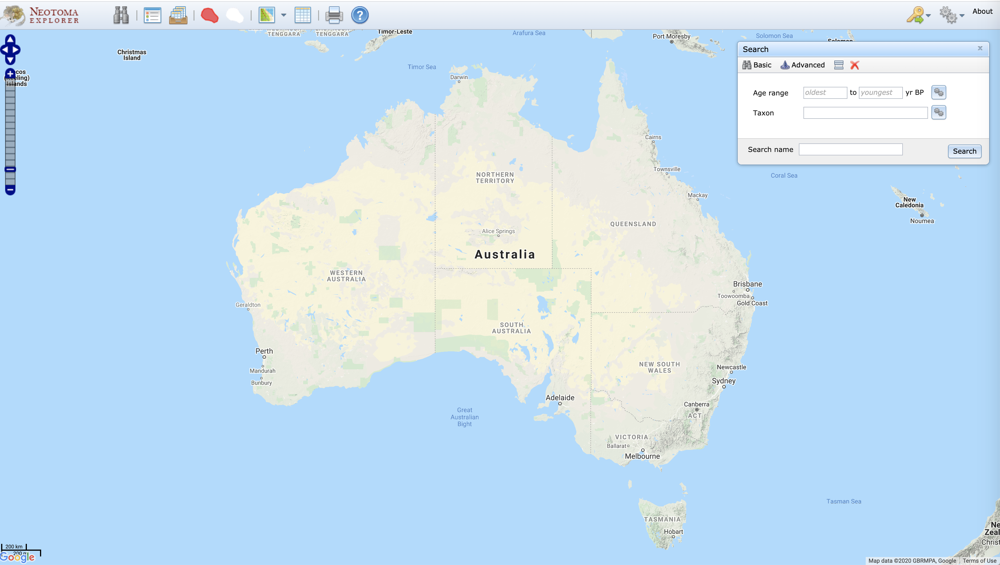
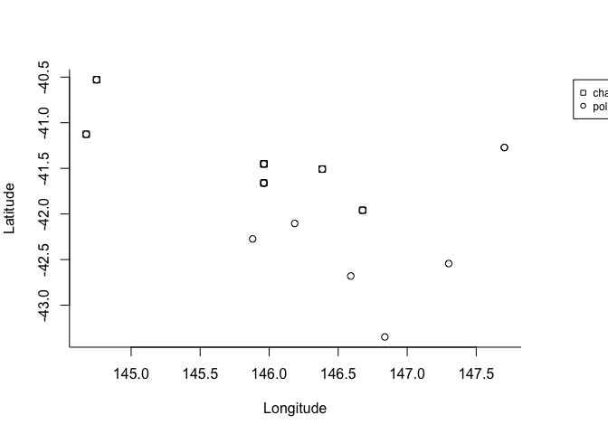
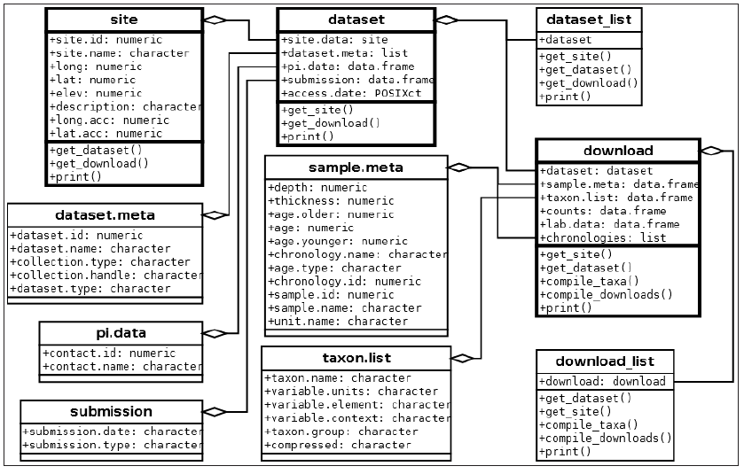
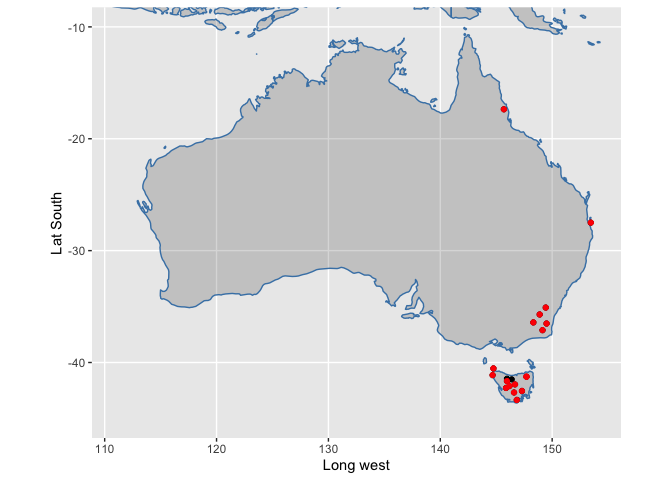
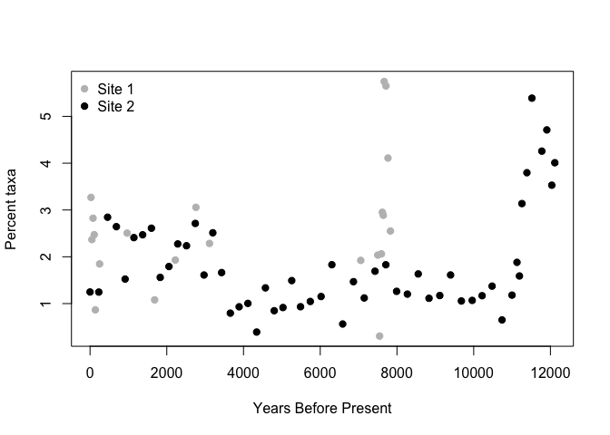

# Introduction

This workshop is intended to introduce individuals to different ways of analysing data stored in the Neotoma Paleoecology Database and the `neotoma` package for R.

1. Introduction to Neotoma Explorer for easy data exploration and extraction.
2. Training in the use of the Neotoma R package to archive, access, and analyze paleoecological data. 

Neotoma is a multiproxy paleo-database that stores a range of paleoecological & paleoenvironmental data, including vertebrate faunal data and ice cover reconstructions for North America. One of the strengths of Neotoma is the ability to compare different paleo-proxy data such as fossil pollen, diatoms, ostracodes, insects, charcoal, and geochemical data.  In addition, the database is structured to allow the creation and storage of age models built on absolute dates derived from age control points and stratigraphic sections. Neotoma is a public-access, community-supported database that has emerged as the standard repository for Pliocene and Quaternary paleoecological data.

More teaching materials can be found [in Neotoma's educational resources](http://www.neotomadb.org/education/category/higher_ed/).

This workshop is available on GitHub, in the NeotomaDB [repository](https://github.com/NeotomaDB/Workshops/tree/master/IBSQuito19).  

# Finding Data

## Explorer

### Getting Started

  1. Go to [http://www.neotomadb.org/](http://www.neotomadb.org/) and click on the 'Explorer' picture, or navigate directly to the [Explorer App](http://apps.neotomadb.org/Explorer/)
  2. Pan (by dragging), or change the zoom so that your window is centered on Australia.
  
  
{width=100% }

### Search for Data

###	Tips and tricks before we start
  1. Show/Hide Search Results
      a. We will accumulate many search layers - it may be getting a bit confusing.  Find the icon that lets you show/hide/combine search layers and use it to hide or delete some of your searches.
  2. Rename searches
      a. Searches from the "Basic" search window are automatically named, but not "Advanced" searches.Add names for your searches as you go at the bottom of the Search dialog.

####	Finding sites
  1. **Find a known site**
      a. Using the Search dialog window (Advanced tab, Metadata subtab, Site Name field), find "Camerons Lagoon". 
      b. Once you've performed the search, click on the point that appears. A window will pop up with some information about this record.

  2. **Explore sites by geography**
      a. Using the Search dialog window (Advanced tab), first choose "dataset type = charcoal" at the top
      b. Then, in the Space subtab, click "Search by extent"
      c. Click the "Extent" dropdown menu and search by shape, select the rectangle by using SHIFT+pointer, then draw a rectangle on the map in your chosen region of Australia (for example, Tasmania).
    
  3. **Find all sites within a database**
 Australia and the region has a rich history in paleoecological reseach of fossil pollen data. Let's see how many are currently in Neotoma:
      a. Search Window, Advanced Tab, Metadata subtab, Database field
      b. Find all sites within the Indo-Pac Pollen Database. 
        * Not that many sites from the region are in Neotoma currently - only 113 datasets across 31 sites
    
####  Find a Taxon 

  1. **Search for a single taxon.**
      a. Search Window, Basic Tab, use Taxon field
      b. Find all sites within the IndoPac Pollen Database with *Casuarina* records
 
  
  2. **Search for multiple taxa**
      a. Let's re-search for *Casuarina*, but make sure we've included all relevant records.
      b. Search Window, Advanced tab, Taxa subtab
        * *Note:* To do this, we will search for a "Taxa group".To the right of the "Taxon name" field, click on the gear symbol. Click on "Vascular plants" for the Taxa group, then search for *Casuarina*. Then, click on all taxa you want to include here.  For example: *Casuarina*, *Casuarina undiff.*, *Casuarina equisetifolia*, etc. 


  
####	Find all charcoal and pollen records in the database 
  1. **Search window, Advanced Tab, Dataset type = "Charcoal"**
  2. **Search window, Advanced Tab, Dataset type = "Pollen"**
  

####	Multi-Taxon Search
  1. **Find all sites with *Casuarina* pollen between 10,000 and 500 years ago.**
      a. For *Casuarina*, first click on "Dataset Type" = "pollen"
      b. Then use the 'Advanced Taxon Selection' which you can use by clicking on the gears icon to the right of the 'Taxon' field in the 'Search' window. 
        * Enter 'Taxa group' = Vascular Plant, search for *Casuarina*, click the box next to Taxon to check all taxa, then uncheck taxa  like "*Myrica/Casuarina*" or "*Casuarina/Corylus*".
      a. Then click the 'Abundance/density' box and select >5%.  
      b. Fill in the desired age range, and choose records that 'intersects result age range'. 
      c. Finally, click 'Search'
    

  2. **Find all sites with *Nothofagus* between 10,000 and 500 years **
      a. Use the 'Advanced Taxon Selection' which you can use by clicking on the gears icon to the right of the 'Taxon' field in the 'Search' window. 
      b Enter 'Taxa group' = Vascular Plant, search for *Nothofagus*, click the box next to Taxon to check all taxa you want to include.
      c. Set a relative abundance filter if you'd like (click the 'Abundance/density' box and select >5%)  
      d. Fill in the desired age range, and choose records that 'intersects result age range'. 
      e. Finally, click 'Search'

You can combine these two searches to find sites with either Casuarina OR Nothfagus, or restrict it to only those sites with both taxa.

####	Multi-Time Search
  1. Hide your previous searches and remember to name your searches, e.g. IndoPac-50ka
  2. Find all sites from the Indo-Pac database between 60,000 and 50,000 years ago.
  3. Find all sites from the Indo-Pac database between 50,000 and 40,000 years ago.
  4. Find all sites from the Indo-Pac database between 40,000 and 30,000 years ago.
  5. Find all sites from the Indo-Pac database between 30,000 and 20,000 years ago.
  6. Find all sites from the Indo-Pac database between 20,000 and 10,000 years ago.
  7. Find all sites from the Indo-Pac database between 10,000 and 0 years ago.

### Download Data
  1. Find the icon in the menu that indicates 'View search results in tables'and click on it. 
  2. Click on the Save icon to the right.  The dataset will be saved as a text file in CSV (comma separated value) format.
  4. Open the downloaded CSV file in Excel or a text editor (e.g. Notepad, Wordpad) to look at it.


# Web API- Application Programming Interface

## What is a Web API?
  1. Set of protocols for building tools and applications that use a specific web service
  2. Often a structure for URL/URI formulation to make a query on a web database, such as Neotoma, iDigBio, or the Paleobiology Database. 
    + URL = Uniform Resource Locator, or web address. 
    + URI = Uniform Resource Identifier, or web address of a service, like an API.
  3. Calls are usually sent as URL `GET` statements: values appended to a URL after a `?` that are processed as parameters to be passed to the code running on the server.  For example, we can think of http://google.com/?q=bananas as if it were an R function called `search()`, passed as `search(q="bananas")`.

Google has APIs for most of its products. You could write an R (or Python, etc.) script that would connect to the Google Calendar API to allow you to automatically change events on your calendar or report agenda items back to you in your own custom environment.  [Hilary Parker](https://hilaryparker.com/) has a nice example for [adding sunsets to Google Calendar](https://hilaryparker.com/2014/05/27/sunsets-in-google-calendar-using-r/) using R.

APIs exist for many important biological and paleobiological databases. We will work through a quick example from Neotoma. Different databases/services produce different kinds of API returns. The simplest kinds are comma delimited text files, but many APIs are now returning JSON documents. 

## More about JSON

At its most basic level, JSON transmits data objects in attribute-value pairs. It has come to replace XML, which was the previous standard for this sort of data transmission.

JSON is composed of objects, enclosed by curly brackets, which may have any number of attributes named in quotes, with values after a colon, separated by commas. You may also present an array, or an ordered collection of values, enclosed in square brackets.


Let's search the Neotoma DB via the API for *Casuarina*. Here is the example API call: 

[http://api.neotomadb.org/v1/data/sampledata?taxonname=Casuarina*]()

Notice when you make this call that the JSON is computer-friendly but not human-friendly (though this depends on browser). Try it again with the ‘pretty’ format tag:

[http://api.neotomadb.org/v1/data/sampledata?taxonname=Casuarina*&format=pretty]()

You should be able to see the nested set of JSON objects, including the occurrences returned as comma-separated objects within `"data"`.

Try experimenting with the search, substituting different names. 

JSON is becoming the standard for data transfer in web services. R has several packages for dealing with JSON-formatted data. We will use some examples from the package [`RJSONIO`](https://cran.rstudio.com/web/packages/RJSONIO/index.html). We will also use the package [`RCurl`](https://cran.rstudio.com/web/packages/Rcurl/index.html), which has functions to let you query APIs from within the R environment.  The `neotoma` package is built around the newer [`httr`](https://cran.rstudio.com/web/packages/httr/index.html) package.

## More on the Neotoma DB API

Based on the *Casuarina* example, you can see that the example API call is reporting data from only part of the distributed database schema of Neotoma. In fact, the Neotoma API is designed around a set of different URLs, each of which allows a user to search a portion of the database. So, if you want the full Site information for locations with *Casuarina* present, you would have to search on *Casuarina* in the SampleData URI (as we did in the example), pull the DatasetID values from those returns, then search on the Dataset URI ([http://api.neotomadb.org/v1/data/datasets]()) for those DatasetIDs, which would, in turn, produce the SiteIDs, which you would then search on the Sites URI ([http://api.neotomadb.org/v1/data/sites]()). This sort of searching would be cumbersome if you were to do it by hand, but fortunately you can script a computer to do it for you. In fact, you don’t have to write the scripts to do it, because they have already been constructed and provided to the community as the R [`neotoma`](https://cran.rstudio.com/web/packages/neotoma/index.html) package. 

The `neotoma` package will the the subject of our next module, but bear in mind that the other APIs also have wrapper packages to simplify data calls in R. The PaleoBioDB has a package, `paleobioDB`, and iDigBio has a package, `ridigbio`.  The Earth-Life Consortium was aimed at creating a single API and wrapping R package to access both PaleoBioDB and Neotoma at the same time, as well as linking to many online museum databases and iDigBio. We wanted to introduce you to the underlying architecture here so you would understand what these packages are doing, and would know that you can crack them open and hack your own solutions if you cannot get them to give you the data or format of data that you need for your work.

# The `neotoma` Package

Install the `neotoma` package, then add it to your programming environment 


```r
# Uncomment this line if you haven't already installed any of these packages:
# install.packages(c("neotoma"))

# Note, because the `neotoma` package is under active development there may be very recent changes
# you may be interested in.  To get those, uncomment the following lines:
# install.packages('devtools')
# devtools::install_github('ropensci/neotoma')

# Add the packages to your programming environment 
library(neotoma)
```

`neotoma` has three core commands: `get_site`, `get_dataset`, and `get_download`. The first two return metadata for sites and datasets; the latter returns data. See Goring *et al*. 2015 for a full description of the package and example code.  This exercise is partially based on those examples.

### Finding sites

We'll start with `get_site`.  `get_site` returns a `data.frame` with metadata about sites. You can use this to find the spatial coverage of data in a region (e.g. using `get_site` with a bounding box), or to get explicit site information easily from more complex data objects.  Use the command `?get_site` to see all the options available.

You can easily search by site name, for example, finding "Camerons Lagoon", a site in Tasmania.

```r
camerons_site <- get_site(sitename = 'Camerons Lagoon')
```

Examine the results


```r
print(camerons_site)
```

```
##        site.name     long       lat elev
##  Camerons Lagoon 146.6765 -41.95905 1045
## A site object containing 1 sites and 8 parameters.
```

The print out might look a bit different to you than a standard `data.frame`, but this is done so that it allows you to use this dataframe easily with other `neotoma` functions, such as the **get_download** and **get_data** which we will look into later on.

By default the search string is explicit, but you can also first search using a wildcard character (%). For example, searching for any pollen site name that has "Lagoon" returns sixteen sites:


```r
lagoon_sites <- get_site(sitename = '%Lagoon%')
```

```r
print(lagoon_sites)
```

```
##                                        site.name       long       lat elev
##  Mereya River, Lagoon Terrace Exposure S4000(30)  142.91667  46.61667    4
##  Mereya River, Lagoon Terrace Exposure S4002      142.91667  46.61667    5
##  Stone Lagoon                                    -124.00000  41.11667   NA
##  Camerons Lagoon                                  146.67654 -41.95905 1045
##  Clarence Lagoon                                 -140.60265  69.59844    4
##  Los Penasquitos Lagoon                          -117.25287  32.93112    0
##  Lazy Lagoon                                     -104.34202  33.35184 1054
##  Lagoon [OjRl-3]                                 -123.72167  71.52056   NA
##  Lagoon Pond                                      -70.60189  41.42826    1
##  Esquimalt Lagoon 11T [Fort Rodd Hill] [DcRt-13] -123.48333  48.41667   NA
##  Little Sand Bay Lagoon                           -90.88553  46.94783  185
##  Michigan Lagoon                                  -90.51207  46.87710  182
##  Outer Lagoon                                     -90.46076  47.00567  183
##  Stockton Lagoon                                  -90.54766  46.92756  188
##  Zibakenar Lagoon                                  49.88528  37.45417   -2
##  Swallow Lagoon                                   153.45472 -27.49861  150
## A site object containing 16 sites and 8 parameters.
```
143.8189, -54.6403, 158.9785, -39.2037
You can also search by lat/lon bounding box.  This one roughly corresponds to Tasmania

```r
TAS_sites <- get_site(loc = c(143, -45, 150, -39)) 
```

You can also search for different dataset types stored in Neotoma. For the full list of names, use `get_table(table.name = "DatasetTypes")` command. Let's have a look at all pollen and charcoal data in the Tasmania region.


```r
dataset_types <- c("pollen",
                   "charcoal",
                   "pollen surface sample")

# Run the `get_dataset` function for each of the different dataset types
dataset_lists <- lapply(dataset_types,
                        function(x) {
                          get_dataset(datasettype=x,
                                      loc = c(143, -45, 150, -39)) 
                          # more or less Tasmania
                          })
```

```
## The API call was successful, you have returned 14 records.
```

```
## The API call was successful, you have returned 7 records.
```

```
## Warning in get_dataset.default(datasettype = x, loc = c(143, -45, 150, -39)):
## The criteria used returned 0 sample sites. Returning NULL.
```

```r
# Using do.call here to make sure that we don't have to split the list out.
dataset_lists <- dataset_lists[-3] # remove the surface samples since there are none
datasets_tas <- do.call(bind, dataset_lists)

# And voila!
plot(datasets_tas)
```

<!-- -->

```r
# Let's look at a more interactive map with this Neotoma function called plot_leaflet
plot_leaflet(datasets_tas)
```


### Getting Datasets

The structure of the Neotoma data model, as expressed through the API, is roughly: "`counts` within `download`, `download` within `dataset`, `dataset` within `site`".  So a `dataset` contains more information than a `site`, about a particular dataset from that site. 


{ width=80% }
<figcaption><i>Figure: Major classes in Neotoma, their relations to one another and the associated methods (functions). Taken from Goring et al. 2015. Open Quaternary</i> 
<figure style="float:right; margin-left:10px" >


A site may have a single associated dataset, or multiple. The Neotoma function `get_dataset` returns a list of datasets containing the **metadata** for each **dataset**. We can pass output from `get_site` (site metadata) to `get_dataset`, even if `get_site` returns multiple sites. For example:


```r
lagoon_datasets <- get_dataset(lagoon_sites)

print(lagoon_datasets)
```

Both of the *Mereya River* sites have two datasets, while *Stone Lagoon* only has one,and *Camerons Lagoon* has three. You can see that the types of datasets represented vary, from pollen to vertebrates to charcoal to insects.


### Get_Download

The Neotoma function `get_download()` returns a `list` that stores a list of `download` objects - one for each retrieved `dataset`.  Note that `get_download()` returns the actual (raw) data associated with each dataset, rather than a list of the available datasets, as in `get_dataset()` above. Each download object contains a suite of data for the samples in that dataset.  

Here we will get data for all datasets with sites that have "cocha" in the name. Using the `get_download()` will accept an object of class `dataset` (ie, `tas_dataset`), but also of class `site` (ie, `lagoon_sites`), since it will automatically query for the datasets associated in each site.  


```r
tas_all <- get_download(datasets_tas)
```

```
## Warning in FUN(X[[i]], ...): This dataset has no defined default chronology.  Please use caution.
## Using the first chronology, No chronology as the default.
```

```
## Warning: 
## There were multiple entries for Lycopodium tablets 
## get_download has mapped aliases for the taxa in the taxon.list.

## Warning: 
## There were multiple entries for Lycopodium tablets 
## get_download has mapped aliases for the taxa in the taxon.list.
```

```
## Warning: 
## There were multiple entries for Charcoal 
## get_download has mapped aliases for the taxa in the taxon.list.
```

```r
print(tas_all, verbose = FALSE)
```

There are a number of messages that appear.  These can be suppressed with the flag `verbose = FALSE` in the function call.  One thing you'll note is that not all of the datasets can be downloaded directly to a `download` objct.  This is because `geochronologic` datasets have a different data structure than other data, requiring different fields, and as such, they can be obtained using the `get_geochron()` function. Note here that we need to use the site names from `get_site`, or search for the geochronologic datasets associated with each site using `get_dataset`:


```r
# Run the `get_dataset` function for each of the different dataset types
datasets_geochron_tas <- get_dataset(datasettype='geochronologic', 
                             loc = c(143, -45, 150, -39)) # more or less Tasmania

# Now we can retrieve the geochronology information
tas_geochron <- get_geochron(datasets_geochron_tas)

print(tas_geochron)
```
Here you see the chronological information of the thirteen sites, explaning how many chronological control points there are, what the minimum and maximum age is of the records.

Let's get the pollen datasets for just Camerons Lagoon (dataset 14969):

```r
camerons_pd <- get_download(14969)
```

```
## API call was successful. Returned record for Camerons Lagoon
```

Let's examine the available data in this download

```r
str(camerons_pd[[1]])
```

There are 6 associated fields:

1. dataset
    + site.data
    + dataset.meta
    + pi.data
    + submission
    + access.date
    + site
2. sample.meta
3. taxon.list
4. counts
5. lab.data
6. chronologies

Within the download object, `sample.meta` stores the core depth and age information for that dataset. We just want to look at the first few lines, so are using the `head()` function.  Let's explore different facets of the dataset


```r
head(camerons_pd[[1]]$sample.meta)

#taxon.list stores a list of taxa found in the dataset
head(camerons_pd[[1]]$taxon.list)

#counts stores the the counts, presence/absence data, or percentage data for each taxon for each sample
head(camerons_pd[[1]]$counts)
```

Here we can get to the papers that published about a site of interest:


```r
get_publication(datasetid = 14969)
```


# Multi-Site Analysis

If we have time, we can work through the example given the [Neotoma package paper in *Open Quaternary*](http://www.openquaternary.com/articles/10.5334/oq.ab/).

So now we know how to explore and download data for one or more sites.  What if we want to look at multiple sites? We can use the same set of `get_dataset` and `get_download` functions we used earlier, but add some specialized functions for compiling the datasets to help improve our ability to analyze the data.  Let's start by looking for sites with Causurina pollen in Australia.


```r
library("ggmap")
```

```
## Loading required package: ggplot2
```

```
## Google's Terms of Service: https://cloud.google.com/maps-platform/terms/.
```

```
## Please cite ggmap if you use it! See citation("ggmap") for details.
```

```r
library("ggplot2")
library("reshape2")
library("Bchron")
library("gridExtra")
```


```r
# let's first see where all sites in Australia are.
all.sites <- get_site(gpid="Australia")
```

```
## The API call was successful, you have returned  19 records.
```

```r
# Now we will only select sites that have pollen and Casuarina
all.datasets.cas <- get_dataset(gpid="Australia", datasettype = "pollen", 
                                taxonname = "Casuarina%")
```

```
## The API call was successful, you have returned 18 records.
```

Let's map it out!


```r
#library(rworldmap)
map <- map_data('world')

ggplot(data = data.frame(map), aes(long, lat))+
  geom_polygon(aes(group = group), color = 'steelblue', alpha = 0.2) +
  geom_point(data = all.sites, aes(x = long, y = lat)) +
  geom_point(data = get_site(all.datasets.cas),
             aes(x = long, y = lat), color = 2) +
  xlab('Long west') +
  ylab('Lat South') +
  coord_map(projection = 'albers', lat0 = 0, latl = 0,
            xlim = c(111, 154), ylim = c(-45,-10))
```

<!-- -->


```r
casuarina_data <- get_download(all.datasets.cas)
```

```
## API call was successful. Returned record for Bega Swamp
```

```
## API call was successful. Returned record for Blue Lake
```

```
## API call was successful. Returned record for Lake George
```

```
## Warning: 
## There were multiple entries for Azolla 
## get_download has mapped aliases for the taxa in the taxon.list.
```

```
## API call was successful. Returned record for Lynch's Crater
```

```
## API call was successful. Returned record for Yarlington Tier
```

```
## API call was successful. Returned record for Eagle Tarn
```

```
## API call was successful. Returned record for Adamsons Peak
```

```
## API call was successful. Returned record for Camerons Lagoon
```

```
## API call was successful. Returned record for Sundown Swamp
```

```
## API call was successful. Returned record for Stockyard Swamp
```

```
## API call was successful. Returned record for Rotten Swamp
```

```
## API call was successful. Returned record for Lake St Clair
```

```
## API call was successful. Returned record for Jacksons Bog
```

```
## API call was successful. Returned record for Ringarooma River
## API call was successful. Returned record for Ringarooma River
```

```
## Warning in FUN(X[[i]], ...): This dataset has no defined default chronology.  Please use caution.
## Using the first chronology, No chronology as the default.
```

```
## API call was successful. Returned record for Lake Vera
```

```
## API call was successful. Returned record for Dove Lake
```

```
## Warning: 
## There were multiple entries for Lycopodium tablets 
## get_download has mapped aliases for the taxa in the taxon.list.
```

```
## API call was successful. Returned record for Swallow Lagoon
```

```
## Warning: 
## There were multiple entries for Lycopodium tablets 
## get_download has mapped aliases for the taxa in the taxon.list.
```

```r
print(casuarina_data)
```


The sample data (`counts`) contained in each `download` in the `download_list` are converted into percentages using `tran()` from the analogue package (Simpson, 2007). We can then compare Casuarina pollen percentages from a few locations (say, Camerons Lagoon and Eagle Tarn) to learn about....


```r
library("analogue")
```

```
## Loading required package: vegan
```

```
## Loading required package: permute
```

```
## Loading required package: lattice
```

```
## This is vegan 2.5-6
```

```
## analogue version 0.17-4
```

```r
site1_taxa <- tran(x = casuarina_data$'14969'$counts, method = 'percent')[,'Casuarina']
site2_taxa <- tran(x = casuarina_data$'14959'$counts, method = 'percent')[,'Casuarina']

taxa_df <- data.frame(taxa = c(site1_taxa, site2_taxa),
                         ages = c(casuarina_data$'14969'$sample.meta$age,
                                  casuarina_data$'14959'$sample.meta$age),
                         site = c(rep('Site1', length(site1_taxa)),
                                  rep('Site2', length(site2_taxa))))

{plot(taxa ~ ages, data = taxa_df[which(taxa_df$site=="Site1"),], col = "gray", 
     pch = 19, xlab = 'Years Before Present', ylab = 'Percent taxa',
     xlim=range(taxa_df$ages))
points(taxa ~ ages, data = taxa_df[which(taxa_df$site=="Site2"),], col = "black", pch=19)
legend("topleft", bty="n", pch=19, col=c("gray", "black"), legend=c("Site 1", "Site 2"))}
```

<!-- -->


# A few final thoughts

* All of these tools are evolving, at times daily, and so make sure to update packages frequently
* We are currently collecting information to revamp the R package!  Please fill out a survey at the following link: [https://docs.google.com/forms/d/1_xu8ijuXZKdSAtlDA5MXzUamoW-uHYWnqlBnb1huyRo/prefill]()
* The resources will get better with your input! There are github repositories for:
    * The Neotoma Paleoecology Database itself: [https://github.com/NeotomaDB]()
    * The `neotoma` R package: [https://github.com/ropensci/neotoma]() (also accessible via the NeotomaDB github)
    * The Paleobiology Database: [https://github.com/paleobiodb]()
    * The PaleobioDB R Package: [https://github.com/ropensci/paleobioDB]()
    * iDigBio: [https://github.com/iDigBio]()
    * The ridigbio R package: [https://github.com/iDigBio/ridigbio]()
* All of these resources to access the data go only so far - we will need human eyes on our data and analyses to detect and correct errors. You can report errors via GitHub "issues", or by emailing Simon Goring directly.
* All of these resources can only access the data that is stored, with both their strengths and limitations.  Making sure any data you contribute or work with are high-quality is a necessary but enormous amount of work, with huge payoffs for you and everyone else in the community.
  
# References

* Goring, S., Dawson, A., Simpson, G., Ram, K., Graham, R., Grimm, E., & Williams, J. (2015). Neotoma: A programmatic interface to the Neotoma Paleoecological Database. Open Quaternary, 1(1).
* Flantua, S. G., Hooghiemstra, H., Grimm, E. C., Behling, H., Bush, M. B., González-Arango, C., ... & Prieto, A. R. (2015). Updated site compilation of the Latin American Pollen Database. Review of Palaeobotany and Palynology, 223, 104-115.

