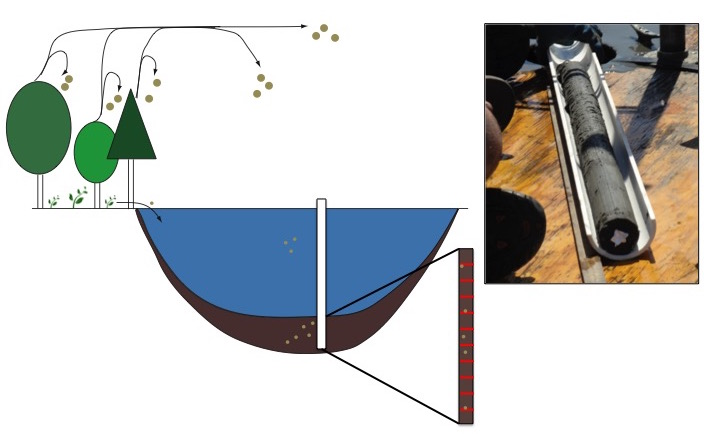

## Learning Objectives

Workshop participants will learn:

- Key elements of paleoecological data 
- how to use **APIs** (Application Programming Interface) for Neotoma and other databases
- how to use the **neotoma R package** to write scripts to retrieve Neotoma data directly into R for further analysis 


## Agenda
* 1 - 1:30pm: Getting started
    + Introductions- why are you in this workshop?  
    + Getting set up for the day
* 1:30 - 2:00pm: Overview of paleoecological data
* 2:00 - 2:30pm: Neotoma web explorer
* 2:30 - 300pm: Intro to API and JSON queries
* 3:00 - 4:00pm: R Neotoma 
* 4:00 - 4:30pm: Buffer, sandbox time

## Getting started
### Resources
- Following along today
    - Intro/Background slides can be viewed through these links:
    https://rawgit.com/NeotomaDB/Workshops/master/IBS2017/IntroSlides/IntroSlides.html
    https://speakerdeck.com/jessicablois/analyzing-paleo-data-intro-slides
    
    - The primary workshop document can be viewed through this link:
    https://rawgit.com/NeotomaDB/Workshops/master/IBS2017/R/Workshop_IBS2017_v0.3.html
    
- All slides and materials are on GitHub
    - The Neotoma Paleoecology Database
    https://github.com/NeotomaDB
    - The Workshops section
    https://github.com/NeotomaDB/Workshops/

## Getting started
### Installations
  1. Download and install R (available at https://cran.r-project.org/)
  2. Download and install RStudio Desktop (https://www.rstudio.com/products/rstudio/download3/)
  3. Install the following R packages: **RJSONIO**, **jsonlite**, **RCurl**, **neotoma**
    + Open up R Studio, then type: install.packages(c(‘RJSONIO’, ‘RCurl’, 'jsonlite'))
    + Install the `neotoma` package:
```R
install.packages('devtools')
devtools::install_github("ropensci/neotoma")
```
 
## Paleoecological data and the Neotoma Paleoecology Database
- Paleo data for biogeographers
    - taxon occurrences in space and time
    - taxon attributes
    - paleoenvironmental data
    
## Taxon occurrences:
- [Neotoma Paleoecology Database](www.neotomadb.org) (multiproxy)
- [Paleobiology Database](https://paleobiodb.org/#/) (PBDB)(multiproxy)
- [NOW database](http://www.helsinki.fi/science/now/) (mammals)
- [PaleoPortal](http://paleoportal.org/index.php?globalnav=doing_paleo&sectionnav=more_submissions&state_id=0&submission_type_id=28&type_id=5&page_num=1) (contains links to several sites)
- [GBIF](http://www.gbif.org/) 
- Others?

## Taxon morphological or functional attributes:
- Sometimes associated with the data in databases (e.g., mammal body size in PBDB)
- [MOM](http://biology.unm.edu/fasmith/Datasets/) (late Quaternary mammal body mass)
- [iDigBio](https://www.idigbio.org/)
- Modern databases (Pantheria, TRY, BIEN, etc)
    
## Paleoenvironmental data:
- CCSM3:
    - Paleo (CCSM3 & ECBilt) to future climate [Lorenz et al. 2016](http://www.nature.com/articles/sdata201648)
    - Related: [PaleoView](http://www.fordhamlab.com/climate-geography) from the Fordham lab
- HadCM3 from [Singarayer & Valdes, 2010](http://www.sciencedirect.com/science/article/pii/S0277379109003564)
- [Worldclim](http://www.worldclim.org/paleo-climate1) (6000 and 22000 ybp, based on CMIP5)
- Others?

## Paleoecological data and the Neotoma Paleoecology Database
- We will discuss attributes of paleo data in the context of Neotoma ([www.neotomadb.org](www.neotomadb.org)), a database that houses different data from the more recent periods of Earth history

## What is Neotoma?
- Neotoma is a database *consortium*: [www.neotomadb.org](www.neotomadb.org)
- Organized around proxy types
    - historically, brought together several major databases or datasets (i.e. FAUNMAP, COHMAP)
    - moving towards direct entry of individual data files
- The different databases use a common, extendable platform to ensure compatibility across proxy types
- Each proxy community can develop own standards, e.g. for taxonomy

## The Neotoma ecosystem
- Faunal data
    - FAUNMAP
    - Other datasets in progress (FAUNMAP2, MIOMAP, ANTIGUA, MQMD):
- Pollen and plant macros
    - North America Pollen Database
    - European Pollen Database
    - Latin American Pollen Database
- Packrat midden database
- Ostracodes, Diatoms
- Isotopes (coming online soon)
- Use `neotoma::get_table("datasettype")` to see all 25 available types

## Scope and strengths of Neotoma
- Pliocene to present, global
- Chronology tools and storage
- Multiproxy
- Active development community
- Curated database --> high quality data

## Curated database
- Each proxy group has a set of data stewards, led by one or a few lead stewards
- Anyone can deposit data into Neotoma
- Before going 'live', data need to be validated by a data steward

## Key elements of paleoecological data
- Fundamental message: user beware. You should understand the **taphonomy** of your study system in order to accurately infer biogeographic patterns across space and time
    - Occurrence records and taxonomy
    - Orienting occurrences in space
    - Orienting occurrences in time
- Some key taphonomy references
    - Behrensmeyer AK, Kidwell S, Gastaldo R. 2000. [Taphonomy and paleobiology.](http://dx.doi.org/10.1666/0094-8373(2000)26[103:TAP]2.0.CO;2) Paleobiology. 26(sp4):103–47
    - Jackson ST. 2012. [Representation of flora and vegetation in Quaternary fossil assemblages: known and unknown knowns and unknowns.](http://dx.doi.org/10.1016/j.quascirev.2012.05.020) Quaternary Science Reviews. 49:1–16

## Occurrence records and taxonomy
- Each occurrence is associated with a **taxonomic identification**
- Paleo data are often, though not always, less precise taxonomically than present-day data
- Different proxy types are recorded in different ways
    - Vertebrate data: MNI/NISP/Presence
    - Pollen data: counts per total pollen count, usually converted to relative abundance

## Spatial precision
- lat-long coordinates, similar to present-day data
- **Different proxy types**, different taxa, and different depositional environments **record different levels of spatial precision**
    - Plant macrofossils vs. pollen
    - Cave deposits vs. fluvial deposits

## Example: Fossil pollen from lake sediments


## Temporal precision
- Every occurrence is associated with an inference about the *time* the organism died
- There are different dating methods, each with their own assumptions and associated strengths and weaknesses
- **Different proxy types and depositional environments will be associated with different amounts of time-averaging**

## Key caveats* 
- Errors or omissions in the data
- Updates to the data may not be stored in the database
    - new dates, changes in taxonomy, etc.
- "Garbage in, garbage out" 
    - Many of the original databases like FAUNMAP and COHMAP convened a group of experts to assess various aspects of data quality. We need to keep applying that same lens to new datasets
    - Data without associated metadata can only go so far
        - *Note*: What is considered "good metadata" changes through time! 
- When in doubt, record and store as much information as possible.

*for Neotoma and all other databases!

## Getting data out of Neotoma
- Neotoma Explorer
- API
- R
- Database snapshots (housed at [www.neotomadb.org/snapshots](www.neotomadb.org/snapshots))

## Major activities
- Adding new data (MIOMAP, ANTIGUA, MQMD)
- Integration with other databases: PBDB/Neotoma cross-database searches
- DOIs: assign datasets individual DOIs (will satisfy NSF data access guidelines)
- Embargos: tools for embargoing data.
    - will allow users to enter and validate data, get a DOI for paper submission, then data go 'live' when the paper is published
- Governance and Sustainability
    - Recently formed a leadership structure
    - Formalized bylaws and policy
- Education and outreach
    - Partnerships with [SERC](http://serc.carleton.edu/index.html), [Flyover Country](http://fc.umn.edu/), etc.

## Questions and Discussion
- Thoughts, questions??
- Primary vertebrate contacts:
    - Jessica Blois, [jblois@ucmerced.edu](mailto:jblois@ucmerced.edu)
    - Edward Davis, [edavis@uoregon.edu](mailto:edavis@uoregon.edu)
    - Russ Graham, [rgraham@ems.psu.edu](mailto:rgraham@ems.psu.edu)
- Primary pollen contacts:
    - Eric Grimm, [eric.c.grimm@outlook.com](mailto:eric.c.grimm@outlook.com)
    - Jack Williams, [jww@geography.wisc.edu](mailto:jww@geography.wisc.edu)
    - Simon Goring, [simon.j.goring@gmail.com](mailto:simon.j.goring@gmail.com)
- Ostracodes:
    - Alison Smith, [alisonjs@kent.edu](mailto:alisonjs@kent.edu)
- [Neotoma Leadership Council](http://www.neotomadb.org/about/category/governance)