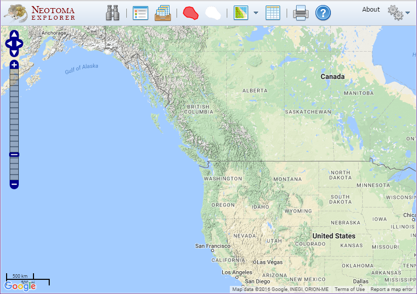
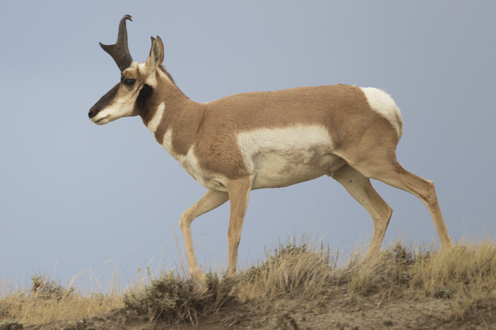
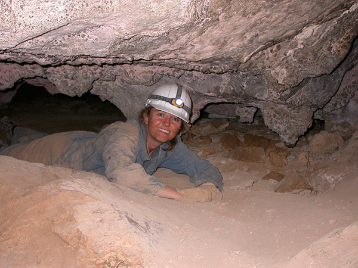
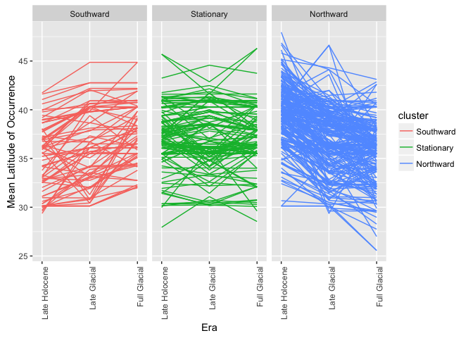

# International Biogeography Society Workshop
Jessica Blois, Scott Farley, Simon Goring, Edward Davis, Jack Williams, Eric C. Grimm  
09 January 2017  

# Introduction

This workshop is designed to use paleoecological data and associated internet resources to provide participants with the following:

1. Guidance on best practices in the archiving and analysis of paleovertebrate data

2. Training in the use of the Neotoma Paleoecology Database (www.neotomadb.org) to archive, access, and analyze paleoecological data. 

Neotoma is a multiproxy paleo-database that stores a range of paleoecological & paleoenvironmental data, including vertebrate faunal data. One of the strengths of Neotoma is the ability to compare faunal data with other proxy data such as fossil pollen, diatoms, ostracodes, insects, charcoal, and geochemical data.  In addition, the database is structured to relate absolute dates to taxon occurrences and to allow the creation and storage of age models built on absolute dates from stratigraphic sections. Neotoma is a public-access, community-supported database that is emerging as the standard repository for Pliocene and Quaternary paleoecological data.

More teaching materials can be found [in Neotoma's educational resources](http://www.neotomadb.org/education/category/higher_ed/).

This workshop is available on GitHub, in the NeotomaDB [repository](https://github.com/NeotomaDB/Workshops/tree/master/IBS2017).  

# Finding Data

## Explorer

### Getting Started

<figure style="float:right; margin-left:10px" >

<figcaption><i>This is what you see when you're in the right place.</i></figcaption>
</figure>

  1. Go to [http://www.neotomadb.org/](http://www.neotomadb.org/) and click on the 'Explorer' picture, or navigate directly to the [Explorer App](http://apps.neotomadb.org/Explorer/)
  2. Pan (by dragging), or change the zoom so that your window is centered on North America, including all of the lower 48 states and the southern half of Canada.

###	Tips and tricks
  1. Show/Hide Search Results
    a. You often accumulate many search layers - it may be getting a bit confusing.  Find the icon that lets you show/hide/combine search layers and use it to hide or delete some of your searches.
  2. Rename searches
    a. Searches from the "Basic" search window are automatically named, but not "Advanced" searches.  Add names for your searches as you go at the bottom of the Search dialog

### Search for Data

####	Finding sites
  1. **Find a known site**
    a. Using the Search dialog window (Advanced tab, Metadata subtab, Site Name field), find the classic Guilday site "New Paris #4". 
        i. *Note:* Search doesn't like the # symbol, so search for "New Paris", which should return two sites: New Paris #2, and New Paris #4
    b. Once you've performed the search, click on the point that appears.  A window will pop up with some information about this record.
    
<p style="border:3px; border-style:solid; border-color:#a9a9a9; padding: 1em;">**QUESTION 1**:  What is the latitude and longitude of New Paris #4?  What is the Site ID?</p>
  
  2. **Explore sites by geography**
    a. Using the Search dialog window (Advanced tab), first choose "dataset type = vertebrate fauna" at the top
    b. Then, in the Space subtab, click "Search by extent"
    c. Click the "Extent" dropdown menu and search by shape, select the rectangle, then draw a rectangle on the map in your chosen region of North America
    
<p style="border:3px; border-style:solid; border-color:#a9a9a9; padding: 1em;">**QUESTION 2**:  How many total sites are found in that region?</p>

  3. **Find all sites produced by a researcher**
    a. Search Window, Advanced Tab, Metadata subtab, Person Name field
    b. Find all sites produced by [Ernie Lundelius](https://www.jsg.utexas.edu/researcher/ernest_lundelius/)
    
<p style="border:3px; border-style:solid; border-color:#a9a9a9; padding: 1em;">**QUESTION 3**:  In which states has Ernie worked?</p>

####  Find a Taxon 

<figure style="float:right; margin-left:10px" >

<figcaption><i>Help me find my friends!</i> <br>[Image credit: <a href="https://en.wikipedia.org/wiki/Pronghorn">Wikimedia Foundation</a>]</figcaption>
</figure>

  1. **Search for a single taxon.**
    a. Search Window, Basic Tab, use Taxon field
    b. Find all sites with *Antilocapra* records
  
<p style="border:3px; border-style:solid; border-color:#a9a9a9; padding: 1em;">**QUESTION 4**:  How many sites have *Antilocapra* records?</p>
  
  2. **Search for multiple taxa**
    a. The basic *Antilocapra* search indicates that we might need to build up the taxonomy.  Let's re-search for *Antilocapra*, but make sure we've included all relevant records.
    b. Search Window, Advanced tab, Taxa subtab
        i. *Note:* To do this, we will search for a "Taxa group".To the right of the "Taxon name" field, click on the gear symbol. Click on "Mammals" for the Taxa group, then search for *Antilocapra*. Then, click on all taxa you want to include here.  For example: *Antilocapra americana*, *Antilocapra* sp., *Antilocapra*, cf. *Antilocapra americana*, cf *Antilocapra* sp., *Antilocapra* cf. *A. americana*, Antilocapridae ?*Antilocapra* sp., and ?*Antilocapra* sp. 
    
c.  Add the modern species range onto the search: Click on the red polygon at the top, search for and select *Antilocapra americana*

<p style="border:3px; border-style:solid; border-color:#a9a9a9; padding: 1em;">**QUESTION 5**:  What state has the easternmost location of *Antilocapra* in this search?  (For comparison, the eastern range limit of *Antilocapra* today is in western Iowa).</p>

  
####	Find all vertebrate and pollen records in the database 
  1. **Search window, Advanced Tab, Dataset type = "Vertebrate fauna"**
  2. **Search window, Advanced Tab, Dataset type = "Pollen"**
  
<p style="border:3px; border-style:solid; border-color:#a9a9a9; padding: 1em;">**QUESTION 6**:  The generation of fossil records is labor intensive and hence expensive - *e.g.* the costs of fieldwork, the money spent on radiocarbon dates, the time required for a trained analysis to identify specimens, etc. A rough time/cost estimate for a single vertebrate fossil record is on the order of two years and $30,000.  Given this, give an order-of-magnitude estimate of the number of person-years and dollars it took to generate the fossil records now stored in Neotoma. (Order-of-magnitude = 10 person-years?  100 person-years? 1000? etc.)</p>
  
####	Multi-Taxon Search
  1. **Find all sites with at least 20% *Picea* pollen between 15,000 and 12,000 years ago.**
    a. For *Picea*, first click on "Dataset Type" = "pollen"
    b. Then use the 'Advanced Taxon Selection' which you can use by clicking on the gears icon to the right of the 'Taxon' field in the 'Search' window. 
        i. Enter 'Taxa group' = Vascular Plant, search for *Picea*, click the box next to Taxon to check all taxa, then uncheck taxa  like "*Picea/Pinus*" or "*Picea/Abies*".
    c. Then click the 'Abundance/density' box and select >20%.  
    d. Fill in the appropriate age range, and choose records that 'intersects result age range'. 
    e. Finally, click 'Search'
  2. **Find all sites with *Mammut* (mastodon) between 15,000 and 12,000 years ago.**
    a. For *Mammut*, use the 'Advanced Taxon Selection' which you can use by clicking on the gears icon to the right of the 'Taxon' field in the 'Search' window.
        i. In the 'Advanced Taxon Selection' window, choose 'Mammals' for Taxa Group and then enter *Mammut* into the 'Search for' window.Then click 'Go'
        ii. Note that the search returned taxon names for both *Mammut* (mastodon) and *Mammuthus* (mammoth).  Click all boxes for all variants of *Mammut* but do not click the *Mammuthus* boxes
        iii. Enter a search name (e.g. '*Mammut* - all') and click Save
        iv. In the general search window, click 'Search'
      
<p style="border:3px; border-style:solid; border-color:#a9a9a9; padding: 1em;">**QUESTION 7**:  Does mastodon tend to live in places with spruce, or without spruce?  Suggest two hypotheses that might explain the observed association (or lack of one).</p>
      
####	Multi-Time Search
  1. Hide your previous searches.
  2. Find all sites with *Mammuthus* between 21,000 and 18,000 years ago.
  3. Find all sites with *Mammuthus* between 18,000 and 15,000 years ago.
  4. Find all sites with *Mammuthus*  between 15,000 and 13,000 years ago.
  5. Find all sites with *Mammuthus*  between 13,000 and 11,000 years ago.
  6. Find all sites with *Mammuthus*  between 11,000 and 8,000 years ago.
  
<p style="border:3px; border-style:solid; border-color:#a9a9a9; padding: 1em;">**QUESTION 8**:  Describe the history of *Mammuthus* distributions in North America over the last 21,000 years.</p>

### View Data
  1. Using the last *Mammuthus* search (between 11,000 - 8,000 years ago), click on the single site that appears (Fetterman Mammoth Locality).  
  2. In the popup window with metadata for **Fetterman**, note that the bottom includes a list of datasets available at the site.  (V = vertebrate; clock = geochronological data)
  3. Hold the mouse over the vertebrate dataset.  Note that an eyeball and '+' appear to the right.
  4. Click on the eyeball to view the Fetterman Mammoth Locality vertebrate dataset.  This opens up a new window with more detail about your dataset.
    a. Samples:  A data table.  Each row is a different variable, the first few columns show metadata associated with each specimen, and each subsequent column is a stratigraphic depth.  In this case, this is an assemblage so there is only one depth column. 
        i. Explore the specimens found at the site. 
    b. Site: General information about the site
    c. Chronology: There is no associated geochronological dataset, but the chronology tab indicates an age for the mammoth. 
    
<p style="border:3px; border-style:solid; border-color:#a9a9a9; padding: 1em;">**QUESTION 9**:  What other information would you want about this date to determine authenticity?</p>
<br>
**QUESTION 10**:  What publications are listed for Fetterman?</p>
    
<figure style="float:right; margin-left:10px" >

<figcaption><i>Well. . . Play it again Sam!</i> <br>[Image credit: <a href="http://www.ucmp.berkeley.edu/science/parks/shasta_trinity.php">UCMP.</a>]</figcaption>
</figure>

  5. Now search for the site "Samwell Cave".  
    a. Notice that this site has multiple localities within it, and each locality has both a vertebrate dataset and a geochronological dataset.
    b. Explore the Samwell Cave Popcorn Dome datasets further.
    
<p style="border:3px; border-style:solid; border-color:#a9a9a9; padding: 1em;">**QUESTION 11**:  What is the difference between information in the "Chronology" tab of the Vertebrate dataset versus the information within the Geochronology dataset?</p>


### Download Data
  1. In the popup window with metadata for Samwell Cave Popcorn Dome, hold the mouse over the vertebrate dataset.  Note that an eyeball and '+' appear to the right.  Click on the '+'.  This adds the dataset to a 'Datasets' tray.
  2. Find the icon for the 'Saved Datasets Tray' and click on it.
  3. Hover over the dataset then click on the Save icon to the right.  The dataset will be saved as a text file in CSV (comma separated value) format.
  4. Open the downloaded CSV file in Excel or a text editor (e.g. Notepad, Wordpad) to look at it.
  
<p style="border:3px; border-style:solid; border-color:#a9a9a9; padding: 1em;">**QUESTION 12**:  When was the last time *Aplodontia rufa* was seen at the site?</p>

# Web API- Application Programming Interface

## What is a Web API?
An API is a structured and documented way for computer applications to talk to each other. 
  
  - Can be used to communicate with web services and incorporate them into your own scripts.
  - Often used to access a database, such as Neotoma, iDigBio, or the Paleobiology Database.
  - Calls are usually sent as URL strings: values appended to a URL after a `?`  are processed as parameters to be passed to the server.  Most APIs use calls to different URLs and parameters to return the specific data that meets your query, such as a different resource (for example, sites, datasets, or samples) or data format (text, json, or xml). 
  
We can think of http://google.com/?q=bananas as if it were an R function called `search()`, passed as `search(q="bananas")`.

    + URL = Uniform Resource Locator -- address of a web page. 
    + URI = Uniform Resource Identifier -- web address of a service, like an API.

Many public APIs exist allowing your programs to tie into many existing web services.  For example, Google has APIs for most of its products. You could write an R (or Python, etc.) script that would connect to the Google Calendar API to allow you to automatically change events on your calendar or report agenda items back to you in your own custom environment.  [Hilary Parker](https://hilaryparker.com/) has a nice example for [adding sunsets to Google Calendar](https://hilaryparker.com/2014/05/27/sunsets-in-google-calendar-using-r/) using R.

APIs are an important part of many important biological and paleobiological databases, because they allow users to filter, search, and download records using custom scripts in their favorite language. Different database APIs have different parameter names, structures, and can produce different types of returns, including raw text, comma-delimited test, and JSON (**J**ava**S**cript **O**bject **N**otation), so make sure you review the documentation specific to the API you're trying to use. 

We will work through examples from the Paleobiology Database and Neotoma. 

## Example 1: Text returns from the Paleobiology database

**Goal:** Get all occurrences of *Camelidae* in the Paleobiology database that are dated to the Pleistocene, returning the spatial location of the occurrence. Get the response as comma-separated text (CSV format).

**Steps:**

  1. The URI for the occurrences returned in text format is `https://paleobiodb.org/data1.2/occs/list.txt`. First we tell the server we want to make a call to the API (`/data1.2`), specifically to search through the occurrences in the database (`/occs`). By calling to the `list.txt` endpoint, we tell the server that we only want our returns in text/CSV format.
  
    *Without any parameters, this call will fail.  The developers of this API have required at least one parameter to be included with the search so that not all records are returned at once.*
    
  2. To specify parameters, add a `?`, followed by the parameter key-value pairs. `base_name=Camelidae` searches for a taxonomic name at any level of the Linnaean hierarchy and returns any occurrences with that name, its synonyms, or its subtaxa.  Try changing to a name of interest to you.
  
  `https://paleobiodb.org/data1.2/occs/list.txt?base_name=Camelidae`
  
  3. To combine multiple search or filter parameters in a single request a request, use a `&` between key-value pairs. `&interval=Pleistocene` returns occurrences that fall within the specific geologic interval. Intervals can include North American Land Mammal Ages as well as the conventional Geologic Timescale.  Try “Blancan” and “Burdigalian” to see what happens.
  
  `https://paleobiodb.org/data1.2/occs/list.txt?base_name=Camelidae&interval=Pleistocene`
  
  4. Finally, the PaleoBioDB API allows you to pick what data fields gets returned with your call using the `show` parameter. `show=loc` includes the location of the occurrences.
  
You should end up with a URI string like this, which can be typed into your web browser:

`https://paleobiodb.org/data1.2/occs/list.txt?base_name=Camelidae&interval=Pleistocene&show=loc`

A successful call should return something like this:

| "occurrence_no" | "record_type" | "reid_no" | "flags" | "collection_no" | "identified_name"           | "identified_rank" | "identified_no" | "difference" | "accepted_name"             | "accepted_rank" | "accepted_no" | "early_interval"   | "late_interval" | "max_ma" | "min_ma" | "reference_no" | "cc" | "state"        | "county"    | "latlng_basis"             | "latlng_precision" | "geogscale"        | "geogcomments"                                  | 
|-----------------|---------------|-----------|---------|-----------------|-----------------------------|-------------------|-----------------|--------------|-----------------------------|-----------------|---------------|--------------------|-----------------|----------|----------|----------------|------|----------------|-------------|----------------------------|--------------------|--------------------|-------------------------------------------------| 
| "138835"        | "occ"         | ""        | ""      | "11803"         | "Camelus sp."               | "genus"           | "42521"         | ""           | "Camelus"                   | "genus"         | "42521"       | "Late Pleistocene" | ""              | "0.126"  | "0.0117" | "4200"         | "IL" | "Mount Carmel" | ""          | "based on nearby landmark" | "minutes"          | ""                 | "Tabun Cave - Lat/Long for nearby Mount Carmel" | 
| "194913"        | "occ"         | ""        | ""      | "20011"         | "Hemiauchenia sp."          | "genus"           | "42528"         | ""           | "Hemiauchenia"              | "genus"         | "42528"       | "Irvingtonian"     | ""              | "1.8"    | "0.3"    | "2066"         | "US" | "Nevada"       | "Douglas"   | "based on political unit"  | "1"                | "small collection" | "Antelope Valley"                               | 
| "194920"        | "occ"         | ""        | ""      | "20012"         | "Hemiauchenia sp."          | "genus"           | "42528"         | ""           | "Hemiauchenia"              | "genus"         | "42528"       | "Irvingtonian"     | ""              | "1.8"    | "0.3"    | "2066"         | "US" | "Nevada"       | "Douglas"   | "based on political unit"  | "1"                | "small collection" | "Antelope Valley"                               | 
| "194921"        | "occ"         | ""        | ""      | "20012"         | "Camelidae indet."          | "family"          | "42513"         | ""           | "Camelidae"                 | "family"        | "42513"       | "Irvingtonian"     | ""              | "1.8"    | "0.3"    | "2066"         | "US" | "Nevada"       | "Douglas"   | "based on political unit"  | "1"                | "small collection" | "Antelope Valley"                               | 
| "194927"        | "occ"         | ""        | ""      | "20014"         | "Camelidae indet."          | "family"          | "42513"         | ""           | "Camelidae"                 | "family"        | "42513"       | "Irvingtonian"     | ""              | "1.8"    | "0.3"    | "2066"         | "US" | "Nevada"       | "Douglas"   | "based on political unit"  | "1"                | "small collection" | "Antelope Valley"                               | 
| "195782"        | "occ"         | ""        | ""      | "20123"         | "Camelops sp."              | "genus"           | "42520"         | ""           | "Camelops"                  | "genus"         | "42520"       | "Irvingtonian"     | ""              | "1.8"    | "0.3"    | "1186"         | "US" | "California"   | "San Diego" | "based on political unit"  | "1"                | "small collection" | "Anza-Borrego Desert State Park"                | 


There are many useful parameters to facilitate searching occurrences in the Paleobiology database, including:

  - taxonomy
  - age
  - environment
  - location
  - geographic bounding box (`lngmin` and `lngmax` as well as `latmin` and `latmax`)
  - database ID

The list of potential parameters is here: [https://paleobiodb.org/data1.2/occs/list_doc.html](https://paleobiodb.org/data1.2/occs/list_doc.html). 

Try for a few minutes to explore the data with different parameters, using the list above.

The full documentation (with a list of all of the available resources) for the Paelobiology Database API is located at [https://paleobiodb.org/data1.2/](https://paleobiodb.org/data1.2/)

## JSON
Text returns are easily read by humans, but are often not suitable for the nested data structure saved in relational databases and can be hard for computers to interpret. 

*J*ava*S*cript *O*bject *N*otation (JSON) is:
  
  - a widely used data format that can encode hierarchical relationships
  - (relatively) human readable
  - can be consumed by many scripting languages (javascript, R, python, etc)
  - newer alternative to XML (e*X*tensible *M*arkup *L*anguage), which you may have seen before
  - modern standard for web-based transmission of data

JSON is composed of key-value pairs, enclosed by curly brackets and separated by commas (sets of key value-pairs within curly brackets are called objects). You may also present an array, or an ordered collection of values, enclosed in square brackets. Values may be objects, allowing nested relationships between data.

As an example, you could present an occurrence like this example from the Neotoma API:

```javascript
{
  "SiteLongitudeWest": -103.31666666666666,
  "SiteLatitudeSouth": 34.283333333333339,
  "TaxonName": "Smilodon fatalis",
  "VariableElement": "bone/tooth",
  "Value": 1.0,
  "VariableContext": null,
  "TaxaGroup": "MAM",
  "SampleAgeYounger": 15332.0,
  "SampleAgeOlder": 30041.0,
  "SiteLongitudeEast": -103.31666666666666,
  "SiteAltitude": 1280.0,
  "VariableUnits": "present/absent",
  "DatasetID": 4564,
  "SampleAge": null,
  "SiteLatitudeNorth": 34.283333333333339
}
```

Can you tell what kind of occurrence this JSON object is describing? How old is it? Where is it located? 

## Example 2: Neotoma, JSON, and R

**Goal**: Search Neotoma for all Smilodon occurrences, and put them into an R data frame.


**Steps:**

  + The Neotoma database has a different structure and requires different parameters than the Paleobiology database. Here is the example API call: 

[http://api.neotomadb.org/v1/data/sampledata?taxonname=Smilodon*](http://api.neotomadb.org/v1/data/sampledata?taxonname=Smilodon*)

  + Notice when you make this call that the JSON is computer-friendly but not human-friendly. Try it again with the ‘pretty’ format tag:

[http://api.neotomadb.org/v1/data/sampledata?taxonname=Smilodon*&format=pretty](http://api.neotomadb.org/v1/data/sampledata?taxonname=Smilodon*&format=pretty)

You should be able to see the nested set of JSON objects, including the occurrences returned as comma-separated objects within `"data"`.

Try experimenting with the search, substituting different names. 

Even when `pretty`, it will be difficult to analyze or map the data as JSON. Before that, we'll need to put the data into an R dataframe. We will use the `jsonlite` package for this, which is a simple way for R to read JSON files.  There are several other packages for JSON-formatted data in the CRAN repository, including [`RJSONIO`](https://cran.rstudio.com/web/packages/RJSONIO/index.html), [`RCurl`](https://cran.rstudio.com/web/packages/Rcurl/index.html), and [`httr`](https://cran.rstudio.com/web/packages/httr/index.html). 

  + Load (and install) the `jsonlite` package.


```r
# Uncomment this line if you haven't already installed this package:
# install.packages(c("jsonlite"))

# Add the packages to your programming environment 
library(jsonlite)
```


   + Make the call to the Neotoma API, saving the result as an R variable. Make sure the URI is represented as a string (enclosed in quotes) so it is properly interpreted by R.


```r
uri = "http://api.neotomadb.org/v1/data/sampledata?taxonname=Smilodon*"
response <- fromJSON(uri) # make the call, save the JSON
```
   + Look at the structure of the data we got back:


```r
str(response)
```

```
## List of 2
##  $ success: int 1
##  $ data   :'data.frame':	34 obs. of  15 variables:
##   ..$ SiteLongitudeWest: num [1:34] -103.3 -91.8 -98.8 -98.4 -86.8 ...
##   ..$ SiteLatitudeSouth: num [1:34] 34.3 29.9 31.1 29.6 36.2 ...
##   ..$ TaxonName        : chr [1:34] "Smilodon fatalis" "Smilodon fatalis" "Smilodon sp." "Smilodon fatalis" ...
##   ..$ VariableElement  : chr [1:34] "bone/tooth" "bone/tooth" "bone/tooth" "bone/tooth" ...
##   ..$ Value            : num [1:34] 1 1 1 1 88 2 29 1 61 24 ...
##   ..$ VariableContext  : logi [1:34] NA NA NA NA NA NA ...
##   ..$ TaxaGroup        : chr [1:34] "MAM" "MAM" "MAM" "MAM" ...
##   ..$ SampleAgeYounger : num [1:34] 15332 9419 11417 11417 1 ...
##   ..$ SampleAgeOlder   : num [1:34] 30041 13854 40350 23956 11549 ...
##   ..$ SiteLongitudeEast: num [1:34] -103.3 -91.8 -98.8 -98.4 -86.8 ...
##   ..$ SiteAltitude     : num [1:34] 1280 NA NA NA 113 113 113 54 54 54 ...
##   ..$ VariableUnits    : chr [1:34] "present/absent" "present/absent" "present/absent" "present/absent" ...
##   ..$ DatasetID        : int [1:34] 4564 4939 5366 5371 5479 5479 5479 6060 6061 6062 ...
##   ..$ SampleAge        : num [1:34] NA NA NA NA NA NA NA NA NA NA ...
##   ..$ SiteLatitudeNorth: num [1:34] 34.3 29.9 31.1 29.6 36.2 ...
```

The server gave us back a named list of two elements.  The first element is an integer called `success`.  If success is not equal to 1, the server had an error while processing your request. You may want to ensure that `success` is true before attempting to pass data into analysis scripts. 

The second element is a `data.frame` of sample data from Neotoma, containing 15 fields.

```r
head(response$data)
```

```
##   SiteLongitudeWest SiteLatitudeSouth        TaxonName VariableElement
## 1        -103.31667          34.28333 Smilodon fatalis      bone/tooth
## 2         -91.75000          29.86667 Smilodon fatalis      bone/tooth
## 3         -98.75000          31.11667     Smilodon sp.      bone/tooth
## 4         -98.36667          29.61667 Smilodon fatalis      bone/tooth
## 5         -86.78333          36.18333 Smilodon fatalis      bone/tooth
## 6         -86.78333          36.18333 Smilodon fatalis      bone/tooth
##   Value VariableContext TaxaGroup SampleAgeYounger SampleAgeOlder
## 1     1              NA       MAM            15332          30041
## 2     1              NA       MAM             9419          13854
## 3     1              NA       MAM            11417          40350
## 4     1              NA       MAM            11417          23956
## 5    88              NA       MAM                1          11549
## 6     2              NA       MAM             2408          10640
##   SiteLongitudeEast SiteAltitude  VariableUnits DatasetID SampleAge
## 1        -103.31667         1280 present/absent      4564        NA
## 2         -91.75000           NA present/absent      4939        NA
## 3         -98.75000           NA present/absent      5366        NA
## 4         -98.36667           NA present/absent      5371        NA
## 5         -86.78333          113           NISP      5479        NA
## 6         -86.78333          113           NISP      5479        NA
##   SiteLatitudeNorth
## 1          34.28333
## 2          29.86667
## 3          31.11667
## 4          29.61667
## 5          36.18333
## 6          36.18333
```

This data frame could be directly passed into further analyses as the results of the Neotoma search.

## R packages and Database APIs

In the previous example, you can see that the example API call is reporting data from only part of the distributed database schema of Neotoma. In fact, the Neotoma API is designed around a set of different URLs, each of which allows a user to search a portion of the database. So, if you want the site information for occurrences of *Smilodon*, you would have to:

  1. search on *Smilodon* in the SampleData URI (as we did in the example)
  2. Get the DatasetID values from each record
  3. Search Neotoma for each Dataset ID using the Datasets resource ([http://api.neotomadb.org/v1/data/datasets]())
  4. Get the SiteID from each dataset record
  5. Search Neotoma for each Site using the Sites resource ([http://api.neotomadb.org/v1/data/sites]()). 

This sort of searching would be cumbersome if you were to do it by hand, but fortunately you can script a computer to do it for you. In fact, you don’t even have to write the scripts to do it, because calls like this have already been constructed and provided to the community as the R [`neotoma`](https://cran.rstudio.com/web/packages/neotoma/index.html) package. 

Other APIs also have wrapper packages to simplify data calls in R, including the paleobiology database (`paleobioDB`) and iDigBio (`ridigbio`).  Currently, a large group of collaborators is working on a single API and wrapping R package to access both PaleoBioDB and Neotoma at the same time, as well as linking to many online museum databases and iDigBio. 

While these packages are a great convenience and the `neotoma` package is the subject of our next module, we wanted to introduce you to the underlying architecture here so you would understand what these packages are doing. If they cannot give you the data or format you need for your work, the API can be cracked open and a custom solution can be easily put together.

# The `neotoma` Package

Install the `neotoma` package, then add it to your programming environment 


```r
# Uncomment this line if you haven't already installed any of these packages:
# install.packages(c("neotoma"))

# Note, because the `neotoma` package is under active development there may be very recent changes
# you may be interested in.  To get those, uncomment the following lines:
# install.packages('devtools')
# devtools::install_github('ropensci/neotoma')

# Add the packages to your programming environment 
library(neotoma)
```

`neotoma` has three core commands: `get_site`, `get_dataset`, and `get_download`. The first two return metadata for sites and datasets; the latter returns data. See Goring *et al*. [@neotoma_goring] for a full description of the package and example code.  This exercise is partially based on those examples.

### Finding sites

We'll start with `get_site`.  `get_site` returns a `data.frame` with metadata about sites. You can use this to find the spatial coverage of data in a region (using `get_site` with a bounding box), or to get explicit site information easily from more complex data objects.  Use the command `?get_site` to see all the options available.

You can easily search by site name, for example, finding "Samwell Cave".  

```r
samwell_site <- get_site(sitename = 'Samwell%')
```

Examine the results


```r
print(samwell_site)
```

```
##     site.name      long      lat elev
##  Samwell Cave -122.2379 40.91691  465
## A site object containing 1 sites and 8 parameters.
```

While `samwell_site` is a `data.frame` it also has class `site`, that's why the print output looks a little different than a standard `data.frame`.  That also allows you to use some of the other `neotoma` functions more easily.  

By default the search string is explicit, but because older sites, especially pollen sites entered as part of COHMAP, often had appended textual information (for example `(CA:British Columbia)`), it's often good practice to first search using a wildcard character.  For example, searching for "Marion" returns three sites:


```r
marion_site <- get_site(sitename = 'Marion%')
```

```r
print(marion_site)
```

```
##                          site.name       long      lat elev
##  Marion Lake (CA:British Columbia) -122.54722 49.30833  305
##  Marion Landfill                    -83.18611 40.59167   NA
##  Marion Lake                       -121.86241 44.55770 1259
## A site object containing 3 sites and 8 parameters.
```

You can also search by lat/lon bounding box.  This one roughly corresponds to Florida.

```r
FL_sites <- get_site(loc = c(-88, -79, 25, 30)) 
```

You can also search by geopolitical name or geopolitical IDs (`gpid`) stored in Neotoma. For a list of names and gpids, go to [http://api.neotomadb.org/apdx/geopol.htm](), or use the `get_table(table.name = "GeoPoliticalUnits")` command.  This command works either with an explicit numeric ID, or with a text string:


```r
# get all sites in New Mexico (gpid=7956)
NM_sites <- get_site(gpid = 7956)

# get all sites in Wisconsin
WI_sites <- get_site(gpid = "Wisconsin")
```

`data.frame` stores vectors of equal length.  The nice thing about a `data.frame` is that each vector can be of a different type (character, numeric values, *etc*.). In RStudio, you can use the Environment panel in upper right to explore variables. 

We pointed out before that the object returned from `get_site` is both a `data.frame` and a `site` object.  Because it has a special `print` method some of the information from the full object is obscured when printed.  You can see all the data in the `data.frame` using `str` (short for *structure*):


```r
str(samwell_site)
```

Let's look at the `description` field:


```r
samwell_site$description

marion_site$description
```


### Getting Datasets

The structure of the Neotoma data model, as expressed through the API is roughly: "`counts` within `download`, `download` within `dataset`, `dataset` within `site`".  So a `dataset` contains more information than a site, about a particular dataset from that site.  A site may have a single associated dataset, or multiple.  For example:


```r
samwell_datasets <- get_dataset(samwell_site)

print(samwell_datasets)
```

`get_dataset` returns a list of datasets containing the metadata for each dataset

We can pass output from `get_site` to `get_dataset`, even if `get_site` returns multiple sites


```r
marion.meta.dataset  <- get_dataset(marion_site)
```

Let's look at the metadata returned for the `Marion%` search:


```r
marion.meta.dataset
```

Both *Marion Lake (CA: British Columbia)* and *Marion Landfill* have a geochronology dataset, while *Marion Lake (CA: British Columbia)* has a pollen dataset and *Marion Landfill* a vertebrate fauna dataset. The third site, *Marion Lake*, has a diatom dataset and a water chemistry dataset.

<p style="border:3px; border-style:solid; border-color:#a9a9a9; padding: 1em;">**Question 13**: Are Marion Lake (CA: British Columbia) and Marion Lake the same site? Try using the `browse` function.</p>

Further searches (*i.e.*, to examine the lat/longs) or consulting the literature would be required. This illustrates the caution needed when using this, or any other, database. Human judgement still needs to be exercised when examining results from databases.  The `get_publication()` function can return citation information if neccessary, but often using the `browse()` function is very helpful in examining a database further.

### Get_Download

`get_download()` returns a `list` that stores a list of `download` objects - one for each retrieved `dataset`.  Note that `get_download()` returns the actual data associated with each dataset, rather than a list of the available datasets, as in `get_dataset()` above. Each download object contains a suite of data for the samples in that dataset.  

Get data for all datasets at Samwell Cave. `get_download()` will accept an object of class dataset (ie, `samwell_dataset`), but also of class site, since it will automatically query for the datasets associated in each site.  Compare the returned messages for the following two commands:


```r
samwell_all <- get_download(samwell_site)
```

```
## Warning in get_download.default(datasetid, verbose = verbose): Some datasetids returned empty downloads, be aware that length(datasetid) is longer than the download_list.
```

```r
samwell_all <- get_download(samwell_datasets)
```

```
## Warning in get_download.default(datasetid, verbose = verbose): Some datasetids returned empty downloads, be aware that length(datasetid) is longer than the download_list.
```

```r
print(samwell_all)
```

There are a number of messages that appear.  These should be suppressed with the flag `verbose = FALSE` in the function call.  One thing you'll note is that not all of the datasets can be downloaded directly to a `download` objct.  This is because `geochronologic` datasets have a different data structure than other data, requiring different fields, and as such, they can be obtained using the `get_geochron()` function:


```r
samwell_geochron <- get_geochron(samwell_site)

print(samwell_geochron)
```

The result is effectively the inverse of the first.

Get the vertebrate datasets for just Samwell Cave Popcorn Dome (dataset 14262):

```r
samwell_pd <- get_download(14262)
```

```
## API call was successful. Returned record for Samwell Cave
```

Let's examine the available data in this download

```r
str(samwell_pd[[1]])
```

There are 6 associated fields:

1. dataset
    + site.data
    + dataset.meta
    + pi.data
    + submission
    + access.date
    + site
2. sample.meta
3. taxon.list
4. counts
5. lab.data
6. chronologies

Within the download object, `sample.meta` stores the core depth and age information for that dataset. We just want to look at the first few lines, so are using the `head()` function.  Let's explore different facets of the dataset


```r
head(samwell_pd[[1]]$sample.meta)

#taxon.list stores a list of taxa found  in the  dataset
head(samwell_pd[[1]]$taxon.list)

#counts stores the the counts, presence/absence data, or percentage data for each taxon for each sample
head(samwell_pd[[1]]$counts)
```

# Multi-Site Analysis

If we have time, we can work through the example given the [Neotoma package paper in *Open Quaternary*](http://www.openquaternary.com/articles/10.5334/oq.ab/).

Jump to the section "Examples", then scroll down to "Mammal Distributions in the Pleistocene".  The R code is reproduced below, with some modifications to accomodate changes since publication.


```r
# install.packages('ggplot2','reshape2')
library("ggplot2")
library("reshape2") 
```


```r
#  Bounding box is effectively the continental USA, excluding Alaska 
mam.set <- get_dataset(datasettype= 'vertebrate fauna', loc = c(-125, 30, -115, 49.5))

#  Retrieving this many sites can be very time consuming.
# If you are running code that takes a long time, but has an obvious output, you can stick it
# in an output file and call it later.  This is a nice trick :)

# if ("mam_dl.rds" %in% list.files('objects')) {
#   mam.dl <- readRDS('objects/mam_dl.rds')
# } else {
#   mam.dl <- get_download(mam.set)
#   saveRDS(mam.dl, file = 'objects/mam_dl.rds')
# }

githubURL <- "https://github.com/NeotomaDB/Workshops/blob/master/SVP2016/R/objects/mam.dl.RData?raw=true"
load(url(githubURL))

compiled.mam <- compile_downloads(mam.dl)

time.bins <- c(500, 4000, 10000, 15000, 20000) 

mean.age <- rowMeans(compiled.mam[,c('age.old','age.young', 'age')], na.rm = TRUE) 

interval <- findInterval(mean.age, time.bins) 

periods <- c('Modern',
             'Late Holocene',
             'Early-Mid Holocene',
             'Late Glacial',
             'Full Glacial',
             'Late Pleistocene') 

compiled.mam$ageInterval <- periods[interval + 1]

mam.melt <- melt(compiled.mam, measure.vars = 11:(ncol(compiled.mam)-1), na.rm = TRUE, factorsAsStrings = TRUE) 

mam.melt <- transform(mam.melt, ageInterval = factor(ageInterval, levels = periods)) 

mam.lat <- dcast(data = mam.melt, variable ~ageInterval, value.var = 'lat', 
                 fun.aggregate = mean, drop = TRUE)[,c(1, 3, 5, 6)]   # variable Late Holocene Late Glacial Full Glacial

# We only want taxa that appear at all time periods: 
mam.lat <- mam.lat[rowSums(is.na(mam.lat)) == 0, ] 

# Group the samples based on the range &direction (N vs S) of migration. 
# A shift of only 1 degree is considered stationary. 
mam.lat$grouping <- factor(findInterval (mam.lat[,2] - mam.lat[, 4], c(-11, -1, 1, 20)), 
                           labels = c('Southward','Stationary','Northward')) 
mam.lat.melt <- melt(mam.lat) 
colnames(mam.lat.melt)[2:3] <- c('cluster','Era')

ggplot(mam.lat.melt, aes(x = Era, y = value)) +
  geom_path(aes(group = variable, color =cluster)) +
  facet_wrap(~ cluster) + 
  scale_x_discrete(expand = c(.1,0)) + 
  ylab('Mean Latitude of Occurrence') +
  theme(axis.text.x = element_text(angle = 90, hjust = 1))
```

<!-- -->

# A few final thoughts

* All of these tools are evolving, at times daily, and so make sure to update packages frequently
* The resources will get better with your input! There are github repositories for:
    * The Neotoma Paleoecology Database itself: [https://github.com/NeotomaDB]()
    * The `neotoma` R package: [https://github.com/ropensci/neotoma]() (also accessible via the NeotomaDB github)
    * The Paleobiology Database: [https://github.com/paleobiodb]()
    * The PaleobioDB R Package: [https://github.com/ropensci/paleobioDB]()
    * iDigBio: [https://github.com/iDigBio]()
    * The ridigbio R package: [https://github.com/iDigBio/ridigbio]()
* All of these resources to access the data go only so far - we will need human eyes on our data and analyses to detect and correct errors. You can report errors via GitHub "issues", or by emailing Jessica directly.
* All of these resources can only access the data that is stored, with both their strengths and limitations.  Making sure any data you contribute or work with are high-quality is a necessary but enormous amount of work, with huge payoffs for you and everyone else in the community.
  
# References
