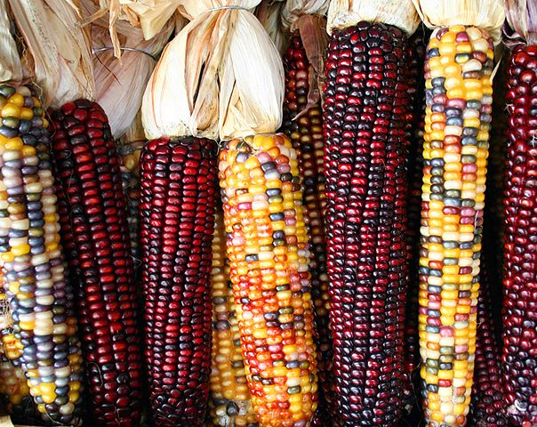

# Introduction

This workshop is intended to introduce individuals to the Neotoma Paleoecology Database and the `neotoma` package for R.

1. Introduction to Neotoma Explorer for easy data exploration and extraction.
2. Training in the use of the Neotoma R package to archive, access, and analyze paleoecological data. 

Neotoma is a multiproxy paleo-database that stores a range of paleoecological & paleoenvironmental data, including vertebrate faunal data and ice cover reconstructions for North America. One of the strengths of Neotoma is the ability to compare different paleo-proxy data such as fossil pollen, diatoms, ostracodes, insects, charcoal, and geochemical data.  In addition, the database is structured to allow the creation and storage of age models built on absolute dates derived from age control points and stratigraphic sections. Neotoma is a public-access, community-supported database that has emerged as the standard repository for Pliocene and Quaternary paleoecological data.

More teaching materials can be found [in Neotoma's educational resources](http://www.neotomadb.org/education/category/higher_ed/).

This workshop is available on GitHub, in the NeotomaDB [repository](https://github.com/NeotomaDB/Workshops/tree/master/IBSQuito19).  

# Finding Data

## Explorer

### Getting Started

<figure style="float:right; margin-left:10px" >

<figcaption><i>This is what you see when you're in the right place.</i></figcaption>
</figure>

  1. Go to [http://www.neotomadb.org/](http://www.neotomadb.org/) and click on the 'Explorer' picture, or navigate directly to the [Explorer App](http://apps.neotomadb.org/Explorer/)
  2. Pan (by dragging), or change the zoom so that your window is centered on South America.

### Search for Data

###	Tips and tricks before we start
  1. Show/Hide Search Results
    a. We will accumulate many search layers - it may be getting a bit confusing.  Find the icon that lets you show/hide/combine search layers and use it to hide or delete some of your searches.
  2. Rename searches
    a. Searches from the "Basic" search window are automatically named, but not "Advanced" searches.  Add names for your searches as you go at the bottom of the Search dialog.

####	Finding sites
  1. **Find a known site**
    a. Using the Search dialog window (Advanced tab, Metadata subtab, Site Name field), find "Laguna de Chochos". 
    b. Once you've performed the search, click on the point that appears. A window will pop up with some information about this record.

  2. **Explore sites by geography**
    a. Using the Search dialog window (Advanced tab), first choose "dataset type = charcoal" at the top
    b. Then, in the Space subtab, click "Search by extent"
    c. Click the "Extent" dropdown menu and search by shape, select the rectangle by using SHIFT+pointer, then draw a rectangle on the map in your chosen region of South America
    
  3. **Find all sites within a database**
 Latin America has a rich history in paleoecological reseach of fossil pollen data, see [Flantua et al. 2015]  (http://www.sciencedirect.com/science/article/pii/S0034666715001773). Over 1400 fossil pollen records have been identified from literature as you can see in this mapinterface [LAPD](https://uvagis.maps.arcgis.com/apps/webappviewer/index.html?id=7403398bce354f1bb6a163ff0f3a4ea1)
Let's see how many are currently in Neotoma:
    a. Search Window, Advanced Tab, Metadata subtab, Database field
    b. Find all sites within the Latin American Pollen Database. Currently more data are being uploaded and made available by authors, so this is much an ungoing process.
    
####  Find a Taxon 

<figure style="float:right; margin-left:10px" >

<figcaption><i>Corn!!</i> <br>[Image credit: <a href="https://en.wikipedia.org/wiki/Zea_(plant)">Wikimedia Foundation</a>]</figcaption>
</figure>

  1. **Search for a single taxon.**
    a. Search Window, Basic Tab, use Taxon field
    b. Find all sites within the Latin American Pollen Database with *Zea mays* records
      i. *Note:* Wanna know more about the history of corn in South America? 
  Check out the PhD thesis from [C. Grimaldo] (https://pdfs.semanticscholar.org/d215/f8e68e2ca724f55bfaffc358bb7e7fd65d9a.pdf) 

  
  2. **Search for multiple taxa**
    a. Let's re-search for *Zea mays*, but make sure we've included all relevant records.
    b. Search Window, Advanced tab, Taxa subtab
        i. *Note:* To do this, we will search for a "Taxa group".To the right of the "Taxon name" field, click on the gear symbol. Click on "Vascular plants" for the Taxa group, then search for *Zea*. Then, click on all taxa you want to include here.  For example: *Zea*, *Zea mays*, *Zea undiff.*, *Zea mays (type 536), Kuhry 1988)*, *Zea mays (type 548), Kuhry 1988)*, *Zea mays-type*. 


  
####	Find all vertebrate and pollen records in the database 
  1. **Search window, Advanced Tab, Dataset type = "Vertebrate fauna"**
  2. **Search window, Advanced Tab, Dataset type = "Pollen"**
  

####	Multi-Taxon Search
  1. **Find all sites with *Mauritia* pollen between 10,000 and 500 years ago.**
    a. For *Mauritia*, first click on "Dataset Type" = "pollen"
    b. Then use the 'Advanced Taxon Selection' which you can use by clicking on the gears icon to the right of the 'Taxon' field in the 'Search' window. 
        i. Enter 'Taxa group' = Vascular Plant, search for *Mauritia*, click the box next to Taxon to check all taxa, then uncheck taxa  like "*Clematis*" or "*Psiloxylon*".
    c. Then click the 'Abundance/density' box and select >5%.  
    d. Fill in the appropriate age range, and choose records that 'intersects result age range'. 
    e. Finally, click 'Search'
    
    <p style="border:3px; border-style:solid; border-color:#a9a9a9; padding: 1em;">**QUESTION 1**:  Are Mauritia mostly a highland or lowland taxa?</p>
    
  2. **Find all sites with at least 10% *Poaceae* (grasses) between 10,000 and 500 years ago and at elevations lower than 1000 m**
    a. Use the 'Advanced Taxon Selection' which you can use by clicking on the gears icon to the right of the 'Taxon' field in the 'Search' window. 
    b. Enter 'Taxa group' = Vascular Plant, search for *Poaceae*, click the box next to Taxon to check all taxa.
    c. Then click the 'Abundance/density' box and select >10%.  
    d. Fill in the appropriate age range, and choose records that 'intersects result age range'. 
    e. Go to the Space subtab, Altitude field and fill in 1000 at max altitude. 
    e. Finally, click 'Search'

<p style="border:3px; border-style:solid; border-color:#a9a9a9; padding: 1em;">**QUESTION 2**:  Does Mauritia tend to live in places with poaceae, or without poaceae?  In what sort of ecosystems do these taxa occur?.</p>

####	Multi-Time Search
  1. Hide your previous searches and remember to name your searches, e.g. Manihot_60-50ka
  2. Find all sites with *Manihot* between 60,000 and 50,000 years ago.
  3. Find all sites with *Manihot* between 50,000 and 40,000 years ago.
  4. Find all sites with *Manihot*  between 40,000 and 35,000 years ago.
  5. Find all sites with *Manihot*  between 35,000 and 30,000 years ago.
  6. Find all sites with *Manihot*  between 30,000 and 25,000 years ago.
  7. Find all sites with *Manihot*  between 25,000 and 20,000 years ago.
  8. Find all sites with *Manihot*  between 20,000 and 15,000 years ago.
  9. Find all sites with *Manihot*  between 15,000 and 5,000 years ago.
  10. Find all sites with *Manihot*  between 5000 and 0 years ago.
  
<p style="border:3px; border-style:solid; border-color:#a9a9a9; padding: 1em;">**QUESTION 3**:  Describe the history of *Manihot* distributions in South America over the last 60,000 years.</p>

<p style="border:3px; border-style:solid; border-color:#a9a9a9; padding: 1em;">**QUESTION 4**:  What could have been the cause of this expansion?</p>

### Download Data
  1. Find the icon in the menu that indicates 'View search results in tables'and click on it. 
  2. Click on the Save icon to the right.  The dataset will be saved as a text file in CSV (comma separated value) format.
  4. Open the downloaded CSV file in Excel or a text editor (e.g. Notepad, Wordpad) to look at it.


# The `neotoma` Package

Install the `neotoma` package, then add it to your programming environment 

```{r message = F}
# Uncomment this line if you haven't already installed any of these packages:
# install.packages(c("neotoma"))

# Note, because the `neotoma` package is under active development there may be very recent changes
# you may be interested in.  To get those, uncomment the following lines:
# install.packages('devtools')
# devtools::install_github('ropensci/neotoma')

# Add the packages to your programming environment 
library(neotoma)
```

`neotoma` has three core commands: `get_site`, `get_dataset`, and `get_download`. The first two return metadata for sites and datasets; the latter returns data. See Goring *et al*. 2015 [@neotoma_goring] for a full description of the package and example code.  This exercise is partially based on those examples.

### Finding sites

We'll start with `get_site`.  `get_site` returns a `data.frame` with metadata about sites. You can use this to find the spatial coverage of data in a region (using `get_site` with a bounding box), or to get explicit site information easily from more complex data objects.  Use the command `?get_site` to see all the options available.

You can easily search by site name, for example, finding "Cayambe", a site close to Quito.
```{r, results= "hide"}
cayambe_site <- get_site(sitename = 'Cayambe')
```

Examine the results

```{r}
print(cayambe_site)
```

The print out might look a bit different to you than a standard `data.frame`, but this is done so that it allows you to use this dataframe easily with other `neotoma` functions, such as the **get_download** and **get_data** which we will look into later on.

By default the search string is explicit, but you can also first search using a wildcard character (%). For example, searching for any pollen site name that has "cocha" (meaning "lake!") returns five sites:

```{r, results= "hide"}
cocha_sites <- get_site(sitename = '%Cocha%')
```
```{r}
print(cocha_sites)
```

You can also search by lat/lon bounding box.  This one roughly corresponds to Bolivia.
```{r, results= "hide"}
BOL_sites <- get_site(loc = c(-70, -58, -23, -9)) 
```

You can also search for different dataset types stored in Neotoma. For the full list of names, use `get_table(table.name = "DatasetTypes")` command. Let's have a look at all pollen and charcoal data in the Northern Andes region.

```{r, results= "hide"}
dataset_types <- c("pollen",
                   "charcoal",
                   "pollen surface sample")

# Run the `get_dataset` function for each of the different dataset types
dataset_lists <- lapply(dataset_types,
                        function(x) {
                          get_dataset(datasettype=x,
                                      loc = c(-84,-18,-67,12)) # more or less the Northern and Central Andes
                        })
# Using do.call here to make sure that we don't have to split the list out.
datasets_andes <- do.call(bind, dataset_lists)

# And voila!
plot(datasets_andes)

# Let's look at a more interactive map with this Neotoma function called plot_leaflet
plot_leaflet(datasets_andes)

```

`data.frame` stores vectors of equal length.  The nice thing about a `data.frame` is that each vector can be of a different type (character, numeric values, *etc*.). In RStudio, you can use the Environment panel in upper right to explore variables. 


### Getting Datasets

The structure of the Neotoma data model, as expressed through the API is roughly: "`counts` within `download`, `download` within `dataset`, `dataset` within `site`".  So a `dataset` contains more information than a `site`, about a particular dataset from that site. 

<figure style="float:right; margin-left:10px" >

<figcaption><i>Figure 1: Major classes in Neotoma, their relations to one another and the associated methods (functions). Taken from Goring et al. 2015. Open Quaternary</i></figcaption>
</figure>

A site may have a single associated dataset, or multiple.The Neotoma function `get_dataset` returns a list of datasets containing the **metadata** for each **dataset**. We can pass output from `get_site` (site metadata) to `get_dataset`, even if `get_site` returns multiple sites. For example:

```{r, results= "hide"}

cocha_datasets <- get_dataset(cocha_sites)

print(cocha_datasets)
```

Both *Laguna Huatacocha* and *Laguna De La Cocha* have two datasets, while *Laguna Pomacocha* and *Laguna Pallcacocha* have three. Only *Laguna Pallcacocha* and *Laguna De La Cocha* have charcoal but all of them have pollen dataset.


### Get_Download

The Neotoma function `get_download()` returns a `list` that stores a list of `download` objects - one for each retrieved `dataset`.  Note that `get_download()` returns the actual data associated with each dataset, rather than a list of the available datasets, as in `get_dataset()` above. Each download object contains a suite of data for the samples in that dataset.  

Get data for all datasets with sites that have "cocha" in the name. Using the `get_download()` will accept an object of class `dataset` (ie, `cocha_dataset`), but also of class `site`, since it will automatically query for the datasets associated in each site.  

```{r, results= "hide", message=F, cache = TRUE}

cocha_all <- get_download(cocha_sites)

print(cocha_all, verbose = FALSE)
```

There are a number of messages that appear.  These can be suppressed with the flag `verbose = FALSE` in the function call.  One thing you'll note is that not all of the datasets can be downloaded directly to a `download` objct.  This is because `geochronologic` datasets have a different data structure than other data, requiring different fields, and as such, they can be obtained using the `get_geochron()` function:

```{r, results= "hide", message=F}

cocha_geochron <- get_geochron(cocha_sites)

print(cocha_geochron)
```


Get the pollen datasets for just Laguna Pallcacocha (dataset 1631):
```{r, results= "hide"}
huata_pd <- get_download(1631)
```

Let's examine the available data in this download
```{r, results= "hide"}
str(huata_pd[[1]])
```

There are 6 associated fields:

1. dataset
    + site.data
    + dataset.meta
    + pi.data
    + submission
    + access.date
    + site
2. sample.meta
3. taxon.list
4. counts
5. lab.data
6. chronologies

Within the download object, `sample.meta` stores the core depth and age information for that dataset. We just want to look at the first few lines, so are using the `head()` function.  Let's explore different facets of the dataset

```{r, results= "hide"}
head(huata_pd[[1]]$sample.meta)

#taxon.list stores a list of taxa found in the  dataset
head(huata_pd[[1]]$taxon.list)

#counts stores the the counts, presence/absence data, or percentage data for each taxon for each sample
head(huata_pd[[1]]$counts)
```

```{r, results= "hide"}
huata_publ <- get_publication(datasetid = 1631)

```


# Multi-Site Analysis

If we have time, we can work through the example given the [Neotoma package paper in *Open Quaternary*](http://www.openquaternary.com/articles/10.5334/oq.ab/).

So now we know how to explore and download data for one or more sites.  What if we want to look at multiple sites? We can use the same set of `get_dataset` and `get_download` functions we used earlier, but add some specialized functions for compiling the datasets to help improve our ability to analyze the data.  Let's start by looking for sites with Mauritia pollen in South America.


```{r, load_packages}
library("ggmap")
library("ggplot2")
library("reshape2")
library("Bchron")
library("gridExtra")
```


```{r}

all.sites <- get_site(loc = c(-82, -57, -13, 7))

all.datasets <- get_dataset(loc = c(-82, -57, -13, 7), datasettype = "pollen", taxonname = "Mauritia%")


```

Let's see where the sites are:

```{r, message=FALSE, warning=FALSE}
#library(rworldmap)
map <- map_data('world')

ggplot(data = data.frame(map), aes(long, lat))+
  geom_polygon(aes(group = group), color = 'steelblue', alpha = 0.2) +
  geom_point(data = all.sites, aes(x = long, y = lat)) +
  geom_point(data = get_site(all.datasets),
             aes(x = long, y = lat), color = 2) +
  xlab('Long west') +
  ylab('Lat South') +
  coord_map(projection = 'albers', lat0 = 0, latl = 0,
            xlim = c(-84, -35), ylim = c(-58,12))


```

```{r, results= "hide"}
mauritia_data <- get_download(mauritia_list)

print(mauritia_data)
````


The sample data (“counts”) contained in each “download” in the “download_list” are converted
into percentages using tran() from the analogue package (Simpson, 2007). We can then compare
Manihot pollen percentages from these two locations to learn about....

```{r}
library("analogue")

site1_taxa <- tran(x = mauritia_data$`21557`$counts, method = 'percent')[,'Mauritia']
site2_taxa <- tran(x = mauritia_data$`21580`$counts, method = 'percent')[,'Mauritia']

taxa_df <- data.frame(taxa = c(site1_taxa, site2_taxa),
                         ages = c(mauritia_data$`21557`$sample.meta$age,
                                  mauritia_data$`21580`$sample.meta$age),
                         site = c(rep('Site1', length(site1_taxa)),
                                  rep('Site2', length(site2_taxa))))
                         
regress 


plot(taxa ~ ages, data = taxa_df, col = taxa_df$site, pch = 19,
     xlab = 'Years Before Present', ylab = 'Percent taxa')

````


# A few final thoughts

* All of these tools are evolving, at times daily, and so make sure to update packages frequently
* The resources will get better with your input! There are github repositories for:
    * The Neotoma Paleoecology Database itself: [https://github.com/NeotomaDB]()
    * The `neotoma` R package: [https://github.com/ropensci/neotoma]() (also accessible via the NeotomaDB github)
    * The Paleobiology Database: [https://github.com/paleobiodb]()
    * The PaleobioDB R Package: [https://github.com/ropensci/paleobioDB]()
    * iDigBio: [https://github.com/iDigBio]()
    * The ridigbio R package: [https://github.com/iDigBio/ridigbio]()
* All of these resources to access the data go only so far - we will need human eyes on our data and analyses to detect and correct errors. You can report errors via GitHub "issues", or by emailing Jessica directly.
* All of these resources can only access the data that is stored, with both their strengths and limitations.  Making sure any data you contribute or work with are high-quality is a necessary but enormous amount of work, with huge payoffs for you and everyone else in the community.
  
# References