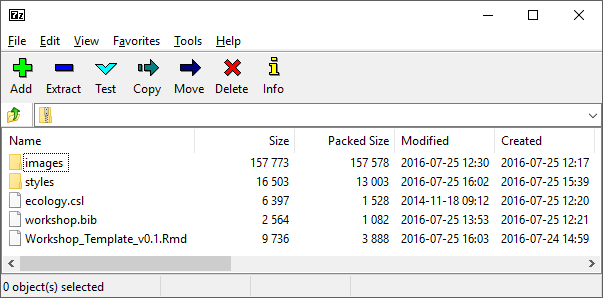
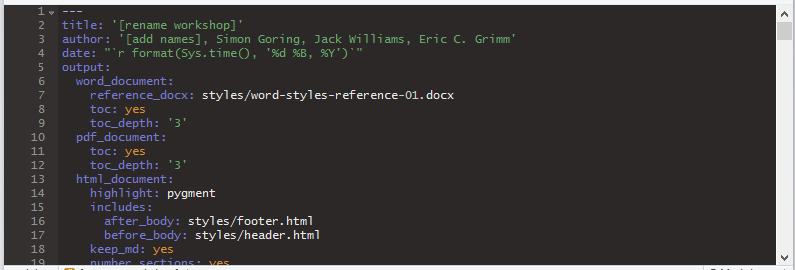

# Neotoma Workshops


<br>

The [Neotoma Paleoecological Database](http://neotomadb.org) is committed to outreach directed at multiple user groups including public school students and teachers, community groups, and academic users.  To facilitate coordinated outreach we have developed a number of teaching modules, and will likely continue developing modules.  These modules are stored in this repository.  We welcome continued contribution and comment on our teaching modules.  Bug reports can be made in the [issue tracker](https://github.com/NeotomaDB/Workshops/issues).

# Contributors

*We welcome contributions from any individual, whether code, documentation, or issue tracking.  All participants are expected to follow the [code of conduct](https://github.com/EarthLifeConsortium/earthlife/blob/master/CONDUCT.md) for this project.*

* [Eric C. Grimm](http://)
* [Simon J. Goring](http://github.com/SimonGoring)
* [Jack W. Williams](http://github.com/IceAgeEcologist)

# Creating New Workshop Docs

## Getting Started Quickly

If you are interested in building a new workshop for Neotoma using [R](https://www.r-project.org/about.html), you can begin by copying the [zipped file](https://github.com/NeotomaDB/Workshops/raw/master/Templates/R/R_template_v0.1.zip) in the [Templates/R](https://github.com/NeotomaDB/Workshops/tree/master/Templates/R) folder.  Extract the `zip` file locally and then edit the [RMarkdown](http://rmarkdown.rstudio.com/) file `Workshop_Template_v0.1.Rmd`  using [RStudio](https://www.rstudio.com/) (or another text editor).

If you're using RMarkdown it is relatively straightforward to render the `Rmd` file into the resulting `html`, `docx` or `pdf` document.  You can also do this natively in R using the [`render`](http://www.inside-r.org/packages/cran/rmarkdown/docs/render) function in the [`rmarkdown`](https://cran.r-project.org/web/packages/rmarkdown/) package:

```r
library(rmarkdown)
render(input = "Workshop_Template_v0.1.Rmd", output_format = "html_document")
```

or from the command line:

```
RScript -e "rmarkdown::render(input = 'Workshop_Template_v0.1.Rmd', output_format = 'html_document')"
```

## What's in the ZIP?

The `R_template_v0.2.zip` file is an archived ZIP file that contains several key components:



<br>

[**Workshop_Template_v0.1.Rmd**](https://github.com/NeotomaDB/Workshops/blob/master/Templates/R/Workshop_Template_v0.1.Rmd)

  * The main document:   This includes executable code (although execution requires a working internet connection).  Feel free to edit to add examples with which you're familiar, or that focus on particular dataset types.<br>

[**images** folder](https://github.com/NeotomaDB/Workshops/tree/master/Templates/R/images)

  * This folder contains any images you might choose to use in the `html`, `PDF` or `docx` document.  This does not include files that will be generated by the script itself (such as plots).  If you wish to add images to the document use the `RMarkdown` formatting: `` having copied the file into the images folder.<br>

[**styles** folder](https://github.com/NeotomaDB/Workshops/tree/master/Templates/R/styles)

  * This folder contains a template file for processing the RMarkdown output to Word `docx` format.  You're welcome to edit styles yourself (you can follow [this](http://rmarkdown.rstudio.com/articles_docx.html) tutorial).  This folder also includes `header.html` and `footer.html`, files that are added to any HTML output.  Again, you can edit these as desired.<br>

[**workshop.bib**](https://github.com/NeotomaDB/Workshops/blob/master/Templates/R/workshop.bib)

  * A file for BiBTex references, used to render references inline in the RMarkdown document.  Copy and paste bibtex references into this document to cite them (using the `[@tag]` formar) and the references will be auto-generated when you render the `Rmd` file.<br>

[**ecology.csl**](https://github.com/NeotomaDB/Workshops/blob/master/Templates/R/ecology.csl)

  * A citation format used by ESA.  Copied from [here](https://github.com/citation-style-language/styles/blob/master/ecology.csl).

**Bacon Files & Folders**:

  * [Bacon](http://chrono.qub.ac.uk/blaauw/bacon.html) is a method for building chronologies using Bayesian methods.  The files are included here so that the workshop can "just run".  This should not be considered a canonical distribution of Bacon.

## Editing the Rmd

At the very simplest, this template is expected to work as a standalone document, providing an overview of the key components of Neotoma, both the web and R access portals, along with some simple data processing.  Feel free to delete or add components as neccessary.  If you have never worked with RMarkdown before please consult this [Getting Started](http://rmarkdown.rstudio.com/?package=servr&version=0.4) reference.  RMarkdown is relatively straightforward in that it is basically a plain-text format, but there are aspects that can be difficult to sort out.

### The YAML header

The YAML (YAML Ain't Markup Language) file provides information to instruct [pandoc](http://pandoc.org/) how to render the Rmd file into PDF, docx or html format (or other formats).  The YAML header is found at the top of the `Workshop_Template_v0.1.Rmd` file.



YAML may seem foreign & strange, but it doesn't have to be.  The template is designed so you only have to edit two places, the `title` & `author` block.  Everything else should work as-is.  For more details on how to customize the YAML header, read [here](http://webcache.googleusercontent.com/search?q=cache:fg2r7RePCJsJ:www.introductoryr.co.uk/Reproducibility/Chap_5_Global_options.html+&cd=1&hl=en&ct=clnk&gl=ca).

### The R blocks

Debugging problems in the R code can often be difficult with RMarkdown documents since they're embedded in the text document.  It's often worth using the [`purl`](https://rforge.net/doc/packages/knitr/knit.html) command to generate a clean set of R code for debugging purposes.  Otherwise, have fun!  Setting the code chunk [options](http://yihui.name/knitr/options/) can give you some more control over what code is shown and what code is hidden.

### Dealing with problems

If something doesn't work, feel free to contact us through the Neotoma [website](http://neotomadb.org), through this repository's [issues tracker](https://github.com/NeotomaDB/Workshops/issues), our [Twitter](http://twitter.com/neotomadb) or via email.  We're happy to help!

## Once you're done

If you have a GitHub account already and have cloned the whole repository, copy your finished workshop documents into a new directory in the `Examples` folder.  Make sure to give it a clear name that indicates the place & time of the workshop, and then make a pull request.

If you aren't comfortable doing this, contact us through the issues tracker or via email and send us a zipped copy of the workshop.  We'll put them up for you.  Please note that this repository is licensed under an [MIT License](https://raw.githubusercontent.com/NeotomaDB/Workshops/master/LICENSE).  If you are not comfortable sharing your work under these terms (or cannot legally) please let us know.

# Last Words

Thanks for helping out and being a part of the Neotoma Paleoecological Database group!

<br>
