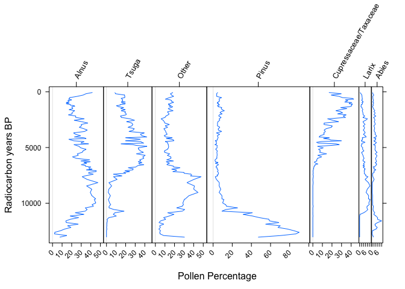

# SVP 2016
Jessica Blois, Edward Davis, Simon Goring, Jack Williams, Eric C. Grimm  

# Introduction

This workshop will provide 1) guidance on best practices in the archiving and analysis of paleovertebrate data and 2) training in the use of the Neotoma Paleoecology Database (www.neotomadb.org) to archive, access, and analyze paleoecological data. Neotoma is a multiproxy paleodatabase that stores multiple kinds of paleoecological & paleoenvironmental data, including vertebrate faunal data. One of the strengths of Neotoma is the ability to compare faunal data with other proxy data such as fossil pollen, diatoms, ostracodes, insects, charcoal, and geochemical data.  In addition, the database is structured to relate absolute dates to taxon occurrences and to allow the creation and storage of age models built on absolute dates from stratigraphic sections. Neotoma is a public-access, community-supported database that is emerging as the standard repository for Pliocene and Quaternary paleoecological data.

More teaching materials can be found [here](http://www.neotomadb.org/education/category/higher_ed/)

# Finding Data

## Explorer

### Getting Started

1.	Go to [http://www.neotomadb.org/](http://www.neotomadb.org/) and click on the 'Explorer' picture, or navigate directly to the [Explorer App](http://apps.neotomadb.org/Explorer/)
2.	Pan (by dragging), or change the zoom so that your window is centered on North America, including all of the lower 48 states and the southern half of Canada.

### Search for Data

1.	Find a Site
  a.	Using the Search dialog window (Advanced tab, Metadata subtab, Site Name field), find the classic Guilday site "New Paris #4". [Note: Search doesn't like the # symbol, so search for "New Paris", which should return two sites: New Paris #2, and New Paris #4]
  b.	Once you've performed the search, click on the point that appears.  A window will pop up with some information about this record.
  c.	QUESTION 1:  What is the latitude and longitude of New Paris #4?  What is the Site ID?

2.	Find a Taxon (Search Window, Basic Tab, use Taxon field)
  a.	Find all sites with *Antilocapra* records.
  b.	QUESTION 2:  How many sites have *Antilocapra* records?
  c.  This indicates that we might need to build up the taxonomy.  Let's re-search for *Antilocapra*, but make sure we've included all relevant records. *Note 1:* To do this, we will search for a "Taxa group".  To the right of the "Taxon name" field, click on the gear symbol. Click on "Mammals" for the Taxa group, then search for *Antilocapra*. Then, click on all taxa you want to include here.  For example: Antilocapra americana, Antilocapra sp., Antilocapra, cf. Antilocapra americana, cf Antilocapra sp., Antilocapra cf A. americana, Antilocapridae ?Antilocapra sp., and ?Antilocapra sp. *Note 2:* It can be helpful to rename your search at the bottom of the Search dialog, e.g., to "Antilocapra"
  What state has the southernmost location of *Antilocapra* in this search?  (For comparison, the southern range limit of *Antilocapra* today is in XXX, plus a few scattered outliers e.g. at the top of the Appalachian Mountains).
3.	Find all sites produced by a researcher (Search Window, Advanced Tab, Metadata subtab, Person Name field)
  a.	Find all sites produced by Ernie Lundelius
  b.	QUESTION 3:  In which states has Ernie worked?
4.	Find all vertebrate records in North America (Search window, Advanced Tab, Dataset field)
  a.	QUESTION 4:  The generation of fossil records is labor intensive and hence expensive - *e.g.* the costs of fieldwork, the money spent on radiocarbon dates, the time required for a trained analysis to identify and count pollen data, etc. A rough time/cost estimate for a single fossil pollen record is on the order of two years and $30,000.  Given this, give an order-of-magnitude estimate of the number of person-years and dollars it took to generate these fossil pollen records now stored in Neotoma. (Order-of-magnitude = 10 person-years?  100 person-years? 1000? etc.)
  b.	QUESTION 5:  Notice there is a fairly dense network of fossil pollen sites in an arc stretching from Minnesota to Nova Scotia.  Why might there be such a dense network in this region?  
5.	Show/Hide Search Results
  a.	You now have many search layers - it may be getting a bit confusing.  Find the icon that lets you show/hide/combine search layers and use it to hide some of your searches.
6.	Multi-Taxon Search
  a.	Find all sites with at least 20% *Picea* pollen between 15,000 and 12,000 years ago.
  b.	Find all sites with Mammut (mastodon) between 15,000 and 12,000 years ago.
    i.	For Mammut, use the 'Advanced Taxon Selection' which you can use by clicking on the gears icon to the right of the 'Taxon' field in the 'Search' window.
      1.	In the ATS window, choose 'Mammals' for Taxa Group and then enter Mammut into the 'Search for' window.  Then click 'Go'
      2.	Note that the search returned taxon names for both Mammut (mastodon) and Mammuthus (mammoth).  Click all boxes for all variants of Mammut but do not click the Mammuthus boxes
      3.	Enter a search name (e.g. 'Mammut - all') and click Save
      4.	In the general search window, click 'Search'
  c.	QUESTION 6:  Take a screenshot of this map and include it in your homework.  Does mastodon tend to live in places with spruce, or without spruce?  Suggest two hypotheses that might explain the observed association.
7.	Multi-Time Search
  a.	Hide your previous searches.
  b.	Find all sites with at least 20% *Picea* pollen between 21,000 and 18,000 years ago.
  c.	Find all sites with at least 20% *Picea* pollen between 15,000 and 12,000 years ago.
  d.	Find all sites with at least 20% *Picea* pollen between 10,000 and 7,000 years ago.
  e.	Find all sites with at least 20% *Picea* pollen between 5,000 and 1,000 years ago.
  f.	QUESTION 7:  Take a screenshot of this map and include it in your homework.  Describe the history of *Picea* distributions in eastern North America over the last 21,000 years (i.e. ignore the Rockies and points west).  What environmental change(s) might be causing this shift in *Picea* distributions?  Given that trees are sessile (immobile) organisms, what processes might allow the observed range shifts?

### View Data

1.	Go find Devil's Lake (WI) again.  Click on the site.  
2.	In the popup window with metadata for Devil's Lake, note that the bottom includes a list of datasets available at the site.  (P = pollen; P^ = pollen surface sample; clock = geochronological data; W = water sample; O^ = ostracode surface sample)
3.	Hold the mouse over the pollen dataset.  Note that an eyeball and '+' appear to the right.
4.	Click on the eyeball to view the Devil's Lake pollen dataset.  This opens up a new window with more detail about your dataset.
  a.	Samples:  A data table.  Each row is a different variable and each column is a stratigraphic depth.  
  b.	Diagram:  Plots a stratigraphic diagram.  Change the Primary Axis to 'COHMAP Chron 2' (this switches the vertical axis from a depth axis to time axis; more about depth vs. time later) then click 'Draw.'
  c.	QUESTION 8:  Take a screenshot of this diagram and include it in your homework assignment.  
    i.	What was the most abundant plant taxon at Devil's Lake during the end of the Pleistocene?  (i.e. prior to 11,000 years ago)
    ii.	What has been the most abundant taxon during the Holocene? (from 11,000 years ago to present)
    iii.	(Note: Here we are assuming that plant with the most abundant pollen in sediments is also the most abundant on the landscape.  This isn't necessarily a good assumption; we'll save that challenge for another day.) 
  d.	QUESTION 9:  Using the information in the Chronology tab, how many age controls are stored for Devil's Lake?  How many of these are radiocarbon dates?
  e.	QUESTION 10:  What publications are listed for Devil's Lake?

### Download Data
1.	In the popup window with metadata for Devil's Lake, hold the mouse over the pollen dataset.  Note that an eyeball and '+' appear to the right.  Click on the '+'.  This adds the dataset to a 'Datasets' tray.
2.	Find the icon for the 'Saved Datasets Tray' and click on it.
3.	Hover over the dataset then click on the Save icon to the right.  The dataset will be saved as a text file in CSV (comma separated value) format.
4.	Open the downloaded CSV file in Excel or a text editor (e.g. Notepad, Wordpad) to look at it.
5.	QUESTION 11:  What is the most abundant taxon at Depth = 1 cm?

## The `neotoma` Package


```r
# Uncomment this line if you haven't already installed any of these packages:
# install.packages(c("neotoma", "analogue"))

#Add the neotoma package to your programming environment (we'll add analogue later)
library(neotoma)
```

`neotoma` has three fundamental commands: `get_site`, `get_dataset`, `get_download`. The first two return metadata for sites and datasets; the latter returns data. See Goring et al. [@neotoma_goring] for a full description of the package and example code.  This exercise is partially based on those examples.

### Finding sites

We'll start with `get_site`.  `get_site` returns a `data.frame` with metadata about sites. You can use this to find the spatial coverage of data in a region (using `get_site` with a bounding box), or to get explicit site information easily from more complex data objects.  Use the command `?get_site` to see all the options available.

You can easily search by site name, for example, finding "Marion Lake".  By default the search string is explicit, but because older sites, entered as part of COHMAP, often had appended textual information (for example `(CA:British Columbia)`), it's often good practice to first search using a wildcard character:


```r
marion_site <- get_site(sitename = 'Marion%')
```

```
## The API call was successful, you have returned  3 records.
```

```r
print(marion_site)
```

```
##                          site.name       long      lat elev
##  Marion Lake (CA:British Columbia) -122.54722 49.30833  305
##  Marion Landfill                    -83.18611 40.59167   NA
##  Marion Lake                       -121.86241 44.55770   NA
## A site object containing 3 sites and 8 parameters.
```

While `marion_site` is a `data.frame` it also has class `site`, that's why the print output looks a little different than a standard `data.frame`.  That also allows you to use some of the other `neotoma` functions more easily.  


```r
#Search by lat/lon bounding box.  This one roughly corresponds to Florida.
FL_sites <- get_site(loc = c(-88, -79, 25, 30)) 
```

```
## The API call was successful, you have returned  8204 records.
```

You can also search by geopolitical name or geopolitical IDs (`gpid`) stored in Neotoma. For a list of names and gpids, go to [http://api.neotomadb.org/apdx/geopol.htm](), or use the `get_table(table.name = "GeoPoliticalUnits")` command.  This command works either with an explicit numeric ID, or with a text string:


```r
#get all sites in New Mexico (gpid=7956)
NM_sites <- get_site(gpid = 7956)
```

```
## The API call was successful, you have returned  116 records.
```

```r
#get all sites in Wisconsin
WI_sites <- get_site(gpid = "Wisconsin")
```

```
## The API call was successful, you have returned  360 records.
```

`data.frame`s store vectors of equal length.  The nice thing about `data.frame`s is that each vector can be of a different type (character, numeric values, *etc*.). In RStudio, you can use the Environment panel in upper right to explore variables. 

We pointed out before that the object returned from `get_site` is both a `data.frame` and a `site` object.  Because it has a special `print` method some of the information from the full object is obscured when printed.  You can see all the data in the `data.frame` using `str` (short for *structure*):


```r
str(marion_site)
```

```
## Classes 'site' and 'data.frame':	3 obs. of  8 variables:
##  $ site.id    : int  1649 5873 13416
##  $ site.name  : chr  "Marion Lake (CA:British Columbia)" "Marion Landfill" "Marion Lake"
##  $ long       : num  -122.5 -83.2 -121.9
##  $ lat        : num  49.3 40.6 44.6
##  $ elev       : num  305 NA NA
##  $ description: chr  "Lake in valley depression. Physiography: hilly and mountainous. Surrounding vegetation: western hemlock forest." NA NA
##  $ long.acc   : num  0 0 0.0239
##  $ lat.acc    : num  0 0 0.016
```

Let's look at the `description` field:


```r
marion_site$description
```

```
## [1] "Lake in valley depression. Physiography: hilly and mountainous. Surrounding vegetation: western hemlock forest."
## [2] NA                                                                                                               
## [3] NA
```


### Getting Datasets

The structure of the Neotoma data model, as expressed through the API is roughly: "`counts` within `download`s, `download`s within `dataset`s, `dataset`s within `site`s".  So a `dataset` contains more information than a site, about a particular dataset from that site.  A site may have a single associated dataset, or multiple.  For example:


```r
get_dataset(marion_site[1,])
```

```
## A dataset_list containing 2 objects:
## Accessed from 2016-08-04 14:31h to 2016-08-04 14:31h. 
## Datasets:
##  dataset.id                         site.name      long      lat
##        1705 Marion Lake (CA:British Columbia) -122.5472 49.30833
##        8377 Marion Lake (CA:British Columbia) -122.5472 49.30833
##            type
##  pollen        
##  geochronologic
```

```r
#get_dataset returns a list of datasets containing the metadata for each dataset
#We can pass output from get_site to get_dataset
marion.meta.dataset  <- get_dataset(marion.meta.site)
#Let's look at the metadata returned for Marion Lake and Marion Landfill.  Both
#have a geochronology dataset, while one has a pollen dataset and the other a 
#vertebrate fauna dataset
marion.meta.dataset
```

### Get_Download

`get_download` returns a list which stores a list of download objects - one for each retrieved dataset.  Each download object contains a suite of data for the samples in that dataset.  Get all datasets for both Marion Site and Marion Landfill. `get_download` will accept an object of class dataset:


```r
marion_all <- get_download(marion_site)
```

```
## Fetching datasets for the site(s)
```

```
## Getting downloads:
```

```
## API call was successful. Returned record for Marion Lake(CA:British Columbia)
## API call was successful. Returned record for Marion Lake(CA:British Columbia)
```

```
## The dataset ID 8377 is associated with a geochronology object, not count data.
```

```
## API call was successful. Returned record for Marion Landfill
## API call was successful. Returned record for Marion Landfill
```

```
## The dataset ID 10248 is associated with a geochronology object, not count data.
```

```
## API call was successful. Returned record for Marion Lake
## API call was successful. Returned record for Marion Lake
```

```
## Warning in get_download.default(datasetid, verbose = verbose): Some datasetids returned empty downloads, be aware that length(datasetid) is longer than the download_list.
```

```r
print(marion_all)
```

```
## A download_list containing 4 objects:
## Accessed from 2016-08-04 14:31h to 2016-08-04 14:31h. 
## Datasets:
##  dataset.id                         site.name       long      lat
##        1705 Marion Lake (CA:British Columbia) -122.54722 49.30833
##        7203 Marion Landfill                    -83.18611 40.59167
##       20103 Marion Lake                       -121.86241 44.55770
##       20104 Marion Lake                       -121.86241 44.55770
##  age.younger age.older             type
##           58     13051 pollen          
##        10340     10340 vertebrate fauna
##          -48       -48 water chemistry 
##          -48       -48 diatom
```

```
## NULL
```

There are a number of messages that appear.  These should be suppressed with the flag `verbose = FALSE` in the function call.  One thing you'll note is that not all of the datasets can be downloaded directly to a `download` objct.  This is because `geochronologic` datasets have a different data structure than other data, requiring different fields, and as such, they can be obtained using the `get_geochron` function:


```r
marion_geochron <- get_geochron(marion_site)
```

```
## This dataset contains records that are not geochronological datasets.  Only geochronological datasets will be returned.
```

```
## API call was successful.
## API call was successful.
```

```r
print(marion_geochron)
```

```
## A geochronology_list containing 2 objects:
## Accessed from 2016-08-04 14:31h to 2016-08-04 14:31h. 
## Geochronologies:
##     id                         site.name       long      lat ages   min
##   8377 Marion Lake (CA:British Columbia) -122.54722 49.30833    7   520
##  10248 Marion Landfill                    -83.18611 40.59167    1 10340
##    max interval
##  12350     1690
##  10340        0
```

```
## NULL
```

The result is effectively the inverse of the first.


```r
#Get all datasets for just Marion Lake (BC):
marion_bc <- get_download(marion_site[1,])
```

```
## Fetching datasets for the site(s)
```

```
## Getting downloads:
```

```
## API call was successful. Returned record for Marion Lake(CA:British Columbia)
## API call was successful. Returned record for Marion Lake(CA:British Columbia)
```

```
## The dataset ID 8377 is associated with a geochronology object, not count data.
```

```
## Warning in get_download.default(datasetid, verbose = verbose): Some datasetids returned empty downloads, be aware that length(datasetid) is longer than the download_list.
```

Within the download object, `sample.meta` stores the core depth and age information for that dataset. We just want to look at the first few lines, so are  using the head function.


```r
head(marion_bc[[1]]$sample.meta)
```

```
##   depth thickness age.older age age.younger chronology.name
## 1   2.5         1        NA  58          NA          NAPD 1
## 2   7.5         1        NA 173          NA          NAPD 1
## 3  12.5         1        NA 289          NA          NAPD 1
## 4  17.5         1        NA 404          NA          NAPD 1
## 5  22.5         1        NA 520          NA          NAPD 1
## 6  27.5         1        NA 587          NA          NAPD 1
##               age.type chronology.id sample.id dataset.id unit.name
## 1 Radiocarbon years BP           791     33760       1705        NA
## 2 Radiocarbon years BP           791     33761       1705        NA
## 3 Radiocarbon years BP           791     33762       1705        NA
## 4 Radiocarbon years BP           791     33763       1705        NA
## 5 Radiocarbon years BP           791     33764       1705        NA
## 6 Radiocarbon years BP           791     33765       1705        NA
```

```r
#taxon.list stores a list of taxa found  in the  dataset
head(marion_bc[[1]]$taxon.list)
```

```
##           taxon.name variable.units variable.element variable.context
## 1              Abies           NISP           pollen               NA
## 2    Acer circinatum           NISP           pollen               NA
## 3              Alnus           NISP           pollen               NA
## 4      Amaranthaceae           NISP           pollen               NA
## 5 Asteraceae undiff.           NISP           pollen               NA
## 6             Betula           NISP           pollen               NA
##       taxon.group ecological.group
## 1 Vascular plants             TRSH
## 2 Vascular plants             TRSH
## 3 Vascular plants             TRSH
## 4 Vascular plants             UPHE
## 5 Vascular plants             UPHE
## 6 Vascular plants             TRSH
```

```r
#counts stores the the counts, presence/absence data, or percentage data for each taxon for each sample
head(marion_bc[[1]]$counts)
```

```
##       Abies Acer circinatum Alnus Amaranthaceae Asteraceae undiff. Betula
## 33760     6               5   390             2                  3     23
## 33761     5               1   197             1                  4      2
## 33762     9               0   165             0                  3     13
## 33763     4               0   138             3                  0      3
## 33764    10               0   196             0                  4      4
## 33765    13               0   244             0                  2      6
##       Corylus Cupressaceae Ericaceae Lycopodiaceae Lysichiton Myrica
## 33760       5          157         5             1         11      6
## 33761       1          168         1             2          3      2
## 33762       3           99         2             3          7      4
## 33763       1          145         1             3          8      8
## 33764       4          339         7             3          9     10
## 33765       8          568         4             4          7     10
##       Nuphar Other plants Picea Pinus contorta-type Pinus monticola-type
## 33760      1           30     5                  28                   18
## 33761      1            3     1                  12                    8
## 33762      1            6     2                  12                    8
## 33763      1            3     4                  11                    8
## 33764      0            1    18                  87                    9
## 33765      0            4    14                  88                    7
##       Poaceae Potamogetonaceae Pseudotsuga Pteridium Rosaceae Salix
## 33760      32                8           5        10       23     4
## 33761      10                2           8         8       14     4
## 33762       2                0          12         3        8     1
## 33763       0                3          13         1        9     0
## 33764       1                4          29         5        3     1
## 33765       3                1          35         5        5     2
##       Sphagnum Tsuga heterophylla Tsuga mertensiana Unknown
## 33760        2                 78                 4       6
## 33761        0                 52                 2       3
## 33762        0                 94                 3       2
## 33763        0                 98                 4       6
## 33764        1                200                 7       7
## 33765        2                202                 7       2
##       Unknown (monolete) Artemisia Acer macrophyllum Cyperaceae Apiaceae
## 33760                 67         0                 0          0        0
## 33761                 49         1                 0          0        0
## 33762                 51         3                 0          0        0
## 33763                 56         2                 0          0        0
## 33764                111         4                 1         15        0
## 33765                128         1                 0          6        0
##       Selaginella wallacei
## 33760                    0
## 33761                    0
## 33762                    0
## 33763                    0
## 33764                    0
## 33765                    0
```

```r
#lab.data stores any associated  laboratory measurements in the dataset
#For Marion Lake, this returns the Microsphere suspension used as a spike to calculate
#concentrations
head(marion_bc[[1]]$lab.data)
```

```
##      
## 33760
## 33761
## 33762
## 33763
## 33764
## 33765
```

### Helper functions

#### `compile_taxa`

The level of taxonomic resolution can vary among analysts.  Often for multi-site analyses it is helpful to aggregate to a common taxonomic resolution. The `compile_taxa` function in `neotoma` will do this.  To help support rapid prototyping, `neotoma` includes a few pre-built taxonomic lists, **however**, the function also supports the use of a custom-built `data.frame` for aligning taxonomies.  Because new taxa are added to Neotoma regularly (based on analyst identification), it is worthwhile to check the assignments performed by the `compile_taxa` function, and to build your own explicit compilation table.


```r
marion_bc <- compile_taxa(marion_bc, list.name = "P25")
```

```
## Warning in FUN(X[[i]], ...): 
## The following taxa could not be found in the existing conversion table:
## Amaranthaceae
## The following taxa could not be found in the existing conversion table:
## Ericaceae
## The following taxa could not be found in the existing conversion table:
## Lycopodiaceae
## The following taxa could not be found in the existing conversion table:
## Lysichiton
## The following taxa could not be found in the existing conversion table:
## Myrica
## The following taxa could not be found in the existing conversion table:
## Nuphar
## The following taxa could not be found in the existing conversion table:
## Other plants
## The following taxa could not be found in the existing conversion table:
## Potamogetonaceae
## The following taxa could not be found in the existing conversion table:
## Pteridium
## The following taxa could not be found in the existing conversion table:
## Rosaceae
## The following taxa could not be found in the existing conversion table:
## Sphagnum
## The following taxa could not be found in the existing conversion table:
## Unknown
## The following taxa could not be found in the existing conversion table:
## Unknown (monolete)
## The following taxa could not be found in the existing conversion table:
## Apiaceae
## The following taxa could not be found in the existing conversion table:
## Selaginella wallacei
```

You'll notice that warning messages return  a number of taxa that cannot be onverted using the existing data table.  Are these taxa important?  They may be important for you.  Check to see which taxa have been converted by looking at the new taxon table:


```r
marion_bc[[1]]$taxon.list[,c("compressed", "taxon.name")]
```

```
##               compressed           taxon.name
## 1                  Abies                Abies
## 2                   Acer      Acer circinatum
## 3                  Alnus                Alnus
## 4                  Other        Amaranthaceae
## 5          Prairie Forbs   Asteraceae undiff.
## 6                 Betula               Betula
## 7                Corylus              Corylus
## 8  Cupressaceae/Taxaceae         Cupressaceae
## 9                  Other            Ericaceae
## 10                 Other        Lycopodiaceae
## 11                 Other           Lysichiton
## 12                 Other               Myrica
## 13                 Other               Nuphar
## 14                 Other         Other plants
## 15                 Picea                Picea
## 16                 Pinus  Pinus contorta-type
## 17                 Pinus Pinus monticola-type
## 18               Poaceae              Poaceae
## 19                 Other     Potamogetonaceae
## 20                 Larix          Pseudotsuga
## 21                 Other            Pteridium
## 22                 Other             Rosaceae
## 23                 Salix                Salix
## 24                 Other             Sphagnum
## 25                 Tsuga   Tsuga heterophylla
## 26                 Tsuga    Tsuga mertensiana
## 27                 Other              Unknown
## 28                 Other   Unknown (monolete)
## 29         Prairie Forbs            Artemisia
## 30                  Acer    Acer macrophyllum
## 31            Cyperaceae           Cyperaceae
## 32                 Other             Apiaceae
## 33                 Other Selaginella wallacei
```

And note that if you look at the names of the objects in the new `download` (using `names(marion_bc[[1]]))`, there is now a `full.counts` object.  This allows you to continue using the original counts, while also retaining the new compiled counts.

#### Plotting

There are several options for plotting stratigraphic data in R.  The `rioja` package [@rioja_package] and `analogue` [@analogue_package] each have methods, and other possibilities exist.  Here we will show simple plotting using the `analogue` package. To make it clear which functions come from the `analogue` package I will use `analogue::` before the function names.  This is just an explicit way to state the function source.  If you choose not to do this you will not encounter any problems unless multiple packages have similarly name functions.


```r
library("analogue")

# Convert the Marion Lake pollen data to percentages
marion_bc_pct <- analogue::tran(x = marion_bc[[1]]$counts, method = 'percent')

# Drop rare taxa:
marion_bc_pct <- marion_bc_pct[, colMeans(marion_bc_pct, na.rm = TRUE) > 2]

analogue::Stratiplot(x = marion_bc_pct[ , order(colMeans(marion_bc_pct, na.rm = TRUE), 
                                                decreasing = TRUE)], 
                     y = marion_bc[[1]]$sample.meta$age,
                     ylab = marion_bc[[1]]$sample.meta$age.type[1],
                     xlab = " Pollen Percentage")
```

<!-- -->

# Age Models

We can use the Neotoma package, along with other tools to rebuild age models. Many of the age modeling tools require additional files to be installed.  One such program is [Bacon](http://chrono.qub.ac.uk/blaauw/bacon.html) [@].  Here we will rebuild a Baysian age model for a site in Wisconsin.

We've looked in detail at Marion Lake, let's choose another site from our pool of Wisconsin sites earlier.  First we need to get Bacon set up:

*Jessica Note: section deleted from this document.  See template to recover*

# Multi-Site Analysis

# Conclusions

# References
