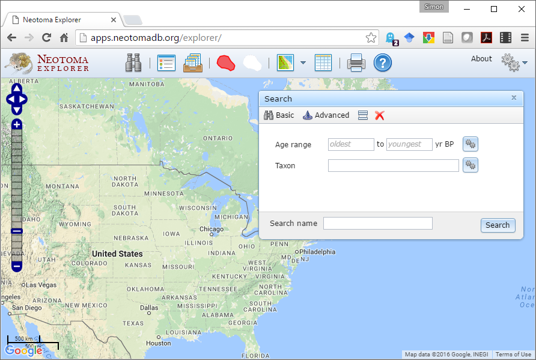
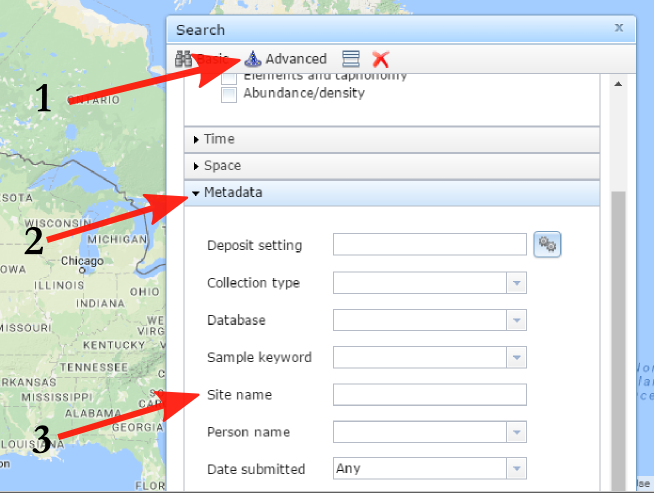

# Introduction

This workshop is intended to introduce individuals to the Neotoma Paleoecology Database and Neotoma Explorer. Neotoma is a public-access and community-supported repository of paleoecological data, mostly from the late Quaternary. These paleoecological data are widely used by scientists to study species responses to past climate change. 

More teaching materials can be found [here](http://www.neotomadb.org/education/category/higher_ed/)

# Finding Data

## Explorer

The Neotoma Explorer is a map-based search tool for paleoecological data discovery.

### Getting Started

To get started, go to [http://www.neotomadb.org/]() and click on the 'Explorer' picture, or navigate directly to the [Explorer App](http://apps.neotomadb.org/Explorer/), then pan (by dragging), or change the zoom so that your window is centered on North America, including all of the lower 48 states and the southern half of Canada.

### Search for Data

There are several ways to find sites or datasets with the Explorer.  The Basic search lets you search across time by taxon, while the Advanced search provides you with 

#### Find a Taxon

Using the **Basic Search**, find all sites with at least 20% *Picea* (spruce) pollen, between 21,000 and 18,000 years ago.

* **QUESTION 1**  What state has the southernmost location of *Picea* in this search?  (For comparison, the southern range limit of *Picea* today is in the northern Great Lakes, plus a few scattered outliers e.g. at the top of the Appalachian Mountains).

#### Find a Site

The **Advanced Search** (the wizard's hat) gives you more powerful search options.

 

1.	Using the Search dialog window -- (1) *Advanced* tab, (2) *Metadata* subtab (3) *Site Name* field -- find "Devil's Lake, WI".
2.	Once you've performed the search, click on the point that appears.  A window will pop up with some information about this record.

* **QUESTION 2**:  What is the latitude and longitude of Devil's Lake?  What is the Site ID?  [Note:  Apparently the choice of Site ID for Devil's Lake is just a coincidence. . .]

#### Find All Work by a PI

The Metadata Tab also allows you to search by Person Name. Find all sites produced by Lou Maher.

* **QUESTION 3**  In which states has Lou worked?

#### Find All Datasets by Type

Using the *Dataset* field, find all fossil pollen records in North America

* **QUESTION 4** The generation of fossil pollen records is labor intensive and hence expensive - *e.g.* the costs of fieldwork, the money spent on radiocarbon dates, the time required for a trained analysis to identify and count pollen data, etc. A rough time/cost estimate for a single fossil pollen record is on the order of two years and $30,000.  Given this, give an order-of-magnitude estimate of the number of person-years and dollars it took to generate these fossil pollen records now stored in Neotoma. (Order-of-magnitude = 10 person-years?  100 person-years? 1000? etc.)

* **QUESTION 5**  Notice there is a fairly dense network of fossil pollen sites in an arc stretching from Minnesota to Nova Scotia.  Why might there be such a dense network in this region?  

#### Show/Hide Search Results

You now have many search layers - it may be getting a bit confusing.  Find the icon that lets you show/hide/combine search layers and use it to hide some of your searches.

#### Multi-Taxon Search

1. Find all sites with at least 20% *Picea* pollen between 15,000 and 12,000 years ago.
2. Find all sites with Mammut (mastodon) between 15,000 and 12,000 years ago.
  1. For Mammut, use the 'Advanced Taxon Selection' which you can use by clicking on the gears icon to the right of the 'Taxon' field in the 'Search' window.
  2. In the ATS window, choose 'Mammals' for Taxa Group and then enter Mammut into the 'Search for' window.  Then click 'Go'
  3. Note that the search returned taxon names for both Mammut (mastodon) and Mammuthus (mammoth).  Click all boxes for all variants of Mammut but do not click the Mammuthus boxes
  4. Enter a search name (e.g. 'Mammut - all') and click Save
  5. In the general search window, click 'Search'

* **QUESTION 6**  Does mastodon tend to live in places with spruce, or without spruce?  Suggest two hypotheses that might explain the observed association.

#### Multi-Time Search

1. Hide your previous searches.
2. Find all sites with at least 20% *Picea* pollen between 21,000 and 18,000 years ago.
3. Find all sites with at least 20% *Picea* pollen between 15,000 and 12,000 years ago.
4. Find all sites with at least 20% *Picea* pollen between 10,000 and 7,000 years ago.
5. Find all sites with at least 20% *Picea* pollen between 5,000 and 1,000 years ago.

* **QUESTION 7**  Describe the history of *Picea* distributions in eastern North America over the last 21,000 years (i.e. ignore the Rockies and points west).  What environmental change(s) might be causing this shift in *Picea* distributions?  Given that trees are sessile (immobile) organisms, what processes might allow the observed range shifts?

### View Data

1. Go find Devil's Lake (WI) again.  Click on the site.  
2. In the popup window with metadata for Devil's Lake, note that the bottom includes a list of datasets available at the site.  (P = pollen; P^ = pollen surface sample; clock = geochronological data; W = water sample; O^ = ostracode surface sample)
3. Hold the mouse over the pollen dataset.  Note that an eyeball and '+' appear to the right.
4. Click on the eyeball to view the Devil's Lake pollen dataset.  This opens up a new window with more detail about your dataset.
  1. Samples:  A data table.  Each row is a different variable and each column is a stratigraphic depth.  
  2. Diagram:  Plots a stratigraphic diagram.  Change the Primary Axis to 'COHMAP Chron 2' (this switches the vertical axis from a depth axis to time axis; more about depth vs. time later) then click 'Draw.'

* **QUESTION 8**  (**1**) What was the most abundant plant taxon at Devil's Lake during the end of the Pleistocene?  (i.e. prior to 11,000 years ago); (**2**)	What has been the most abundant taxon during the Holocene? (from 11,000 years ago to present); *Note: Here we are assuming that plant with the most abundant pollen in sediments is also the most abundant on the landscape.  This isn't necessarily a good assumption; we'll save that challenge for another day.*

* **QUESTION 9**  Using the information in the Chronology tab, how many age controls are stored for Devil's Lake?  How many of these are radiocarbon dates?

* **QUESTION 10**  What publications are listed for Devil's Lake?

### Download Data

1.	In the popup window with metadata for Devil's Lake, hold the mouse over the pollen dataset.  Note that an eyeball and '+' appear to the right.  Click on the '+'.  This adds the dataset to a 'Datasets' tray.
2.	Find the icon for the 'Saved Datasets Tray' and click on it.
3.	Hover over the dataset then click on the Save icon to the right.  The dataset will be saved as a text file in CSV (comma separated value) format.
4.	Open the downloaded CSV file in Excel or a text editor (e.g. Notepad, Wordpad) to look at it.
5.	QUESTION 11:  What is the most abundant taxon at Depth = 1 cm?

# References